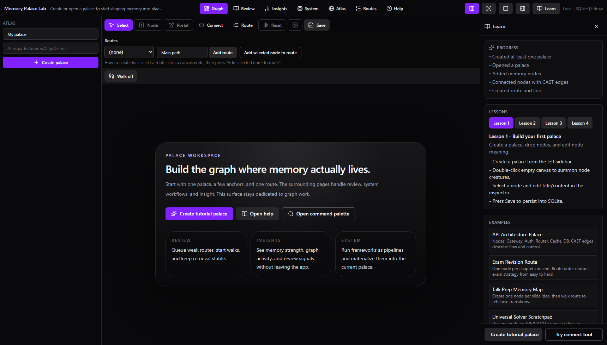
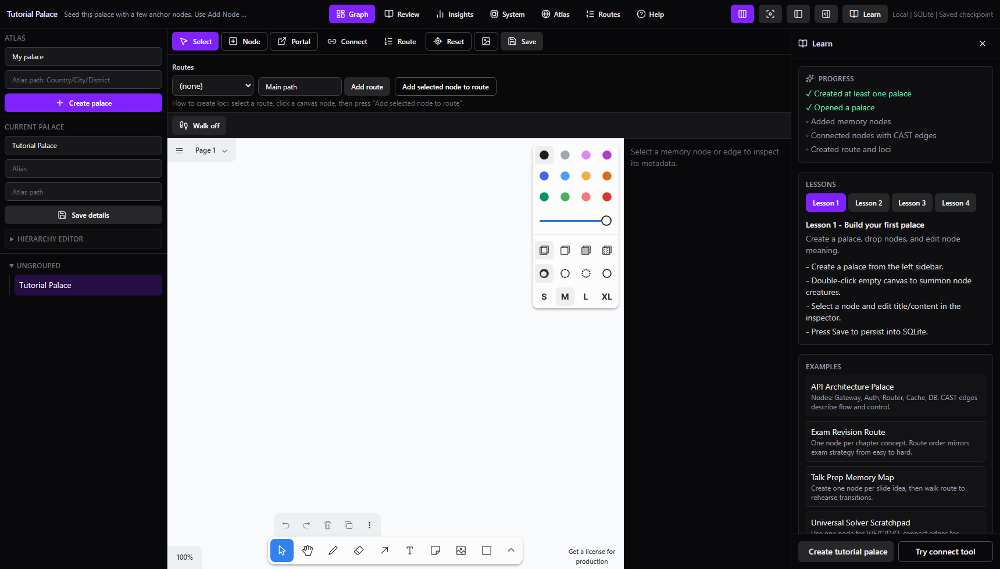
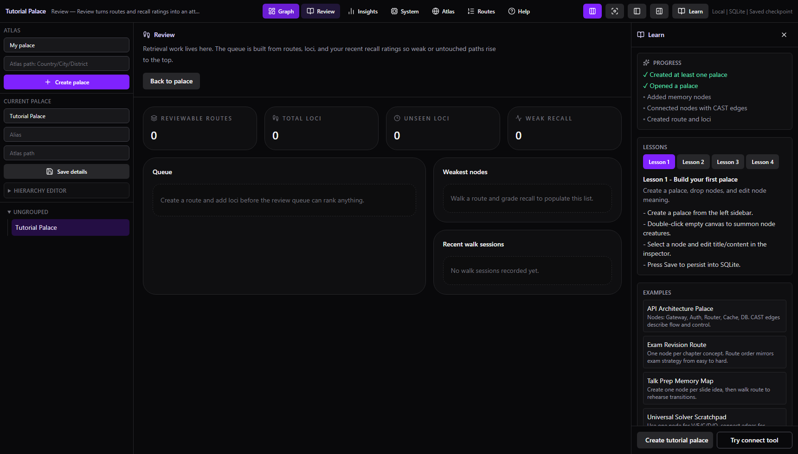
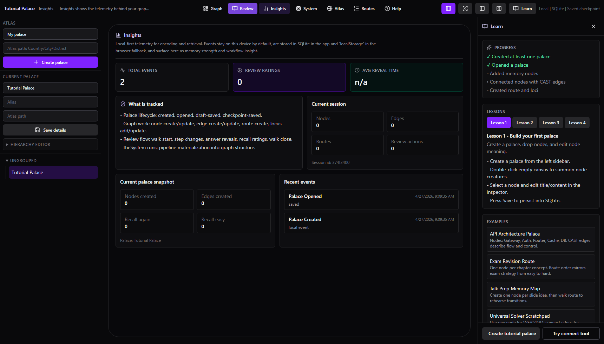
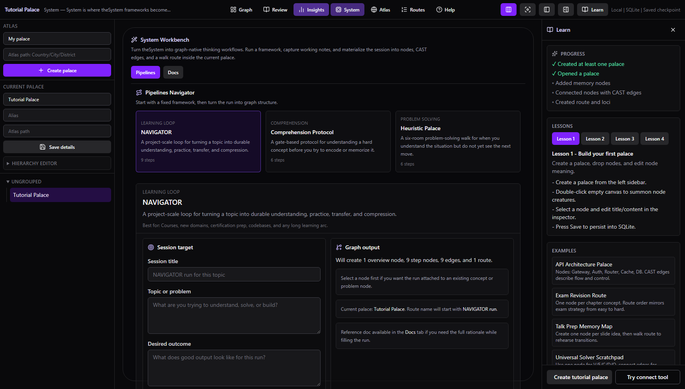
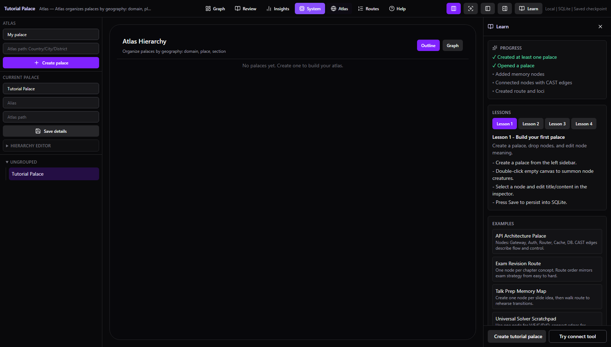
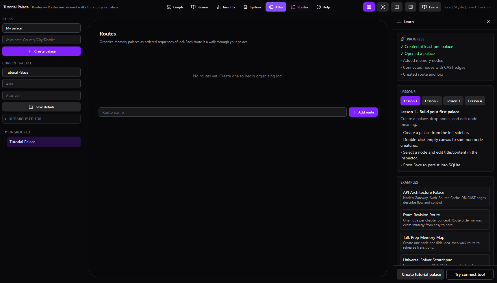
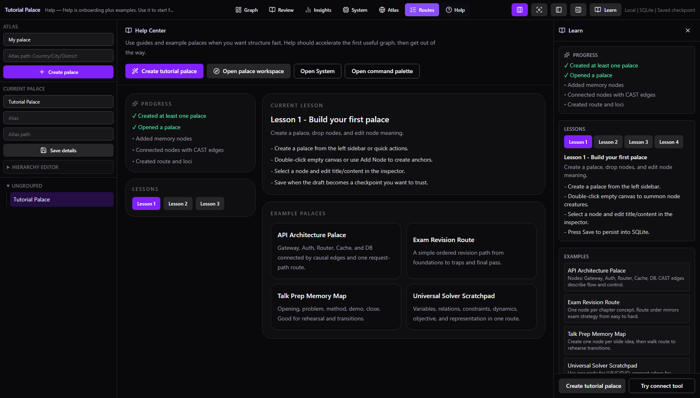

# Memory Palace Lab

Memory Palace Lab is a local-first graph workspace for building, rehearsing, and reviewing memory structures.
It combines an infinite canvas, CAST semantic edges, route-based recall, spaced review queues, and analytics in one desktop-first app.

## What You Can Do

- Build memory palaces as graph-native maps (nodes + semantic edges on top of `tldraw`).
- Encode relationships with CAST edge profiles (Causal, Associative, Structural, Temporal).
- Turn graph structure into ordered routes and run recall-first walk sessions.
- Use a due-based review queue that prioritizes weak or unseen loci.
- Track local telemetry in the Insights page (node/edge/route/review/session events).
- Run theSystem pipelines and materialize them into ready-to-walk graph runs.
- Read everything in one Library: first-session lessons, the curated theSystem guides, the Neural OS wiki mirror, the glossary with the bilingual CAST lexicon, and the Palace DSL reference.
- Keep preferences in one Settings page: review goal, AI key, idle tips, atlas terminology, backup/restore, updates.
- Organize multiple palaces with Atlas hierarchy paths (`Domain/Place/Section`).
- Use portal nodes to jump between palaces and start linked routes.
- Work safely with draft autosave and explicit save checkpoints.

## Screenshots

### Graph empty state


### Graph workspace (tutorial palace)


### Review queue


### Insights analytics


### System Workbench


### Atlas hierarchy


### Routes (in-canvas route panel)


### Library (lessons, guides, wiki, glossary, reference)


## Tech Stack

- React 19 + TypeScript + Vite
- `tldraw` canvas runtime
- Zustand state store
- Tauri v2 desktop shell
- SQLite (desktop persistence)
- Vitest + Testing Library + Playwright

## Project Structure

```text
src/
  app/              App shell and top-level page routing
  canvas/           tldraw integration and shape/snapshot helpers
  components/       UI pages and feature panels
  domain/           Pure business services and entities
  infrastructure/   Repository adapters (Tauri + in-memory fallback)
  store/            Zustand app state
src-tauri/
  src/              Rust commands, DB access, and app wiring
docs/
  backlog/          Ranked feature backlog and delivery notes
  screenshots/      README screenshots
tests/ui/           Playwright end-to-end coverage
```

## Installing on Windows

When you download and run the `.msi` or `.exe` installer, Windows Defender SmartScreen may show a warning that the app is unrecognized. This happens because the app is not yet code-signed with a commercial certificate.

To install anyway:

1. Click **More info** on the SmartScreen dialog.
2. Click **Run anyway**.

The app is open-source — you can review the full source code in this repository before installing.

## Getting Started

### Prerequisites

- Node.js 20+
- npm 10+
- Rust toolchain (`rustup`) and Tauri prerequisites for desktop builds: <https://tauri.app/start/prerequisites/>

### Install

```bash
npm install
```

### Run (web mode)

```bash
npm run dev
```

Web mode is useful for UI development and tests. Desktop persistence features rely on Tauri runtime.

### Run (desktop mode, recommended)

```bash
npm run tauri dev
```

This runs Vite + Tauri and stores palace snapshots and analytics in SQLite via Rust commands.

## Scripts

| Command | Description |
| --- | --- |
| `npm run dev` | Start Vite dev server (web mode). |
| `npm run tauri dev` | Start desktop app with Tauri + Vite. |
| `npm run build` | Type-check and build production bundle. |
| `npm run preview` | Preview production web build. |
| `npm run mcp` | Start the memory-palace MCP server (stdio). |
| `npm run palace -- <command>` | Run the `palace` CLI (lint/fmt/hash DSL files, import/export/analyze palaces, CAST lexicon). See [docs/cli.md](docs/cli.md). |
| `npm run sync:thesystem` | Re-mirror the curated wiki slice into `theSystem/wiki/`. |
| `npm run sync:thesystem:check` | Fail if that mirror is out of date (needs a local wiki checkout). |
| `npm test` | Run Vitest unit/integration tests. |
| `npm run test:mcp` | Run MCP server tests. |
| `npm run test:ui` | Run Playwright UI tests. |
| `npm run test:ui:headed` | Run Playwright tests with headed browser. |
| `npm run lint` | Run ESLint. |
| `npm run typecheck` | Run TypeScript checks (`tsc --noEmit`). |
| `npm run typecheck:mcp` | Run TypeScript checks for the MCP server. |
| `npm run format` | Run Prettier write mode. |

## Quick Workflow

1. Create or open a palace.
2. Add nodes (double-click canvas or use node tools).
3. Edit node title/content in the inspector and apply changes.
4. Connect nodes with CAST edges from the Connect workflow.
5. Create a route and add selected nodes as loci.
6. Start Walk mode and grade recall honestly.
7. Open Review for due queue prioritization.
8. Open Insights to inspect learning and graph telemetry.
9. Save checkpoint when draft state is ready to persist.

## Persistence Model

- Desktop (`npm run tauri dev`): SQLite-backed palace snapshots and analytics.
- Web (`npm run dev`): in-memory palace repository fallback with browser-local fallback behavior for some client-side state.

## MCP (Model Context Protocol)

The repo ships a full MCP integration so Claude (or any MCP client) can read, build, and analyze palaces:

- **memory-palace** server — domain tools (palace/node/edge/route CRUD, DSL import/export, graph analysis, crux, motifs, review queue), resources (palace DSL, theSystem docs), and prompts (nine-dive drill, comprehension protocol, encoding assistant). Works against the same SQLite DB as the desktop app; the running app live-refreshes when Claude edits a palace.
- **tauri-debug-bridge** — dev-only tooling for driving the running app (debug builds only).

Both are registered in the project-scoped `.mcp.json`. See [docs/mcp.md](docs/mcp.md).

## Command Line (`palace`)

The same domain tools are available from a shell for hooks, CI, other repositories, and batch work:

```bash
bin/palace lint --strict palaces/*.dsl        # parse diagnostics, exit 1 on errors
bin/palace import my-palace.dsl               # new palace from a DSL file
bin/palace export "SOLID Citadel" > solid.dsl # palace as DSL text
bin/palace cast decode "00 01 10 00"          # theSystem bits → compact token + scene
bin/palace meter backfill                     # mirror walks and encoding into METER's events.jsonl
```

`lint`, `fmt`, `hash`, and `cast` need no database. See [docs/cli.md](docs/cli.md).

## Testing

```bash
npm test
npm run test:ui
```

UI tests cover key workflows including palace creation, routes/walk mode, review queue behavior, CAST edges, atlas hierarchy, command palette, and theSystem materialization.

## Generate README Screenshots

The repository includes an automated capture script:

```bash
node scripts/capture-readme-screenshots.mjs
```

Defaults:
- Base URL: `http://127.0.0.1:4173`
- Output folder: `docs/screenshots`

Optional environment variables:
- `MP_BASE_URL`
- `MP_SCREENSHOT_DIR`

## The System Docs

`theSystem/` holds the memory science the app is built on, in two parts:

- **`theSystem/*.md`** — hand-authored lab docs (CAST system, concept encoding, retrieval
  protocol, the app manual). Written in the app's own voice; edit them here.
- **`theSystem/wiki/`** — a read-only mirror of a curated slice of the
  [Neural OS wiki](https://github.com/DavidTbilisi/Neural-OS-Research), which is canonical
  for that material. **Do not edit these files** — edit the wiki and re-sync.

```bash
npm run sync:thesystem                          # source defaults to ../Neural-OS-Research
npm run sync:thesystem -- /path/to/Neural-OS-Research
NEURAL_OS_WIKI=/path/to/repo npm run sync:thesystem
node scripts/sync-thesystem.mjs --dry-run       # report only
```

Which pages get mirrored is curated in `theSystem/wiki-sync.manifest.json`. The sync flattens
pages to a single directory, rewrites `[[wiki-links]]` to relative markdown links (flattening
the ones that point outside the mirrored slice), skips fenced code blocks, and stamps each
page with a `wiki_source:` frontmatter key. Both sets are exposed over MCP as
`thesystem://{slug}`, with mirrored wiki pages under a `wiki-` slug prefix.

## Backlog and Delivery Notes

- Ranked ROI backlog: [docs/backlog/README.md](docs/backlog/README.md)
- Process notes: [docs/backlog/DELIVERY_PROCESS.md](docs/backlog/DELIVERY_PROCESS.md)
- Palace DSL reference: [docs/palace-dsl.md](docs/palace-dsl.md)
