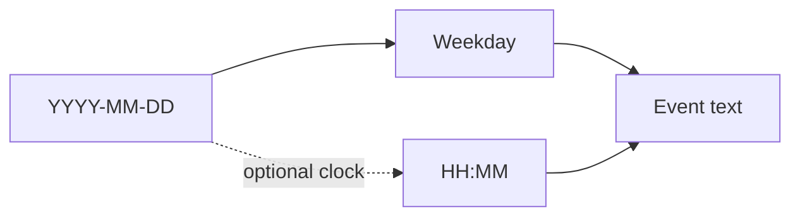
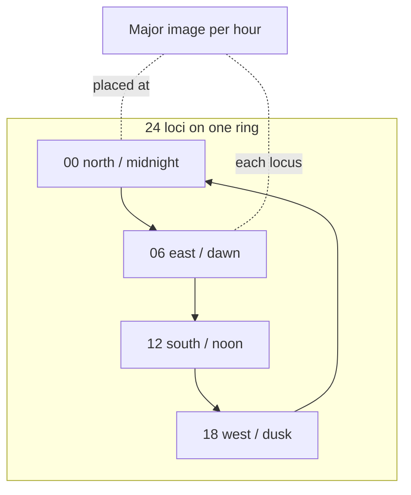
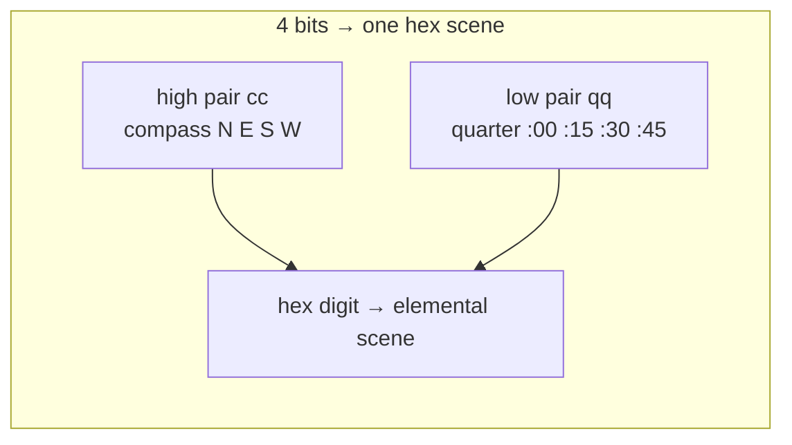

# Calendar & time memorization

Full-stack notes for **dates** (`year-month-day` + **weekday**) and **hours** (clock time), plus a **worked example deck** (“famous clocks” timeline) you can copy into Anki or a palace ring.

**Prerequisites:** `georgian-system.md` (month/day variants, weekday color banks, Georgia holidays), `major-system.md`, `sem3-full.md`, `mind-palace.md`, `retrieval-protocol.md`. **Optional binary path:** `binary-hex.md` (nibble / byte scenes).

---

## Memorizing this method

**Helper:** [memorization-helpers.md](./memorization-helpers.md#mh-calendar-time-memorization) — NEDF/SPEAR lens, minimal first session, stack placement.

---

## 1. One-line log format (history & appointments)

Use a **fixed template** so every card and journal line has the same shape:

```text
YYYY-MM-DD Weekday — Event
```



Add **`HH:MM`** when the fact needs clock time — see **§1.1**.

- **`YYYY-MM-DD`:** ISO order sorts correctly in text files.
- **`Weekday`:** spell out or use **Mon…Sun** — pick one style and freeze it.
- **Event:** short noun phrase; put longer story on the next line or on the card back.

### Example history lines (proleptic Gregorian; weekdays checked for study drills)

| Line | Notes |
|------|--------|
| `1969-07-20 Sunday — Apollo 11 first lunar landing` | UTC/ US prime-time context; moonwalk “date” people recall |
| `1989-11-09 Thursday — Berlin Wall opening` | Check photos of crowds at Bornholmer Straße |
| `1991-04-09 Tuesday — Georgia declares independence from USSR (April 9)` | Pairs with `georgian-system.md` country table |
| `1918-05-26 Sunday — Georgia declares Democratic Republic (1918 Act)` | Same bundle as May 26 holiday |
| `1776-07-04 Thursday — US Continental Congress adopts Declaration` | Narrative vs exact signing — card back cites source |
| `1963-08-28 Wednesday — “I Have a Dream” speech, Washington DC` | |
| `2001-09-11 Tuesday — September 11 attacks (NYC–DC–PA)` | High affect — use comprehension gate before encoding if personal |
| `1986-04-26 Saturday — Chernobyl reactor accident begins` | Local date USSR; confirm timezone pedagogy on card |
| `1944-06-06 Tuesday — D-Day (Allied landings, Normandy)` | |
| `1945-05-08 Tuesday — VE Day (Victory in Europe)` | Some countries celebrate May 9 — add **Distinguisher** if you learn both |

**Encoding recipe (typical):**

- **Year** → SEM3+Major (4+4 digits) or split `YY` + `YY` if century is stable in your course.
- **Month** → Georgian row 1–12 and/or civic month skin (`georgian-system.md` § optional pegs).
- **Day** → Major (00–31) **or** Georgian row 1–31 — **one** system for the day slot.
- **Weekday** → ROYGBIV object bank + Sunday/Monday-first table.
- **Event** → NEDF (Name hook = headline, Failure = common exam mistake).

### 1.1 Full lines with wall time (`YYYY-MM-DD Weekday HH:MM`)

When the fact includes **clock time**, extend the one-line log (still sorts as plain text if weekday stays a word):

```text
YYYY-MM-DD Weekday HH:MM — Event
```

**Rule:** Put **legal timezone** (`UTC`, `America/New_York`, `Europe/Berlin`, `Asia/Tokyo`, …) and “approximate vs logged” on the **card back** or the next line. History is full of **ship clocks**, **summer time**, and **revised official times** — your line is the **encoding handle**, not a court exhibit.

#### Worked examples (weekdays: proleptic Gregorian; times: common references, rounded)

| Full line | Timezone / pedagogy |
|-----------|---------------------|
| `1969-07-20 Sunday 20:17 — Apollo 11 Eagle lunar landing` | ~**UTC** for the Eagle landing instant; TV “when I watched” differs by country. |
| `1963-11-22 Friday 12:30 — JFK assassination (Dealey Plaza)` | **America/Chicago** (Dallas); shot timing approximate. |
| `2001-09-11 Tuesday 08:46 — Flight 11 strikes North Tower` | **US Eastern**; first impact time widely published. |
| `1945-08-06 Monday 08:15 — Hiroshima atomic bomb` | **Japan Standard Time** for the 08:15 airburst convention. |
| `1912-04-14 Sunday 23:40 — Titanic strikes iceberg` | **Ship time** (westbound); not the same as shore GMT story. |
| `1989-11-09 Thursday 18:57 — Bornholmer Straße opens (Berlin)` | **Local CET**; exact minute varies by crossing and crowd. |
| `1944-06-06 Tuesday 06:30 — D-Day first landings (Omaha area anchor)` | **Double Summer Time / BST** context; use one official history for your deck. |
| `1986-04-26 Saturday 01:23 — Chernobyl Unit 4 power excursion` | Often quoted in **Moscow time**; plant logs have finer dispute — **Failure** slot names the ambiguity. |
| `1991-04-09 Tuesday 00:00 — Georgia independence referendum (date anchor)` | **All-day vote** — `00:00` is a **sort key / card anchor**, not the minute polls opened; put real hours on the back if needed. |
| `1918-05-26 Sunday 12:00 — Georgia declares independence (1918 Act, midday anchor)` | **Tbilisi** civil time of the act is disputed in English sources — freeze one book for your deck; **Failure** = mixing with **1991-04-09**. |
| `2026-04-21 Tuesday 14:00 — Example: team stand-up (45 min)` | Fictional **appointment**; swap to your zone (`2026-04-21 Tuesday 14:00 Europe/Berlin — …`). |

For fusion with palaces, see **§2.4** (date walk → clock alcove vs split cards).

---

## 2. Hours of the day — do we memorize them?

Previously the bundle had **no** dedicated “hours” chapter. **Here is the default recommendation.**

### 2.1 When you actually need clock time in memory

- **Exam / oral board:** drug timing, lab schedule, history “at what hour.”
- **Story / game design:** your own clock-tower deck (see §4).
- **Habit stacking:** “run at 06:45” — usually better in a **real alarm**, with memory only for the **habit chain** (SPEAR), not the digits.

### 2.2 Twenty-four positions (canonical)

Treat **00:00–23:00** (hour resolution) as **24 loci** on one **ring**:



- **Ring A — Civil night→day:** start at **midnight** = north / gate you always enter; proceed clockwise; **+1 hour per locus** (see §2.25 for **vivid compass skins** so the ring is not a flat diagram).
- **Tag AM vs PM** if you collapse to **12 loci** instead: add **sun** vs **moon** modifier on the same locus (24 distinct scenes).

**Encode the hour number:**

- **Hour `HH`** as **two-digit Major** (`00`–`23` — you need images for 00–23; 20–23 often drilled as extensions of your 00–99 table or as **PAO** head + Major tail).
- **Minutes `MM`:** either
  - **Quarter-hour pegs** (00 / 15 / 30 / 45) as four sub-loci inside the hour locus, or
  - **Full Major** for `MM` if precision matters (flight ops, astronomy).
- **Alternative:** encode compass + quarter + hour with **nibbles / bytes** (§2.26) so clock memory reuses the same **elemental hex** vocabulary as the rest of the stack.

### 2.25 Compass-locked ring — vivid skins (hours + quarter minutes)

**Boring failure mode:** four gray labels (“N, E, S, W”) on a mental map. **Fix:** keep the **geometry** universal, but dress each cardinal as a **permanent gate** with smell, sound, temperature, and motion — then **make your hour’s Major image fight, hug, or steal from that gate**.

#### Skeleton (keep this boring on purpose — it is the chassis)

1. **North-up** — **N up · E right · S down · W left** (same as most maps and map apps).
2. **Clockwise = N → E → S → W** — matches a clockwise hour ring starting at north.
3. **Sun story (rough, mid-latitudes)** — **rises ~east**, **sets ~west**; use a Distinguisher near the poles or for exact ephemeris.

Everything below is **optional skin**; pick **one** skin for the whole ring and stay with it for months.

#### Compass skins — three worked examples (swap in your own lore)

Each skin is **four outrageous stations**. Your **24 hour loci** sit **on the path between** these stations (or **on** the station if you place midnight at North). Quarter minutes **:00 :15 :30 :45** reuse **N · E · S · W** as **micro-zones inside** the current hour’s scene (e.g. “:15 = east corner of this room = the gargoyle’s left eye”).

| Skin | **North** | **East** | **South** | **West** |
|------|-----------|----------|-----------|----------|
| **Storm cathedral** | Ice organ pipes; choir hums frost; breath steams | Stained glass **explodes** sunrise into the nave; shards sing | Bell mouth **inhales** heat; brass lip burns cherry-red | Flood up the aisle; **organ** blows bubbles of shipwreck sound |
| **Circus at world’s edge** | Tightrope over **aurora**; snow leopards heckle from below | Cannon fires you **into** a pink wall of dawn; popcorn comets | Lion ring: sawdust **ignites** in a perfect circle; ringmaster melts | Exit ramp dives into **salt fog**; tent flaps become kelp |
| **Ruined starport** | Broken antenna drinks **green** aurora; static tastes metallic | Launch gantry blind with **white** glare; alarms are birds | Fusion trench **yawns**; heat shimmers spell old warnings | Junk reef of satellites **catches** low sun; solar panels whisper |

**Rule of thumb:** each cardinal should have **one dominant sense** (cold / glare / heat / wet, etc.) so you can tell **which gate** even when the hour story is loud.

#### Make hours vivid: collide Major with the gate

Static placement is forgettable. Each hour, **do one action** between your **Major image for `HH`** and the **gate character** for that direction:

- **North midnight:** your `00` image **chains** the aurora to the organ, or **steals** a pipe.
- **East 06:00:** your `06` image **rides** the cannon shell into the dawn wall.

Same locus tomorrow? **Change only the verb**, not the geography — keeps palace stable, scenes fresh for spaced review.

#### Personal body pegs (still allowed)

**Nose / eat / soup / water** (facing north: up / right / down / left) is fine if it is **more vivid** for you than abstract maps — paint the soup **volcanic**, the water **bioluminescent**, etc. If **nose** or **hands** collide with other decks, tag roles (`collisions.md`) or move the body map onto a **giant statue** you walk on, not your own skin.

#### Language rhymes (optional, local)

English **NEWS** or **“Never Eat Soggy Worms”** are fine **extras**; they are not universal. Prefer **geometry + one skin + Major-vs-gate action**.

### 2.26 Binary / nibble alternative (compass + quarters + hour)

If you **already** drill `binary-hex.md`, you can run the clock ring as **bits → hex scenes** instead of (or layered under) compass skins and Major for the hour digit.

#### One nibble = compass + quarter (4 bits → one hex scene)

Pack **two** choices into a **single nibble** (16 states = 4 × 4):



| Bits (high → low) | Meaning |
|-------------------|---------|
| **High pair** `cc` | Cardinal, **clockwise from north:** `00` North · `01` East · `10` South · `11` West |
| **Low pair** `qq` | Quarter: `00` :00 · `01` :15 · `10` :30 · `11` :45 |

**Example:** East + `:30` → `cc=01`, `qq=10` → binary **`0110`** → hex **`6`** → in the elemental matrix that is **Air · Gas** (breeze scene in `binary-hex.md`). One image carries **both** “which side of the ring” and “which quarter of the hour.”

**Failure to avoid:** swapping your own bit order between study sessions — freeze **high pair = compass, low pair = quarter** (or the reverse, but never both).

#### Hour `00–23` as one byte (two nibbles)

Write the hour as an **8-bit value** (pad with leading zeros). Split into **two hex digits** → **two** elemental scenes from the same matrix:

| Hour (dec) | Byte (binary) | Nibbles (hex scenes) |
|------------|---------------|----------------------|
| `05` | `0000 0101` | `0` · `5` |
| `14` | `0000 1110` | `0` · `E` |
| `23` | `0001 0111` | `1` · `7` |

Chain **nibble (compass+quarter)** + **nibble-nibble (hour)** in one small palace alcove: three scenes, fixed order.

#### Minute `00–59` (optional second byte)

For **full minutes**, treat the minute as a number **0–59**, pad to **8 bits**, read **two nibbles** (hex `00` … `3B`):

| `MM` | Byte | Nibbles |
|------|------|---------|
| `07` | `0000 0111` | `0` · `7` |
| `45` | `0010 1101` | `2` · `D` |
| `59` | `0011 1011` | `3` · `B` |

Invalid pairs (e.g. high nibble `4`–`F` on the tens side) never occur if you always start from true wall time — still, **verify** when building cards.

#### When this path wins

- You want **one vocabulary** for permissions, CAST edges, *and* clock/campus direction drills.
- You like **composing** scenes from a finite table instead of inventing new props per hour.

#### When to stay with Major + palace

- You do **not** yet read nibbles in under a second — add latency and errors until drilled.
- You need **spoken 12h** social fluency first; binary is a second layer, not a replacement for “what time is it out loud?”

### 2.3 Twelve-hour spoken clock

If your culture defaults to **12h + AM/PM**, use **12 loci** on the dial and a **binary or NEDF** tag for AM/PM (sun vs moon, rooster vs owl).

### 2.4 Fusion with dates

For **`YYYY-MM-DD HH:MM`**, either:

- **One palace corridor:** date walk → **branch** into “clock alcove” for that day’s time, or
- **Two cards:** date card + time card linked by shared **CAST** edge `appointment → occurs_at → timestamp`.

---

## 3. Famous clocks deck (worked example — hour ↔ landmark year)

The JSON this bundle was seeded from uses **`time`** as the **hour peg** (13:00 → 23:00 → wrap to **00:00** midnight → … → **12:00** noon) and a **dummy calendar date** (`YYYY-01-01`) only for sorting — **not** the historical opening date. On each card, store the **real “first built / installed” year** in the **fact field** and keep the **mnemonic** aligned to **that** year after you verify sources.

**Builder hygiene:**

- Several rows ship a **mnemonic that encodes a different four-digit year** than the `date` field — **reconcile** before memorizing (example: **07:00** row had `1969` in description but a `1960` mnemonic in the source JSON — pick one year, fix the image).
- **12:00** row mixes **1392** mnemonic with **1960** description — split into two cards or one card with explicit “two historical layers” if you study art history that way.

### 3.1 Table — hour → clock → mnemonic hook (from project seed)

| Time | Landmark (short) | Mnemonic (seed) | Wikipedia |
|------|------------------|-----------------|-------------|
| 13:00 | Zytglogge, Bern (~1405) | 1405 (Tears Lollipop) | [Zytglogge](https://en.wikipedia.org/wiki/Zytglogge) |
| 14:00 | Prague Astronomical Clock (1410) | 1410 (Tart sauce) | [Prague Orloj](https://en.wikipedia.org/wiki/Prague_astronomical_clock) |
| 15:00 | St Mark’s Clocktower, Venice (1499) | 1499 (Drop Baby) | [St Mark’s Clocktower](https://en.wikipedia.org/wiki/St_Mark%27s_Clocktower) |
| 16:00 | Ulm Town Hall clock (1520) | 1520 (TeLeNewS) | [Ulm Town Hall](https://en.wikipedia.org/wiki/Ulm_Town_Hall) |
| 17:00 | Sighișoara Clock Tower (1648) | 1648 (DJ roof) | [Sighișoara](https://en.wikipedia.org/wiki/Sighi%C8%99oara_Clock_Tower) |
| 18:00 | Lyon astronomical clock (1661) | 1661 (Attach Judah) | [Lyon clock](https://en.wikipedia.org/wiki/Astronomical_clock_of_Lyon) |
| 19:00 | Spasskaya Tower clock (1852) | 1852 (Devil Nail) | [Spasskaya Tower](https://en.wikipedia.org/wiki/Spasskaya_Tower) |
| 20:00 | Atlas clock, Tiffany NYC (1853) | 1853 (Diva Lamb) | [Atlas clock](https://en.wikipedia.org/wiki/Atlas_Clock) |
| 21:00 | Big Ben / Elizabeth Tower (1859) | 1859 (Tough Lip) | [Big Ben](https://en.wikipedia.org/wiki/Big_Ben) |
| 22:00 | Église Sainte-Croix, Nantes (1860) | 1860 (TV jazz) | [FR wiki Sainte-Croix](https://fr.wikipedia.org/wiki/%C3%89glise_Sainte-Croix_de_Nantes) |
| 23:00 | Dolmabahçe Clock Tower (1895) | 1895 (Diva Pail) | [Dolmabahçe](https://en.wikipedia.org/wiki/Dolmabah%C3%A7e_Clock_Tower) |
| 00:00 | Philadelphia City Hall clock (1898) | 1898 (Dive Buffet) | [Philadelphia City Hall](https://en.wikipedia.org/wiki/Philadelphia_City_Hall) |
| 01:00 | Musée d’Orsay station clock (1900) | 1900 (Top Sauce) | [Orsay](https://en.wikipedia.org/wiki/Mus%C3%A9e_d%27Orsay) |
| 02:00 | Edwardian clock, Dorchester (1905) | 1905 (shTePSeLi) | [Dorchester](https://en.wikipedia.org/wiki/Dorchester,_Dorset) |
| 03:00 | Grand Central Terminal clock (1913) | 1913 (Top Dome) | [Grand Central](https://en.wikipedia.org/wiki/Grand_Central_Terminal) |
| 04:00 | Ankeruhr, Vienna (1914) | 1914 (Debater) | [Ankeruhr](https://en.wikipedia.org/wiki/Ankeruhr) |
| 05:00 | Ottawa Peace Tower carillon (1920) | 1920 (Top news) | [Peace Tower](https://en.wikipedia.org/wiki/Peace_Tower) |
| 06:00 | Selfridges, Oxford St (1931) | 1931 (Dope mad) | [Selfridges](https://en.wikipedia.org/wiki/Selfridges,_Oxford_Street) |
| 07:00 | Urania Weltzeituhr, Berlin (1969) | **fix** mnemonic vs 1969 year | [World clock Berlin](https://en.wikipedia.org/wiki/World_clock) |
| 08:00 | Allen-Bradley Tower (1962) | 1962 (BaBaJaN) | [Allen-Bradley](https://en.wikipedia.org/wiki/Allen-Bradley_Clock_Tower) |
| 09:00 | Alexanderplatz Weltzeituhr (1969) | 1969 (Top Shop) | [Weltzeituhr](https://en.wikipedia.org/wiki/World_Clock_(Alexanderplatz)) |
| 10:00 | Tbilisi leaning clock tower (2011) | 2011 (Nasty Date) | [Tbilisi tower](https://en.wikipedia.org/wiki/Leaning_Clock_Tower_(Tbilisi)) |
| 11:00 | Makkah Royal Clock Tower (2011) | 2011 (Nasty Date) | [Abraj Al Bait](https://en.wikipedia.org/wiki/Abraj_Al_Bait) |
| 12:00 | Wells / Binns clock tradition (often cited **1392**; tower restorations later) | 1392 (DuMB Nun) — **decouple** from “1960” if you split facts | [Atlas Obscura Binns](https://www.atlasobscura.com/places/binns-clock) |

**Poetry** lines from the seed JSON are optional **Arts** hooks — store on card back if they improve recall; skip if they add noise.

### 3.2 Anki card shape (hour deck)

- **Front:** `13:00 → ?` (image of clock face without caption, or text only).
- **Back:** landmark name + city + **verified year** + mnemonic breakdown + Wikipedia link.
- **Extra:** map thumbnail in `images/` folder if you ship this as an app deck.

---

## 4. Related bundle files

| Need | Open |
|------|------|
| Month / weekday / Georgia holidays | `georgian-system.md` |
| Year & chunk numbers | `major-system.md`, `sem3-full.md`, `encoding-examples.md` |
| Spatial hour ring | `mind-palace.md` |
| Nibble / byte scenes for §2.26 | `binary-hex.md` |
| Timed reviews | `retrieval-protocol.md` |

---

## STEAM / STEMM examples

Add deck rows under **Arts** (architecture + poetry), **Technology** (tower mechanisms), **History** (political dates), **Engineering** (tower structures) when you extend `steam-stemm-examples.md` — optional follow-up.
