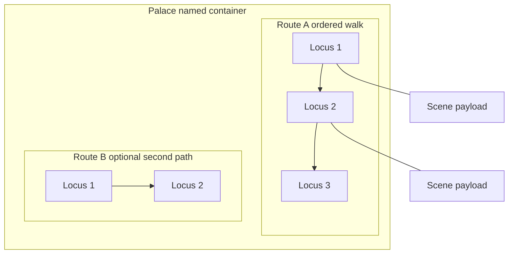
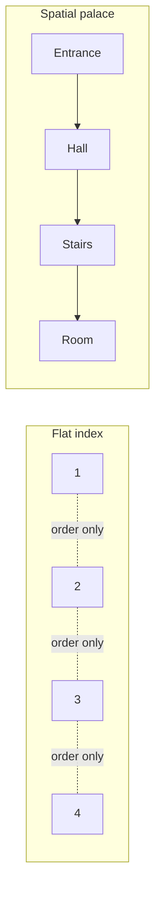

# Mind palace — full specification (method of loci)

A **mind palace** (memory palace) is a **deliberate spatial index**: you store encodings at fixed **loci** along one or more **routes** through a place you can walk in imagination (or in the real world). The palace is not the imagery inside NEDF/CAST/SPEAR/Major — it is the **geography that holds and orders** those scenes.

**This document is canonical** for when to use palaces, how to build them, benefits and weaknesses, and how they differ from flat indexing. Operational cadence (timed walks, repair) stays in `retrieval-protocol.md`. **Graph + CAST layout** extends `cast-system.md` (Part 7). The **Heuristic Palace** is a *special* fixed palace for problem-solving moves — see `heuristic-palace.md` (different job from domain storage palaces).

## Memorizing this method

**Helper:** [memorization-helpers.md](./memorization-helpers.md#mh-mind-palace) — compact NEDF/SPEAR + first session for the *idea* of a domain palace (anchor lives there).

---

## 1. Vocabulary (use these words consistently)

| Term | Meaning |
|------|---------|
| **Palace** | A **named spatial system**: one coherent place (building, campus, vehicle, game map) plus **rules** (route order, naming, what is allowed per locus, how it connects to Anki tags). |
| **Route** | An **ordered path** through the palace: entrance → corner → door → shelf…. Order along the route is the **default list order** for anything stored sequentially (speech, proof, pipeline). |
| **Locus** (plural **loci**) | A **single address**: one specific spot on the route (the third step on the stairs, the left burner on the stove). This is where you **mount** a scene. |
| **Scene** | The **encoded image** (NEDF, CAST edge, PAO story, formula layout…) bound to a locus. |
| **Indexing** (flat) | **Numbered slots** without a continuous spatial story: peg list 1–10, “item 7,” flashcard #42, spreadsheet row. Order exists, but **neighborhood in space does not carry extra meaning** beyond position. |

**Palace vs locus:** the palace is the **whole map**; a locus is **one pin** on that map. People say “my mind palace” when they mean either — here, **palace = container + routes**, **locus = one stop**.

---

## 2. Structure (how pieces nest)

Think in four layers:

1. **Macro** — which palace (e.g. `#palace-university`, `#palace-parents-house`).
2. **Meso** — wings / floors / outdoor loops (clusters of topics).
3. **Micro** — the ordered loci on one walk (individual slots).
4. **Payload** — the scene at each locus (often one primary scene; sometimes a **bounded stack** of 2–3 if you accept higher collision risk).

**One palace, many routes:** e.g. clockwise perimeter vs inside corridor — useful when two courses must not share the same linear chain.

---

## 3. Why a palace instead of “just indexing”?

### What spatial indexing adds

1. **Extra retrieval cues (context reinstatement)**  
   Recall is not only “what was the image?” but “where was I on the walk?” Position, direction, gravity, light, and left/right all add **redundant cues**. Flat index gives you position number only.

2. **Order for free**  
   Walking **forward** is the default serialization. That matches speeches, procedures, and dependency walks without maintaining a separate ordered list in working memory.

3. **Meaningful proximity (optional but powerful)**  
   You can place **related** nodes or edges **near** each other so “walk from A to B” mirrors “conceptual neighbor in the graph.” That is **graph embedding in space** — the heart of CAST + palace in `cast-system.md` Part 7.

4. **Hierarchical chunking**  
   Wing = chapter; room = section; locus = fact. The brain already navigates buildings and cities — you borrow that machinery for abstract material.

5. **Timed structural rehearsal**  
   Walking the whole route under time pressure tests **topology + order**, which Anki alone does not (`retrieval-protocol.md`).

### When flat indexing is enough (or better)

- Very short lists (≤7) you will drill with spaced repetition only.
- **Pure symbol drill** where spatial story adds no structure (some Major/PAO card streams).
- Material that **changes weekly** — palace maintenance cost dominates.
- You dislike visualization — peg + audio or sentence mnemonics may fit better (still ordered, not necessarily spatial).

**Summary:** palace = **spatial + ordered + optionally semantic layout**. Index = **order without rich spatial neighborhood**. Choose by **load shape**: if *topology or long order* matters, palace wins; if *isolated items*, index or Anki may win.

---

## 4. Benefits (honest)

| Benefit | Mechanism |
|---------|-----------|
| **Stable order** | Route is the spine; forgetting “what came next” is reduced. |
| **Large capacity** | Many loci, each holding a dense scene (PAO, CAST…). |
| **Structural exam of knowledge** | A full walk reveals holes in *sequence* and *placement*. |
| **Graph alignment** | Hubs at prominent architecture; clusters in rooms (`cast-system.md`). |
| **Separation of domains** | Different palaces reduce cross-domain collisions. |
| **Speed training** | Timed walks target **latency**, not just correctness. |

---

## 5. Weaknesses and failure modes

| Weakness | What goes wrong | Mitigation |
|----------|-----------------|------------|
| **Build cost** | Designing routes and loci takes time before first encode. | Start with 10–20 loci you already know; grow slowly. |
| **Maintenance** | Source graph changes; palace becomes **wrong topology**. | Version the graph; migrate or prune; tag `#needs-rewrite` (`measurement-framework.md`). |
| **Crowding** | Too many scenes at one locus → blur and swaps. | **One primary scene per locus**; split palace. |
| **Route drift** | You “improve” the path mentally → order silently changes. | **Freeze route**; same direction every walk (`retrieval-protocol.md`). |
| **False confidence** | Smooth walk but wrong content (especially under stress). | Spot-check against source; add checksum scenes (`beating-the-red-queen.md` / REMAPS). |
| **Accessibility** | Some people struggle with vivid space; aphantasia varies. | Use **real walked routes**, tactile anchors, or hybrid audio+spatial. |
| **Ethics (real places)** | Attaching violent/embarrassing imagery to real homes or workplaces. | Use **dedicated study palaces** or fictional maps; keep public spaces clean. |

---

## 6. Real palaces vs imaginative palaces

### Real (physically grounded)

**Definition:** A route through a place you have **actually** walked: home, school, commute, gym.

**Benefits:** Strong kinesthetic and sensory detail; easy to refresh by walking once in a while.

**Risks:** Other people share the space; you may not want bizarre imagery tied to your kitchen. **Do not** rely on private spaces you cannot mentally access in an exam room if that breaks your recall — have a **purely imagined backup** for high-stakes.

### Imaginative / fictional

**Definition:** Game maps, movie sets, invented buildings, Tolkien-scale fantasy — anything with stable layout **because you designed it**.

**Benefits:** Total control; no social awkwardness; can exaggerate architecture for hubs.

**Risks:** Early instability until the map is **overlearned**. You must walk it on schedule until frozen.

### Hybrid (recommended for many learners)

Use a **real skeleton** (your street) for macro order, but **decorate** with allowed fictional props only where encoding demands it — still one canonical route.

---

## 7. When and how to use a palace

### Decision checklist

Use a **domain storage palace** when:

- Order matters (procedure, proof, talk, timeline).
- You need **many** related encodings in one domain for months+.
- **Graph proximity** should mirror idea proximity (CAST-heavy).
- You will run **timed walks** as part of retrieval (`retrieval-protocol.md`).

Defer or skip a palace when:

- The material is **lookup-first** (docs, IDE, regulations) — bookmark and SRS the pointer.
- The structure **changes faster** than you can migrate scenes.
- You only need **recognition**, not ordered or structural recall.

### Build procedure (minimal SPEAR)

| Slot | Action |
|------|--------|
| **S** | Pick macro place + name tag (`#palace-…`). |
| **P** | Ensure 10–40 empty loci you can name in order without notes. |
| **E** | Walk forward naming empty loci; then mount scenes one per locus; tag Anki. |
| **A** | Second route or second palace if collision pressure rises. |
| **R** | Weak locus → REMAPS / `retrieval-protocol.md` repair verbs; never “hope it fixes itself.” |

### Payload rules

- **Default:** one **primary** scene per locus (one NEDF, one CAST edge, one PAO…).
- **Chains:** SPEAR **Execution** can be a **linear chain** of micro-scenes along consecutive loci.
- **CAST graphs:** node scenes at hubs; edge scenes along **connecting** path segments; see Part 7 in `cast-system.md`.

---

## 8. Palace vs Heuristic Palace (do not mix jobs)

| | **Domain palaces** (this doc) | **Heuristic Palace** |
|--|------------------------------|------------------------|
| **Stores** | Course facts, code graphs, history, languages | **Problem-solving moves** (understand, plan, debug…) |
| **Changes** | Often as projects evolve | **Layout should stay fixed** for reflex |
| **Walk goal** | Reproduce content + structure | Trigger the right *move* when stuck |

You *may* reuse the same physical template for both — but **different named systems** and **different walk rules** to avoid collision.

---

## 9. Diagram — flat index vs spatial palace

Flat: neighbors are arbitrary. Spatial: neighbors are **chosen** to carry optional meaning + richer sensory context.

---

## 10. Integration with the rest of the stack

| Layer | Role of palace |
|-------|----------------|
| **NEDF** | Essence/Distinguisher scenes **live at** chosen loci. |
| **SPEAR** | Execution chain **is** the ordered loci (spatial path style). |
| **CAST** | Palace **embeds** the graph; walk ≈ traverse edges. |
| **Numeric** | SEM3/PAO/Major outputs are **objects** placed at loci. |
| **Anki** | Cards remain **atomic**; palace holds **structure** and **speed**; tag `#palace-…`. |
| **Collisions** | Palace + locus id is a **disambiguator** when images repeat (`collisions.md`). |

---

## 11. Sizing and lifecycle

- **Minimal viable:** one route, **12–25** loci, one course or one subsystem.
- **Growth:** add **new wing** before overstuffing a single corridor.
- **Retirement:** when project ends, archive palace → monthly spot-check only (`retrieval-protocol.md`).
- **Measurement:** track walk duration + weak flags; rising time = overcrowding signal.

---

## 12. STEAM / STEMM examples

Three scenarios each for **Science, Technology, Engineering, Arts, Math, and Medicine** using this method: **[steam-stemm-examples.md](./steam-stemm-examples.md#appendix-mind-palace)**.

---

## Related files

- `beating-the-red-queen.md` — **# Loci** chapter: narrative intro to the method of loci, then **Mind palace** subsection (reader spine + diagram); this file is the bundle deep-dive  
- `retrieval-protocol.md` — timed walks, cadence, weak-link repair  
- `cast-system.md` — Part 7 graph–palace principle  
- `heuristic-palace.md` — separate fixed palace for solving  
- `collisions.md` — when the same prop appears in two palaces  
- `memorization-helpers.md` — NEDF/SPEAR stub (`#mh-mind-palace`) + link back to this full spec
