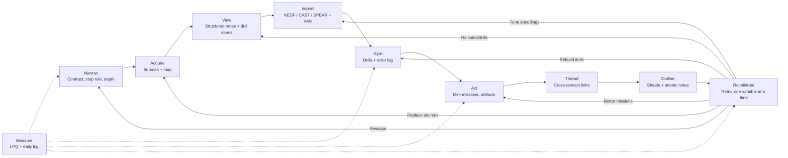

# NAVIGATOR — Nine-Phase Learning Loop (Wraps the Mnemonic Stack)

**Acronym = order.** Read the phases top-to-bottom; their initials spell **NAVIGATOR** — a single word you can recall when checking “what comes next?”

| Letter | Phase | What it is (one line) |
|--------|--------|------------------------|
| **N** | **Narrow** | Border the work: contract, stop rule, depth target |
| **A** | **Acquire** | Pick sources and build a rough map |
| **V** | **View** | Take in material as **structure**, not highlights |
| **I** | **Imprint** | Encode into durable scenes + Anki per stack rules |
| **G** | **Gym** | Drills that isolate bottlenecks + error log |
| **A** | **Act** | Mini-missions that prove transfer (real artifact) |
| **T** | **Thread** | Link into the larger graph across domains |
| **O** | **Outline** | Distill: cheat sheets, atomic notes, one-pagers |
| **R** | **Recalibrate** | Retro, prune, change **one** variable at a time |

*(Earlier working title “RAPID” no longer matched the steps; the pipeline itself is unchanged.)*

**Purpose:** A repeatable **project-scale** path from input → durable knowledge → transfer. The mnemonic stack (`SKILL.md`) owns **Imprint → Retrieve**; NAVIGATOR adds **scope, sources, structured intake, missions, weaving, compression, and evolution** so encoding does not happen in a vacuum.

**Rule:** NAVIGATOR does not replace comprehension gates or CAST/NEDF choices. It sequences *when* you run them across a course, codebase, or certification unit.

**Life / citizenship / STEAM fit:** **Narrow** should name a *human* outcome (calmer conflict at work, safer online habit, budget you actually follow, credible climate claim you can defend), not only a syllabus page. **Act** should produce a small **real-world artifact** (conversation, checklist used, money moved, drill performed). See **`design-orientation.md`** for pillar → tool mapping and **STEAM / STEMM** emphasis (Arts = representation richness; Medicine = high-stakes procedures with external verification).

## Memorizing this method

**Helper:** [memorization-helpers.md](./memorization-helpers.md#mh-navigator) — NEDF/SPEAR lens, minimal first session, stack placement.

---

## Why forgetting is often a process failure

Before blaming "bad memory," check:

- **Weak View** — highlights without structure, facts without relations
- **No retrieval** — rereading instead of recall (Anki + palace walks fix this)
- **No bottleneck isolation** — practicing everything evenly instead of the weak link
- **Weak feedback** — no error log, no repair pass after failures
- **No spacing** — cramming without scheduler (`onboarding-path.md`)
- **Depth mismatch** — trained for recognition, expected strategic use (see DOK below)

---

## Learning contract (**Narrow**)

Before deep work, write a one-page **contract**:

- **Success criteria** — demo, exam band, shipped artifact, or debug bar cleared
- **Constraints** — time budget, tools, money
- **Stop rule** — when to pause or pivot (prevents endless polish)
- **Target depth** — how good is good enough for *this* investment
- **Expected return** — why this block of time is worth it

If "mastery" is undefined, the system drifts into infinite study.

---

## Phases (canonical order)

| # | Phase | Goal | Typical outputs |
|---|--------|------|-----------------|
| 1 | **Narrow** | Border the work | Learning contract, stop rule, depth target |
| 2 | **Acquire** | High-signal sources + map | Short source list, rough dependency / topic map |
| 3 | **View** | Structure, not highlights | Notes with claims, evidence, relations; drill stems |
| 4 | **Imprint** | Durable, retrievable form | NEDF / CAST / SPEAR / numeric encodings + Anki cards per `retrieval-protocol.md` |
| 5 | **Gym** | Isolate bottlenecks | Precision drills with pass rules and error log |
| 6 | **Act** | Prove transfer | Mini-mission producing an external artifact |
| 7 | **Thread** | Connect to larger graph | Cross-links to other domains; reusable primitives |
| 8 | **Outline** | Compress without losing power | Cheat sheet, atomic notes, one-page review |
| 9 | **Recalibrate** | Evolve the system | Retro: change **one** variable at a time; prune dead cards/tags |

Learning is non-linear — **Recalibrate** feeds back into any earlier phase when metrics or reality demand it.

---

## Depth check — Webb's DOK (per phase)

Use this so "done" is not confused with "recognized once":

| Level | Question |
|-------|----------|
| **DOK 1** | Can you recall terms, steps, and core facts? |
| **DOK 2** | Can you explain, compare, classify, and organize them? |
| **DOK 3** | Can you choose and use them under constraints? |
| **DOK 4** | Can you transfer into a real artifact, investigation, or new domain? |

Passing DOK 1–2 alone does **not** mean transfer is built — schedule **Act** explicitly.

*(Full tie-in to measurement belts: `measurement-framework.md`, Dimension 3 — Depth.)*

---

## Quick start (30–60 minutes)

1. Write a minimal learning contract (**Narrow**: scope, stop rule, one success test).
2. **Acquire:** one primary source, one contrasting view, one practice-heavy source.
3. **View:** sketch a map — primitives, operators, patterns, edge cases, one canonical problem.
4. **Imprint + Gym:** small batch of encodings + drills (respect onboarding new-card caps).
5. **Act:** one mini-mission with a tangible output (bugfix, proof sketch, explainer note).
6. **Recalibrate:** keep what moved the needle; delete or suspend what did not.

---

## Measurement defaults (aligns with this stack)

Track learning as a system, not a mood. Prefer:

- **Input** — planned vs actual hours
- **Process** — % sessions with retrieval (not passive reread)
- **Output** — validated concepts or encodings per focused hour
- **Outcome** — transfer attempts vs successes (mini-missions)
- **Time** — D1 / D7 / D30 spot checks on cold recall where relevant
- **ROI** — if extra depth stops paying, maintain instead of pushing

Details: `measurement-framework.md` — belts and LPQ read from METER's event log, plus the daily check-in there.

---

## Diagram

---

## Companion habits (80/20, from *Beating the Red Queen*)

These pair with the mnemonic stack; they are not encodings:

| Habit | Use when |
|-------|----------|
| **Chunking** | Too many loose parts; need named units |
| **Order** | Talks, procedures, lists need a stable path |
| **Loci / palace** | Ordered recall under pressure |
| **Major** (or bootstrap 00–19) | Digits must be exact |
| **Active recall + SRS** | Durability; Anki as single scheduler |

**Externalize** commitments, deadlines, and shopping — memory holds **cues**, not the only copy (`onboarding-path.md` preconditions).

---

## View-phase tactic: visual container chunking

When you need a **short ordered list** without a full palace route:

1. Pick one strong anchor image (house, laptop, face, map).
2. Split it into **regions** with a fixed scan order (e.g. top-left → top-right → bottom-left → bottom-right).
3. **Merge** items into the surface (inside the window, on the handle, carved in) — do not float them "near" the anchor.
4. Weak link feels like a **broken composite** (checksum effect) — good for spotting gaps.

---

## Memory gym (rotation idea)

Short, repeatable sessions beat heroic sporadic effort. Rotate drills across:

- numbers · dates · order · short lists · calendar anchors · presentation outline · language items

Loop: **imprint → retrieve → review → act** on a timer you can repeat daily.

---

## Where this sits in the ecosystem

| Need | Read |
|------|------|
| Which encoder for this datum? | `SKILL.md` decision tables |
| Week-by-week caps and promotion | `onboarding-path.md` |
| Before NEDF/CAST on hard ideas | `comprehension-protocol.md` |
| Anki shapes and palace cadence | `retrieval-protocol.md` |
| Trajectory and belts | `measurement-framework.md` |

NAVIGATOR is the **scaffolding**; those files are the **engine**.

---

## STEAM / STEMM examples

Three scenarios each for **Science, Technology, Engineering, Arts, Math, and Medicine** using this method: **[steam-stemm-examples.md](./steam-stemm-examples.md#appendix-navigator)**.

