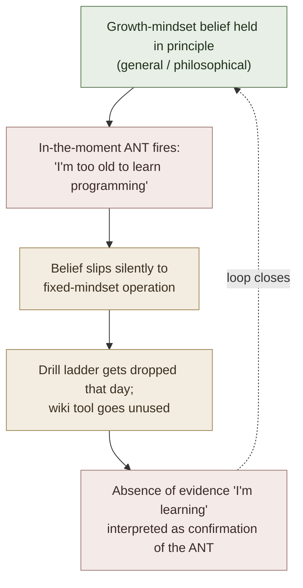

# ANTs and the 7 LIEs of Learning

**Summary**: Operational counter-protocol for the **belief-system layer** that gates whether the wiki gets used. Two stacked concepts:
1. **LIEs — Limited Ideas Entertained**: Jim Kwik's reframe of fixed-mindset beliefs about learning capacity into a catalog of 7 specific lies, each rebuttable. LIE #1 (Intelligence is Fixed) is load-bearing; the other 6 are scaffolding.
2. **ANTs — Automatic Negative Thoughts**: term coined by psychiatrist Daniel Amen (*Change Your Brain, Change Your Life*, 1998); the in-the-moment thoughts that fire below conscious notice and undermine effort. Kwik's protocol: **identify → name → talk back**. Same machinery as Maltz's [Cancel!](./failure-mechanism.md) pattern interrupt and Maltz's BS (Belief System) check.

This page is the **operational layer** above [growth-mindset](./growth-mindset.md) (which is the theoretical frame) and a sibling of [failure-mechanism](./failure-mechanism.md) (which is Maltz's identity-layer version). Together they form the belief-discipline that lets the wiki's drill ladders actually run.

**Sources**:
- Jim Kwik, *Limitless* (Hay House 2020), Ch 5 "The Spell of Belief Systems" + Ch 6 "The 7 Lies of Learning" + Day 2 of the 10-Day Kwik Start Plan ("Kill Your ANTs") — source file `F:\tutorials\Mnemonic Device\Limitless...epub`
- Daniel G. Amen, *Change Your Brain, Change Your Life* (Times Books 1998) — origin of the ANT term and the identify-name-rebut protocol
- David Burns, *Feeling Good* (Avon 1980); *The Feeling Good Handbook* (Plume 1989) — cognitive distortions taxonomy (all-or-nothing thinking · overgeneralization · mental filter · disqualifying the positive · jumping to conclusions · magnification · emotional reasoning · should statements · labeling · personalization)
- Aaron T. Beck, *Cognitive Therapy and the Emotional Disorders* (International Universities Press 1976) — the CBT foundation for cognitive-restructuring
- Carol Dweck, *Mindset* (2006) — the theoretical frame; see [growth-mindset](./growth-mindset.md)

**Last updated**: 2026-05-24

---

## The load-bearing unlock

[growth-mindset](./growth-mindset.md) names the belief that abilities are developable. ANTs + LIEs name **why the belief slips in the moment**:



The general-frame belief is necessary but insufficient. The operational protocol must catch the in-the-moment slip. **ANTs are caught at the thought-level; LIEs are caught at the belief-system level**. The two operate on the same loop at different timescales:

| Layer | Timescale | Form | Counter-tool |
|---|---|---|---|
| **LIE** (Limited Idea Entertained) | belief-system; quasi-permanent until revised | "intelligence is fixed" | Reframe + counter-evidence (Dweck-style) |
| **ANT** (Automatic Negative Thought) | moment-to-moment; fires hundreds of times/day | "I can't learn this" / "I'm not a math person" / "this is too hard" | Cancel! / identify-name-rebut (Amen / Maltz) |
| **BS** (Belief System check) | session-level | drift-check across both above | Periodic audit |

Kwik's Day 2 of the Limitless 10-Day Plan: *"Identify the voices in your head that are focusing on what you can't do — those Automatic Negative Thoughts (ANTs). Start talking back to them. Remember, too, to discount those pesky LIEs: Limiting Ideas Entertained. And consistently check in with your BS, Belief Systems."*

The wiki gains a three-layer belief-discipline that sits *above* [self-image](./self-image.md) and *above* [growth-mindset](./growth-mindset.md) at the operational level.

---

## The 7 LIEs (Kwik *Limitless* Ch 6)

| # | LIE | Why it's a lie | Counter-frame to assert |
|---|---|---|---|
| **1** | **Intelligence is fixed** | Test scores are stable; intelligence is not (Roche; Flynn effect; Dweck) | Mindset is a choice; intelligence is trainable across decades — see [growth-mindset](./growth-mindset.md) |
| 2 | We only use 10% of our brain | Neuroimaging consistently disproves this; whole brain is active across tasks | Brain efficiency varies; capacity is not the bottleneck |
| 3 | Mistakes are failures | Mistakes are data; people who avoid them avoid learning. Burger & Starbird 2012 grade 5% of their students' course grades on **quality of failure** — students who don't fail productively cannot earn an A. See [fail-to-succeed-habit](./fail-to-succeed-habit.md) for the Edison "10,000 ways" and Beckett "fail better" canon, and *Mary's loop* as the operational defect-find→fix iteration pattern. | Mistakes = where the gap is; mistake-rate ↑ during plateau-breaking ([Foer metronome](./ok-plateau.md)); [Burger Fire-habit](./fail-to-succeed-habit.md) *"fail nine times"* protocol reframes the first miss as *"10% done!"* |
| 4 | Knowledge is power | Knowledge is *potential* power; **applied** knowledge is power | Encoding without retrieval, drill, or use is shelf-decay — see [active-recall](./active-recall.md) |
| 5 | Learning new things is very difficult | Difficulty is a function of method, not capacity | Bad method makes anything hard; the wiki's encoder spine + drill ladders are *the* method |
| 6 | The criticism of other people matters | Most criticism reveals the critic, not the criticized | Filter for signal; discard the rest |
| 7 | Genius is born | Genius is largely built (Bruce Lee, Mozart, Einstein worked at it); see Ericsson deliberate-practice canon | [ok-plateau](./ok-plateau.md) §Deliberate practice; [learning-sciences-validation](./learning-sciences-validation.md) |

**LIE #1 is the load-bearing one**. The other six are scaffolding around it — if LIE #1 is asserted as truth, the others survive even after individual refutation. Kill LIE #1 (via [growth-mindset](./growth-mindset.md)) and the rest deflate.

---

## ANTs — Amen's operational protocol

Daniel Amen (*Change Your Brain, Change Your Life*, 1998) coined the metaphor: **Automatic Negative Thoughts are ants** — small, individually trivial, but they swarm and ruin the picnic. The protocol is three steps:

| Step | What | How |
|---|---|---|
| **1. Identify** | Notice the thought is firing | The signal is usually an *emotional dip without obvious external cause* — that means an ANT fired below notice and is now coloring the mood |
| **2. Name** | Classify the thought-pattern | Use a Burns / Beck cognitive-distortion taxonomy (next section) so the ANT is named, not just felt |
| **3. Talk back** | Counter-assert with specific evidence | Not "think positive"; specific *evidence-based* rebut — "actually I learned X last month, here's the artifact" |

The Maltz parallel: when a [F·A·I·L·U·R·E.](./failure-mechanism.md) frame fires, Maltz prescribes *"Cancel!"* as the verbal pattern-interrupt and then re-orientation to the [winning-feeling](./winning-feeling.md). Same machinery, different vocabulary. Both halt the ANT's ability to reinforce itself via reconsolidation (every uninterrupted rumination on an ANT *strengthens* the trace — see [memory-reconsolidation](./memory-reconsolidation.md) §Cancel-pattern interrupt).

The Burger / [Fire-habit](./fail-to-succeed-habit.md) parallel sits at a *different* layer: ANTs/Cancel! address the *thought* level (per-thought belief-discipline); Fire-habit's "Mary's loop" addresses the *task* level (per-attempt iteration discipline). Both halt the same downstream failure (drilled skill abandoned because evidence-of-failure was misread as evidence-of-inability), but at different layers. The full belief-discipline stack: per-thought ANTs/Cancel! → per-session BS check → per-attempt Mary's loop (Burger Fire) → per-quarter LIE review → annual self-image audit ([Burger Aether](./transformative-change-habit.md) + Maltz [self-image](./self-image.md)).

---

## The 10 cognitive distortions (Burns / Beck → ANT taxonomy)

**Ownership note (2026-08-31):** [thought-mastery-os](./thought-mastery-os.md) is now the canonical owner of the cognitive-distortion taxonomy wiki-wide, and carries five additional worry-specific cards sourced from leahy-worry-cure. This page keeps the 10-card table below as the learning-context instance of the taxonomy (the ANT vocabulary and the learning-specific examples are this page's own), but does not restate the general deck — see the owner page for updates, the full 15-card set, and cross-taxonomy notes.

Names for what kind of ANT just fired:

| # | Distortion | What it looks like in learning context |
|---|---|---|
| 1 | **All-or-nothing** | "If I can't master it, there's no point starting" |
| 2 | **Overgeneralization** | "I failed this drill, so I always fail at this kind of thing" |
| 3 | **Mental filter** | Focusing only on what went wrong in the session; filtering out the wins |
| 4 | **Disqualifying the positive** | "I only got it right because the question was easy" |
| 5 | **Jumping to conclusions** | Mind-reading ("they think I'm slow") / fortune-telling ("I'll fail tomorrow's test") |
| 6 | **Magnification / minimization** | Errors loom huge; gains feel trivial |
| 7 | **Emotional reasoning** | "I feel stupid, so I must be stupid" |
| 8 | **Should statements** | "I should have learned this faster" |
| 9 | **Labeling** | "I'm a slow learner" / "I'm not a math person" |
| 10 | **Personalization** | Attributing external setbacks to one's character |

Naming the distortion is the second of Amen's three steps. Without naming, the ANT is felt-but-not-seen and cannot be rebutted with evidence.

---

## The Kwik wedge — BS check

Kwik's *Limitless* Day 2 also names a **BS (Belief System) check** — a session- or day-level audit asking: *what dominant belief did I act under today?* This sits at the third timescale:

```
Per-thought:   ANT identify-name-rebut
Per-session:   BS audit (what belief was I operating under?)
Per-quarter:   LIE catalog review (any of the 7 reasserted itself?)
```

This three-tier rhythm is the operational version of the [growth-mindset](./growth-mindset.md) theoretical claim.

---

## Wiki integration

Five operational follow-ups:

1. **[red-queen-skill-gym](./red-queen-skill-gym.md) pre-session** — first 30 seconds of any session is a BS check: *"what belief am I about to operate under?"* If a LIE has reasserted (#1 most common), do not start the drill; do the rebut first.
2. **[ok-plateau](./ok-plateau.md) Foer metronome** — when error rate spikes by design, ANTs fire reliably. Pre-mark the session with the counter-frame in writing so the rebut is *waiting* when the ANT arrives.
3. **[active-recall](./active-recall.md) failed-card pattern** — every Anki "again" answer is an ANT bait. The card schedule already absorbs the failure as data; the *operator* must too. Add a discipline: any "again" answer triggers a one-second pause to name the ANT if one fired.
4. **[memory-reconsolidation](./memory-reconsolidation.md) Cancel! integration** — the Cancel! pattern from [failure-mechanism](./failure-mechanism.md) is the most aggressive ANT counter; use it when an ANT is mid-rumination (vs the gentler identify-name-rebut for ANTs caught earlier).
5. **PULSE Stress-side** — chronic ANT firing is itself a Stress indicator; logging ANT-rate per day is a PULSE-readable signal.

---

## METER floor for this page

- Name the 3 belief-discipline layers in <8s: ANT (per-thought) · BS check (per-session) · LIE catalog (per-quarter).
- Recall Amen's 3-step ANT protocol in <6s: identify · name · talk back.
- Name LIE #1 in <3s: "Intelligence is fixed" — the load-bearing one.
- Name 5 of the 7 LIEs in <15s.
- Name 5 of the 10 cognitive distortions in <15s.
- Distinguish ANT from Cancel! in <10s: ANT-protocol is the gentle catch-and-rebut; Cancel! is the aggressive mid-rumination interrupt.

---

## Mnemonic

A **picnic blanket** spread on grass. On the blanket: a **drill notebook**, the **wiki open**, **Anki cards**, a **plate of food labeled LEARNING SESSION**. From all sides, **black ants** swarm the picnic — each ant has a small thought-bubble:
- one says *"I'm too old"* (ANT)
- another *"I always fail at this"* (overgeneralization)
- another *"I'm not a math person"* (labeling)
- another *"if I were smart this would be easy"* (LIE #1)

A figure standing over the blanket holds:
- a **magnifying glass** (Identify)
- a **field-guide booklet** labeled *Burns/Beck Distortion Names* (Name)
- a **spray-bottle** labeled with specific past learning wins as ammunition (Talk Back)

Above the picnic, **seven enormous LIE billboards** loom — #1 a glass cylinder labeled *Intelligence is Fixed* (the [growth-mindset](./growth-mindset.md) diptych). One BS-Check **timer** sits on the corner of the blanket, set to ring every session. To the side: a **Cancel! stamp** the figure uses on any ant caught already rummaging through the food (mid-rumination ANTs).

---

## Memory checksum

- **3** belief-discipline layers (ANT per-thought · BS check per-session · LIE catalog per-quarter)
- **3** Amen steps (Identify · Name · Talk back)
- **7** LIEs; #1 (Intelligence is Fixed) is load-bearing
- **10** Burns/Beck distortions (all-or-nothing / overgeneralization / mental filter / disqualifying positive / jumping to conclusions / magnification / emotional reasoning / should / labeling / personalization)
- **2** counter-protocols (gentle: Amen identify-name-rebut · aggressive: Maltz Cancel!)
- **1** founding metaphor (ants on a picnic — small, swarming, ruinous)

3-3-7-10-2-1 recall from "ANTs and LIEs of learning" within 60s → page is encoded.

---

## U — See (CAST)

1. Picnic-and-ants scene; 3 timescale layers stacked (per-thought / per-session / per-quarter); 7-LIEs billboards looming above; Cancel!-stamp and field-guide tools
2. Edges: ANT fires → identify → name (Burns/Beck distortion) → talk back (evidence) → ant retreats; uninterrupted ANT → reconsolidation → trace strengthens (vicious loop)

## D — Name (NEDF)

1. ANT = Automatic Negative Thought (Amen 1998)
2. LIE = Limited Idea Entertained (Kwik); 7 catalogued; #1 = "Intelligence is fixed"
3. BS = Belief System check (Kwik); session-level audit
4. Distinguisher: ANT is per-thought; LIE is belief; both differ from [FAILURE-frame](./failure-mechanism.md) (identity-layer)

## F — Do (SPEAR)

1. Per-session: 30-second BS check before drill; if LIE reasserted, rebut first
2. Per-thought: catch ANT → name distortion (Burns/Beck) → talk back with specific past evidence
3. Mid-rumination ANT: switch to [Cancel!](./failure-mechanism.md) aggressive interrupt
4. Per-quarter: LIE catalog review; any of the 7 reasserted?
5. Drill-card "again" answer: 1-second pause to check for ANT-firing

## B — Watch (HEART)

1. Emotional dip without external cause → ANT fired below notice
2. Defensive response to feedback → personalization (#10) firing
3. Drill avoidance after one bad session → overgeneralization (#2) firing
4. "Think positive" without evidence-based rebut → ineffective; protocol skipped a step

## L — Predict (ORACLE)

1. Per-day ANT frequency predicts week's drill volume (inverse)
2. Unrebutted LIE #1 over weeks → drill ladder abandonment >60%
3. ANTs strengthen via [memory-reconsolidation](./memory-reconsolidation.md) every uninterrupted rumination; rumination time predicts trace strength

## R — Act (GRACE)

1. Skill-onboarding day → preload the 7-LIE counter-frames as a checklist
2. ANT fires during session → identify-name-rebut without breaking session
3. Mid-rumination → Cancel! verbal interrupt
4. PULSE Stress reading high → check for ANT-rate as upstream contributor

---

## Related pages

- [growth-mindset](./growth-mindset.md) — theoretical frame above this operational layer
- [failure-mechanism](./failure-mechanism.md) — Maltz identity-layer sister; Cancel! pattern is the aggressive ANT interrupt
- [self-image](./self-image.md) — downstream identity gate; ANT-clearing protects self-image from drift
- [snap-back-effect](./snap-back-effect.md) · [ok-plateau](./ok-plateau.md) — both plateau pages assume the belief-discipline of this page is operational
- [memory-reconsolidation](./memory-reconsolidation.md) — uninterrupted ANT rumination strengthens the ANT trace; this page's protocols halt that loop
- [active-recall](./active-recall.md) — "again" answers are ANT bait; protocol applies inline
- [red-queen-skill-gym](./red-queen-skill-gym.md) — pre-session BS-check addition
- [pulse-overview](./pulse-overview.md) — Stress-side reads ANT rate as upstream signal
- [learning-sciences-validation](./learning-sciences-validation.md) — extension #13 candidate: ANT+LIE belief-discipline as operational counterpart to growth-mindset extension #12
- [psycho-cybernetics-maltz](./psycho-cybernetics-maltz.md) — Maltz family of identity-belief protocols
- [thought-mastery-os](./thought-mastery-os.md) — canonical owner of the cognitive-distortion taxonomy as of 2026-08-31; this page's 10-card table is the learning-context instance
- leahy-worry-cure — source of the taxonomy's worry-specific extension cards, now on the owner page
- **2026-05-29 learning-canon cross-links**: [learning-styles-myth](./learning-styles-myth.md) (4-source convergent debunking) · [fluency-illusion](./fluency-illusion.md) (cognitive-layer sibling failure mode) · [10000-hour-rule-mythbusting](./10000-hour-rule-mythbusting.md) (sister myth-correction) · [brown-make-it-stick](./brown-make-it-stick.md) Ch 6 (myths debunked in chapter) · [willingham-cognitive-principles](./willingham-cognitive-principles.md) (#7 children-more-alike-than-different)
