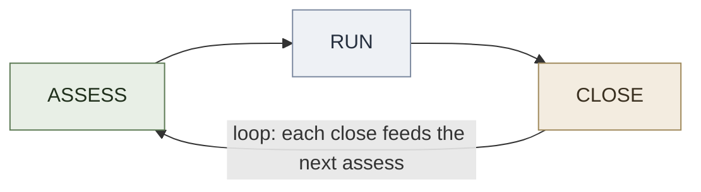

# ARC Framework

**Summary**: The unified problem-solving loop — three phases that wrap all five core tools into one callable sequence. When a problem lands, you run ARC: Assess the type, Run the matching pipeline, Close with reflection.

**Sources**:
- wiki/problem-solving-os.md
- wiki/frame-forge.md
- wiki/problem-type-classifier.md
- wiki/decision-kernel.md
- wiki/attention-framework.md

**Last updated**: 2026-08-20 (§Visual authored — diagram replaces the TODO stub); 2026-08-20 (§Checksum authored — 3 falsifiable retrieval questions replace the TODO stub); 2026-08-20 (§Mnemonic authored — TODO stub replaced with a real device); 2026-08-20 (`glyph:` re-picked 🌈 → 🧰 — wraps all five core tools into one callable — a toolbox is one thing you pick up with many inside; [representation-rules](./representation-rules.md) Rule 11); 2026-08-20 (`glyph:` assigned — [representation-rules](./representation-rules.md) Rule 11); 2026-05-19

---

## The Three Phases



### A — Assess

Run [S·E·C·T](./problem-type-classifier.md). Output: one letter. Time: <60 seconds.

| Output | Meaning | Route to |
|---|---|---|
| **S** | Search — the answer exists, you need to find/construct it | FRAME FORGE |
| **E** | Execution — the path is known, staying on it is the challenge | Attention Framework |
| **C** | Constraint — hard limits narrow the solution space | Decision Kernel |
| **T** | Tradeoff — no solution is free; you are choosing which cost to pay | Decision Kernel |

**Failure mode**: skipping Assess and jumping straight to Run. This produces the wrong tool for the problem type — the most common reason a problem-solving session stalls.

### R — Run

Execute the type-specific pipeline named by Assess.

| Type | Pipeline | Steps |
|---|---|---|
| S | [FRAME FORGE](./frame-forge.md) | Frame · Inventory · Represent · Probe · Generate · Evaluate · Formalize · Distill (8 steps) |
| E | [Attention Framework](./attention-framework.md) | Energy audit · Focus block · Abort conditions · Recovery protocol |
| C / T | [Decision Kernel](./decision-kernel.md) | 7 questions · Reversibility check · Values hierarchy · Decision record |

Run ends when the pipeline's output criterion is met:
- FRAME FORGE: a formalized answer you can communicate
- Attention Framework: the task is done or the session is closed cleanly
- Decision Kernel: a logged decision with reasoning

**Note on scope**: S-type problems (FRAME FORGE, 8 steps) take significantly longer than E or C/T types. ARC's "Run" phase spans minutes to hours depending on type — Assess tells you which it is so you can set expectations before committing.

### C — Close

Run the [AAR](./after-action-review.md) on every completed loop, regardless of type. Four questions, 10 minutes:

1. **What did I intend?** — the goal you set at the start of Run
2. **What happened?** — the actual output
3. **Why the gap?** — root cause of any difference
4. **What changes?** — one concrete adjustment to carry into the next loop

Close is not optional on completed problems. Skipping it means the session produced output but no learning. Over 30+ sessions, the compound cost is a flat [METER](./meter-overview.md) curve instead of a rising one.

---

## How to Use It

When a problem lands, say three things to yourself:

1. **"What type is this?"** — run S·E·C·T, produce one letter
2. **"Which pipeline, and how long?"** — route to the matching tool, set a time expectation
3. **"What did I learn?"** — run AAR at close, log the adjustment

That is the complete loop. ARC does not replace the inner tools — it is the scaffold that tells you which tool to pick up and when to put it down.

---

## Composition With Other Layers

ARC is a **calling convention**, not a new encoder. It wraps the existing tools without replacing them.

| Layer | Role inside ARC |
|---|---|
| [PULSE](./pulse-overview.md) | Governs whether to start a loop at all (state precondition check before Assess) |
| [METER](./meter-overview.md) | Records the loop: problem type logged at Assess, pipeline output at Run, AAR result at Close |
| [REMAPS](./remaps.md) | Applied inside Run to any encoding steps within FRAME FORGE |
| [Problem-Solving OS](./problem-solving-os.md) | ARC is the callable entry point for the OS; the OS provides the routing table, maturity ladder, and daily rhythm that govern multiple loops over time |
| [problem-solving-maturity-levels](./problem-solving-maturity-levels.md) | At levels 0–2 (Lost/Aware/Apprentice), ARC runs with coaching and reference; at levels 3–4 (Practitioner/Journeyman), Assess becomes automatic (<30s); at level 5 (Expert), the whole loop is internalized |

---

## Drilling ARC

ARC is not useful as a fact to memorize. It is a **reflex loop** to internalize through repeated use.

**Minimum viable drill:**
- Take any real problem (work, study, personal)
- Say the phase name aloud before entering it: "Assessing... it's an S-type. Running FRAME FORGE. Step 1: Frame."
- At close, answer all 4 AAR questions in writing, even briefly

**Pass criterion**: Assess produces a type classification in <60s without prompting from the list. Run starts the correct pipeline immediately. Close runs without skipping even when the output feels obvious.

**Maturity signal**: You stop needing to name the phases aloud. The sequence fires as a single gesture.

---

## Related Pages

- [problem-solving-os](./problem-solving-os.md) — the full OS that ARC is the entry point for; contains routing table, maturity ladder, and daily/weekly rhythm
- [problem-type-classifier](./problem-type-classifier.md) — the S·E·C·T tool used in Assess
- [frame-forge](./frame-forge.md) — the S-type pipeline used in Run
- [attention-framework](./attention-framework.md) — the E-type pipeline used in Run
- [decision-kernel](./decision-kernel.md) — the C/T-type pipeline used in Run
- [after-action-review](./after-action-review.md) — the reflection protocol used in Close
- [problem-solving-framework-map](./problem-solving-framework-map.md) — visual atlas showing where ARC's inner tools sit in the 12-band taxonomy
- [METER](./meter-overview.md) — measurement layer that logs each ARC loop
- [PULSE](./pulse-overview.md) — state layer that governs loop entry


---

## U — See (CAST)
1. Unified 3-phase problem-solving loop
2. Assess → Run → Close

## D — Name (NEDF)
1. ARC framework = unified 3-phase loop
2. Distinguisher: wraps 5 tools into one callable sequence
3. Failure mode: skipping Close phase

## F — Do (SPEAR)
1. Problem appears → A: assess type
2. R: run matching pipeline → C: close with reflection

## B — Watch (HEART)
1. Skipping Close → no learning
2. Wrong pipeline in R

## L — Predict (ORACLE)
1. Assess result → predict pipeline
2. Close → predict next-time improvement

## R — Act (GRACE)
1. Problem landed → run ARC
2. Stuck → return to A phase

## Mnemonic

**"Assess · Run · Close — and the close *is* the next assess."** Three phases, but the third feeds the first, so ARC is a loop with a handle rather than a checklist with an end. One thing you pick up; five tools inside it.

## Checksum

1. Name the three phases, and say what makes it a loop rather than a checklist.
2. How many core tools does ARC wrap, and what is the point of wrapping them into one call?
3. Which phase feeds which, and what does that mean for the end of a run?


## Visual

**Three phases, and the third feeds the first** — a loop with a handle, not a checklist with an end.

```
             ┌──────────────────────────────────┐
             │                                  │
             ▼                                  │
        ┌─────────┐      ┌─────────┐     ┌─────────┐
        │ ASSESS  │─────▶│   RUN   │────▶│  CLOSE  │
        │what is  │      │ use the │     │ what did
        │  true?  │      │  tools  │     │ it teach?
        └─────────┘      └─────────┘     └─────────┘
                              │
                    ┌─────────┴─────────┐
                    │ the five core tools│
                    └────────────────────┘
```

The close **is** the next assess — which is why one problem's ending is the next one's opening move.

