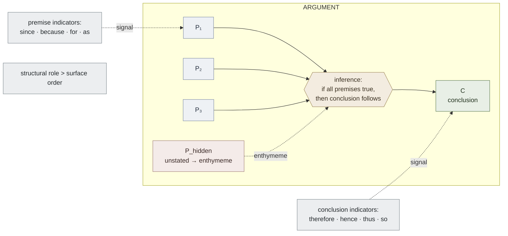
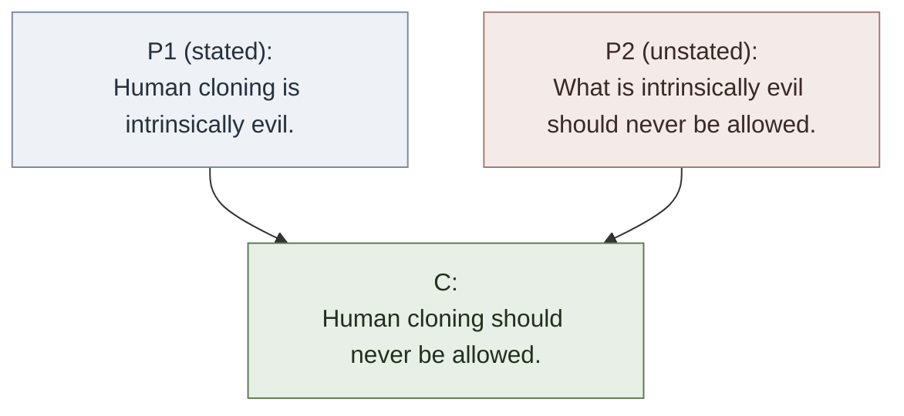

# Argument Anatomy

**Summary**: The internal structure of every argument: **premises** (the supports) + **conclusion** (the claim) + **inference** (the relation that ties them) — plus the surface signals (premise indicators, conclusion indicators) and the common shortcut (the **enthymeme**, an argument with an unstated but understood premise). The Atom-tier concept page in [logic-atomic-design](./logic-atomic-design.md)'s Argument-Anatomy family. Trained as the *argument-extraction reflex* in the [Red Queen Gym](./red-queen-skill-gym.md) — given an English paragraph, identify premises and conclusion in <60 s with ≥80% accuracy.

**Sources**:
- [Copi/Cohen/McMahon *Introduction to Logic* 14th ed](./copi-introduction-to-logic.md), Ch 1 §2 *Propositions and Arguments* and Ch 1 §3 *Recognizing Arguments* — the canonical treatment.
- [methods-of-mathematical-argument](./methods-of-mathematical-argument.md) — sister page on argument-*construction* (Zeitz, proof methods).
- [problem-solving-os](./problem-solving-os.md) — the operating sequencer that gains a validity-test sub-step using these atoms.

**Last updated**: 2026-05-25

---

## One-line

> An **argument** is a cluster of propositions in which one (the *conclusion*) is claimed to follow from the others (the *premises*).

Not disagreement, not controversy. A *structured inferential unit*. The first move of every analysis is to extract this structure from the English (or other-language) surface.

## Unlocks (lead, not footer)

1. **Argument-extraction as a wiki-grade reflex.** Every analytic task in the wiki — reading a Bible passage, debugging a security argument, evaluating a money decision, parsing a logic puzzle, reviewing a philosophical argument — starts with the same move: locate premises, locate conclusion, name the inference. The Copi vocabulary makes this a *drillable* atomic skill. METER target: <60 s with ≥80% accuracy on a random Copi exercise from Ch 1.
2. **The enthymeme is the load-bearing analytical move.** Stated arguments are easy. The unstated premise is where almost every interesting disagreement lives — the silent assumption the speaker considers obvious or the speaker is hiding. Surfacing the unstated premise is the first move that turns disagreement from rhetorical pressure into examinable structure.
3. **Indicators are weakly diagnostic.** Premise/conclusion indicators help but do not settle which proposition is which — context and meaning must do most of the work (Copi: "the order in which premises and conclusion appear can also vary, but it is not critical in determining the quality of the argument").

## Mnemonic

**P → C** (with hidden *if* in the middle).

The simplest possible glyph: premise(s) on the left, conclusion on the right, an arrow. The fact that the arrow can be expanded into *"if all the premises are true, then the conclusion follows"* is the whole content of the page.

For the enthymeme: **P → [P_hidden] → C**. A second premise lives in the brackets; the analyst's job is to fill them.

## Memory checksum

If you can answer these in <60 s each from memory, the page is encoded:

1. **What is a proposition?** (A statement, what is typically asserted by a declarative sentence — always either true or false. Questions / commands / exclamations are *not* propositions.)
2. **State the premise / conclusion / inference structure.** (Premises = propositions offered as support; Conclusion = the proposition supported; Inference = the relation by which the conclusion is arrived at from the premises.)
3. **List 4 premise indicators and 4 conclusion indicators.** (Premise: *since · because · for · as · inasmuch as · in view of the fact that*. Conclusion: *therefore · hence · thus · so · consequently · accordingly · which means that · we may infer*.)
4. **What is an enthymeme?** (An argument with one or more premises unstated but understood. The unstated premise may be controversial; surfacing it is the analyst's first move.)
5. **State the order-doesn't-determine rule.** (Premises can appear before or after the conclusion in the surface text; the structural role is determined by meaning + indicators, not by surface order.)

## Visual — the argument glyph

The arrows show the *inferential* flow, which can run in any direction in the text — premises can appear after the conclusion, between two parts of the conclusion, embedded in subordinate clauses, etc. The job of the analyst is to *redraw* this graph from the English.

---

## The five atoms

### 1. Proposition

A **proposition** is what a declarative sentence is typically used to assert. Always either true or false (truth-value may be unknown). Distinguished from:

- **Questions** ("Do you know how to play chess?") — assert nothing.
- **Commands** ("Come quickly!") — neither true nor false.
- **Exclamations** ("Oh my gosh!") — neither true nor false.

Two different sentences can express the same proposition: *"It is raining"* and *"Es regnet"* assert the same proposition in two languages. The same sentence can express different propositions at different times: *"The largest US state was once an independent republic"* — true in 1850 (about Texas), false in 1960 (about Alaska).

Compound propositions:
- **Conjunctive**: *"The Amazon Basin produces oxygen, and creates rainfall, and harbors species"* — equivalent to asserting each component separately.
- **Disjunctive (alternative)**: *"Circuit courts are useful, or they are not useful"* — no one component asserted.
- **Hypothetical (conditional)**: *"If God did not exist, it would be necessary to invent him"* — neither component asserted; only the if-then relation is asserted.

### 2. Premise

A premise is a proposition offered as support for the conclusion. May be stated or unstated (enthymeme). May be true or false; the argument is *valid* (or *strong*) based on the inferential structure, not on premise truth — that's [soundness](./validity-vs-soundness.md).

### 3. Conclusion

The proposition that the premises are offered to support. There is always exactly one conclusion *per argument* (a passage may contain multiple arguments, hence multiple conclusions). Tip: the conclusion is what the speaker is *trying to get you to believe*.

### 4. Inference

The relation by which the conclusion is arrived at and affirmed on the basis of the premises. Every argument *corresponds to* an inference; for every possible inference there is a corresponding argument.

Inferences are either **deductive** (premises claim to *necessitate* the conclusion) or **inductive** (premises claim to make the conclusion *probable*). See [validity-vs-soundness](./validity-vs-soundness.md) for the full distinction.

### 5. Indicator

A word or phrase that signals the role of the proposition that follows.

**Conclusion indicators** (Copi's partial list):

| therefore | hence | so | accordingly | in consequence |
| consequently | proves that | as a result | for this reason | thus |
| it follows that | I conclude that | which shows that | which means that | which entails that |
| which implies that | which allows us to infer that | which points to the conclusion that | we may infer | |

**Premise indicators** (Copi's partial list):

| since | because | for | as | follows from |
| as shown by | inasmuch as | as indicated by | the reason is that | for the reason that |
| may be inferred from | may be derived from | may be deduced from | in view of the fact that | |

Indicators are *weakly diagnostic*. Words that look like indicators may not be (*"since"* can mean *because* or *temporally after*). Words that aren't on the list may serve as indicators in context. *Meaning beats lexicon every time.*

## The enthymeme — load-bearing atom

An **enthymeme** is an argument with one or more premises *unstated but understood*.

Example (Copi Ch 1): *"Human cloning — like abortion, contraception, pornography and euthanasia — is intrinsically evil and thus should never be allowed."*

The unstated premise: *"What is intrinsically evil should never be allowed."*

The argument's structure:

The unstated premise is where the argument's interesting work happens. The arguer may rely on it because it's universally accepted; or may deliberately leave it unstated because it's contested and stating it would invite attack. **Surfacing the unstated premise is the analyst's first sharp move.**

Common varieties:
- *"Since X is Y, X is Z"* relies on the unstated *"all Y is Z"*.
- *"If slavery is not wrong, nothing is wrong"* (Lincoln, quoted by Rawls) — relies on the obvious-falsehood second premise *"things are wrong"* and the conclusion *"slavery is wrong"*. The unstated falsehood of the consequent → unstated falsehood of the antecedent.

## Argument vs explanation

Both have the surface form *"Q because P"*. The distinction:

| Test | Argument | Explanation |
|---|---|---|
| Is Q in doubt? | Yes — premises offered to *establish* Q | No — Q is known; P offered to *account for why* Q is true |
| Goal | Persuade | Illuminate |

Example argument: *"Lay up treasures in heaven, where neither moth nor rust consumes. For where your treasure is, there will your heart be also."* (Matt 6:19-21) — laying up treasures in heaven is in doubt; the *for* clause supplies a reason.

Example explanation: *"Therefore is the name of it called Babel; because the Lord did there confound the language of all the earth."* (Gen 11:9) — the name Babel is not in doubt; the *because* clause explains *why* the name was given.

When you can't tell, the passage may serve both — name it an argument-explanation dual and continue.

## Argument-extraction drill (METER)

The 60-second reflex:

1. **Read the passage once.** Note any indicator words.
2. **Identify the conclusion.** What is the speaker trying to get you to believe? (Usually after *therefore / hence / thus*, or before *because / since / for*. But meaning trumps.)
3. **Identify the premises.** What reasons are offered?
4. **Surface any unstated premises.** Does the inference work *only if* some additional claim is granted? Name it.
5. **Write the structure.** *P1, P2, [P3 hidden], ∴ C*.

Pass floor: ≥80% accuracy on Copi Ch 1 exercises in <60 s per item.

## Failure modes

- **Confusing conclusion with first sentence.** Many arguments lead with the conclusion (*"Every law is an evil, for every law is an infraction of liberty"* — Bentham). The *for* signals a premise; the conclusion is what came before.
- **Missing the enthymeme.** Easy when the unstated premise is uncontroversial; dangerous when it's contested.
- **Treating an explanation as an argument** (or vice versa). The "Q because P" surface is identical; the distinguishing test is *is Q in doubt?*
- **Believing indicators are decisive.** They are *signals*, not certainty. Context wins.
- **Confusing rhetorical questions with non-propositions.** A rhetorical question can serve as a premise *because* it suggests a clear answer. Surface it as the proposition the question implies.

## Cross-links into the wiki

- **Bible study**: every Bible-study page extracting premises + conclusion from a passage uses this anatomy. The first move of Davidson's hermeneutical decalogue is *single-meaning + author-intent*, which presupposes argument extraction.
- **Problem-solving**: [problem-solving-os](./problem-solving-os.md)' step 2 (Classify) presupposes premise/conclusion extraction; step 3 (Anti-tactic detection) presupposes it; step 5 (Argue) builds on it.
- **CISSP / cybersecurity**: every security argument (risk acceptance, due care/due diligence justification, control selection) is an argument in Copi's sense and should be extracted into the same structure before evaluation.
- **Money decisions**: every investment thesis is an argument. Argument-extraction is the first move of every money-canon-synthesis phase-gate evaluation.

## Related pages

- [copi-introduction-to-logic](./copi-introduction-to-logic.md) — source textbook (Ch 1)
- [validity-vs-soundness](./validity-vs-soundness.md) — what to do once the argument is extracted; the form/content distinction
- [fallacy-taxonomy](./fallacy-taxonomy.md) — what goes wrong in arguments
- [logic-atomic-design](./logic-atomic-design.md) — the hub; argument-anatomy is the Atom-tier root
- [methods-of-mathematical-argument](./methods-of-mathematical-argument.md) — sister page on argument-*construction* (Zeitz)
- [problem-solving-os](./problem-solving-os.md) — the operating sequencer that depends on argument-extraction
- [glossary](./glossary.md) — Logic layer registration (argument · proposition · premise · conclusion · enthymeme · inference · indicator)
