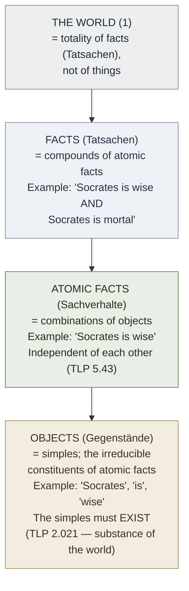

# Atomic Fact (TLP 2)

**Summary**: [TLP](./tractatus-logico-philosophicus.md) proposition 2 and its sub-propositions: *what is the case — a fact — is the existence of states of affairs* (Pears/McGuinness) / *the existence of atomic facts* (Ogden). Wittgenstein's **smallest unit of reality** beneath which there are no further facts. German: *Sachverhalt*. Distinct from *Tatsache* (a compound fact). The picture-theoretic atom on which TLP's entire logical machinery is built.

**Sources**:
- [Wittgenstein TLP](./tractatus-logico-philosophicus.md) propositions 2 – 2.063 (Ogden numbering matches; Pears/McGuinness uses slightly different sub-numbering).
- Russell's introduction to TLP — the explanation of *Sachverhalt* vs *Tatsache*.
- [picture-theory-of-language](./picture-theory-of-language.md) — atomic facts are the objects of pictures.

**Last updated**: 2026-05-25

---

## One-line

> *Sachverhalt* (atomic fact / state of affairs) = a combination of objects (things, entities). The smallest possible factual unit. **Atomic facts are logically independent** — from one atomic fact, no other follows (TLP 5.43).

## Unlocks (lead, not footer)

1. **The smallest factual unit on which TLP's machinery rests.** [Picture theory](./picture-theory-of-language.md) says a proposition pictures a fact. *Which* fact? The smallest are atomic facts. The world is the totality of facts (TLP 1.1); the totality of *existing* states of affairs is reality (TLP 2.06); the totality of states of affairs (existing and non-existing) is *logical space*. **The atom is where the picture-meets-world structure bottoms out.**

2. **Logical independence is the load-bearing claim.** TLP 5.43: *from one atomic fact no other can be inferred*. This is what makes truth-function reduction possible — if atomic facts were logically dependent, complex propositions couldn't be analyzed by truth-functions of independent atomic propositions; the truth-function machine breaks. **Logical independence is the assumption [Gödel's incompleteness](./godels-incompleteness.md) showed cannot hold for arithmetic-augmented systems** — but at the philosophical layer it remains the picture-theoretic ground.

3. **Translation matters: *Sachverhalt* vs *Tatsache*.** Ogden's 1922 translation renders *Sachverhalt* as *atomic fact*; Pears/McGuinness (1961/74) prefers *state of affairs*. Both refer to the same Wittgenstein concept; the wiki uses whichever the cited passage uses, defaulting to Pears/McGuinness for one-translation citations. **The two translations diverge from TLP 2.01 onward**; reader needs to know which one is being cited.

4. **Cross-link to the wiki's encoder atoms.** [NEDF](./nedf-overview.md) cards have *objects* in slots (Name-hook / Essence / Distinguisher / Failure). The wiki's encoder objects correspond to TLP's atomic-fact *constituents* (the entities/things/objects out of which the atomic fact is composed). The wiki's encoder scenes correspond to TLP's atomic facts (configurations of those objects). **The encoder paradigm builds NEDF scenes that *are* picture-theoretic atomic-fact pictures.**

## Mnemonic

**2 = SoA** = *Proposition 2 of TLP = State of Affairs (Sachverhalt).*

Two levels of compositional structure: **objects (things)** combine into **states of affairs (atomic facts)**; states of affairs combine into **facts** (Tatsachen). The atom is at the bottom of the two-level hierarchy.

## Memory checksum

1. **State TLP 2.** (*What is the case — a fact — is the existence of states of affairs.* (Pears/McGuinness) / *What is the case, the fact, is the existence of atomic facts.* (Ogden))
2. **Distinguish *Sachverhalt* from *Tatsache*.** (*Sachverhalt* = atomic fact / state of affairs = combination of objects; *Tatsache* = fact = compound of multiple atomic facts. Both translate to *"fact"* in casual English but Wittgenstein distinguishes.)
3. **State the logical-independence claim.** (TLP 5.43: from one atomic fact, no other atomic fact follows. Atomic facts are independent; complex propositions are truth-functions of them.)
4. **State the relationship to picture theory.** (Picture theory says propositions are pictures of facts; specifically, of atomic facts. The proposition's *elements* correspond to the atomic fact's *objects*. The proposition's *structure* shares the atomic fact's *logical form*.)
5. **What did Gödel do to this claim?** (At the philosophical layer, atomic-fact-and-picture-theory survives. At the technical claim of *all propositions reduce to truth-functions of elementary atomic propositions* (TLP 5), Gödel demolished the universal scope. The Gödel sentence G is a proposition that *cannot* be analyzed as a truth-function of elementary propositions; it asserts its own unprovability via arithmetical encoding.)

## Visual — the two-level compositional hierarchy

The world is built from objects upward through atomic facts (Sachverhalte) to facts (Tatsachen) to the world. The atom (Sachverhalt) is the smallest fact-level structure.

---

## The propositions of TLP 2

| TLP # | Pears/McGuinness | Ogden |
|---|---|---|
| **2** | What is the case — a fact — is the existence of states of affairs. | What is the case, the fact, is the existence of atomic facts. |
| **2.01** | A state of affairs (a state of things) is a combination of objects (things). | An atomic fact is a combination of objects (entities, things). |
| **2.011** | It is essential to things that they should be possible constituents of states of affairs. | It is essential to a thing that it can be a constituent part of an atomic fact. |
| **2.012** | In logic nothing is accidental: if a thing can occur in a state of affairs, the possibility of the state of affairs must be written into the thing itself. | In logic nothing is accidental: if a thing can occur in an atomic fact the possibility of that atomic fact must already be prejudged in the thing. |
| **2.02** | Objects are simple. | The object is simple. |
| **2.021** | Objects make up the substance of the world. That is why they cannot be composite. | Objects form the substance of the world. Therefore they cannot be compound. |
| **2.0271** | Objects are what is unalterable and subsistent; their configuration is what is changing and unstable. | The object is the fixed, the existent; the configuration is the changing, the variable. |
| **2.03** | In a state of affairs objects fit into one another like the links of a chain. | In the atomic fact objects hang one in another, like the links of a chain. |
| **2.06** | The existence and non-existence of states of affairs is reality. | The existence and non-existence of atomic facts is the reality. |
| **2.061** | States of affairs are independent of one another. | Atomic facts are independent of one another. |
| **2.062** | From the existence or non-existence of one state of affairs it is impossible to infer the existence or non-existence of another. | From the existence or non-existence of an atomic fact we cannot infer the existence or non-existence of another. |
| **2.063** | The sum-total of reality is the world. | The total reality is the world. |

The Pears/McGuinness translation uses *state of affairs* and *things* where Ogden uses *atomic fact* and *objects*. The concepts are the same; the translation choice is stylistic.

## Logical independence (TLP 5.43)

> *From one atomic fact no other can be inferred.* — TLP 5.43 (paraphrased; the exact text is part of TLP 5)

The claim is **load-bearing for the truth-function machine**: if atomic facts were logically dependent, then knowing one atomic fact would tell you something about another, and the truth of a compound proposition couldn't be determined purely by the truth-values of its elementary components.

The independence is what allows TLP 5 — *every proposition is a truth-function of elementary propositions* — to work. Truth-tables only work if the rows (truth-value assignments to atomic propositions) are independent.

### What does logical independence mean?

If atomic facts P and Q are *logically independent*:
- *P* true doesn't imply *Q* true.
- *P* true doesn't imply *Q* false.
- *P* false doesn't imply *Q* true.
- *P* false doesn't imply *Q* false.

All four combinations are logically possible. Any *physical* dependencies (e.g., "if water boils, water vaporizes") aren't logical dependencies — they're consequences of physical laws + observational facts, not of logic.

### What Gödel did

Gödel's first incompleteness theorem produces a proposition G that *cannot* be analyzed as a truth-function of elementary atomic propositions of the system. **G's truth-value isn't determined by the truth-values of any finite set of atomic propositions**; it's determined by arithmetical-self-reference.

So Gödel's theorem doesn't refute *logical independence* directly — atomic propositions in Gödel's system remain logically independent of each other. **What it refutes is TLP 5's claim that *all propositions* reduce to truth-functions of these atomic propositions.** G is a counter-example: a proposition outside the scope of truth-functional analysis.

The wiki's stance: atomic-fact + logical-independence + picture-theory survives Gödel philosophically; the *universal truth-function reduction* doesn't.

## Cross-link to the wiki's encoder paradigm

TLP's atomic-fact ontology is operationalized in the wiki's encoders:

| TLP element | Wiki encoder operationalization |
|---|---|
| Object (Gegenstand) | NEDF/SPEAR slot-occupant (the entity in a Name-hook slot, the agent in a SPEAR Execution slot, etc.) |
| Atomic fact (Sachverhalt) | A configuration of slot-occupants forming a single retrievable scene |
| Fact (Tatsache) | A compound encoding (multiple connected NEDF cards, a SPEAR procedure chain, a HEART room with multiple traits) |
| Logical form | The structural shape the scene shares with the concept |
| Picture | The encoding itself (the scene, the glyph, the diagram) |

**An NEDF card is structurally a picture of an atomic fact.** The card's slots are the object positions; the card's integrated scene is the atomic-fact picture; the card's logical form mirrors the concept's logical form.

The wiki's reflex: when encoding a new concept, ask *what is the atomic fact this concept is about?* — identify the objects, identify their combination, build the scene.

## Objects and the substance of the world (TLP 2.021)

> *Objects are what is unalterable and subsistent; their configuration is what is changing and unstable.* — TLP 2.0271

Wittgenstein's claim: **objects are the substance of the world**. They are *simples* — irreducible, unalterable, the bedrock on which configurations sit.

This is a substantial ontological claim. Wittgenstein doesn't say *what* the objects are — he leaves that to empirical investigation. But the *form* of the world requires that there be objects: irreducible simples out of which atomic facts are configured.

Russell's introduction: this is *"a logical necessity demanded by theory"* — like an electron. The simples may not be directly observable; they're posited because the theory of representation requires them.

### Modern critique

The TLP claim has been criticized:
- **Quantum mechanics**: are quarks simples? Are they configurations of more-basic entities? The empirical question turns out to be ill-posed.
- **Phenomenology**: simples in *what* sense — physical, conceptual, perceptual?
- **Mereology**: are some "objects" actually constituents-of-constituents?

The wiki's stance: TLP's claim is structurally elegant but empirically thin; the *existence* of simples is required for picture theory to bottom out, but *which* things are simples isn't resolved by TLP itself.

## METER integration

| Drill | Pass floor | Source |
|---|---|---|
| State TLP 2 in either translation | <15 s | this page §Mnemonic |
| Distinguish *Sachverhalt* from *Tatsache* | <30 s | this page §Memory checksum |
| State logical-independence claim + its role | <30 s | this page §Logical independence |
| Map a wiki NEDF card onto TLP's atomic-fact ontology | <60 s | this page §Cross-link |
| Explain what Gödel did to TLP 5 without overturning atomic-fact ontology | <60 s | this page §What Gödel did |

## Related pages

- [tractatus-logico-philosophicus](./tractatus-logico-philosophicus.md) — source primary text
- [picture-theory-of-language](./picture-theory-of-language.md) — atomic facts are the objects of pictures
- [show-vs-say](./show-vs-say.md) — atomic facts' *form* is shown by propositions, not said
- [truth-function-machine](./truth-function-machine.md) — TLP 5-6 machinery built on atomic-fact independence
- [the-mystical-tlp](./the-mystical-tlp.md) — what lies *beyond* the world of atomic facts
- [limits-of-language-tlp](./limits-of-language-tlp.md) — language describes atomic facts; not what lies beyond
- [godels-incompleteness](./godels-incompleteness.md) — what demolished TLP 5's scope (atomic-fact ontology survives)
- [nedf-overview](./nedf-overview.md) — encoder operationalizing atomic-fact picture-theory
- [wittgenstein-ludwig](./wittgenstein-ludwig.md) — author biography
- [glossary](./glossary.md) — Logic layer registration (*Sachverhalt* / *Tatsache* / object / logical independence)
