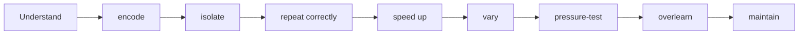
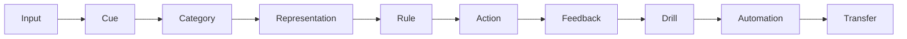
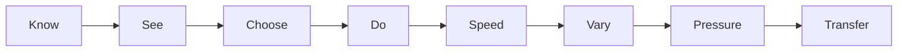
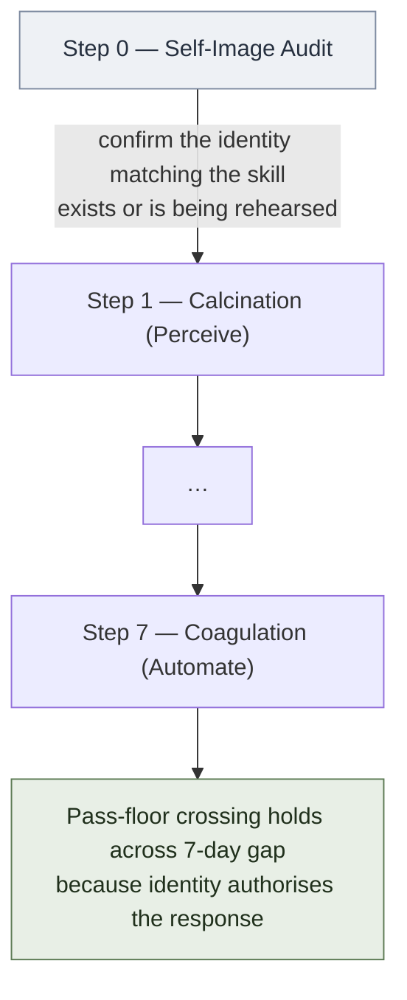
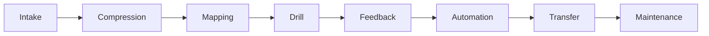
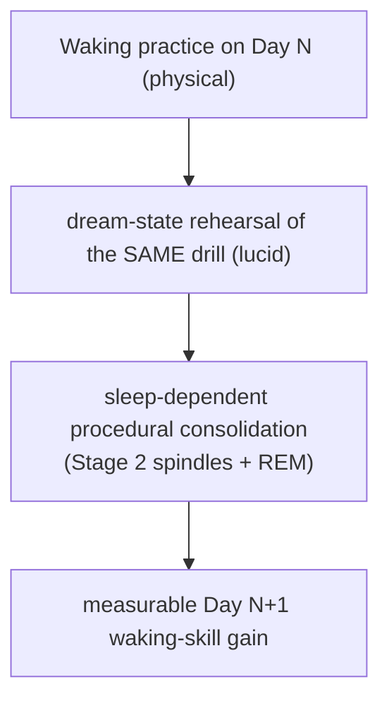

# Automaticity and Reflex Training

**Summary**: A unified framework for turning knowledge into automatic trigger-action responses. Covers The Great Work (seven alchemical operations from raw exposure to reflex), The Five Elements (skill type taxonomy), the Automation Protocol (11 steps), automaticity levels 0–9, blocked/mixed/random practice progression, and the Reflex Card as the atomic training unit.

**Sources**: `raw/01 Core_Memory/Automaticity.md`, `Automation Protocol` (pasted research document with citations)

**Last updated**: 2026-09-05 (automaticity ladder count corrected — 10 levels, 0–9); 2026-05-12

---

## Core claim

Understanding is not enough. Encoding is not enough.



The goal is **proceduralization**: turning "I know what to do" into "my nervous system runs the pattern before verbal thought appears."

---

## The Great Work (seven operations)

Every learnable skill passes through the same seven operations (source: Automaticity.md):

| Operation | Question | Failure if missing |
|---|---|---|
| **Calcination** (Perceive) | What signal do I notice? | Miss the cue entirely |
| **Dissolution** (Classify) | What type of thing is this? | Route to wrong tool |
| **Separation** (Represent) | How do I model it? | Can't manipulate the problem |
| **Conjunction** (Select) | Which rule/pattern applies? | No bridge from knowledge to action |
| **Fermentation** (Execute) | Can I do the move? | Skill stays conceptual, never procedural |
| **Distillation** (Feedback) | How do I know it worked? | No correction, no improvement |
| **Coagulation** (Automate) | Can I do it without thinking? | Cue-action link never closes |

Base exposure enters at Calcination; refined reflex exits at Coagulation. Every skill of every type passes through all seven operations in order. (Previously labelled **PCR-SEFA** in source notes.)

The Red Queen variant: **CAST-A** — Cue → Abstraction → Strategy → Tactic → Automation. A five-step compression of The Great Work for rapid reflex routing. (Note: "CAST-A" overlaps with the [CAST](./cast-overview.md) framework and the Tier 2 CAST encoding inside it. See [glossary](./glossary.md) under "CAST — three meanings" for disambiguation rules.)

---

## Universal Skill Pipeline



Every domain — programming, AWS, cybersecurity, language, soroban, math — maps onto the same pipeline. The skill is not "learn AWS." The skill is "build the pipeline once and feed AWS into it."

---

## The Five Elements (skill type)

> **Name-collision warning** (added 2026-05-27 during the [Burger 2012](./burger-5-elements-effective-thinking.md) ingest): this section uses Water/Air/Earth/Fire/Aether as a *skill-type taxonomy* (Sense B). Burger and Starbird's 2012 *The 5 Elements of Effective Thinking* uses the *same five names* for a different concept — five *habits* of thinking (Sense A: Earth=Understand-Deeply, Fire=Fail-to-Succeed, Air=Raise-Questions, Water=Flow-of-Ideas, Aether=Change). The two readings are **orthogonal layers, not competing definitions**. See [five-elements-mapping-reconciliation](./five-elements-mapping-reconciliation.md) for the full cross-walk and the linting rule that new pages must name the sense on first mention.

Every skill has a dominant element — the primary cognitive demand that defines where it is hardest to build.

| Element | Type | Definition | Training method |
|---|---|---|---|
| **Water** | Perceptual | Seeing/hearing signal (error logs, code patterns, accents) | Recognition drills |
| **Air** | Conceptual | Understanding models (architecture, theology, math theory) | Representation + explanation |
| **Earth** | Procedural | Doing sequences (debugging, soroban, configuring servers) | Workflows + reps |
| **Fire** | Generative | Creating outputs (writing, system design, teaching) | Templates + critique |
| **Aether** | Strategic | Choosing what matters (prioritization, planning, tradeoffs) | Decision journals + tradeoff models |

Complex skills combine all five elements. Cybersecurity = Water (notice behavior) + Air (vuln classes) + Earth (tools) + Fire (reports) + Aether (attack path).

## Element × Great Work matrix

The element identifies where in The Great Work training energy concentrates. Identify the dominant element first; it tells you which operations to emphasize.

| Element | Peak operations | Training emphasis |
|---|---|---|
| **Water** (Perceptual) | Calcination · Dissolution · Coagulation | Signal recognition drilled to instant classification |
| **Air** (Conceptual) | Separation · Conjunction | Model-building and rule selection; automate less critical |
| **Earth** (Procedural) | Fermentation · Coagulation | Execute correctly first, then close the cue-action loop |
| **Fire** (Generative) | Separation · Fermentation | Both modeling and production are load-bearing |
| **Aether** (Strategic) | Calcination · Conjunction | Situational reading and judgment; hardest to automate |

A complex skill (all five elements) requires all seven operations at full weight — that is the hardest kind to build and the reason it takes longest.

---

## Reflex atom format

The atomic unit of training — tighter than a flashcard, tighter than a NEDF card:

```
When I see/hear X,
I automatically do Y,
and I check success by Z.
```

Stored as a **Reflex Card**:

```yaml
reflex:
  trigger: "User is logged in but receives 403"
  classification: "Authorization problem"
  action: "Check role, policy, ownership, route permissions"
  success_test: "Identify layer in <5 seconds"
  common_mistakes:
    - "Check password/session first (that is authentication)"
    - "Confuse 401 with 403"
  drills: [recognition, decision, execution, mixed, pressure]
```

Flashcards store **memory**. Reflex cards store **procedural reflexes**.

---

## Automaticity levels (0–9)

| Level | State | Gate | Pass criterion |
|---|---|---|---|
| 0 | Unknown | Cannot explain | — |
| 1 | Understands | Can explain slowly | — |
| 2 | Recognizes with help | Needs reference | — |
| 3 | Recognizes alone | No reference needed | — |
| 4 | Acts correctly slowly | Untimed performance | 80% accuracy untimed |
| 5 | Acts correctly under time | Timer present | 90% under timer |
| 6 | Acts correctly under variation | Different surface forms | 90% in mixed deck |
| 7 | Acts correctly under pressure | Noise, fatigue, partial info | 90% in pressure mode |
| 8 | Transfers | Works in new context | Correct in real-world scenario |
| 9 | Teaches/debugs others | Can diagnose errors in others | — |

The Pass criterion column was previously a separate "Pass gates Level 1–7" axis lower on this page; it has been folded in here so each automaticity level carries its own confirmation gate. There is now one progression axis with one gate per step.

Most people stop at automaticity level 2–3. The gym targets automaticity levels 4→5→6. The Red Queen Skill Gym targets levels 5–6 as "operational reflex." (Numbering canonical at [skill-progression-stages](./skill-progression-stages.md).)

The compact version:



---

## The Automation Protocol (11 steps)

1. **Define the exact reflex** — trigger/action/success-test triad. No vague targets.
2. **Split into reflex atoms** — each atom trainable in 30 seconds to 3 minutes.
3. **Slow perfect reps first** — accuracy before speed. Automating noise is worse than no automation.
4. **Compress the cue** — move from verbal rule to direct symbol: `traffic jam → queue → SQS`
5. **Short high-density drills** — 5 min single reflex / 10 min mixed / 5 min correction log
6. **Add speed only after 90–95% accuracy** — controlled compression, not panic
7. **Blocked → mixed → random** — build the move, then discrimination, then reflex (see below)
8. **Recognition before production** — classify fast before solving
9. **Error-focused repetition** — mistake log drives next drill, not passive review
10. **Add pressure gradually** — clean → timed → mixed → noisy → realistic → live
11. **Overlearn** — after first perfect set, do 50–100% more reps

---

## Blocked → Mixed → Random (practice progression)

The three modes form the canonical practice progression inside any [Lamp / Scale / Sword phase](#lamp--scale--sword-phases):

| Mode | How cards are arranged | What it trains | Timer |
|---|---|---|---|
| **Blocked** | All items of same type grouped | Building the base pattern | Longer (more time to think) |
| **Mixed** | One of each type per cycle | Discrimination between similar categories | Standard |
| **Random** | Fully shuffled | Reflex — pure automatic response | Shorter |

This is the "contextual interference" effect: random/varied practice is harder during training but creates stronger transfer because the brain must repeatedly select the correct response rather than repeat the last pattern.

Practical rule:
```
Blocked practice builds the move.
Mixed practice builds choice.
Random practice builds reflex.
```

---

## "Never automate before feedback" rule

You can automate bad patterns just as easily as good ones. Automaticity without feedback creates **fossilized errors**.

```
Never practice at full speed until you know the pattern is correct.
```

The gate: accuracy ≥ 90% before increasing speed. If you speed up at 70% accuracy, you are training 30% wrong responses.

---

## The Coagulation trap — [OK Plateau](./ok-plateau.md) warning (added 2026-05-24, Foer ingest)

The pipeline above treats **Coagulation** (operation #7, automaticity Level 7–9) as the goal. Joshua Foer's *Moonwalking with Einstein* (2011, Ch 8), building on Fitts & Posner's 1967 three-stage model and Ericsson's deliberate-practice research, identifies Coagulation as **also the trap**: once a skill goes autonomous, fMRI shows prefrontal regions drop out and improvement stops. The wiki gains a routing rule:

```
For skills where the ceiling does NOT matter (typing, driving, ATM use):
    Coagulate happily. Free the cognition.

For skills where the ceiling DOES matter (memory sport, surgery, music,
chess, math, language fluency, anything competitive):
    Coagulation is the ENEMY. Stay in the Cognitive stage by force.
```

The forced-regression protocol (Foer metronome): set timer 10–20% past current limit, allow errors, log specific failure patterns, re-engineer the failing encoding, hold the new speed. The full failure mode, diagnostic, and antidote live at [ok-plateau](./ok-plateau.md).

OK Plateau is the **reflex-layer twin** of [snap-back-effect](./snap-back-effect.md) (identity layer). Combined 2×2 diagnostic:

| | Crosses pass-floor | Holds 7+ days |
|---|---|---|
| **Snap-back** | yes | no — route to [self-image](./self-image.md) + [theater-of-the-mind](./theater-of-the-mind.md) |
| **OK Plateau** | yes | yes, but never rises — route to [ok-plateau](./ok-plateau.md) metronome protocol |
| **Drill-difficulty** | no | n/a — more drilling |
| **Healthy ceiling** | yes | yes, rises with deliberate practice |

If a metric is flat for ≥4 consecutive Sword-phase sessions at automaticity Level 7+, suspect OK Plateau before suspecting innate limit or "needs more reps."

---

## Self-image as the upstream gate (added 2026-05-24 from Psycho-Cybernetics ingest)

The reflex-layer rule above has a **dual at the identity layer**, named by Maxwell Maltz's *Psycho-Cybernetics* (1960). The wiki absorbed this in the 2026-05-24 ingest — see [psycho-cybernetics-maltz](./psycho-cybernetics-maltz.md) and the load-bearing confirmed unlock row in [composability-index](./composability-index.md).

The dual rule:

```
Never drill an action whose corresponding self-image hasn't been programmed.
```

Without it, drilling produces **fossilized failure** — performance crosses the pass-floor in-session, but the [snap-back line](./snap-back-effect.md) held by the [self-image](./self-image.md) yanks the performance back to baseline within 7 days. The learner concludes "I need more drilling." But the gap is upstream.

### Distinguishing drill-fixable from identity-fixable plateaus

| Signal | Drill-difficulty | Identity-snap-back |
|---|---|---|
| Pass-floor crossing | Never crosses | Crosses, doesn't hold |
| 7-day hold | N/A | Fails |
| Self-talk after the regression | "I need more practice" | "I'm not really that kind of person" |
| Fix that works | More drilling | [Theater of the Mind](./theater-of-the-mind.md) cycle |

If three or more identity-snap-back signals fire on a regression, the plateau is at the [self-image](./self-image.md) layer. Route to identity-rehearsal, not to additional drilling. See [snap-back-effect](./snap-back-effect.md) for the full diagnostic signature table.

### Pipeline addition — Step 0: Self-Image Audit

The Great Work's 7 operations (Calcination → … → Coagulation) all assume the learner is a fixed substrate. Maltz argues the learner is itself a substrate — the [self-image](./self-image.md). The wiki adds an implicit **Step 0** above Calcination:



Operational: when starting a skill that's identity-distant (a new role, capability, or behaviour outside the current self-image), run a 21-day [theater-of-the-mind](./theater-of-the-mind.md) cycle on the substitute identity **before** starting the gym drills. This is the difference between drilling that holds and drilling that snaps back.

### When this rule applies vs. doesn't

- **Apply** when the skill demands an identity-step (executive talk, sales-by-cold-call, public performance, contested negotiation, fitness/diet that touches body-image, study at a new academic tier).
- **Don't apply** when the skill is fully within the existing self-image (a new programming language inside an existing software-engineer identity, a new dish inside an existing cook identity, an additional move inside an existing martial arts identity).

The audit (see [self-image](./self-image.md) §audit) takes ~2 weeks and is a one-time cost per identity-step. The 21-day Theater cycle that follows is the actual encoding work.

---

## No fake mastery: 8 states

| State | Meaning |
|---|---|
| Recognized | "I know what this is" |
| Recalled | "I can remember the answer" |
| Selected | "I can choose among similar options" |
| Executed | "I can do the action" |
| Timed | "I can do it fast" |
| Varied | "I can do it in different forms" |
| Transferred | "I can apply it outside the original lesson" |
| Automatic | "I do it without verbal reasoning" |

Most learning tools only test Recognized/Recalled. The gyms target Selected → Timed. Full mastery requires Transferred → Automatic.

---

## Drill types and what each trains

| Drill | Trains |
|---|---|
| Recognition (Cue Flash) | Seeing the signal |
| Classification | Naming the pattern |
| Discrimination | Separating near-confusables |
| Decision | Choosing the action |
| Execution Sprint | Doing the actual move |
| Mixed | Selecting correctly under variety |
| Pressure Chamber | Automatic response under noise/time |
| Transfer Arena | Using the pattern in new context |

The gyms implement three named phases — **Lamp → Scale → Sword** — defined in the next section.

---

## Lamp / Scale / Sword phases

The gym rotates between three phases. Each phase emphasizes a different cognitive move; the names are biblical instruments chosen for memorability over numeric labels (the previous wording "Stages 1→2→3" collided with three other stage axes — see [skill-progression-stages](./skill-progression-stages.md) and [glossary](./glossary.md)).

| Phase | Mental image | What it trains | Drills typically used |
|---|---|---|---|
| **Lamp** | a lamp illuminating ("thy word is a lamp") | Recognition — see the signal before reasoning | Recognition (Cue Flash), Classification |
| **Scale** | a balance weighing ("weighed in the balances") | Discrimination — separate near-confusables under load | Discrimination, Mixed |
| **Sword** | a sword cutting ("the sword of the Spirit") | Pressure — act decisively under noise, fatigue, and time | Decision, Execution Sprint, Pressure Chamber |

The phases are **orthogonal** to the [automaticity level axis](./skill-progression-stages.md). A learner does not graduate from Lamp to Scale to Sword once and stop; the phases rotate, and any single session may be Lamp-heavy, Scale-heavy, or Sword-heavy depending on which collapse the learner is currently fixing.

---

## Skill OS (8 modules)

Every skill passes through the same pipeline in the Neural OS:



- **Intake**: raw course/book/problem set
- **Compression**: extract terms, rules, patterns, failure cases
- **Mapping**: NEDF / CAST / SPEAR / analogies / palaces
- **Drill**: recognition → discrimination → execution → mixed → pressure
- **Feedback**: define correctness before drilling
- **Automation**: cue → action (the gym stage)
- **Transfer**: toy example → real project
- **Maintenance**: spaced repetition + weekly drills + real usage

---

## Skill stack (5 layers)

```
Layer 5: Domain expertise
Layer 4: Domain patterns
Layer 3: Universal cognitive operations
Layer 2: Memory/automation system
Layer 1: Attention/energy/time
```

Higher layers depend on lower ones. You cannot build Layer 4 without Layer 2. This is why the gym (Layer 2 output) must come before exam attempts (Layer 4 demands).

---

## Universal Skill Object (template)

```yaml
skill:
  name:
  purpose:
  domain:
  primitives:
    cues:
    categories:
    representations:
    rules:
    actions:
    feedback:
    drills:
    automations:
    transfer:
    maintenance:
```

This is the [drill-generator](./drill-generator.md) input format extended with automation targets and transfer domains.

---

## Pass criteria and gym phase mapping

Pass criteria for each automaticity level are folded into the [Automaticity levels (0–9)](#automaticity-levels-09) table at the top of this page. They are not a separate scoring axis — they are the operational gate that confirms a level has been reached.

The gym moves the learner from automaticity Level 4 through Level 7 by rotating the Lamp / Scale / Sword phases:

- **Lamp** drills sharpen signal detection — required for Levels 2–4
- **Scale** drills build judgment under variation — required for Level 6
- **Sword** drills build speed and resilience — required for Levels 5 and 7

Pre-gym work (Anki, self-explanation) lands Levels 0–3. Post-gym work (real-world transfer, teaching) lands Levels 8–9.

Two intermediate criteria worth noting (between named levels):

- "90% accuracy at 70% of timer speed" sits between Level 5 and Level 7 — use it during Sword-phase drills to confirm true compression rather than mere timer-tolerance.
- "90% accuracy untimed" sits between Level 4 and Level 5 — use it during Lamp-phase drills to confirm correctness before the timer is added.

**A different gate shape, worth naming separately.** Every criterion above is an **absolute** floor — a wall-clock or percentage threshold calibrated in advance. [yagodkin-advance-mnemonics](./yagodkin-advance-mnemonics.md)'s "recall overtakes image" criterion is a **relative** pass-floor instead: it compares two retrieval latencies *within the learner* (translation vs. the mnemonic scaffold) and drops the scaffold when the direct route wins, needing no stopwatch or per-learner calibration. It answers this page's own automaticity question from a different instrument, not a different level — see that page for the full argument and its citation discipline against [skill-progression-stages](./skill-progression-stages.md).

---

## How this connects to existing Neural OS pages

- [red-queen-skill-gym](./red-queen-skill-gym.md) — the performance layer this formalizes; add the 10-level (0–9) automaticity scale and the blocked/mixed/random protocol. See [skill-progression-stages](./skill-progression-stages.md) for the canonical numbering and the citation rule.
- [drill-generator](./drill-generator.md) — the Skill OS Drill module; the reflex atom format is the missing atomic unit below the drill ladder
- [failure-modes-in-encoding](./failure-modes-in-encoding.md) — Automaticity failure = stuck at Level 2–3 without pressure/speed gates
- [problem-type-classifier](./problem-type-classifier.md) — Classification (Primitive 2) is the first thing the problem-type gym trains
- [framework-comparison-matrix](./framework-comparison-matrix.md) — CAST-A is a new Red Queen routing alias worth adding
- [pulse-overview](./pulse-overview.md) — state-conditioned modulation: under low Energy (E≤2), reflex training switches from random/mixed to blocked single-mode and reduces volume; under high Stress (S≥4), pressure-test stages are skipped in favor of accuracy-only drills

## Relationship To PULSE

Automaticity training assumes the user can sustain pressure-stage drills. That assumption only holds under reasonable cognitive state. [PULSE](./pulse-overview.md) reads Energy and Stress at session start and during sessions, then modulates how this training is dispatched: under low state, the gym Limits volume, defers pressure-stage drills, and switches mixed/random back to blocked single-mode. The 10-level (0–9) automaticity ladder is unchanged by PULSE — what changes is *which* level the user is allowed to attempt today, not what the levels mean.

## Diagrams

The Great Work pipeline (7 alchemical operations), the Five Elements panel showing peak-operation emphasis, Reflex Card example, practice escalation (Blocked → Mixed → Random), and the universal skill pipeline:


Hero — the alchemist's laboratory metaphor: seven progressive workstations from calcination crucible through coagulation pedestal, the same raw material transforming station-by-station, with five colored elemental flames suspended above to show which operations a given element emphasizes:


## Dream-state substrate for procedural drills (added 2026-05-24, sleep ingest)

The 2026-05-24 sleep ingest registers a candidate unlock in [composability-index](./composability-index.md): **lucid dream × SPEAR motor drill**. The mechanism is documented in lucid-dreaming §Motor-learning transfer:

- LaBerge Ch. 11 case reports: French horn student (Shostakovich solo rehearsed in lucid dream → near-perfect sight-read next day); surgeon claiming 35–40% case-time reduction via decades of dream-state rehearsal (flagged as case report, not RCT).
- **Erlacher et al.** (*J. Sports Sciences*, *J. Sleep Research*, 2009+): statistically detectable transfer for dart-throwing, gymnastics, finger-tapping. Small samples; modest but real effect size.
- Walker's procedural-consolidation evidence ([sleep-dependent-memory-consolidation](./sleep-dependent-memory-consolidation.md)): +20% speed / +35% accuracy after 8h sleep vs equivalent waking interval (Walker p. 711). REM is required.

### Operational integration

A lucid dream is a **zero-physical-cost rehearsal substrate**. A motor-skill drill structured as a SPEAR procedure (Scene · Preconditions · Execution · Alternatives · Repair) can be **rehearsed in the lucid state**:



The dream rehearsal does not *replace* physical practice — it **compounds** it through the REM consolidation channel. The current evidence base supports it as a supplement, not a primary mode.

### Routing rules

| Substrate | When to use |
|---|---|
| Waking physical practice | Always primary |
| Mental rehearsal (waking) | Compatible; well-evidenced |
| **Lucid-dream rehearsal** | After reaching lucid-dreaming curriculum stage 6 (control); supplement to physical practice; zero fatigue cost; modest effect size |
| Sleep alone (no rehearsal) | The default consolidation; required regardless |

### Prerequisites and constraints

- Requires full lucid-dreaming curriculum mastery — recall, RT, MILD, WBTB, stabilisation, control. Not a beginner technique.
- **Scheduling conflict with cbt-i-program**: sleep restriction compresses REM. Defer lucid-state drilling until CBT-I program completes.
- Effect size is *modest*; do not expect to substitute for physical hours. Expect a compounding multiplier on existing practice.

### METER

Dream-rehearsal events go into `wiki/_meta/lucid-data.js` (see sleep-and-cognition §METER integration) with the rehearsed-skill tag. Pair with waking-skill METER floors to detect transfer.

## Related pages

- [red-queen-skill-gym](./red-queen-skill-gym.md)
- [drill-generator](./drill-generator.md)
- [drill-ladder-patterns](./drill-ladder-patterns.md)
- [failure-modes-in-encoding](./failure-modes-in-encoding.md)
- [problem-type-classifier](./problem-type-classifier.md)
- [frame-forge](./frame-forge.md)
- [web-gym-generation-schema](./web-gym-generation-schema.md)
- [pulse-overview](./pulse-overview.md)
- lucid-dreaming — dream-state motor practice substrate (added 2026-05-24)
- [sleep-dependent-memory-consolidation](./sleep-dependent-memory-consolidation.md) — the REM consolidation channel
- sleep-and-cognition — sleep ingest topic spine
- [yagodkin-advance-mnemonics](./yagodkin-advance-mnemonics.md) — owns the "recall overtakes image" relative pass-floor, a different-shaped scaffold-drop test

---

- **2026-05-29 learning-canon cross-links**: [ericsson-peak](./ericsson-peak.md) · [deliberate-practice](./deliberate-practice.md) · [practice-is-required-not-optional](./practice-is-required-not-optional.md) (Willingham #5: Whitehead's "civilization advances by what we don't have to think about") · [brown-make-it-stick](./brown-make-it-stick.md) · [mental-models-for-learning](./mental-models-for-learning.md) (what automaticity builds toward)

## U — See (CAST)
1. 7 skill primitives × 10 automaticity levels (0–9) × 3 practice modes
2. Edges: Reflex Card → drill → gym → measurement

## D — Name (NEDF)
1. Automaticity = trigger → action without deliberation
2. Great Work: 7 alchemical operations from raw → reflex
3. Reflex Card = the atomic training unit

## F — Do (SPEAR)
1. Skill spec → run the 11-step Automation Protocol
2. Blocked → mixed → random practice progression
3. Measure: latency, accuracy, transfer

## B — Watch (HEART)
1. Skipping mixed-practice → no transfer
2. Random too early → fragile
3. Level claimed without measurement

## L — Predict (ORACLE)
1. Automaticity level predicts performance under load
2. Skipping levels → regression under stress

## R — Act (GRACE)
1. New skill → spec as Reflex Card
2. Plateau → check current automaticity level honestly