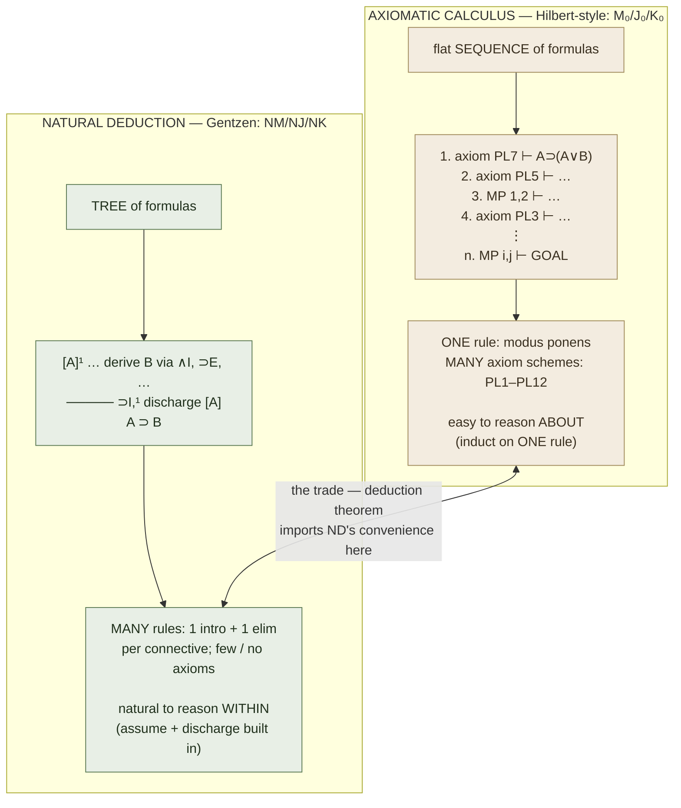

# Axiomatic Calculi (M₀ / J₀ / K₀ · M₁ / J₁ / K₁)

**Summary**: Hilbert-style derivation systems in which a proof is a *flat sequence* of formulas, each either an instance of an axiom scheme or obtained from earlier lines by the single rule [*modus ponens*](./logic-atomic-design.md). This page owns the term **axiomatic calculi** and the **deduction theorem** for the wiki. The defining trade — many axioms but one rule, versus [natural-deduction](./natural-deduction.md)'s few axioms but many introduction/elimination rules — makes axiomatic systems *easy to reason about* (induct over one rule) and *painful to reason within* (no heuristics; even transitivity of ⊃ takes five lines). The wiki's authoritative source for the Hilbert-style style of proof and for the deduction theorem that rescues it.

**Sources**:
- [Mancosu, Galvan, Zach (2021)](./proof-theory-mancosu-galvan-zach.md) Ch 2 — §2.4 logical calculi (M₀/J₀/K₀), §2.5 inference rules (modus ponens), §2.6 derivations from assumptions, §2.8 the deduction theorem, §2.10 negation, §2.13–2.14 predicate calculus M₁/J₁/K₁.
- Heyting, A. (1930) — the propositional axiom numbering PL1–PL11 reproduced in §2.4.
- Gentzen, G. (1933) — refers to the same axiomatization; his names for the predicate systems are **LHJ** (= J₁) and **LHK** (= K₁).

**Last updated**: 2026-06-10

---

## What an axiomatic derivation is

In an axiomatic (Hilbert-style) calculus a *derivation* of a formula is a finite sequence of formulas A₁, …, Aₙ in which each Aᵢ is either an instance of an axiom scheme or follows from two earlier formulas by modus ponens; the last formula Aₙ is the *end-formula*, and a formula B is a *theorem* if some derivation has B as its end-formula (source: dokumen.pub_an-introduction-to-proof-theory...pdf, §2.5). The whole apparatus has exactly **one** rule of inference, *modus ponens*: from A and A ⊃ B, infer B (source: dokumen.pub_an-introduction-to-proof-theory...pdf, §2.5).

The logical weight is carried instead by the **axiom schemes**. Each scheme stands for infinitely many axioms — every formula of that shape counts — which is how the book avoids needing a separate rule of substitution (source: dokumen.pub_an-introduction-to-proof-theory...pdf, §2.4.1). For more on how this flat sequence relates to the broader Hilbert programme it serves, see [proof-theory-mancosu-galvan-zach](./proof-theory-mancosu-galvan-zach.md) and [hilberts-program](./hilberts-program.md).

## The six systems

The book fixes **six** axiomatic calculi: a propositional trio and a predicate trio, each ordered minimal → intuitionistic → classical, where each system is the previous one plus a stronger axiom scheme (source: dokumen.pub_an-introduction-to-proof-theory...pdf, §2.4).

| System | Logic | Level | Extra over predecessor |
|---|---|---|---|
| **M₀** | minimal, propositional | weakest | axiom schemes PL1–PL10 |
| **J₀** | intuitionistic, propositional | + ex falso | adds PL11: ¬A ⊃ (A ⊃ B) |
| **K₀** | classical, propositional | + double negation | adds PL12: ¬¬A ⊃ A |
| **M₁** | minimal, predicate | + quantifiers | M₀ plus quantifier axioms/rules |
| **J₁** | intuitionistic, predicate | | J₀ + quantifiers (Gentzen: **LHJ**) |
| **K₁** | classical, predicate | strongest | K₀ + quantifiers (Gentzen: **LHK**) |

The subscript **0** marks the propositional fragment and **1** the predicate logic (source: dokumen.pub_an-introduction-to-proof-theory...pdf, §2.4 fn 6). The letters are Gentzen's: **L** for *logistic* (i.e. axiomatic), **H** for *Hilbert* (who made heavy use of such calculi), **J** and **K** for *intuitionistic* and *classical* — typographic variants of the same German uppercase letter (source: dokumen.pub_an-introduction-to-proof-theory...pdf, §2.4 fn 6).

The minimal calculus **M₀** uses the ten axiom schemes PL1–PL10 (e.g. PL1: A ⊃ (A ∧ A); PL5: B ⊃ (A ⊃ B)) (source: dokumen.pub_an-introduction-to-proof-theory...pdf, §2.4.1). **J₀** = M₀ + PL11 (¬A ⊃ (A ⊃ B), *ex falso quodlibet*), which M₀ deliberately lacks (source: dokumen.pub_an-introduction-to-proof-theory...pdf, §2.10). **K₀** = J₀ + PL12 (¬¬A ⊃ A, double-negation elimination); over J₀ this is equivalent to the law of excluded middle A ∨ ¬A (source: dokumen.pub_an-introduction-to-proof-theory...pdf, §2.10.1).

> Number/scale note: the count of axiom schemes (PL1–PL12) and the three-system ladder minimal→intuitionistic→classical are particular to this book's presentation, not a wiki-registered progression; the wiki's registered ladders are catalogued separately at [skill-progression-stages](./skill-progression-stages.md).

## The deduction theorem

The **deduction theorem** is the first proof-theoretic result the book proves, and the lever that makes axiomatic calculi tolerable to work in. It states: **if Γ, A ⊢ B then Γ ⊢ A ⊃ B** — that is, you may prove a conditional A ⊃ B by *assuming* its antecedent A as a hypothesis and deriving the consequent B, then discharging the assumption into the arrow (source: dokumen.pub_an-introduction-to-proof-theory...pdf, §2.8, Theorem 2.16). The result is due to Herbrand (source: dokumen.pub_an-introduction-to-proof-theory...pdf, §2.6).

The proof goes by induction on the *length* of the derivation of B from Γ ∪ {A}, splitting on whether the line is an axiom, a member of Γ ∪ {A}, the assumption A itself, or a modus-ponens step; the modus-ponens case leans on the schematic theorem ⊢ [A ⊃ (B ⊃ C)] ⊃ [(A ⊃ B) ⊃ (A ⊃ C)] proved just beforehand (source: dokumen.pub_an-introduction-to-proof-theory...pdf, §2.8). The **converse** also holds and is trivial — given Γ ⊢ A ⊃ B, append A and one modus-ponens step to get Γ ∪ {A} ⊢ B (source: dokumen.pub_an-introduction-to-proof-theory...pdf, §2.8).

Why it matters: before the deduction theorem, even simple conditional theorems require finding intermediate formulas A and A ⊃ B "out of thin air"; after it, you may reason *forward from assumptions* — importing the hypothesis-discharge convenience of [natural-deduction](./natural-deduction.md) into the axiomatic setting as a derived, metatheoretically-justified move (source: dokumen.pub_an-introduction-to-proof-theory...pdf, §2.8). The same kind of statement, lifted to quantifiers, is proved separately as the deduction theorem for the predicate calculus (source: dokumen.pub_an-introduction-to-proof-theory...pdf, §2.14).

## Easy to reason ABOUT, painful to reason WITHIN

This is the central trade and the reason the style survives despite its awkwardness.

**Painful to reason *within*.** With modus ponens as the only rule, there is no systematic way, starting from a goal B, to find formulas A and A ⊃ B that are both provable and yield B; the book itself says a from-scratch derivation is "incredibly hard to read" and "daunting" to find (source: dokumen.pub_an-introduction-to-proof-theory...pdf, §2.5). Even the transitivity of ⊃ — from A ⊃ B and B ⊃ C infer A ⊃ C — cannot be done in one step and needs a multi-line detour packaged as the *derived rule* ⊃trans (source: dokumen.pub_an-introduction-to-proof-theory...pdf, §2.5–2.6). The book deliberately makes the reader feel this friction first, so that the deduction theorem lands as relief (source: dokumen.pub_an-introduction-to-proof-theory...pdf, §2.6).

**Easy to reason *about*.** The very sparseness that hurts the practitioner helps the metatheorist. Because a derivation is a flat sequence governed by one rule, *induction on the length of a derivation* is the natural and only proof method needed to establish properties of *all* derivations — which is exactly how the deduction theorem itself is proved (source: dokumen.pub_an-introduction-to-proof-theory...pdf, §2.7–2.8). One rule means one inductive case to check for the inference step; one fewer moving part in every metatheorem.

This inverts the [natural-deduction](./natural-deduction.md) profile. Axiomatic systems have **many axioms, one rule**; natural deduction has **few axioms, many introduction/elimination rules**, formalising reasoning from hypothetical assumptions with explicit discharge (source: dokumen.pub_an-introduction-to-proof-theory...pdf, §1.2). Natural deduction is "the system mathematicians actually argue in"; the axiomatic calculus is the system that is *cheapest to prove theorems about*. The third member of the family, the [sequent-calculus](./sequent-calculus.md), pushes the metatheoretic-tractability idea further still by making structural rules explicit, which is what enables Gentzen's [cut-elimination](./cut-elimination-hauptsatz.md).

## Mnemonic

**"AXE has one swing; ND has many hands."**

- **AXE** = **AX**iomatic calculus → *one* edge (modus ponens), many things to chop at it (the axiom schemes). One swing: you can only do one thing, but it is *easy to describe* the swing — so easy to reason *about*, hard to reason *within*.
- **ND** = **N**atural **D**eduction → *many hands* (one intro + one elim rule per connective) and almost nothing to memorise as axioms. Many hands make the work natural to *do*, but harder to make a single clean statement *about*.

To keep the six axiomatic systems straight: **"My Justified King grows up"** — **M**inimal ⊂ **J** (intuitionistic, adds ex falso) ⊂ **K** (classical, adds ¬¬A ⊃ A), with subscript **0** = propositional "child", subscript **1** = predicate "grown-up". M-J-K, naught-then-one.

## Checksum

If you can answer these in <60 s each from memory, the page is encoded:

1. **How many rules of inference does an axiomatic calculus have, and which?** (*Exactly one: modus ponens — from A and A ⊃ B infer B. All logical strength sits in the axiom schemes.*)
2. **Name the six systems and the two axes they vary on.** (*M₀ J₀ K₀ M₁ J₁ K₁; axis 1 = strength (minimal → intuitionistic + PL11 ex falso → classical + PL12 ¬¬-elim); axis 2 = subscript 0 propositional vs 1 predicate.*)
3. **State the deduction theorem and who it is due to.** (*If Γ, A ⊢ B then Γ ⊢ A ⊃ B; converse holds trivially via one modus ponens. Due to Herbrand. Proved by induction on derivation length.*)
4. **What is the AXE/ND trade in one line?** (*Many axioms + one rule = easy to reason ABOUT (one inductive case), painful to reason WITHIN (no heuristics, transitivity-of-⊃ takes a multi-line derived rule); [natural-deduction](./natural-deduction.md) is the mirror image.*)
5. **What does each letter of Gentzen's LHJ / LHK stand for?** (*L = logistic/axiomatic, H = Hilbert, J = intuitionistic, K = classical; these are the predicate systems J₁ and K₁.*)

## Visual — the proof-shape contrast

The **deduction theorem** is the bridge drawn in the middle: it lets the left-hand column borrow the right-hand column's "assume the antecedent, then discharge it" move *as a derived metatheorem*, without ever adding a second primitive rule to the axiomatic system (source: dokumen.pub_an-introduction-to-proof-theory...pdf, §2.8).

## Related pages

- [proof-theory-mancosu-galvan-zach](./proof-theory-mancosu-galvan-zach.md) — the source textbook; this page is its Ch 2 anchor
- [natural-deduction](./natural-deduction.md) — the mirror system (few axioms, many intro/elim rules); the deduction theorem imports its discharge move
- [sequent-calculus](./sequent-calculus.md) — the third Gentzen system, pushing metatheoretic tractability to cut-elimination
- [hilberts-program](./hilberts-program.md) — why fully-formalised axiomatic calculi mattered to Hilbert's foundational project
- [cut-elimination-hauptsatz](./cut-elimination-hauptsatz.md) — the sequent-calculus analogue of "reasoning ABOUT proofs"
- [skill-progression-stages](./skill-progression-stages.md) — registry for the wiki's named level/stage ladders
