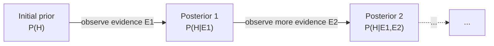

# Bayesian Probability Primer (Provisional)

**Summary**: A **provisional overview** of Bayesian probability — the logic of *degree of rational belief* updated by evidence — built from canonical knowledge of the field rather than from an ingested source PDF. Closes the [probability-as-logic](./probability-as-logic.md) gap re: Bayes (Copi Ch 14 doesn't cover Bayes' theorem). **Bayesian probability** treats probability as a **degree of rational belief** rather than as **frequency** or **a-priori symmetry** — a third interpretation alongside the two Copi covers. **Bayes' theorem** *P(H|E) = P(E|H) × P(H) / P(E)* is the rule for updating beliefs given evidence. Pending future Jaynes ingest.

**Sources**:
- **Bayesian probability is not in the Wave-1 source corpus.** Copi Ch 14 covers a-priori + relative-frequency interpretations and the product + sum theorems, but does NOT cover Bayes' theorem.
- Standard primary text: E.T. Jaynes, *Probability Theory: The Logic of Science* (Cambridge UP 2003) — queued for future ingest. Would replace this page's canonical content.
- Standard introductory texts: Edwin Jaynes (above), David MacKay *Information Theory, Inference, and Learning Algorithms* (2003), Persi Diaconis + Brian Skyrms *Ten Great Ideas about Chance* (Princeton 2017).
- Original key works: Thomas Bayes 1763 (posthumous), Pierre-Simon Laplace's *Théorie analytique des probabilités* (1812), R.T. Cox "Probability, Frequency, and Reasonable Expectation" (1946) — the Cox theorem deriving Bayesian probability from axioms about rational degree-of-belief.
- **Provisional**: this page should be updated when Jaynes is ingested.

**Last updated**: 2026-08-20 (`glyph:` assigned — [representation-rules](./representation-rules.md) Rule 11); 2026-05-25

---

## One-line

> Bayesian probability = **degree of rational belief updated by evidence**. The rule: *P(H|E) = P(E|H) × P(H) / P(E)* — *posterior = likelihood × prior / evidence*. Treats one-off events naturally (unlike frequency-based probability); requires explicit priors. **Third interpretation** alongside a-priori + relative-frequency.

## Unlocks (lead, not footer)

1. **Bayesian probability closes the [probability-as-logic](./probability-as-logic.md) gap.** Copi Ch 14 covers product + sum theorems but **not Bayes' theorem** — the most-important 20th-century development in probabilistic reasoning. This page provisional-closes the gap. **Bayesian updating** is the rigorous form of *learning from evidence*; without it, the wiki's inductive-reasoning infrastructure is incomplete.

2. **Bayes treats one-off events naturally.** Frequency-based probability struggles with one-off events (probability of nuclear war by 2030 cannot be observed in repeated trials). **Bayesian probability treats one-off events as degrees of rational belief that can be updated as evidence accumulates**. Useful for: forecasting, scientific hypothesis updating, expert reasoning, AI alignment risk assessment, medical diagnosis, jury reasoning, legal evidence weighting.

3. **The Cox theorem grounds Bayesian probability rigorously.** R.T. Cox (1946) proved that any reasonable measure of *degree of belief* satisfying certain consistency axioms must obey the probability calculus. **This is a foundational result**: it shows that Bayesian probability isn't an arbitrary preference for one interpretation — it's the *unique* coherent way to quantify rational belief. (Cox's theorem has been refined; the basic result holds.)

4. **Prior-posterior updating is the core operation.** Bayes' theorem decomposes belief-updating into 4 quantities: **prior** *P(H)* (belief before evidence), **likelihood** *P(E|H)* (how likely the evidence is given hypothesis), **evidence** *P(E)* (total probability of evidence across all hypotheses), **posterior** *P(H|E)* (belief after evidence). The decomposition makes belief-updating *explicit + auditable + computable*.

## Mnemonic

***P(H|E) = P(E|H) × P(H) / P(E)***

Read: **posterior = likelihood × prior / evidence**.

For the 4 quantities: **P-L-E-P** = *Prior · Likelihood · Evidence · Posterior*.

## Memory checksum

1. **State Bayes' theorem.** (*P(H|E) = P(E|H) × P(H) / P(E)*. Posterior probability of hypothesis given evidence = likelihood of evidence given hypothesis × prior probability of hypothesis / total probability of evidence.)
2. **Name the 4 quantities + what each represents.** (Prior *P(H)*: belief before observing evidence. Likelihood *P(E|H)*: probability of evidence assuming hypothesis. Evidence *P(E)*: total probability of evidence across all hypotheses. Posterior *P(H|E)*: belief after observing evidence.)
3. **State the Bayesian interpretation of probability + why it matters.** (Probability = *degree of rational belief*. Matters because it handles one-off events naturally and provides explicit machinery for updating beliefs given evidence.)
4. **What does the Cox theorem (1946) show?** (Any reasonable measure of *degree of belief* satisfying certain consistency axioms (e.g., closure under negation, additivity, conditioning) must obey the probability calculus. Bayesian probability is the unique coherent way to quantify rational belief.)
5. **State the *not*-claim boundary.** (The page does NOT claim Bayesian probability is *the* interpretation. It claims Bayes is *one* of three interpretations (a-priori + relative-frequency + Bayesian), each with strengths + weaknesses. The Bayesian interpretation is particularly useful for one-off events + explicit belief-updating; frequentists offer different + sometimes superior tools for repeated-trial scenarios.)

## Visual — Bayes' theorem decomposed

**Bayes' theorem**: *P(H|E) = P(E|H) × P(H) / P(E)*

**The 4 quantities**:

| Quantity | Symbol | Meaning |
|---|---|---|
| Prior | P(H) | belief in H before observing E |
| Likelihood | P(E\|H) | probability of E given H is true |
| Evidence | P(E) | total probability of E = Σ P(E\|H_i) × P(H_i) (across all hypotheses) |
| Posterior | P(H\|E) | belief in H after observing E (what Bayes calculates) |

**Worked example — medical diagnosis**: disease has a 1% base rate (P(D) = 0.01); test has 95% sensitivity (P(+|D) = 0.95) and 95% specificity (P(-|¬D) = 0.95, so P(+|¬D) = 0.05, the false-positive rate). Question: you tested positive — what's the probability of having the disease?

Apply Bayes: P(D|+) = P(+|D) × P(D) / P(+). Calculate P(+) (evidence) via total probability: P(+) = P(+|D)×P(D) + P(+|¬D)×P(¬D) = 0.95×0.01 + 0.05×0.99 = 0.0095 + 0.0495 = 0.059. Then: P(D|+) = 0.95×0.01 / 0.059 = 0.0095/0.059 = 0.161 ≈ 16%.

Counter-intuitive result: even with a "95% accurate" test, a positive result only gives 16% probability of disease. The *base-rate neglect fallacy* (Kahneman-Tversky): people intuitively report ~95% probability, ignoring the low prior. Bayes makes the prior explicit + correctable.

**Prior-posterior iteration** — Bayes can be iterated; each new piece of evidence updates the prior (which is the previous posterior):



This is how scientific hypotheses are updated over time, jury reasoning over presentation, forecaster predictions over new information.

**The 3 interpretations of probability**:

| Interpretation | Basis | Good for | Covered by |
|---|---|---|---|
| A priori | probability from symmetry (1/6 for fair die) | dice, cards, well-defined games | Copi Ch 14 |
| Relative frequency | long-run frequency limit (~0.5 for fair coin) | repeatable events with stable mechanisms | Copi Ch 14 |
| Bayesian (degree of belief) | rational belief, updated by evidence per Bayes | one-off events, scientific hypotheses, expert reasoning, forecasting | this page |

For symmetric well-defined cases, all 3 interpretations agree numerically. For one-off / unique events, Bayes is the only well-defined interpretation. Choice of interpretation is partly a practical matter, partly philosophical (debated).

The decomposition is the operational machinery.

---

## The two key concepts

### Concept 1 — Probability as degree of rational belief

In **Bayesian probability**, *P(H)* represents your **degree of rational belief in hypothesis H**. It's not a frequency (you can't run multiple "elections" to measure how often candidate X wins the 2024 election) and not a symmetry-based a-priori value (no symmetric setup determines the probability of nuclear war by 2030).

It's a **rational state of belief** — what a perfectly rational agent should believe given the available evidence.

**Range**: 0 to 1.
- *P(H) = 0*: certain H is false.
- *P(H) = 1*: certain H is true.
- *P(H) = 0.5*: maximally uncertain.

**Constraint**: probabilities must sum to 1 across exhaustive + mutually exclusive hypotheses. If you assign *P(H) + P(¬H) = 1.05*, your beliefs are *incoherent* (would lose money on a Dutch-book bet — a series of bets where you accept all bets but inevitably lose).

### Concept 2 — Updating belief via Bayes' theorem

When new evidence *E* arrives, you update your belief in *H* via Bayes' theorem:

```
P(H|E) = P(E|H) × P(H) / P(E)
```

**4 quantities**:
- **P(H)** — *prior*: belief in H before observing E.
- **P(E|H)** — *likelihood*: probability of observing E given H is true.
- **P(E)** — *evidence*: total probability of observing E (across all possible hypotheses).
- **P(H|E)** — *posterior*: belief in H after observing E.

**Calculation of P(E)** typically uses *total probability*:

```
P(E) = Σ P(E|H_i) × P(H_i)
```

Where the sum is over all mutually exclusive + exhaustive hypotheses *H_i*.

## The 3 interpretations compared

| | A priori | Relative frequency | Bayesian |
|---|---|---|---|
| Foundation | Symmetry | Long-run observation | Degree of belief |
| Probability value | Ratio of favorable to equipossible | Limit of observed frequency | Rational belief level |
| Best for | Fair dice, cards | Repeated events with stable mechanisms | One-off events, hypothesis updating |
| Handles one-off events | Sometimes (if symmetric) | Poorly | Naturally |
| Requires priors | No | No (the prior is the observed frequency) | Yes (explicit prior required) |
| Updates with evidence | Implicitly | Slowly (more observations) | Directly via Bayes' theorem |

**For symmetric well-defined cases**, all 3 interpretations agree numerically. **For asymmetric / one-off events**, only Bayesian gives a well-defined probability.

**Practical implication**: working scientists, engineers, statisticians, doctors, and AI safety researchers all use Bayesian reasoning whether they call it that or not. Bayes is implicit in every "given new evidence, how should I update my belief?" workflow.

## Worked example — medical diagnosis

**Setup**:
- Disease D has 1% base rate in the population: *P(D) = 0.01*.
- Test for D has 95% sensitivity: if you have D, test says positive 95% of the time. *P(+|D) = 0.95*.
- Test has 95% specificity: if you don't have D, test says negative 95% of the time. *P(-|¬D) = 0.95*, so *P(+|¬D) = 0.05*.

**Question**: You tested positive. What's the probability you have the disease?

**Calculation**:

```
P(+) (total evidence) = P(+|D) × P(D) + P(+|¬D) × P(¬D)
                     = 0.95 × 0.01 + 0.05 × 0.99
                     = 0.0095 + 0.0495
                     = 0.059
```

```
P(D|+) = P(+|D) × P(D) / P(+)
       = 0.95 × 0.01 / 0.059
       = 0.0095 / 0.059
       ≈ 0.161
       = 16%
```

**Counter-intuitive result**: even with a "95% accurate" test, a positive result gives only 16% probability of disease.

**Why**: the disease is rare (1% base rate). Out of 1000 people:
- 10 have the disease; 9 test positive (true positives).
- 990 don't have the disease; 49 test positive (false positives — 5% of 990).
- Total positives: 9 + 49 = 58.
- Of positives, only 9/58 ≈ 16% actually have the disease.

**Base-rate neglect fallacy** (Kahneman-Tversky): people intuitively answer ~95% for this question. They focus on the test's accuracy and forget the prior. **Bayes makes the prior explicit + correctable.**

## Worked example — coin bias

**Setup**: you have a coin. You don't know if it's fair (50/50) or biased (e.g., 60/40 toward heads). You flip it 10 times and get 7 heads.

**Question**: how much should this evidence shift your belief about the coin's bias?

**Bayesian approach**: assign priors over possible bias parameters; compute likelihood of observed outcome given each bias; apply Bayes; get posterior over bias parameters.

**Simplified version** (just two hypotheses):
- *H_fair*: coin is fair (50/50). Prior: 0.5.
- *H_biased*: coin is biased 60/40 toward heads. Prior: 0.5.

**Likelihoods**:
- *P(7 heads | H_fair)* = C(10,7) × 0.5^10 ≈ 0.117 (binomial probability).
- *P(7 heads | H_biased)* = C(10,7) × 0.6^7 × 0.4^3 ≈ 0.215.

**Evidence (total probability of observing 7 heads)**:
*P(7 heads) = 0.5 × 0.117 + 0.5 × 0.215 = 0.166*.

**Posteriors**:
- *P(H_fair | 7 heads)* = 0.117 × 0.5 / 0.166 ≈ 0.352.
- *P(H_biased | 7 heads)* = 0.215 × 0.5 / 0.166 ≈ 0.648.

**Interpretation**: starting at 50/50 belief in fairness vs bias, after seeing 7/10 heads, the posterior shifts to ~35% fair vs ~65% biased. **Moderate evidence in the direction of bias, but not conclusive.**

## The Cox theorem (1946)

R.T. Cox proved that **any reasonable measure of degree of belief** satisfying certain consistency axioms must obey the probability calculus. The axioms:

1. **Closure under negation**: belief in *¬H* is a function of belief in *H*.
2. **Closure under conjunction**: belief in *A ∧ B* is a function of belief in *A* + belief in *B given A*.
3. **Consistency**: equivalent propositions get equivalent belief levels.

Plus continuity assumptions.

**Result**: any function satisfying these axioms must be isomorphic to a probability measure. **Bayesian probability is the unique coherent way to quantify rational belief.**

Cox's theorem has been refined (with various conditions on what counts as "reasonable"), but the basic result holds: **if you want to be a coherent reasoner under uncertainty, you must reason Bayesianly** (in some form).

## The "subjective" vs "objective" Bayesian debate

**Subjective Bayesian** (de Finetti, Savage): probabilities reflect *individual* rational belief states; different agents can have different priors; "objective" probability is a useful fiction.

**Objective Bayesian** (Jaynes, Cox): probabilities are determined by the *information state* of a rational agent; different agents *should* arrive at the same probabilities given the same evidence + the same priors selected by principles like maximum entropy.

**Practical impact**: most working Bayesian statistics is *subjective-leaning* (uses convenient priors); most foundational + AI safety work is *objective-leaning* (seeks principled priors).

**Wiki's stance**: take the Bayesian framework seriously regardless of which side of this debate one falls on. The framework's utility doesn't depend on resolving the subjective/objective question.

## Bayesian vs frequentist statistics

**Frequentist statistics** (Fisher, Neyman, Pearson):
- p-values: probability of observing data this extreme assuming the null hypothesis is true.
- Confidence intervals: range covering the true parameter in 95% of repeated samples.
- Hypothesis testing: reject null if p < 0.05.

**Bayesian statistics** (Jaynes, Lindley, Gelman):
- Posterior distributions: probability of parameter values given observed data.
- Credible intervals: range with 95% posterior probability.
- Hypothesis testing: compare posteriors of H_0 vs H_1.

**The two paradigms differ substantially**:

| | Frequentist | Bayesian |
|---|---|---|
| Parameter | Fixed (unknown but real) | Random variable (degree of belief) |
| Data | Random (could vary in repeated experiments) | Fixed (we observed this) |
| Goal | Long-run frequency properties | Posterior distribution |
| Requires prior | No | Yes |

**Wiki's stance**: both paradigms have strengths. Bayesian is **more natural for one-off events + explicit belief-updating**; frequentist is **more natural for designed experiments with controllable repetition**. Working scientists often use both depending on context. **Neither paradigm is "the right one"; both are tools.**

## Common Bayesian patterns

### Pattern 1 — Hypothesis updating

Given prior beliefs about competing hypotheses, observe evidence, compute posteriors, repeat as more evidence arrives.

**Used in**: scientific theory testing, jury reasoning, medical diagnosis, machine learning (Bayesian networks).

### Pattern 2 — Sequential decision-making under uncertainty

Combine Bayesian belief-updating with expected-utility maximization: update beliefs given evidence, then choose action with highest expected utility given current beliefs.

**Used in**: Bayesian decision theory, reinforcement learning (Bayesian RL), AI alignment (e.g., Stuart Russell's *Human Compatible*).

### Pattern 3 — Predictive modeling

Train a Bayesian model on observed data, get posterior distributions over parameters, use posteriors to make predictions on new data with quantified uncertainty.

**Used in**: Bayesian machine learning, probabilistic programming (Stan, PyMC), AI uncertainty quantification.

### Pattern 4 — Forecasting

Forecasters (like Tetlock + the *Good Judgment Project*) explicitly use Bayesian-style probability assignments + updating to forecast events. **Calibrated forecasters** track how well their probabilities match observed outcomes (a well-calibrated 70%-probability forecaster sees 70% of their predictions come true).

**Used in**: geopolitical forecasting, weather forecasting, election prediction, AI risk assessment.

## Why Copi doesn't cover Bayes

Copi's *Introduction to Logic* (14th ed, 2014) is structurally a **classical** probability text. The 14 chapters cover:
- A-priori probability (symmetric).
- Relative-frequency probability (frequentist).
- Product theorem (independence + dependence).
- Sum theorem (mutually exclusive + general inclusion-exclusion).

**Bayes' theorem is conspicuously absent.** This is partly because:
- Classical probability textbooks tend to cover combinatorial + frequency-based probability.
- Bayesian probability is sometimes treated as a separate course/text.
- Copi's audience is undergraduate analytic-philosophy logic students, not statistics-track students.

**The wiki's coverage**: this provisional page fills the gap until Jaynes 2003 is ingested.

## Limitations of this primer

This page is **provisional**. A proper Jaynes-2003 ingest would:
- Develop the full Cox theorem with care.
- Cover maximum-entropy priors + objective Bayesian methodology.
- Treat *information* + *entropy* + *Shannon* + *thermodynamic* connections.
- Discuss Jaynes's *physics-based* approach (probability as logic; thermodynamic / statistical-mechanical applications).
- Engage substantively with the subjective/objective Bayesian debate.
- Treat conjugate priors + Bayesian inference for standard distributions.
- Cover Markov Chain Monte Carlo + modern computational Bayesian methods.
- Treat Bayesian decision theory at appropriate depth.

**The primer here serves as scaffolding** until a proper ingest replaces it. Per [take-seriously-but-hold-lightly](./memory-paradox.md): take the Bayesian framework seriously; hold this specific page's content lightly pending the proper source ingest.

## METER integration

| Drill | Pass floor | Source |
|---|---|---|
| State Bayes' theorem | <15 s | this page §Mnemonic |
| Name the 4 quantities + roles | <30 s | this page §Memory checksum |
| Apply Bayes to a 2-hypothesis problem (e.g., medical diagnosis) | <120 s | this page §Worked example |
| Distinguish the 3 interpretations of probability | <60 s | this page §3 interpretations |
| State the *not-claim* boundary | <30 s | this page §Not claiming |

## Related pages

- [probability-as-logic](./probability-as-logic.md) — Copi Ch 14 source page; this primer closes the Bayes gap
- [copi-introduction-to-logic](./copi-introduction-to-logic.md) — source textbook (doesn't cover Bayes)
- [oracle-overview](./oracle-overview.md) — ORACLE distributional + conditional modes correspond to Bayesian reasoning
- [validity-vs-soundness](./validity-vs-soundness.md) — Bayesian inference is inductive (strength/cogency), not deductive (validity)
- [causal-reasoning-mill-methods](./causal-reasoning-mill-methods.md) — Bayes complements Mill's methods at the quantified-probability layer
- [science-and-hypothesis](./science-and-hypothesis.md) — Bayesian hypothesis updating is the modern form of step 4 (hypothesis refinement)
- [methods-of-deduction](./methods-of-deduction.md) — Bayes uses propositional logic + probability calculus together
- [internal-limits-applied-to-ai-safety](./internal-limits-applied-to-ai-safety.md) — Bayesian decision theory is load-bearing for AI alignment
- [substrate-thesis-applied-to-ai-alignment](./substrate-thesis-applied-to-ai-alignment.md) — Bayesian reasoning helps with the perfectionism component (explicit uncertainty + calibrated belief)
- [memory-paradox](./memory-paradox.md) — take-seriously-but-hold-lightly (this page is provisional)
- [modal-logic-primer](./modal-logic-primer.md) — sister provisional page
- [philosophical-investigations-overview](./philosophical-investigations-overview.md) — sister provisional page (early ones)
- [logic-atomic-design](./logic-atomic-design.md) §Gaps — Bayes gap; this page provisionally closes
- [glossary](./glossary.md) — Logic layer registration
