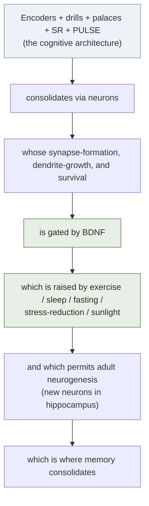
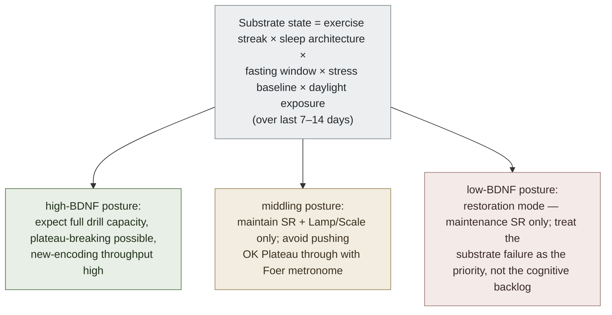

# BDNF and Adult Neurogenesis — The Biological Substrate

**Summary**: The biological lever underneath every wiki encoder, drill, palace, and SR card. **BDNF** (brain-derived neurotrophic factor; gene on chromosome 11) is the protein that protects existing neurons, encourages synapse formation, and spurs **neurogenesis** — the birth of new neurons from neural stem cells in the dentate gyrus of the hippocampus. Dr. John Ratey (Harvard) calls BDNF "Miracle-Gro for the brain." Until the late 1990s the dogma was that the adult brain doesn't make new neurons; we now know it does, throughout life, **in the hippocampus** — the exact structure Genova names as the "memory weaver." BDNF is depressed in Alzheimer's patients. **Five lifestyle levers raise BDNF**: aerobic exercise, restorative sleep, intermittent fasting, stress reduction, sunlight exposure. This page names the substrate the wiki has been implicitly farming.

**Sources**:
- Sanjay Gupta, *Keep Sharp: Build a Better Brain at Any Age* (Simon & Schuster 2021), Ch 4 "The Miracle of Movement" + Ch 5 "The Power of Purpose, Learning, and Discovery" + Ch 9 "Sharp Brain Program" — source file `F:\tutorials\Mnemonic Device\Keep Sharp...epub`
- Lisa Genova, *Remember* (Harmony 2021), Ch 1 "Making Memories 101" (hippocampus as memory weaver) + Ch 17 "Alzheimer's Prevention"
- John Ratey, *Spark: The Revolutionary New Science of Exercise and the Brain* (Little, Brown 2008) — coined "Miracle-Gro for the brain" framing
- Erikson et al. (2011) "Exercise training increases size of hippocampus and improves memory" — *PNAS* 108(7): 3017–3022 (the canonical MRI study showing hippocampal volume gain in older adults from aerobic exercise)
- Eriksson et al. (1998) "Neurogenesis in the adult human hippocampus" — *Nature Medicine* 4: 1313–1317 (the BrdU study that overturned the "no new neurons in adults" dogma)
- Mattson (2014–2019) intermittent-fasting + BDNF papers (Johns Hopkins / NIA)
- Rina Bliss, *Rethinking Intelligence* (2023), Ch 4–5 — learning novelty as BDNF trigger; epigenetic methylation as lasting suppressor class distinct from proximal cortisol spike

**Last updated**: 2026-05-30 (EGW MCP ingest — added 7th BDNF lever: spiritual/existential grounding; mechanism = cortisol reduction + sleep restoration + sustained intrinsic motivation)

---

## The load-bearing unlock

The wiki has 50+ pages of encoding architecture (NEDF / CAST / SPEAR / HEART / ORACLE / GRACE), gym layers ([red-queen-skill-gym](./red-queen-skill-gym.md)), automaticity protocols ([automaticity-and-reflex-training](./automaticity-and-reflex-training.md)), spaced-repetition machinery ([spaced-repetition](./spaced-repetition.md), [encoded-spaced-repetition](./encoded-spaced-repetition.md)), and PULSE state-modulation ([pulse-overview](./pulse-overview.md)). **All of it runs on neurons whose growth, plasticity, and protection are governed by one protein and one process.**

The wiki has been farming this substrate without naming it. sleep-and-cognition and walker-why-we-sleep cover the sleep lever; [pulse-overview](./pulse-overview.md) covers the stress lever obliquely; exercise has *zero* dedicated page; fasting has *zero*; sunlight has *zero*. The aphantasia-native palace, the Lamp/Scale/Sword phase rotation, every drill — all become more or less effective depending on the BDNF state of the hippocampus when the work is done.

**Operational consequence**: the wiki gains a **substrate layer** below PULSE. PULSE reads in-the-moment Energy / Stress / Focus to schedule cognitive work; the substrate layer reads multi-day BDNF posture (exercise streak, sleep architecture, fasting window, stress baseline, daylight exposure) to predict what level of cognitive work is even possible.

---

## The two intertwined facts (post-1998 revolution)

**Fact 1: Adult brains grow new neurons (neurogenesis).** Until the late 1990s, dogma said this was impossible. Eriksson et al. (1998, *Nature Medicine*) used BrdU labeling in cancer patients to show **new neurons are continuously born from neural stem cells in the dentate gyrus of the hippocampus** in human adults, into the eighth decade and beyond. Genova: *"in the dentate gyrus of the hippocampus, there's a reservoir of neural stem cells that are continually replenished and can differentiate into brain neurons."* The wiki's [long-term-memory](./long-term-memory.md) page already implies plasticity; this names the *new-neuron* side, which is distinct from synapse-rewiring plasticity.

**Fact 2: BDNF is what makes Fact 1 happen.** Brain-Derived Neurotrophic Factor (gene on chromosome 11). Three roles:

| Role | What | Wiki impact |
|---|---|---|
| **Neurogenesis support** | Helps new neurons survive and differentiate in the hippocampus | Every new memory has more substrate to consolidate into |
| **Synapse formation** | Encourages neurons to connect to other neurons | The very pattern that *is* a memory (per Genova Ch 1) requires synapses |
| **Neuroprotection** | Protects existing neurons from death + amyloid plaque accumulation | Cognitive reserve against Alzheimer's; lower decline rate with age |

Gupta: BDNF is **depressed in Alzheimer's patients** — both cause and consequence are debated; both directions plausibly hold.

---

## The five lifestyle levers that raise BDNF (Gupta Ch 4–9)

| Lever | Evidence | Wiki cross-link |
|---|---|---|
| **Aerobic exercise** | Erikson et al. 2011: brisk walking 40 min × 3/week for 1 year → 2% hippocampal volume *gain* in older adults (the population that normally loses 1-2% per year); BDNF spike post-session is measurable. Gupta cites this as "the only behavioral activity scientifically proven to trigger biological effects that can help the brain." | No dedicated wiki page yet; neural-os-daily-loop should anchor 30-40 min aerobic block |
| **Restorative sleep** | REM + slow-wave sleep both required for the glymphatic clearance that protects neurons from amyloid (see glymphatic-system) and for the procedural consolidation that lays down new synapses | sleep-and-cognition; walker-why-we-sleep; sleep-architecture; [sleep-dependent-memory-consolidation](./sleep-dependent-memory-consolidation.md) |
| **Intermittent fasting** | Mattson (Johns Hopkins / NIA, 2014+): fasting windows of 16–20 hours trigger ketone-body production; ketones upregulate BDNF transcription in the hippocampus. Gupta: "fasting done correctly can increase the production of BDNF" (Ch 9). | No dedicated wiki page yet |
| **Stress reduction** | Chronic cortisol elevation suppresses BDNF transcription and damages hippocampal neurons; meditation / yoga / mindfulness lower cortisol and restore BDNF | [pulse-overview](./pulse-overview.md) Stress-side; [failure-mechanism](./failure-mechanism.md) Cancel! protocol; future page candidate |
| **Sunlight / circadian alignment** | Daylight exposure (esp. morning) anchors circadian rhythm → improves sleep architecture → raises BDNF. Gupta lists this on the modifiable-strategies list. | circadian-rhythm-and-chronotypes; sleep-architecture |
| **Learning novelty (6th lever — Bliss 2023)** | When the brain encounters genuinely new information, synaptic demand triggers epigenetic activation of BDNF-related genes. The learning-moment itself is an endogenous BDNF trigger — not just a byproduct of exercise/sleep/fasting but a distinct input. Bliss Ch 4–5: *"forcing your brain to respond to your environment in new ways tells it that it is time to create new pathways and new cells."* Corollary: familiar rote repetition (OK Plateau autopilot) does NOT generate this trigger — only genuinely new learning does. (source: Bliss, *Rethinking Intelligence* 2023) | [ok-plateau](./ok-plateau.md); [epigenetics-and-intelligence](./epigenetics-and-intelligence.md) (mechanism: methylation); [bliss-rethinking-intelligence](./bliss-rethinking-intelligence.md); [cognitive-house-model](./cognitive-house-model.md) (Advance's independently-arrived-at neurodynamics-as-battery folk metaphor aligns with this lever — metaphor only, no mechanism or citation of its own) |
| **Spiritual / existential grounding (7th lever — EGW, MCP 1977)** | Spiritual communion, prayer, and a stable sense of meaning and divine accountability reduce chronic anxious thought-loading, lower cortisol, restore sleep quality, and sustain intrinsic motivation — all of which upregulate BDNF. EGW documents the cascade in both directions: "as in the case of Daniel, in exact proportion as the spiritual character is developed, the intellectual capabilities are increased" (MCP1, Ch. 4); "let the mind become intelligent and the will be placed on the Lord's side, and there will be a wonderful improvement in the physical health" (MCP1, Ch. 4). The mechanism is not magical: reduced anxiety → lower chronic cortisol → restored sleep architecture → BDNF upregulation. A second pathway: existential security (knowing one is known and purposeful) reduces the "threatened-survival" neural state that chronically suppresses hippocampal plasticity. (source: en_1MCP.mobi, en_2MCP.mobi) | [mind-the-citadel](./mind-the-citadel.md); egw-mcp; [egw-diet-and-mind](./egw-diet-and-mind.md); relates to [pulse-overview](./pulse-overview.md) Stress-side and [social-weathering](./social-weathering.md) |

Two-way street (Gupta's warning): *brain plasticity is bidirectional.* The same machinery that builds neurons under good conditions **destroys them under bad conditions** (sedentarism, chronic sleep deprivation, junk food, chronic stress, social isolation, alcohol). PULSE's negative side is real.

**Epigenetic methylation as a lasting suppressor class (Bliss 2023 addition)**: the five levers above all modulate *proximal* BDNF production. Bliss adds a sixth suppressor that operates at a *longer* timescale: chronic discriminatory or socioeconomic stress generates **epigenetic methylation patterns** that silence neurogenesis genes at the regulatory level — persisting even after the proximal cortisol spike has resolved. This is distinct from the Stress lever above (which addresses cortisol) and is addressed by the [social-weathering](./social-weathering.md) Weathering Baseline construct. Restoring BDNF after this class of suppressor requires sustained environmental improvement, not just single-session stress reduction. (source: Bliss Ch 4; see [epigenetics-and-intelligence](./epigenetics-and-intelligence.md))

---

## Connection to the wiki's existing architecture

| Wiki claim | Substrate fact | Implication |
|---|---|---|
| [memory-palace](./memory-palace.md) / [memory-systems](./memory-systems.md): hippocampus binds episodic memory | Hippocampus is the ONE site of adult neurogenesis | New neurons born this week are literally the substrate of memories formed this week — exercise/sleep/fasting/stress posture during encoding matter |
| [spaced-repetition](./spaced-repetition.md) strengthens traces | Strengthening requires synapse stability + new synapse formation, both BDNF-gated | SR sessions on a low-BDNF day produce weaker consolidation per retrieval |
| [automaticity-and-reflex-training](./automaticity-and-reflex-training.md): drill ladders produce proceduralization | Procedural consolidation runs on sleep-spindle-driven re-synaptic-tagging requiring BDNF | Sleep-deprived drill sessions have lower transfer ratio |
| [sleep-dependent-memory-consolidation](./sleep-dependent-memory-consolidation.md): +20% speed / +35% accuracy after 8h sleep | Sleep is the largest BDNF-modulating window in the 24h cycle | Already named; this page provides the upstream "why" |
| [ok-plateau](./ok-plateau.md): deliberate practice breaks the autopilot plateau | Plateau-breaking requires new synapse formation in the trained circuits | Forced practice past comfort on a low-BDNF day produces fatigue, not learning gain |
| [pulse-overview](./pulse-overview.md): Energy / Stress / Focus modulate cognitive work | These are PROXIMAL state; BDNF posture is DISTAL state (multi-day) | New: substrate-layer reading below PULSE |

---

## Operational substrate-layer rule

Below the in-session PULSE check, a **multi-day substrate-layer** check governs what level of cognitive work is realistic:

A pre-session check:

| Pre-session check | Answer |
|---|---|
| Last aerobic session within 72h? | yes / no |
| Last night's sleep ≥ 7h with REM? | yes / no |
| Stress baseline below threshold? | yes / no |
| Daylight exposure this morning? | yes / no |
| Fasting window honored? | yes / no |
| Spiritual grounding (prayer/communion) this week? | yes / no |

The wiki should treat 3+ "no" answers as a substrate-layer red flag — the same way PULSE treats Energy ≤ 2 as a Sword-phase red flag. The cognitive backlog is not the problem; the substrate is.

---

## What this page does NOT claim

- Does **not** claim exercise reverses dementia. Gupta carefully writes "evidence is mounting" not "proven."
- Does **not** claim BDNF supplements work — there's no oral form that crosses the blood-brain barrier. The route is endogenous production via the 6 levers.
- Does **not** claim neurogenesis happens everywhere — it's hippocampus-specific in adults; cortex and other regions do **not** make new neurons in adulthood.
- Does **not** rank the 6 levers — Gupta's position is they compound rather than substitute.

---

## METER floor for this page

- Define BDNF in <8s: "Brain-Derived Neurotrophic Factor — the protein that protects neurons, builds synapses, and spurs hippocampal neurogenesis."
- Name 3 BDNF-raising levers in <8s.
- Name the 1998 finding in <10s: adult human hippocampus produces new neurons throughout life (Eriksson et al., Nature Medicine).
- State the dentate-gyrus location in <5s.
- Recall the Erikson 2011 figure in <8s: brisk walking 40 min × 3/week × 1 yr → ~2% hippocampal volume gain in older adults.

---

## Mnemonic

A **glowing hippocampus** (seahorse-shaped, lit from within) is a **garden** in the center of a brain-shaped greenhouse. The garden has a **labeled sign**: *Dentate Gyrus — neural stem-cell nursery, est. always*. **Spray bottles labeled "BDNF — Miracle-Gro for the Brain"** mist the garden continuously. Five **gardeners** tend the spray valves:
- a **runner** in sweat-stained shorts (aerobic exercise)
- a **sleeping figure** wrapped in a blanket of REM-waves (sleep)
- an **empty plate** with a clock showing 16:8 (intermittent fasting)
- a **meditator** with a thin stress-meter at zero (stress reduction)
- a **sunbathing figure** with morning light striping their face (daylight)

When any gardener stops working, their valve closes and the corresponding patch of garden **wilts** — neurons retract and die. In a corner: a **withered Alzheimer's-affected hippocampus** with all five valves shut and the BDNF mister empty. A **2% green progress-bar** climbs the side of the garden every year that all five gardeners work (Erikson 2011 figure). The wiki's NEDF / CAST / SPEAR / HEART **encoder-flags** plant themselves in the garden — and grow only as tall as the garden allows.

---

## Memory checksum

- **1** protein name (BDNF — Brain-Derived Neurotrophic Factor); gene on **chromosome 11**
- **1** brain region for adult neurogenesis (**dentate gyrus** of the **hippocampus** — and ONLY here in adults)
- **3** BDNF roles (neurogenesis support · synapse formation · neuroprotection against amyloid)
- **5** lifestyle levers (aerobic exercise · sleep · intermittent fasting · stress reduction · sunlight)
- **1** canonical figure (Erikson 2011: 40 min × 3/week × 1 yr → ~2% hippocampal volume gain in older adults)
- **1** dogma-overturning year (1998 — Eriksson et al., *Nature Medicine*)
- **1** clinical association (BDNF depressed in Alzheimer's)

1-1-3-5-1-1-1 recall from "BDNF and neurogenesis" within 60s → page is encoded.

---

## U — See (CAST)

1. Hippocampus-as-garden with 5 valve-gardener nodes; central BDNF-mister; growth/wilt feedback loop; encoders planted as flags
2. Edges: lever → BDNF production → neurogenesis + synapse-formation + neuroprotection → wiki-encoder consolidation; bidirectional plasticity arrows

## D — Name (NEDF)

1. BDNF = Brain-Derived Neurotrophic Factor; "Miracle-Gro for the brain" (Ratey)
2. Neurogenesis = birth of new neurons (adults: dentate gyrus only)
3. 6 levers (exercise · sleep · fasting · stress-down · sunlight · spiritual grounding)
4. Distinguisher: not the same as synaptic plasticity (that's any neuron rewiring; this is new neurons)
5. Failure mode: substrate decay → cognitive backlog gets harder, not easier

## F — Do (SPEAR)

1. Pre-session substrate check: aerobic 72h / sleep 7h / stress baseline / daylight / fasting window / spiritual grounding — count noes
2. 3+ noes → restoration mode (maintenance SR only; defer plateau-breaking)
3. 0–2 noes → normal cognitive schedule
4. Multi-day substrate failure → treat as the priority, not the cognitive task

## B — Watch (HEART)

1. Treating cognitive backlog as the bottleneck when substrate is the bottleneck
2. Aerobic-only without sleep — partial; both needed
3. Chronic stress eating BDNF faster than the other 4 levers can replenish
4. Supplement-shopping — BDNF doesn't cross the BBB; only lifestyle works

## L — Predict (ORACLE)

1. Substrate posture over last 7-14 days predicts in-session encoding throughput
2. Aerobic streak + good sleep architecture predicts plateau-breaking capacity ([ok-plateau](./ok-plateau.md))
3. Chronic high stress over months predicts measurable hippocampal volume loss + Alzheimer's risk increase
4. 6-lever consistency over years predicts cognitive trajectory at age 80

## R — Act (GRACE)

1. Drill session feels harder than usual → substrate-layer check before doubling drill volume
2. New skill onboarding → schedule the encoding-heavy weeks during high-substrate posture
3. Stress event landed → expect 1-3 weeks of reduced encoding throughput; rebalance backlog
4. Building neural-os-daily-loop → ensure all 6 levers have a daily-loop slot

---

## Related pages

- [memory-systems](./memory-systems.md) — overview parent
- [long-term-memory](./long-term-memory.md) — consolidation runs on this substrate
- sleep-and-cognition · walker-why-we-sleep · sleep-architecture · [sleep-dependent-memory-consolidation](./sleep-dependent-memory-consolidation.md) · glymphatic-system — sleep lever
- circadian-rhythm-and-chronotypes — sunlight/circadian lever
- [pulse-overview](./pulse-overview.md) — proximal state above this distal substrate
- [ok-plateau](./ok-plateau.md) — plateau-breaking requires high BDNF posture
- [automaticity-and-reflex-training](./automaticity-and-reflex-training.md) — drill consolidation depends on this substrate
- mild-cognitive-impairment — what substrate decay looks like clinically (future ingest)
- mind-diet — nutritional lever that overlaps the 6-lever stack (future ingest)
- connection-for-protection — social-connection lever modulating stress baseline (future ingest)
- [epigenetics-and-intelligence](./epigenetics-and-intelligence.md) — cellular substrate of BDNF regulation; methylation as lasting suppressor
- [social-weathering](./social-weathering.md) — discrimination-induced methylation that suppresses BDNF chronically
- [bliss-rethinking-intelligence](./bliss-rethinking-intelligence.md) — source for 6th lever and methylation suppressor additions
- [cognitive-house-model](./cognitive-house-model.md) — Advance's neurodynamics-as-battery metaphor aligns with (does not corroborate) this page's novelty-lever material
- home-recomposition-protocol — schedules the aerobic lever concretely (two zone-2 days/week plus a daily step floor), so the training program pays a cognitive dividend alongside the body-composition one
