# Bertrand Russell (1872–1970)

**Summary**: British philosopher, mathematician, logician, public intellectual; Frege's de facto heir; Whitehead's collaborator on [*Principia Mathematica*](./principia-mathematica.md); Wittgenstein's teacher and TLP's first introducer; pacifist, prisoner (1918, six months), Nobel laureate (1950, Literature); **author of [the paradox](./russells-paradox.md) that demolished his teacher's program and of the 13-year reconstruction project that Gödel eventually wounded**. The narrator of [Logicomix](./logicomix-graphic-novel.md) and the load-bearing biographical example of [substrate stewardship via field-leaving](./logicians-madness-substrate-thesis.md). The *survivor* of the six-case grid; lived to 97; died of natural causes.

**Sources**:
- Ray Monk, *Bertrand Russell: The Spirit of Solitude 1872-1921* (Free Press 1996) and *Bertrand Russell: The Ghost of Madness 1921-1970* (Free Press 2000) — the two-volume scholarly biography.
- Bertrand Russell, *The Autobiography of Bertrand Russell* (3 vols, 1967-1969) — primary source for the substrate story.
- [logicomix-graphic-novel](./logicomix-graphic-novel.md) — Russell as narrator + load-bearing character.
- [russells-paradox](./russells-paradox.md) · [principia-mathematica](./principia-mathematica.md) · [tractatus-logico-philosophicus](./tractatus-logico-philosophicus.md) §Russell's introduction · [logicians-madness-substrate-thesis](./logicians-madness-substrate-thesis.md) — all extensively cite Russell.

**Last updated**: 2026-05-25

---

## One-line

> Born aristocrat 1872; discovered the paradox 1901; spent 13 years on *Principia Mathematica*; introduced TLP to the English world 1922; imprisoned for pacifism 1918; survived three (or four) marriages; wrote popular philosophy + political activism for 60 years; Nobel Prize 1950; died of natural causes 1970 at age 97. **The only major figure of the foundations crisis to live a long, productive, and recognizable life.**

## Unlocks (lead, not footer)

1. **The survivor's biography is the proof-by-contrast of [the substrate thesis](./logicians-madness-substrate-thesis.md).** Russell did the same kind of work as Cantor, Frege, Hilbert, Wittgenstein, Gödel — he spent 13 years on *Principia*, faced foundational collapse via Gödel's incompleteness applied to his system, lived through the same era and intellectual milieu. **Yet he survived to 97 with sustained intellectual productivity.** The variable is *field-leaving + relational diversification + concrete-world engagement + self-acknowledged imperfection*. Russell is *the* worked example of the protective move.

2. **The narrator of Logicomix is also a participant.** Russell tells the foundations-crisis story *because he lived it*. His 1939 lecture (Logicomix frame) is given by someone who watched his teacher (Frege) be demolished by his own letter, who saw his student (Wittgenstein) overtake him intellectually, who watched Gödel kill his life work. **Russell is the *only* observer of the entire 1880-1939 arc; his testimony is irreplaceable.**

3. **The cross-disciplinary range is itself the substrate story.** Russell wrote on: mathematics (Principia, foundations), philosophy of language (theory of descriptions), epistemology (knowledge by acquaintance vs description), ethics (essays + political action), education (Beacon Hill School 1927-1932), politics (pacifism + anti-nuclear activism), religion (*Why I Am Not a Christian* 1927), history (*History of Western Philosophy* 1945), popular philosophy (dozens of accessible essays). **The range itself is the substrate stewardship** — pursuing alternative domains where different cognitive substrate is exercised.

4. **The Nobel was for *literature*, not philosophy or mathematics.** Russell received the 1950 Nobel Prize in Literature *"in recognition of his varied and significant writings in which he champions humanitarian ideals and freedom of thought."* The Nobel committee recognized the *range* + *accessibility* + *humanitarian engagement* as the load-bearing contribution. **Russell is one of three philosophers ever to win a Literature Nobel** (Bergson 1927, Sartre 1964 [declined], Russell 1950).

## Mnemonic

**1872 → 1901 → 1910-1913 → 1922 → 1918 → 1950 → 1970** = *Born · paradox · Principia · TLP intro · prison · Nobel · death.*

Seven dates anchor the biography. The chronological range (98 years from birth to death) makes Russell exceptional — he is the foundations-crisis figure who lived *through* all of it and a generation beyond.

For the substrate-protection moves: **F-R-C-S** = *Field-leaving · Relational diversification · Concrete-world engagement · Self-acknowledged imperfection.*

## Memory checksum

1. **State Russell's role in the foundations crisis.** (Discovered the paradox (1901) that demolished Frege's *Grundgesetze*; co-authored [*Principia Mathematica*](./principia-mathematica.md) (1910-1913) as logicism's most-developed instance; introduced Wittgenstein's [TLP](./tractatus-logico-philosophicus.md) to the English world (1922) with his introduction; saw Gödel demolish his program 1931.)
2. **What did Russell survive that the others didn't?** (Survived to 97 with sustained intellectual productivity. *Why*: field-leaving repeatedly (after *Principia* → popular philosophy + pacifism + politics); relational diversification (four marriages + many other engagements); concrete-world engagement (prison + activism); self-acknowledged imperfection (open about his failures).)
3. **Why did Russell go to prison?** (Pacifist activism during WWI; six months in Brixton Prison, 1918. Wrote *Introduction to Mathematical Philosophy* during the imprisonment.)
4. **What was the Nobel for?** (1950 Nobel Prize in Literature, not philosophy — *"in recognition of his varied and significant writings in which he champions humanitarian ideals and freedom of thought."* The Nobel committee recognized Russell's *range* and *accessibility* + *humanitarian engagement*.)
5. **State Russell's substrate-stewardship pattern.** ([Field-leaving + relational diversification + concrete-world engagement + self-acknowledged imperfection](./logicians-madness-substrate-thesis.md) = the four-component protective pattern that distinguished Russell's survival from the others' collapse.)

## Visual — the 97-year span

```mermaid
timeline
  title Bertrand Russell — the 97-year span
  1872 : Born at Trellech, Wales, into the British aristocracy (grandson of Lord John Russell, twice Prime Minister)
  1894 : Cambridge degree; engaged to Alys Pearsall Smith (Quaker)
  1895 : First marriage (Alys); will fail by 1911
  1900 : ICM Paris; meets Peano; reads Frege; conceives logicism
  1901 : ★ DISCOVERS THE PARADOX ★ — Letter to Frege follows in 1902
  1903 : Publishes Principles of Mathematics; meets G.E. Moore
  1905 : Theory of descriptions (the 'On Denoting' essay)
  1910 : Principia Mathematica Vol I (with Whitehead) — Cambridge UP
  1911 : Wittgenstein arrives at Cambridge; becomes Russell's student
  1912 : PM Vol II; first affair with Lady Ottoline Morrell
  1913 : PM Vol III; Wittgenstein produces TLP fragments
  1914 : WWI begins; Russell becomes a public pacifist
  1916 : Dismissed from Trinity College Cambridge for pacifism
  1918 : Six months in Brixton Prison; writes Introduction to Mathematical Philosophy
  1922 : TLP English edition with Russell's introduction
  1927 : Founds Beacon Hill School with Dora Russell (his second wife) : Why I Am Not a Christian
  1931 : Gödel demolishes the Principia program
  1938 : Lectures in America; controversy over CCNY teaching post
  1939 : ★ LOGICOMIX FRAME ★ — American university lecture
  1945 : History of Western Philosophy — bestseller
  1950 : ★ NOBEL PRIZE IN LITERATURE ★
  1952 : Marries Edith Finch (fourth marriage); will be his last
  1957 : Founds the Campaign for Nuclear Disarmament with Einstein
  1961 : Imprisoned for one week (age 89) for anti-nuclear protest
  1967-69 : Publishes 3-volume Autobiography
  1970 : Dies of natural causes at Penrhyndeudraeth, Wales (age 97)
```

The chronological range itself is the substrate story. **No other major foundations-crisis figure had a 97-year arc.**

---

## The substrate-protection pattern — Russell's four moves

### 1. Field-leaving

After *Principia* (1913), Russell did not continue the logicist program at the foundational layer. Instead:
- 1914-1918: pacifist activism; *Principles of Social Reconstruction*; *Why Men Fight*.
- 1919: *Introduction to Mathematical Philosophy* (popular treatment).
- 1921: *The Analysis of Mind*.
- 1927: *The Analysis of Matter*; *An Outline of Philosophy*.
- 1945: *History of Western Philosophy*.
- 1948+: post-Hiroshima political activism.
- 1957+: anti-nuclear campaigning.

Russell continued *thinking* about logic and mathematics; he stopped making them his *only* domain.

### 2. Relational diversification

Four marriages (Alys 1894-1921; Dora 1921-1935; Patricia "Peter" 1936-1952; Edith 1952-1970), four children (including with women he wasn't married to), many close friendships across multiple domains (G.E. Moore, T.S. Eliot, D.H. Lawrence, Joseph Conrad, Albert Einstein, Aldous Huxley, dozens more), correspondence with countless public figures, students, and ordinary people.

The marriages were turbulent — Russell himself characterized most as failed — but the *diversification* itself was protective. **Russell engaged with people in non-mathematical contexts throughout life.** The contrast with Gödel's single-relationship dependency (only Adele could prepare safe food) or Wittgenstein's monastic isolation is sharp.

### 3. Concrete-world engagement

Russell got physically involved with the world:
- WWI pacifism led to dismissal from Trinity College and Brixton Prison (1918).
- Anti-nuclear activism led to a second imprisonment (1961, age 89).
- Beacon Hill School (1927-1932) — Russell and Dora ran a progressive school for children.
- Political lectures, candidacy for Parliament (unsuccessful), public broadcasts during WWII.

**The world acted *on* him** in ways it did not act on Cantor or Wittgenstein.

### 4. Self-acknowledged imperfection

Russell's *Autobiography* (1967-1969) is unusually candid about his failures — moral, marital, intellectual. He documented his depressions, his cruelties, his mistakes. **The perfectionist load was lower** because the standard wasn't perfection.

Contrast with Wittgenstein: who self-flagellated for moral failures; who burned manuscripts he considered unworthy; whose biography is studded with self-condemnation. Russell's biography is studded with self-criticism but rarely with self-condemnation.

## The Russell-Wittgenstein relationship

The most intense intellectual relationship in 20th-century philosophy. Phases:

| Year | Phase | Russell's view of Wittgenstein |
|---|---|---|
| 1911 | Arrival | "An unknown German appeared … obstinate and perverse, but I think not stupid." |
| 1912 | First year | "He has the pure intellectual passion in the highest degree; it makes me love him." |
| 1913 | Crisis | Russell increasingly oppressed by Wittgenstein's criticism of his work. |
| 1914-1918 | WWI separation | Wittgenstein in the Austrian army; intermittent correspondence; manuscript pages sent. |
| 1918-1922 | TLP reception | Russell writes the introduction (over Wittgenstein's mixed feelings about it). |
| 1922-1929 | Hiatus | Wittgenstein in Austria; minimal contact. |
| 1929-1947 | Cambridge years | Wittgenstein returns; their views diverge sharply. |
| 1950s | Final estrangement | "I had thought him a genius. I now think differently." |

Russell's later judgment of Wittgenstein was negative — he came to believe the *Philosophical Investigations* late-Wittgenstein was a fall from the TLP early-Wittgenstein, and that the late position was an evasion. The wiki's stance: Russell's negative judgment is itself a data point; many philosophers think *Investigations* is the *greater* book.

## The American controversy (1940)

In 1940, Russell was appointed Professor of Philosophy at the City College of New York. The appointment was challenged in court by a parent on grounds of Russell's writings on sex and marriage (*Marriage and Morals* 1929). A New York judge ruled the appointment "an insult to the people of New York" and ordered it revoked. **Russell was effectively barred from teaching philosophy at any public US institution for a decade.**

He survived this professionally (privately funded lectures continued; he was eventually invited to Harvard and Princeton in the 1940s), but the controversy is one of the most-cited instances of academic-freedom-meets-popular-morality clashes in 20th-century US history.

## The Nobel and the late-career renaissance

The 1950 Nobel Prize in Literature was awarded *"in recognition of his varied and significant writings in which he champions humanitarian ideals and freedom of thought."*

The Nobel committee explicitly cited:
- *A History of Western Philosophy* (1945) — the popular philosophy bestseller.
- *Why I Am Not a Christian* (1927) and other essay collections.
- *Marriage and Morals* (1929) — the work that got him barred from CCNY.
- Russell's sustained role as a public intellectual.

The award is *unusual* — Russell is one of only three philosophers to receive a Literature Nobel (Bergson 1927; Sartre 1964, declined; Russell 1950). The committee recognized that Russell's contribution was the *bridge between technical philosophy and public discourse* — exactly the *field-leaving* the substrate thesis names as protective.

## The anti-nuclear years (1955-1970)

Russell's final 15 years were dominated by anti-nuclear activism:
- **Russell-Einstein Manifesto** (July 1955): co-authored with Einstein; called for nuclear disarmament; eleven signatories including Linus Pauling and Max Born.
- **Pugwash Conferences** (founded 1957): scientific anti-nuclear collaboration; received the 1995 Nobel Peace Prize after Russell's death.
- **Campaign for Nuclear Disarmament** (CND, 1957): founded with Russell as its first president.
- **Imprisonment 1961** (age 89): one-week imprisonment for inciting civil disobedience at an anti-nuclear demonstration.
- **Russell Tribunal** (1966): investigating US war crimes in Vietnam.

**Russell was politically active until his death in 1970, age 97.** The sustained engagement is itself a substrate-stewardship signature.

## Death

Russell died February 2, 1970, at his home in Penrhyndeudraeth, Wales, of influenza. He was 97 years old.

His ashes were scattered (per his wishes) over the Welsh mountains where he had spent his final years.

Per his last published essay (*"Bertrand Russell looks back"*, 1967): *"Three passions, simple but overwhelmingly strong, have governed my life: the longing for love, the search for knowledge, and unbearable pity for the suffering of mankind."*

## Cross-link to the wiki

| Wiki layer | Russell's contribution |
|---|---|
| [russells-paradox](./russells-paradox.md) | The 1901 demolition of Frege's logicism |
| [principia-mathematica](./principia-mathematica.md) | The 13-year reconstruction project with Whitehead |
| [tractatus-logico-philosophicus](./tractatus-logico-philosophicus.md) §Russell's introduction | TLP's standard scholarly entry-point |
| [picture-theory-of-language](./picture-theory-of-language.md) | Russell's introduction explains picture theory for English readers |
| [logicomix-graphic-novel](./logicomix-graphic-novel.md) | Russell as narrator + load-bearing character |
| [foundations-crisis](./foundations-crisis.md) | Russell in the 65-year timeline; one of the three primary actors |
| [logicians-madness-substrate-thesis](./logicians-madness-substrate-thesis.md) | The survivor; the worked example of the protective move |
| [memory-paradox](./memory-paradox.md) | Russell's *Autobiography* is the take-seriously / hold-lightly rule made into a life |
| connection-for-protection | Russell's relational-diversification pattern |
| [bdnf-and-neurogenesis](./bdnf-and-neurogenesis.md) | Russell's substrate stewardship via sustained intellectual + physical + social engagement |

## METER integration

| Drill | Pass floor | Source |
|---|---|---|
| Place Russell on the foundations-crisis timeline | <15 s | [foundations-crisis](./foundations-crisis.md) |
| State the four substrate-protection moves | <30 s | this page §Substrate protection |
| Quote Russell on Wittgenstein at three different phases | <60 s | this page §Russell-Wittgenstein |
| State why Russell received the Nobel and what it was for | <30 s | this page §Nobel |
| Distinguish Russell-style survival from Hilbert-style survival | <60 s | [logicians-madness-substrate-thesis](./logicians-madness-substrate-thesis.md) + this page §Substrate |

## Related pages

- [logicomix-graphic-novel](./logicomix-graphic-novel.md) — Russell as narrator
- [russells-paradox](./russells-paradox.md) — the 1901 discovery
- [principia-mathematica](./principia-mathematica.md) — the 13-year project
- [tractatus-logico-philosophicus](./tractatus-logico-philosophicus.md) — Russell's introduction
- [picture-theory-of-language](./picture-theory-of-language.md) · [show-vs-say](./show-vs-say.md) · [truth-function-machine](./truth-function-machine.md) — TLP concepts Russell introduced to English readers
- [foundations-crisis](./foundations-crisis.md) — Russell as one of three primary actors
- [logicians-madness-substrate-thesis](./logicians-madness-substrate-thesis.md) — Russell as the survivor
- [memory-paradox](./memory-paradox.md) — take-seriously / hold-lightly as the lived rule
- [wittgenstein-ludwig](./wittgenstein-ludwig.md) — Russell's student
- [frege-gottlob](./frege-gottlob.md) — Russell's de facto predecessor
- [hilbert-david](./hilbert-david.md) — alternative survival pattern (Göttingen-substrate vs Russell's field-leaving)
- [glossary](./glossary.md) — Logic layer registration
