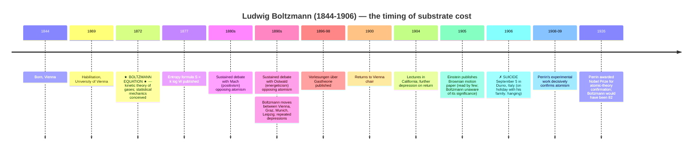

# Ludwig Boltzmann (1844–1906)

**Summary**: Austrian physicist; founder of **statistical mechanics** (the reduction of thermodynamics to mechanics + probability); creator of the **Boltzmann equation** (1872) and the **entropy formula** *S = k log W* (engraved on his tombstone in Vienna's Zentralfriedhof). **Suicide 1906** in Duino, Italy. **Substrate-thesis case 3** — the *parallel-domain* worked instance: Boltzmann was not a foundations-of-mathematics figure, but he worked in the same milieu (Austria-Vienna 1880s-1900s), under the same kind of reductionist program, against the same kind of community opposition (Mach + Ostwald rejected atomism), with the same biographical pattern (depression, sustained intellectual isolation, recognition deficit).

**Sources**:
- Carlo Cercignani, *Ludwig Boltzmann: The Man Who Trusted Atoms* (Oxford UP 1998) — the standard scholarly biography.
- Boltzmann, *Vorlesungen über Gastheorie* (1896-1898) — the canonical statistical-mechanics treatise.
- Boltzmann's late lectures and his philosophical writings on the realism-positivism controversy with Mach.
- [logicians-madness-substrate-thesis](./logicians-madness-substrate-thesis.md) §Six-case grid — Boltzmann as case 3.

**Last updated**: 2026-05-25

---

## One-line

> Reduced thermodynamics to statistical mechanics (1872+); fought a 30-year battle defending atomic theory against Mach + Ostwald; died by suicide 1906 in Duino, Italy, three years before atoms were decisively confirmed by Einstein-Perrin work on Brownian motion. **The atomic theory was vindicated immediately after his death.**

## Unlocks (lead, not footer)

1. **Substrate-thesis case 3 — the parallel-domain instance.** Boltzmann wasn't doing foundations of mathematics; he was doing foundations of *thermodynamics*. But the structural pattern of [the substrate thesis](./logicians-madness-substrate-thesis.md) applies: extended regress-pursuing into a contested reductionist program + sustained community opposition + isolation + abstract-perfection-as-personal-standard → mood collapse → suicide. **The thesis generalizes beyond foundations-of-math to any reductionist program pursued under hostile substrate conditions.**

2. **The recognition-deficit timing is uniquely painful.** Boltzmann died by suicide September 5, 1906. Einstein's Brownian motion paper (1905) and Jean Perrin's experimental work (1908-1909) decisively confirmed atomism within 3-5 years of Boltzmann's death. **Boltzmann did not live to see his program vindicated.** Cantor lived 12 years past his community ostracism without sustained vindication; Boltzmann lived no time past his and missed it by months.

3. **The Mach-Ostwald hostility was sustained, public, and personal.** Ernst Mach (positivism) and Wilhelm Ostwald (energeticism) explicitly rejected the existence of atoms. Mach: *"Atoms cannot be perceived by the senses; like all substances, they are things of thought."* Ostwald: *"Atomism is a useful hypothesis, but not a description of reality."* Both held senior positions; both publicly opposed Boltzmann throughout the 1890s. The opposition was substrate-corrosive in the relational layer — Boltzmann's professional community contained sustained adversaries, not merely critics.

4. **S = k log W is on his tombstone.** Boltzmann's entropy formula — *S = k log W*, where S is entropy, k is now called the Boltzmann constant, W is the number of microstates compatible with the macrostate — is **engraved on his tombstone in Vienna**. The formula is the canonical 19th-century reductionist achievement: thermodynamics (continuous, macroscopic) reduced to mechanics (discrete, microscopic) via probability. **The most concise tombstone-as-statement-of-life'-work in the history of science.**

## Mnemonic

**1872 → 1906 → 1908** = *Boltzmann equation · suicide · atomic theory vindicated.*

Three dates. The 34-year gap between equation and vindication is the substrate-cost timing.

For the entropy formula: ***S = k log W***. The five symbols compress an entire reductionist program.

## Memory checksum

1. **State Boltzmann's reductionist program.** (Thermodynamics (macroscopic, continuous) reduces to statistical mechanics (microscopic, atomic, probabilistic). Heat, temperature, pressure — all explained as statistical averages over atomic motions.)
2. **State Boltzmann's entropy formula.** (*S = k log W* — entropy S equals Boltzmann's constant k times the natural logarithm of the number of microstates W compatible with the macrostate. The formula on his tombstone in Vienna's Zentralfriedhof.)
3. **What was the Mach-Ostwald hostility?** (Mach (positivism) and Ostwald (energeticism) explicitly rejected the existence of atoms as inferred-but-not-perceived. Both held senior positions; both publicly opposed Boltzmann throughout the 1890s. Sustained substrate-corrosive opposition.)
4. **When and how did Boltzmann die?** (September 5, 1906; suicide by hanging; Duino, Italy, where he was on holiday with his family.)
5. **When was atomism vindicated?** (Einstein's Brownian motion paper 1905 (read by few until later); Jean Perrin's experimental work 1908-1909 → decisive confirmation of atomic theory. Boltzmann missed the vindication by 3-5 years.)

## Visual — the timing of substrate cost



*Tombstone in Vienna's Zentralfriedhof, engraved S = k log W.*

The 3-year gap between Boltzmann's death and Perrin's decisive vindication is the timing element of his substrate cost. Boltzmann fought a 30-year battle; the vindication arrived months after he stopped being able to receive it.

---

## The work — statistical mechanics

### The Boltzmann equation (1872)

Boltzmann's equation describes the time evolution of the distribution function *f(x, v, t)* — the density of particles at position *x* moving with velocity *v* at time *t*:

```
∂f/∂t + v · ∇_x f + F · ∇_v f = (∂f/∂t)_collision
```

Left side: free-streaming evolution of the distribution.
Right side: collision term changing the distribution as particles scatter.

**Physical content**: gas behavior derives from atomic motion + collisions; the macroscopic gas laws (Boyle, Charles, ideal-gas law) are statistical consequences of the underlying mechanics.

### The H-theorem (1872)

Boltzmann showed that for a gas obeying his equation:

```
H = ∫ f · log f dx dv
```

monotonically decreases with time (modulo equilibrium). **H is essentially negative entropy.** The H-theorem provides a *statistical* derivation of the second law of thermodynamics (entropy increases) from the underlying *reversible* mechanics.

This is one of the most-discussed results in the history of physics — the Loschmidt paradox (1876) and the Zermelo recurrence paradox (1896) attacked it, and the resolution involves understanding that the irreversibility is statistical, not strict.

### The entropy formula (1877)

```
S = k · log W
```

Where:
- **S** = entropy of a thermodynamic system in some macrostate.
- **k** = Boltzmann's constant ≈ 1.381 × 10⁻²³ J/K.
- **W** = the number of microstates compatible with the macrostate.

Entropy is *combinatorial* — it counts the number of microscopic arrangements that look identical macroscopically. **The formula reduces thermodynamic entropy to a counting problem in atomic configurations.**

The formula is engraved on Boltzmann's tombstone in Vienna's Zentralfriedhof.

## The Mach-Ostwald opposition

### Ernst Mach (positivism)

Ernst Mach (1838-1916) was Boltzmann's senior colleague at Vienna and a leading positivist philosopher of science. Mach held that:
- **Only the sensorily observable is real.**
- Atoms, not directly perceptible, are at best *useful hypotheses* — not descriptions of reality.
- Theoretical entities (atoms, fields, forces) should be treated as economical *summaries* of observations.

Mach was articulate, influential, and politically positioned. His positivism became one of the dominant philosophy-of-science positions of the late 19th century. **Mach's opposition to atomism was sustained, public, and influential.**

### Wilhelm Ostwald (energeticism)

Wilhelm Ostwald (1853-1932) was a Leipzig professor and a leading chemist (Nobel 1909 for catalysis). Ostwald proposed *energeticism* — that *energy* is the fundamental physical reality, not matter. Atoms, on his view, are a useful but expendable hypothesis.

Boltzmann debated Ostwald in print and in person throughout the 1890s. The most famous exchange was at the 1895 Lübeck meeting of the Society of German Natural Scientists, where Boltzmann reportedly came close to physical confrontation with Ostwald.

### The substrate cost of the opposition

The Mach-Ostwald hostility:
- **Was sustained** (decades, not occasional).
- **Was institutionally backed** (both held senior chairs).
- **Was philosophical-foundational** (not merely technical disagreement).
- **Lacked decisive empirical resolution** until Einstein-Perrin work.

Boltzmann's letters from the 1890s onward show **increasing despair** about whether his program would ever be accepted. His repeated job changes (Vienna → Graz → Munich → Leipzig → Vienna) reflect partly substrate-stewardship attempts that failed.

## The biographical depression pattern

Documented depressive episodes throughout Boltzmann's life:
- **1880s**: first major episode, coinciding with intensifying opposition to atomism.
- **1890s**: sustained low-grade depression; multiple job moves attempting environmental change.
- **1900**: severe episode after returning to Vienna; consideration of suicide.
- **1904**: severe episode after California lectures.
- **1906**: final episode → suicide.

Boltzmann's wife Henriette and his children documented the cycles. The pattern is consistent with bipolar II or recurrent major depression; modern diagnosis would have likely been treated pharmacologically but no such treatment existed in 1906.

## The suicide

September 5, 1906. Boltzmann was on holiday with his family at Duino on the Adriatic coast (then part of Austria-Hungary, now Italy). His wife and daughter went swimming in the morning; Boltzmann remained at the villa.

When they returned, he had hanged himself.

The suicide note (or lack of one) is debated; sources vary. The immediate trigger is not known with certainty — the depression had been sustained for months, the academic year was about to resume at Vienna, the Mach-Ostwald controversy was ongoing.

**The death is one of the most-cited cases of substrate-cost in 20th-century physics.** It is referenced extensively in Cercignani's biography and in subsequent discussions of mental health in scientific careers.

## Cross-link to [logicians-madness-substrate-thesis](./logicians-madness-substrate-thesis.md)

Boltzmann is case 3 of the six-case grid. The three-component mechanism:

| Component | Present? |
|---|---|
| Regress-pursuing inside a closed formal system | YES — the reduction of thermodynamics to statistical mechanics, sustained 30+ years |
| Social isolation from non-domain peers | PARTIAL — Boltzmann had family + students + some allies (Planck, Gibbs), but the sustained adversarial opposition from Mach + Ostwald + their schools was the load-bearing isolation factor |
| Abstract perfection as personal standard | YES — Boltzmann's letters show recurrent self-doubt about whether his program could ever be vindicated; the depression pattern is consistent with internalized standards he couldn't satisfy externally |

**Boltzmann's case extends the substrate thesis beyond foundations-of-mathematics to parallel-domain reductionist programs.** The three-component mechanism is domain-general; the specific kind of regress (mathematical vs physical) is less important than the structural pattern.

## What survives — the vindication

Within 5 years of Boltzmann's death:

- **Einstein's Brownian motion paper (1905)**: explained the random motion of suspended particles as evidence of atomic impact; predicted specific quantitative features of the motion.
- **Perrin's experimental work (1908-1909)**: measured Avogadro's number via multiple independent methods using Brownian motion; **decisively confirmed atomism**.
- **Planck's quantum hypothesis (1900) + photoelectric effect (Einstein 1905)**: required atoms + discrete energy levels.
- **Rutherford's nuclear atom (1911)**: gave atoms internal structure; atomism became *the* paradigm of physics.

By 1915, atomism was the consensus of physics. **By 1926, when Perrin received the Nobel Prize for confirming Boltzmann's program, Boltzmann had been dead 20 years.**

His contribution survives in:
- The Boltzmann constant *k* (the bridge between thermodynamic and statistical quantities).
- The Boltzmann distribution (the equilibrium distribution of particles in a thermal system).
- The H-theorem (statistical derivation of the second law).
- The entropy formula *S = k log W* (the fundamental statistical-mechanics result).
- The Boltzmann equation (still used in transport theory, plasma physics, semiconductor physics).
- The entire methodological program of statistical-mechanical reduction.

## METER integration

| Drill | Pass floor | Source |
|---|---|---|
| State Boltzmann's entropy formula and its meaning | <30 s | this page §S = k log W |
| Name the Mach-Ostwald opposition + what it rejected | <30 s | this page §Mach-Ostwald |
| Place Boltzmann's death + atomic-theory vindication on a timeline | <30 s | this page §Visual |
| State the substrate-thesis mechanism for Boltzmann | <60 s | this page §Substrate cross-link |
| Distinguish Boltzmann's reductionist program from the foundations-of-math programs | <60 s | this page §Cross-link |

## Related pages

- [logicians-madness-substrate-thesis](./logicians-madness-substrate-thesis.md) — Boltzmann as case 3 of six
- [foundations-crisis](./foundations-crisis.md) — Boltzmann's milieu was parallel to but distinct from the math-foundations crisis
- connection-for-protection — the sustained Mach-Ostwald hostility as substrate corrosion
- [probability-as-logic](./probability-as-logic.md) — statistical mechanics extends probability theory into physics
- [bdnf-and-neurogenesis](./bdnf-and-neurogenesis.md) — depression management gap in Boltzmann's era; modern treatments unavailable
- [memory-paradox](./memory-paradox.md) — the take-seriously / hold-lightly rule applied: take Boltzmann's vindication seriously (atoms are real); hold it lightly (the controversy was epistemologically substantive, not merely a personal feud)
- [bertrand-russell](./bertrand-russell.md) — contemporary survivor; opposite outcome
- [logicomix-graphic-novel](./logicomix-graphic-novel.md) — narrative parallel (Boltzmann not in the cast but in the same era + same shape)
- [glossary](./glossary.md) — Logic layer registration
