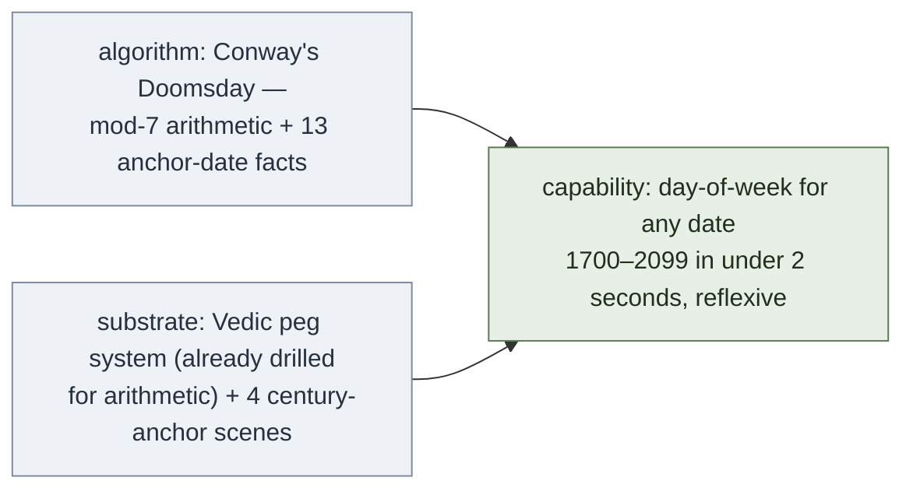

# Calendar Reflex — Day-of-Week for Any Date

**Summary**: An **unlock** from [composability-index](./composability-index.md) — combine the Vedic-trained peg substrate (digit-images, mod-arithmetic fluency) with Conway's Doomsday algorithm and you get sub-2-second mental day-of-week computation for any date from 1700 to 2099. The substrate already exists if the user is drilling [vedic-speed-math](./vedic-speed-math.md); the algorithm is small enough to fit on one page. Highest visible-payoff unlock from the [composability-index](./composability-index.md) candidate list.

**Sources**:
- Conversation synthesis with the user (2026-05-11)
- Conway's Doomsday algorithm (J.H. Conway, 1973) — the standard mental-calculation method, designed for speed not symbolic neatness
- Composes on top of [vedic-speed-math](./vedic-speed-math.md), Soroban Learning Method, [peg-matrix-remaps-scenes](./peg-matrix-remaps-scenes.md)
- Architectural primitive: [substrate-algorithm-composition](./substrate-algorithm-composition.md)

**Last updated**: 2026-05-11

---

## The unlock



Why this composition works: every step of Doomsday is *exactly* the kind of small-number mental computation Vedic+pegs is built for. Mod-7 addition is cross-add-and-cast-out-sevens. The (Y + Y/4) part is one division and one add. The 13 anchor dates are pure mnemonic. There is no step in this algorithm that exceeds working memory once the substrate is in place.

Cost: this rides on a substrate the user is already building. The marginal cost is **the 13 anchor dates + 4 century anchors + a drill ladder** — maybe 5–10 hours of focused practice to reach <3s, another 20–40 to reach <2s reflex.

---

## The algorithm — Conway's Doomsday method

A "doomsday" is a specific day-of-week that recurs on a fixed set of dates every year. Once you know the doomsday for a year, every other date in that year is a small offset away.

### Step 1: Century anchor (the century's doomsday)

| Century | Doomsday | Mnemonic |
|---|---|---|
| 1700s | **Sunday** (0) | "Sunday — the original" |
| 1800s | **Friday** (5) | "Civil War on a Friday" |
| 1900s | **Wednesday** (3) | "We-this-day" / hump-day for the 20th century |
| 2000s | **Tuesday** (2) | "Twosday — two-thousand Tuesday" |
| 2100s | **Sunday** (0) | (cycle repeats every 400 years) |

The pattern cycles `Tue → Sun → Fri → Wed → Tue` every 400 years. Memorise the four scenes (one per century) using the user's existing peg system or a simple narrative chain.

### Step 2: Year doomsday within the century

Take the last two digits of the year, call it `Y`. Then:

```
   year_offset  =  (Y  +  ⌊Y/4⌋)  mod 7
   year_doomsday  =  (century_anchor  +  year_offset)  mod 7
```

That's it. Two operations the Vedic substrate already drills: integer division by 4 (right-shift by 2 in binary, or simple chunking), and mod-7 addition (cast-out-sevens — same shape as Vedic's casting-out-nines check).

**Worked: 2026**
- Y = 26, ⌊Y/4⌋ = 6
- year_offset = (26 + 6) mod 7 = 32 mod 7 = 4
- 2026 doomsday = (Tuesday + 4) mod 7 = (2 + 4) mod 7 = 6 = **Saturday**

**Worked: 1776** (July 4 is famously a Thursday)
- Y = 76, ⌊Y/4⌋ = 19
- year_offset = (76 + 19) mod 7 = 95 mod 7 = 4
- 1776 doomsday = (Sunday + 4) mod 7 = (0 + 4) mod 7 = 4 = **Thursday** ✓

### Step 3: The 13 anchor dates (every year, these fall on the doomsday)

```
   Even months         :  4/4, 6/6, 8/8, 10/10, 12/12     (symmetric — memorise as one fact)
   "9-to-5 at the 7-11":  5/9, 9/5, 7/11, 11/7            (Conway's own mnemonic)
   March               :  3/0 (= last day of February)    (or 3/7, 3/14, 3/21, 3/28)
   January             :  1/3 (common years), 1/4 (leap years)
   February            :  2/28 (common), 2/29 (leap) — last day of February
```

**Leap year rule**: divisible by 4, except centuries not divisible by 400. So 2000 was leap, 1900 was not, 2100 will not be, 2400 will be.

### Step 4: Offset from nearest anchor

Pick the anchor date in the target month, count days to your target date, mod 7. Add to the doomsday.

**Worked: 2026-05-11**
- 2026 doomsday = Saturday (Step 2 above)
- May anchor = 5/9 (a doomsday) = Saturday
- May 11 = May 9 + 2 days = Saturday + 2 = **Monday**

**Worked: 1969-07-20** (Apollo 11 moon landing)
- Y = 69, ⌊Y/4⌋ = 17, year_offset = (69 + 17) mod 7 = 86 mod 7 = 2
- 1969 doomsday = (Wednesday + 2) mod 7 = (3 + 2) mod 7 = 5 = Friday
- July anchor = 7/11 = Friday
- July 20 = July 11 + 9 days = Friday + (9 mod 7) = Friday + 2 = **Sunday** ✓

---

## The substrate — what the Vedic+pegs stack contributes

This is where the composition pays off. Each step of Doomsday is a Vedic-shaped operation:

| Doomsday step | What Vedic substrate provides |
|---|---|
| Y + ⌊Y/4⌋ | Fast integer division by 4 (drilled in [vedic-speed-math](./vedic-speed-math.md) §4 special cases); fast 2-digit addition |
| (anything) mod 7 | Cast-out-sevens — same shape as cast-out-nines, a standard Vedic check |
| Century anchor recall | One of 4 fixed peg-scenes (Sun-image, Fri-image, Wed-image, Tu-image) |
| Anchor date recall | 13 fixed facts, encoded as peg scenes if needed |
| Offset count from anchor | Single-digit addition mod 7 — Vedic-trivial |

**Optional substrate upgrade — precomputed year-offset table.** If the user has [peg-matrix-remaps-scenes](./peg-matrix-remaps-scenes.md) (a 10×10 peg-encoded scene matrix), each year 00–99 can be pre-encoded with its year_offset directly. This eliminates Step 2's arithmetic entirely: see "26" → see the scene → read off "4." This is the highest-leverage substrate-extension, and is structurally similar to soroban-masters precomputing common multiplications.

---

## Drill ladder

Following [automaticity-and-reflex-training](./automaticity-and-reflex-training.md)'s Lamp / Scale / Sword progression:

### Lamp phase (~3–5 hours)
- Write out the algorithm on paper. Walk through 20 dates slowly, looking up each step.
- Goal: correct answer every time; no time pressure.
- Pass criterion: 20/20 correct on random dates from 1900–2099.

### Scale phase (~10–20 hours)
- Drill each component to fluency *separately*:
  - Century anchors: any-century-name → day in <1s (≈100 reps)
  - Year offsets 00–99: any-year-name → year_offset in <3s (≈400 reps; faster if peg-matrix substrate is used)
  - 13 anchor dates: any-month-name → anchor date in <1s (≈50 reps)
  - Day-arithmetic: random day + random offset (0–6) in <1s (≈200 reps)
- Pass criterion: each component under its target with 95%+ accuracy on cold tests.

### Sword phase (~10–30 hours)
- Random dates from 1700–2099. Target <3s end-to-end, then <2s.
- Drill in **mixed** mode: don't pre-warm with same century or month.
- Add hostile dates: leap-year January and February (1/3 vs 1/4, 2/28 vs 2/29), century boundaries (1900 vs 2000), pre-1900 dates.
- Pass criterion: 95%+ accuracy on 50 random dates with median time <2s.

Total time to reflex: ~25–55 hours if the Vedic substrate is already in place. ~100+ hours if starting from scratch.

---

## Failure modes (from substrate-algorithm-composition anti-patterns)

1. **Century-anchor confusion at boundaries**. Jan 1, 1900 vs Jan 1, 2000 — different century anchors, different year-doomsdays. Drill these specifically.
2. **Leap-year exception in Jan/Feb**. Jan 3 vs Jan 4, Feb 28 vs Feb 29. Memorise as: "January is 3, except leap-Jan is 4; February-last is 28, except leap-Feb is 29."
3. **Mod-7 arithmetic error under time pressure**. Cast-out-sevens is harder than cast-out-nines because 7 is less digit-friendly. Drill mod-7 separately as a Scale-phase component.
4. **Year-offset miscalculation for years ending 96–99**. Y/4 = 24, the addition crosses 100 (e.g., 99 + 24 = 123). Mod 7 of 123 = 4. Practice the high-Y cases explicitly.
5. **Wrong direction count from anchor**. May 11 is *after* May 9, so add 2. May 4 is *before* May 9, so subtract 5 (= add 2 mod 7 from the other direction). Drill both directions.
6. **Substrate drift**: if the same peg image gets used for "Tuesday" and for digit 2 elsewhere, the calendar peg corrupts the digit peg. Use *distinct* peg images for day-of-week vs digit roles, or always context-tag them.

---

## Worked extended example: 2026-12-25 (Christmas 2026)

1. Century anchor = Tuesday (2000s)
2. Y = 26, ⌊Y/4⌋ = 6, year_offset = (26 + 6) mod 7 = 32 mod 7 = 4
3. 2026 doomsday = (2 + 4) mod 7 = 6 = Saturday
4. December anchor = 12/12 = Saturday
5. Dec 25 = Dec 12 + 13 days = Saturday + (13 mod 7) = Saturday + 6 = **Friday**

(Sanity check: Dec 25 2026 should indeed be a Friday.)

The full computation took ~12 mental operations. Drilled to reflex, each operation collapses to a peg-recognition step, and the whole thing happens in under 2 seconds.

---

## Why this is a high-payoff unlock specifically

1. **Demonstration value is enormous**. Day-of-week for arbitrary dates is the single most visible "human calculator" trick. It looks like magic to anyone who doesn't know how it works.
2. **Substrate is already paid for**. The Vedic-trained user has the arithmetic substrate from [vedic-speed-math](./vedic-speed-math.md) training; only the 13 anchor dates and 4 century scenes are new mnemonic work.
3. **Algorithm is small**. Three steps, no branching except for leap years. Fits on a single page.
4. **Transfers to neighbouring skills**: mod-7 arithmetic, casting-out-sevens, mental date-distance computations (how many days until X?), age computation, scheduling.
5. **Self-quizzable**. Every date in the past has a known answer; verification is trivial via any phone calendar. No drill data to construct manually.

---

## Cross-references and next moves

- This unlock is now **confirmed** in [composability-index](./composability-index.md) (was candidate row #1 in the May 11 commit).
- After this is drilled to Scale-phase fluency, the **next unlock chain** is: same mod-7 substrate + leap-year rule + days-between-dates algorithm = age-in-days reflex, scheduling-distance reflex, "how many weeks until X" reflex. All ride on the same substrate.
- For the user's profile: pair this with the **NEDF + SR encoded-spaced-repetition** unlock ([encoded-spaced-repetition](./encoded-spaced-repetition.md)) — the 13 anchor dates and 4 century scenes are exactly the kind of small-fact-set that benefits from 4-angle SR drilling.

## Related pages

- [substrate-algorithm-composition](./substrate-algorithm-composition.md) — the architectural primitive this is an instance of
- [composability-index](./composability-index.md) — the unlock registry; this page promotes calendar-reflex from candidate to confirmed
- [vedic-speed-math](./vedic-speed-math.md) — supplies the mental-arithmetic substrate
- [vedic-speed-math-skill-ceiling](./vedic-speed-math-skill-ceiling.md) — quantifies the speed-up; calendar-reflex is one of the "day-of-week 1–3s" entries
- [peg-matrix-remaps-scenes](./peg-matrix-remaps-scenes.md) — optional substrate upgrade for precomputed year-offsets
- Soroban Learning Method — sister substrate (place-value beads); soroban itself isn't needed for Doomsday but reinforces the mod-arithmetic muscles
- [automaticity-and-reflex-training](./automaticity-and-reflex-training.md) — the drill engine; Lamp/Scale/Sword phases used in the drill ladder above
- [encoded-spaced-repetition](./encoded-spaced-repetition.md) — companion unlock; ideal for drilling the 13 anchor dates
- [Visual walkthrough →](../../pages/perpetual-calendar.html) — interactive perpetual-calendar pack (mechanism diagram · offset table · concept map · live simulator) that consumes this reflex as its input


---

## U — See (CAST)
1. Sub-2-second mental day-of-week computation
2. Vedic peg substrate × Conway Doomsday algorithm

## D — Name (NEDF)
1. Calendar reflex = day-of-week reflex via Doomsday
2. Distinguisher: composition unlock from composability-index
3. Failure mode: trying to use without Vedic substrate

## F — Do (SPEAR)
1. Date input → apply Doomsday + peg substrate
2. Output day-of-week in <2 sec

## B — Watch (HEART)
1. Substrate drift (Vedic weak)
2. Algorithm error

## L — Predict (ORACLE)
1. Date → predict day-of-week
2. Practice → predict reflex speed

## R — Act (GRACE)
1. Day-of-week needed → run reflex
2. Slow → drill Vedic + Doomsday