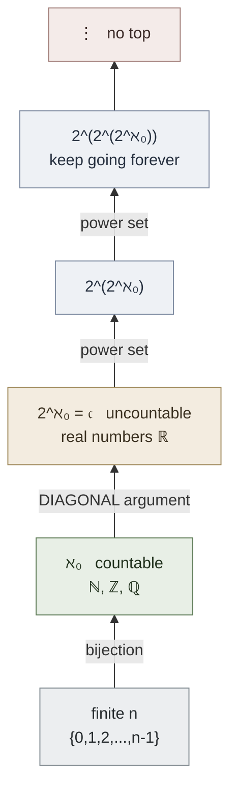

# Cantor's Infinities and the Power Set

**Summary**: Georg Cantor's 1874–1891 discovery that **there are infinitely many sizes of infinity**. Two sets have the same cardinality iff a one-to-one correspondence exists between them. The natural numbers, integers, and rationals all have the same "smallest" infinity (cardinality ℵ₀, *countable*). The real numbers have a strictly larger infinity (cardinality 2^ℵ₀, *uncountable*) — Cantor's diagonal argument proves this. The power set P(S) of any set S always has strictly larger cardinality than S — so there is no largest infinity. Burger and Starbird's [*Heart of Mathematics*](./burger-heart-of-mathematics.md) Ch 3 (pp. 201–272) is the standard pedagogically-clear introduction. The wiki cares because the diagonal argument is the canonical *meta-tactic* for any "show no enumeration captures everything" problem — appears in Gödel's incompleteness, Turing's halting problem, Russell's paradox, and at least 6 wiki pages.

**Sources**: [burger-heart-of-mathematics](./burger-heart-of-mathematics.md) Ch 3 (pp. 201–272: §3.1 "Beyond Numbers" · §3.2 "Comparing the Infinite" · §3.3 "The Missing Member: Georg Cantor Answers — Are Some Infinities Larger Than Others?" · §3.4 "Travels Toward the Stratosphere of Infinities: The Power Set" · §3.5 "Straightening Up the Circle").

**Last updated**: 2026-05-27 — created during the Burger ingest.

---

## One-to-one correspondence: the definition of size for infinite sets

**Cantor's reframe** (pp. 210–215): two sets have the *same size* (cardinality) iff there is a bijection (one-to-one correspondence) between them. For finite sets, this matches everyday counting. For infinite sets, it produces surprises.

Worked instances (Heart of Math §3.2):

- **ℕ and 2ℕ (naturals and even naturals)** have the same cardinality. The bijection: n ↔ 2n. *"There are just as many even numbers as natural numbers — a part has the same size as the whole."*
- **ℕ and ℤ (naturals and integers)**: 0 ↔ 0, 1 ↔ 1, 2 ↔ −1, 3 ↔ 2, 4 ↔ −2, ... A zig-zag bijection.
- **ℕ and ℚ (naturals and rationals)**: list rationals in a 2D grid; traverse diagonally to enumerate all of them. Each rational appears at a specific natural-numbered position. ℚ is *countable*.

This cardinality is named **ℵ₀ (aleph-naught)** — the smallest infinity.

---

## Cantor's diagonal argument (Heart of Math §3.3, pp. 227–237)

**Claim**: ℝ (the real numbers) cannot be put into one-to-one correspondence with ℕ. There are *strictly more* reals than naturals.

**Proof by contradiction** (Cantor 1891): suppose ℝ between 0 and 1 *could* be listed as a sequence r₁, r₂, r₃, ... Each rₖ has a decimal expansion:

```
r₁ = 0 . d₁₁ d₁₂ d₁₃ d₁₄ ...
r₂ = 0 . d₂₁ d₂₂ d₂₃ d₂₄ ...
r₃ = 0 . d₃₁ d₃₂ d₃₃ d₃₄ ...
r₄ = 0 . d₄₁ d₄₂ d₄₃ d₄₄ ...
   ⋮
```

Now construct a new number x by walking the *diagonal*: x = 0.x₁x₂x₃x₄... where each xₖ is *different from* dₖₖ. For instance, set xₖ = 5 if dₖₖ ≠ 5, else 6.

Then x differs from r₁ in the 1st decimal, from r₂ in the 2nd, from r₃ in the 3rd, ... from every rₖ in the k-th. So x is a real in [0, 1] not in the list — contradicting the assumption that we listed them all.

**Conclusion**: no list (no enumeration) captures all real numbers. ℝ has cardinality **strictly greater** than ℵ₀. This cardinality is named **𝔠 (continuum)** or **2^ℵ₀**.

The diagonal argument is the canonical *meta-tactic*: whenever you suspect "no enumeration / no countable list / no algorithm" captures all objects in some class, attempt to build a diagonal counterexample.

---

## The power set theorem (Heart of Math §3.4, pp. 238–255)

**Power set**: for any set S, the power set P(S) is the set of all subsets of S. If |S| = n (finite), then |P(S)| = 2ⁿ.

**Cantor's theorem (1891)**: for *any* set S (finite or infinite), |P(S)| > |S| strictly.

**Proof sketch**: suppose a bijection f: S → P(S) existed. Construct the *Cantor diagonal subset* D = { x ∈ S : x ∉ f(x) }. Then D ∈ P(S), so some y ∈ S has f(y) = D. But then y ∈ D iff y ∉ f(y) iff y ∉ D — contradiction.

**Consequence**: there is *no largest infinity*. Starting from any infinite set S, you can produce a strictly larger one (P(S)), then a strictly larger one (P(P(S))), and so on without limit. The infinities form a strict, transfinite tower: ℵ₀ < 𝔠 ≤ 2^ℵ₀ < 2^{2^ℵ₀} < 2^{2^{2^ℵ₀}} < ...

---

## Why the wiki cares

**The diagonal argument as universal meta-tactic** ([crux-recognition-gym](./crux-recognition-gym.md) Tool-level target): whenever a problem says *"prove no algorithm / no enumeration / no list / no countable construction can ..."*, the diagonal argument is in the top-3 candidate tactics. Recognition floor: ≤30 s.

**Wiki pages that explicitly use diagonal-style arguments**:

| Wiki page | Use of diagonal |
|---|---|
| godel-incompleteness | (if exists / candidate) Gödel's incompleteness theorems use a diagonal construction on the set of provable formulas |
| halting-problem / turing-machines | (candidate) Turing's undecidability proof is a direct port of Cantor's diagonal |
| russell-paradox | (candidate) "The set of all sets that do not contain themselves" is Cantor's D applied to the universe |
| [copi-introduction-to-logic](./copi-introduction-to-logic.md) | references the paradoxes that arose post-Cantor |
| [problem-solving-three-levels](./problem-solving-three-levels.md) | Cantor's diagonal is registered as a Tool-level [crux-move](./crux-move.md) |
| [crux-recognition-gym](./crux-recognition-gym.md) | recognition target: "no enumeration captures all of X" cue → diagonal candidate |

**Cardinality-class encoding** ([nedf-overview](./nedf-overview.md) candidate): finite / countably-infinite / uncountable is a *3-tier* Distinguisher slot that the wiki could routinely include for any concept involving collections (e.g., NEDF Distinguisher for "list of users" = countably-finite; "set of real-valued thresholds" = uncountable).

**Hilbert's Hotel** (Heart of Math §3.2 p. 220) — Cantor's pedagogical anchor — is a memorable scene candidate for [memory-palace](./memory-palace.md) anchor selection. The hotel with countably-infinite rooms can always accommodate one more guest (shift everyone up one room), countably-many more guests (shift n to 2n), or *uncountably-many more*... wait, no — the limit of accommodation is exactly the line between ℵ₀ and 𝔠.

---

## METER integration

| Event | Operational form | Pass floor |
|---|---|---|
| `same_cardinality_yn` | Given two sets, identify whether they have the same cardinality | ≤8 s; ≥80% accuracy |
| `diagonal_argument_one_line_cue` | Cued recall of the diagonal-argument structure | ≤6 s |
| `power_set_strictly_larger_proof_sketch` | State Cantor's theorem proof sketch from memory | ≤45 s |
| `diagonal_candidate_recognition_in_problem` | When a problem invites a diagonal-style proof, name it | ≤30 s; ≥70% accuracy |

---

## Visual — the cardinality tower



The transfinite tower has no top. Each rung strictly contains the previous — *Cantor's theorem*.

---

## Mnemonic — *"Diagonal Wrecks Every List"*

D-W-E-L. The line names the diagonal argument's mechanism (diagonal · wrecks · every · list) and its consequence (any claimed enumeration fails).

For the cardinality hierarchy: *"Aleph nought, continuum, power, power, power... no top."*

---

## Memory Checksum

Numbered inventory (recite in ≤25 s):

1. **Equicardinality via bijection**: same size iff one-to-one correspondence (Cantor's reframe)
2. **ℕ ~ 2ℕ ~ ℤ ~ ℚ**: all have cardinality ℵ₀ (countable)
3. **ℝ has cardinality 2^ℵ₀ = 𝔠**: strictly bigger than ℕ
4. **Diagonal argument**: for every claimed list r₁, r₂, ..., construct x differing in the k-th decimal from rₖ; x is not in the list
5. **Power set theorem**: |P(S)| > |S| for any S (proof via Cantor diagonal subset D = {x : x ∉ f(x)})
6. **Cardinality tower has no top**: ℵ₀ < 𝔠 < 2^𝔠 < 2^{2^𝔠} < ... forever
7. **Hilbert's Hotel**: pedagogical anchor for paradoxes of countable infinity (a part = the whole)

**Counts**: 7 results · 2 paradoxes (part = whole · no largest) · 1 universal meta-tactic (diagonal).

**Recite floor**: ≤25 s.

---

## Related pages

- [burger-heart-of-mathematics](./burger-heart-of-mathematics.md) — Ch 3 source
- [pigeonhole-principle](./pigeonhole-principle.md) · [fibonacci-and-golden-ratio](./fibonacci-and-golden-ratio.md) · [penrose-tilings-and-platonic-solids](./penrose-tilings-and-platonic-solids.md) · [expected-value-and-arrows-theorem](./expected-value-and-arrows-theorem.md) — sibling Heart-of-Math concepts
- [problem-solving-three-levels](./problem-solving-three-levels.md) — Cantor's diagonal registered as Tool-level crux
- [crux-recognition-gym](./crux-recognition-gym.md) — diagonal is a Tool-level recognition target
- [copi-introduction-to-logic](./copi-introduction-to-logic.md) · [logic-atomic-design](./logic-atomic-design.md) — diagonal underlies Russell's paradox + Gödel
- [memory-palace](./memory-palace.md) — Hilbert's Hotel as anchor candidate
- [nedf-overview](./nedf-overview.md) — cardinality-class as candidate Distinguisher slot
