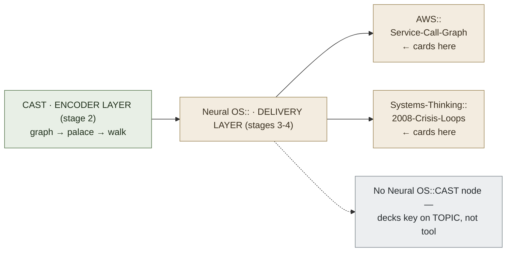

# Do You Need a Separate Anki Deck for CAST?

**Summary**: No — you never create a deck called "CAST." [CAST](./cast-overview.md) is an *encoder* (pipeline stage 2); Anki is a spaced-repetition *delivery layer* (pipeline stages 3–4). Decks are organized by **topic cluster, not by encoder**, so CAST-encoded material's retrieval cards live in the relevant topic deck — and most CAST review happens by re-walking the palace, not by flashcards.

**Sources**:
- raw/templates/04_CAST_TEMPLATE.md (CAST card formats + palace-walk retrieval test)
- [anki-reflex-deck-builder](./anki-reflex-deck-builder.md) (deck-granularity and pipeline-stage rules)
- [nedf-overview](./nedf-overview.md) (the "no prerequisite Anki" separation, stated for CAST's sibling encoder)
- Conversation with the user (2026-06-05)

**Last updated**: 2026-08-20 (`glyph:` assigned — [representation-rules](./representation-rules.md) Rule 11); 2026-06-05

---

## The core distinction: encoder vs. delivery layer

CAST and Anki answer different questions and sit on different stages of the skill pipeline (see [skill-progression-stages](./skill-progression-stages.md) for the canonical numbering):

| Pipeline stage | Tool | Question it answers |
|---|---|---|
| 2. Encode concept | **CAST** (mnemonics) | *How do I turn this graph into a palace walk?* |
| 3–4. Remember cue→action / distinguish | **Anki** | *How do I keep the discrete facts from decaying?* |

This mirrors the separation stated explicitly for [NEDF](./nedf-overview.md), CAST's sibling encoder: *"No prerequisite Anki — NEDF defines the content; SR delivery is a separate layer."* The same holds for CAST. The encoder defines *what* is stored and *how* it sits in space; Anki is an optional scheduler bolted on top — never a thing you organize *around*.

## Decks are keyed by topic, not by encoder

The deck-granularity rule in [anki-reflex-deck-builder](./anki-reflex-deck-builder.md) is **"one deck per topic cluster, not one deck per domain"** — and emphatically not one deck per encoder. A topic cluster is 10–40 cards over one discriminable concept space. CAST is neither a domain nor a topic; it is a *method*. So whatever you encode with CAST routes its retrieval cards into **that topic's leaf deck**, under the standard `Neural OS::` hierarchy:

```
Neural OS::
  AWS::
    Service-Call-Graph        ← CAST-encoded content lives here
  Systems-Thinking::
    2008-Crisis-Loops         ← also CAST-encoded, different topic deck
```

Parent decks are folders; cards live in leaf decks. There is no `Neural OS::CAST` node — that would be organizing by tool, which the deck-granularity rule explicitly rejects.

## CAST *does* ship card formats — they're templates, not a deck

`04_CAST_TEMPLATE.md` defines four card formats for relational material:

1. **Graph Structure** — front: system name; back: nodes, edges, palace layout
2. **Edge Retrieval** — front: `Node A → Node B`; back: the verb scene for that edge
3. **Path Finding** — front: path from A to B; back: sequence of edges/intermediate nodes
4. **Cycle Detection** — front: identify cycles; back: the feedback loops

These are **card templates you add inside a topic deck** when a particular edge, path, or cycle resists the palace walk. They are not a standalone deck.

## The bigger point: CAST's native review is the palace walk

CAST's own retrieval test is *"Can you walk the palace and explain the relationships?"* (`04_CAST_TEMPLATE.md` Step 5) — trace a path, name each edge, explain why it exists, detect the cycles. That is the primary review mechanism. Anki is the **secondary** reinforcement layer, used selectively for the discrete facts a walk doesn't reliably surface. For much CAST material you may need **no Anki at all** — you drill by re-walking.

When you *do* want SR reinforcement, note that CAST cards also feed the [ORACLE](./oracle-overview.md) predictive layer: faces minted from CAST cards via `tm oracle generate` carry `oracle::*` tags (see [anki-reflex-deck-builder](./anki-reflex-deck-builder.md) §Tag schemes). Those cards still live in the topic deck — the tags, not a separate deck, carry the cross-layer state.

## Two cases where a dedicated deck *is* justified

1. **Learning the CAST technique itself.** Practicing the *skill* of CAST — assigning [Georgian animals](./georgian-animals.md), encoding edges as verb scenes, building palaces — is a legitimate topic cluster. That is what [cast-drill-ladder](./cast-drill-ladder.md) is for, and it could back a small "learn CAST" deck. This deck is about the *method*, separate from any content encoded with it.
2. **One large CAST-encoded system.** A single graph that generates more than ~40 retrieval cards naturally splits into its own leaf deck — but it is named for the *system* (e.g. `2008-Crisis-Loops`), not for "CAST."

## Bottom line

Encode the graph with CAST → store the walk in a palace → review by re-walking → only if specific edges/paths/cycles keep slipping, drop those cards into the relevant **topic** deck under `Neural OS::`. No framework-level "CAST" deck — that would violate the deck-granularity rule and confuse the encoder layer with the delivery layer.

## Related pages

- [cast-overview](./cast-overview.md) — the encoder this page is about
- [cast-drill-ladder](./cast-drill-ladder.md) — where learning the CAST *technique* (a valid deck) lives
- [anki-reflex-deck-builder](./anki-reflex-deck-builder.md) — deck-granularity, pipeline-stage, and tag rules
- [nedf-overview](./nedf-overview.md) — sibling encoder; states the same "no prerequisite Anki" separation
- [encoded-spaced-repetition](./encoded-spaced-repetition.md) — how an encoder note generates multiple SR cards on the delivery layer
- [skill-progression-stages](./skill-progression-stages.md) — canonical pipeline-stage numbering used above
- [oracle-overview](./oracle-overview.md) — predictive layer that consumes CAST cards via `oracle::*` tags

---

## Mnemonic

**"Encode in CAST, deliver in topic decks."** CAST is the *kitchen* (where the meal is made); Anki decks are *plates* sorted by *meal type*, never by *kitchen*. You'd never label a plate "the kitchen."

## Checksum

1. Which pipeline stage does CAST occupy, and which does Anki occupy? (CAST = stage 2 encode; Anki = stages 3–4 remember/distinguish.)
2. Decks are organized by ____, not by ____. (By topic cluster; not by encoder/domain.)
3. What is CAST's *primary* (non-Anki) retrieval mechanism? (Walking the palace and explaining the relationships — `04_CAST_TEMPLATE.md` Step 5.)

## Visual


