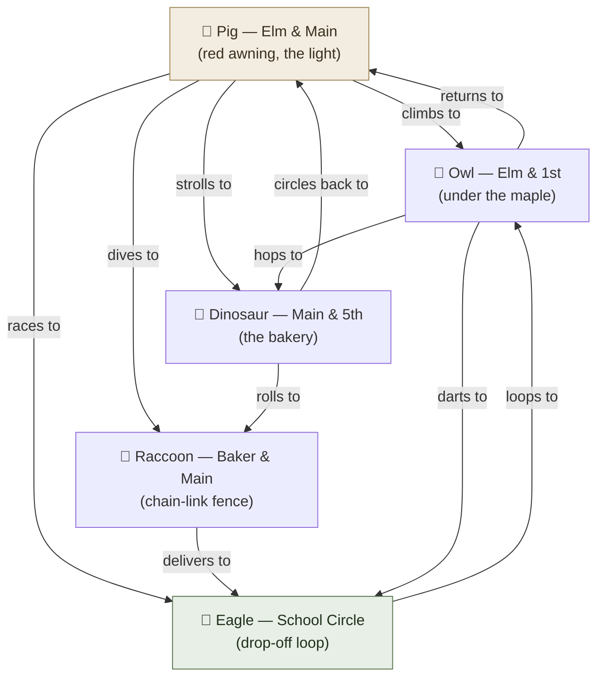

# Example: City Streets

**Summary**: Level 4 worked [CAST](./cast-overview.md) example — a 5-intersection neighborhood block encoded as a real spatial palace. Demonstrates one-way vs. two-way streets (directed edges cost differently depending on which you have) and shows that merge points (several streets converging on one corner) need no special notation — they just fall out of ordinary in-degree. Companion to *Web Service* (unwritten) (Level 3) and [University Math Program](./cast-example-math-program.md) (Level 8).

**Sources**: Synthesized worked example built to the spec in [maturity-levels-overview](./maturity-levels-overview.md) ("Level 4 Example: City Streets — 5 intersections, 8 streets, one-way and two-way, real-world palace"); encoding conventions per [georgian-animals](./georgian-animals.md) and [nodes-and-edges](./nodes-and-edges.md).

**Last updated**: 2026-09-04 (2026-04-30 ingest-ghost pass: dead `links` from that ingest's navigation skeleton repointed to the pages that actually own the content, or named as gaps); 2026-08-20 (`glyph:` assigned — [representation-rules](./representation-rules.md) Rule 11); 2026-07-12.

---

## The block

Your own morning-walk block, five corners:

| Corner | What's actually there |
|---|---|
| **Elm & Main** | The geometric center of the block. A red awning over the corner store, a working 4-way light. |
| **Elm & 1st** | North of center, under an old maple that drops helicopter seeds on the crosswalk. |
| **Main & 5th** | West of center, the corner bakery with a chalkboard sandwich sign. |
| **Baker & Main** | South of center, a chain-link fence running along the sidewalk. |
| **School Circle** | East of center, the elementary school's drop-off loop, playground fence visible through the trees. |

Eight physical streets connect these five corners — three of them two-way, five one-way. A two-way street is not one edge, it's two: one anchored at each end, each with its own verb. That asymmetry is the whole lesson of this level.

## Step 0: count edges, not streets

| Street | Segment | One-way or two-way | CAST edges it produces |
|---|---|---|---|
| Elm St | Elm&Main ↔ Elm&1st | two-way | 2 |
| Main St (west leg) | Elm&Main ↔ Main&5th | two-way | 2 |
| Baker Connector | Elm&Main → Baker&Main | one-way | 1 |
| Center Ave | Elm&Main → School Circle | one-way | 1 |
| Ridge Row | Elm&1st → Main&5th | one-way | 1 |
| Lower Row | Main&5th → Baker&Main | one-way | 1 |
| Baker Ave | Baker&Main → School Circle | one-way | 1 |
| Short Cut Lane | Elm&1st ↔ School Circle | two-way | 2 |

8 physical streets, **11 directed CAST edges**. The three two-way streets alone account for 6 of those 11 — you pay double for symmetry. This is not a CAST rule imposed on the world; it's just what "edges live on the source, not floating in the air between nodes" ([nodes-and-edges](./nodes-and-edges.md)) implies once a relation is actually bidirectional: you need one scene anchored at each end.

## Step 1: in-degree — and the twist

Count incoming edges per corner:

| Corner | Incoming edges | In-degree |
|---|---|---|
| School Circle | from Elm&Main, from Baker&Main, from Elm&1st | **3** |
| Elm&Main | from Elm&1st, from Main&5th | 2 |
| Elm&1st | from Elm&Main, from School Circle | 2 |
| Main&5th | from Elm&Main, from Elm&1st | 2 |
| Baker&Main | from Elm&Main, from Main&5th | 2 |

**School Circle wins the Eagle — not Elm & Main.** Elm & Main *looks* like the hub (it's the geometric center, the one with the traffic light), but it only has two-way streets to two neighbors, so its in-degree is 2. School Circle sits on the rim and racks up three separate one-way streets converging on it, so it wins on in-degree even though nobody would point at it on a map and call it "the hub." **In-degree measures how many things point at a node, not how central the node looks.** That distinction is the actual content of this level — a flat network is small enough that you can *see* this collision between geometric and structural centrality happen once and internalize it before graphs get too large to eyeball.

Assignment (highest in-degree first, ties broken by first-appearance-as-target reading order per [georgian-animals](./georgian-animals.md)):

| # | Corner | Animal |
|---|---|---|
| 1 | School Circle | 🦅 Eagle |
| 2 | Elm & 1st | 🦉 Owl |
| 3 | Elm & Main | 🐷 Pig |
| 4 | Main & 5th | 🦕 Dinosaur |
| 5 | Baker & Main | 🦝 Raccoon |

## Step 2: edge bundles (Tier 1 — no collisions at this level)

Each corner's outgoing edges, one distinct verb per bundle member — Level 4 stays flat, so no verb ever collides within a single source's bundle and nothing needs Tier 2 promotion:

**Pig (Elm & Main)** — 4 outgoing, still under the 5-edge bundle limit:
- *climbs to* Owl (Elm & 1st)
- *strolls to* Dinosaur (Main & 5th)
- *dives to* Raccoon (Baker & Main)
- *races to* Eagle (School Circle)

**Owl (Elm & 1st)** — 3 outgoing:
- *returns to* Pig (Elm & Main)
- *hops to* Dinosaur (Main & 5th)
- *darts to* Eagle (School Circle)

**Dinosaur (Main & 5th)** — 2 outgoing:
- *circles back to* Pig (Elm & Main)
- *rolls to* Raccoon (Baker & Main)

**Raccoon (Baker & Main)** — 1 outgoing:
- *delivers to* Eagle (School Circle)

**Eagle (School Circle)** — 1 outgoing:
- *loops to* Owl (Elm & 1st)

## The merge, without ceremony

Three different corners — Pig, Owl, and Raccoon — each have an edge landing on Eagle (School Circle). That's the "merge" this example is named for: three streets converging on one drop-off loop. Notice it required **no new mechanism**. Each of those three edges is an ordinary Tier 1 scene, anchored at its own source, exactly like every other edge on this page. When you physically stand in School Circle during the walk, you don't encode anything about the merge itself — you just notice, as a side effect of the walk, that three different animals' bundles all pointed here. A flowchart needs a special "merge" symbol because its edges are drawn as free-floating lines; CAST never needs one, because an edge is never anything but "this source, this verb, this target."

## Visual

Tan = the geometric hub (in-degree 2). Green = the actual in-degree winner and merge point (in-degree 3).

## Mnemonic

**Pig sends Owl north, Dinosaur west, Raccoon south, and Eagle east — every road home leads back to the schoolyard.** Walk it from Pig (the natural entry point, standing at the light) outward along all four spokes, then notice the rim closes the loop and everything drains toward the Eagle.

## Checksum

1. Which corner has the highest in-degree, and why does it win the Eagle despite not being the geometric hub? *(School Circle, in-degree 3 — three one-way streets converge on it; Elm & Main, the visual hub, only reaches in-degree 2 because its connections are two-way to just two neighbors.)*
2. How many directed CAST edges do the three two-way streets alone produce, versus the five one-way streets? *(3 × 2 = 6 from the two-way streets; 5 × 1 = 5 from the one-way streets — two-way costs more.)*
3. At School Circle, how many distinct source animals have an edge landing there, and does CAST need any special "merge" notation to represent it? *(Three — Pig, Owl, Raccoon. No special notation: each is an ordinary edge anchored at its own source.)*

## Related pages

- [CAST](./cast-overview.md) — the framework this example instantiates
- [georgian-animals](./georgian-animals.md) — the in-degree assignment rule used in Step 1
- [nodes-and-edges](./nodes-and-edges.md) — the two-layer model (nodes, Tier 1 edges) this page applies
- [maturity-levels-overview](./maturity-levels-overview.md) — Level 4 in the 10-level progression
- [maturity-levels-overview](./maturity-levels-overview.md) §Quick Reference Table — Level 4: Small Flat Networks
- [Step 0 Analysis](./step-zero-analysis.md) — in-degree calculation, generalized
- *Example: Web Service (Level 3)* — the simpler sibling (no two-way edges) promised by the 2026-04-30 ingest and never written; the 4-service kitchen graph in [cast-overview](./cast-overview.md) is the nearest live stand-in
- [Example: University Math Program (Level 8)](./cast-example-math-program.md) — next sibling up, adds hierarchy and Tier 2
- [neighborhood-palace](./neighborhood-palace.md) — the production-scale version of this exact idea (real streets, cabbie-grade fluency)

---

## U — See (CAST)
1. 5-intersection spatial graph; the geometric hub (Elm & Main) is not the in-degree winner
2. School Circle is a 3-way merge — ordinary edges, no special notation

## D — Name (NEDF)
1. City Streets = Level 4 worked example: real palace, one-way vs. two-way, merges
2. Distinguisher: in-degree ranks structural importance, not map geometry
3. Failure mode: assuming the visually-central node is always the Eagle

## F — Do (SPEAR)
1. Walk your own block → list intersections and streets
2. Mark each street one-way or two-way → count directed edges, not streets
3. Rank by in-degree → assign Georgian animals

## B — Watch (HEART)
1. Treating a two-way street as one edge instead of two
2. Assuming geometric centrality equals in-degree hub status

## L — Predict (ORACLE)
1. Several one-way streets converging on one corner → predict that corner wins the Eagle
2. A two-way street → predict double the encoding cost of a one-way street

## R — Act (GRACE)
1. New spatial graph → count in-degree before picking animals
2. Streets merge → just add the edges; no special merge scene required
