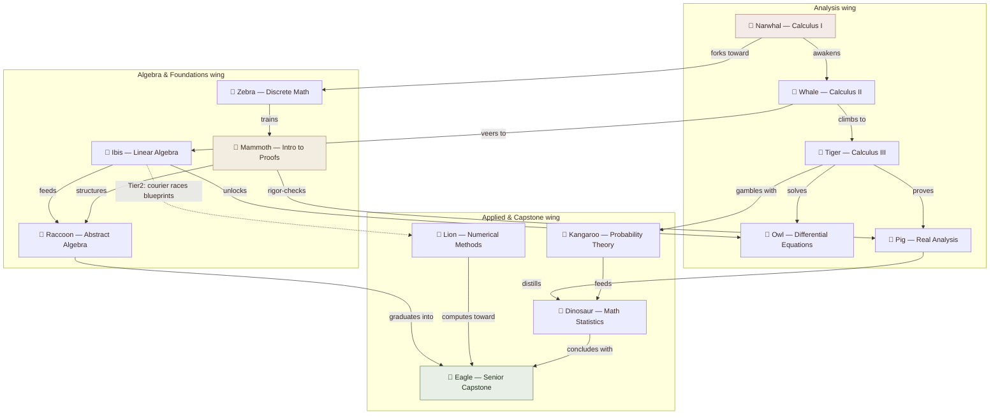

# Example: University Math Program

**Summary**: Level 8 worked [CAST](./cast-overview.md) example — a 13-course prerequisite DAG encoded as three nested palace rooms (tracks), with three clean [diamond patterns](./lego-skills-patterns.md), two explicit cross-edges joining the tracks, and one Tier 2 promotion where a source's verb bundle collides. The first example on the ladder to combine nested hierarchy (Level 7) with Tier 2 collision handling (Level 5) in a single graph. Companion to [City Streets](./cast-example-city-streets.md) (Level 4) and *2008 Financial Crisis* (unwritten) (Level 9).

**Sources**: Synthesized worked example built to the spec in [maturity-levels-overview](./maturity-levels-overview.md) ("Level 8 Example: University Math Program — 13 courses, prerequisites form a DAG, three diamond patterns, nested palace + cross-edges"); encoding conventions per [georgian-animals](./georgian-animals.md), [nodes-and-edges](./nodes-and-edges.md), and [lego-skills-patterns](./lego-skills-patterns.md).

**Last updated**: 2026-09-04 (2026-04-30 ingest-ghost pass: dead `links` from that ingest's navigation skeleton repointed to the pages that actually own the content, or named as gaps); 2026-08-20 (`glyph:` assigned — [representation-rules](./representation-rules.md) Rule 11); 2026-07-12.

---

## The program

Thirteen courses, prerequisites forming a DAG (a tree would mean every course has exactly one prerequisite; this doesn't — several courses need two or three).

**Nested palace**: your university math building, three floors as three rooms — the room boundaries follow *subject track*, not year, because tracks are what actually cluster densely (most edges stay inside a track; only two edges genuinely cross between them):

| Room | Track | Courses |
|---|---|---|
| **Analysis wing** | Calculus → analysis | Calculus I, Calculus II, Calculus III, Differential Equations, Real Analysis |
| **Algebra & Foundations wing** | Discrete → proofs → algebra | Discrete Math, Intro to Proofs, Linear Algebra, Abstract Algebra |
| **Applied & Capstone wing** | Probability → statistics → synthesis | Probability Theory, Mathematical Statistics, Numerical Methods, Senior Capstone |

## Step 1: in-degree across the whole graph (not per-room)

| Course | Prerequisites (in-edges) | In-degree |
|---|---|---|
| Senior Capstone | Abstract Algebra, Numerical Methods, Math Statistics | **3** |
| Differential Equations | Calculus III, Linear Algebra | 2 |
| Real Analysis | Calculus III, Intro to Proofs | 2 |
| Abstract Algebra | Linear Algebra, Intro to Proofs | 2 |
| Math Statistics | Real Analysis, Probability Theory | 2 |
| Calculus II | Calculus I | 1 |
| Discrete Math | Calculus I | 1 |
| Calculus III | Calculus II | 1 |
| Linear Algebra | Calculus II | 1 |
| Probability Theory | Calculus III | 1 |
| Numerical Methods | Linear Algebra | 1 |
| Intro to Proofs | Discrete Math | 1 |
| Calculus I | *(none — the root)* | 0 |

**The twist, one level up from City Streets' hub/merge collision**: Senior Capstone — the *last* course you ever take — wins the Eagle, the #1 animal, because in-degree counts incoming edges and three courses feed it directly. Calculus I — the *first* course, the one everything else transitively depends on — has zero direct prerequisites of its own, so under this deterministic rule it gets the *last* letter, Narwhal, #13. In-degree rewards direct convergence, not downstream importance or graph position. Keep this in view for Step 3 — it is exactly why the walk order and the letter order diverge on a DAG.

Assignment (highest in-degree first; ties broken by first-appearance-as-target order in the edge list below, per [georgian-animals](./georgian-animals.md)):

| # | Animal | Course | Room |
|---|---|---|---|
| 1 | 🦅 Eagle | Senior Capstone | Applied & Capstone |
| 2 | 🦉 Owl | Differential Equations | Analysis |
| 3 | 🐷 Pig | Real Analysis | Analysis |
| 4 | 🦕 Dinosaur | Math Statistics | Applied & Capstone |
| 5 | 🦝 Raccoon | Abstract Algebra | Algebra & Foundations |
| 6 | 🐋 Whale | Calculus II | Analysis |
| 7 | 🦓 Zebra | Discrete Math | Algebra & Foundations |
| 8 | 🐯 Tiger | Calculus III | Analysis |
| 9 | 🦩 Ibis | Linear Algebra | Algebra & Foundations |
| 10 | 🦘 Kangaroo | Probability Theory | Applied & Capstone |
| 11 | 🦁 Lion | Numerical Methods | Applied & Capstone |
| 12 | 🦣 Mammoth | Intro to Proofs | Algebra & Foundations |
| 13 | 🦭 Narwhal | Calculus I | Analysis |

## Step 2: edge bundles, room by room

Every bundle below stays under the [5-edge limit](./nodes-and-edges.md) per source. Verbs must only be distinct *within* one source's own bundle — the same verb reused by two different sources is not a collision.

**Analysis wing**
- Narwhal (Calc I) → *awakens* Whale (Calc II); → *forks toward* Zebra (Discrete Math)
- Whale (Calc II) → *climbs to* Tiger (Calc III); → *veers to* Ibis (Linear Algebra)
- Tiger (Calc III) → *solves* Owl (Diff Eq); → *proves* Pig (Real Analysis); → *gambles with* Kangaroo (Probability)

**Algebra & Foundations wing**
- Zebra (Discrete Math) → *trains* Mammoth (Intro to Proofs)
- Mammoth (Intro to Proofs) → *structures* Raccoon (Abstract Algebra); → *rigor-checks* Pig (Real Analysis) — **cross-edge into the Analysis wing**
- Ibis (Linear Algebra) → *unlocks* Owl (Diff Eq) — cross-edge into Analysis; → *feeds* Raccoon (Abstract Algebra); → **[Tier 2 — see Step 3]** Lion (Numerical Methods)

**Applied & Capstone wing**
- Pig (Real Analysis) → *distills* Dinosaur (Math Statistics)
- Kangaroo (Probability) → *feeds* Dinosaur (Math Statistics)
- Raccoon (Abstract Algebra) → *graduates into* Eagle (Capstone)
- Lion (Numerical Methods) → *computes toward* Eagle (Capstone)
- Dinosaur (Math Statistics) → *concludes with* Eagle (Capstone)

18 directed edges total, 13 nodes.

## Step 3: the Tier 2 promotion

Ibis's (Linear Algebra's) outgoing bundle has three edges. Two of them — → Abstract Algebra and → Numerical Methods — both read as *feeds*. Same source, same verb, two different targets: a genuine Tier 1 collision, exactly the trigger [nodes-and-edges](./nodes-and-edges.md) names. One of the pair gets promoted to full Character·Action·Stream·Time:

**Ibis → Numerical Methods (promoted)**
- Character: a Courier (not Ibis itself — Tier 2 always swaps in a new character so the scene reads as visibly distinct from the Tier 1 scene it's disambiguating from)
- Action: Racing
- Stream: Blueprints
- Time: a shortcut alley
- Scene: *A Courier races blueprints through a shortcut alley.*

This scene also happens to be doing double duty structurally: Numerical Methods is the one course in this graph whose only prerequisite (Linear Algebra) sits in a *different, non-adjacent* room — the edge skips straight from the Algebra & Foundations wing into the Applied & Capstone wing without passing through Analysis. A verb collision and a long cross-room jump landing on the same edge is a coincidence of this particular graph, not a rule — but it's a convenient one: the promoted scene is memorable for two independent reasons at once.

## Step 4: three diamonds

A [diamond](./lego-skills-patterns.md) is exactly A→B, A→C, B→D, C→D — one source, two independent paths, one shared sink. This graph has three, and they overlap (DAGs reuse nodes; that's normal):

| Diamond | Top | Two paths | Bottom |
|---|---|---|---|
| **D1** | Whale (Calc II) | → Tiger *solves* → Owl; → Ibis *unlocks* → Owl | Owl (Diff Eq) |
| **D2** | Tiger (Calc III) | → Pig *distills* → Dinosaur; → Kangaroo *feeds* → Dinosaur | Dinosaur (Math Stats) |
| **D3** | Ibis (Linear Algebra) | → Raccoon *graduates into* → Eagle; → Lion *computes toward* → Eagle | Eagle (Capstone) |

Recognizing "diamond" as a chunk means you don't encode D1's four edges individually — you encode **one shape** (top splits, bottom reunites) and only the two path-verbs need to be held separately. Tiger sits at the top of D2 and inside D1's right-hand path simultaneously; Ibis is the top of D3 and inside D1's left-hand path. Shared membership across diamonds is exactly what makes this a DAG instead of three disconnected trees.

## Step 5: walk order is not letter order

Letters were handed out by in-degree — that rewards *convergence* (Eagle/Capstone, 3 parents) and penalizes the *root* (Narwhal/Calc I, 0 parents). But the actual recall walk has to follow prerequisite order: you cannot mentally "arrive" at a course before its prerequisites, any more than you could take Calculus III before Calculus II. **Walk topologically, room by room — Narwhal first, Eagle last** — never in letter order. If you start the walk at "Eagle, because it's animal #1," you are standing at the one node in this entire graph with zero outgoing edges. The walk dead-ends on the first step. Flat networks (Level 3–4) rarely expose this trap because their in-degree hub is usually also a sensible place to start; a DAG with a real source and a real sink almost never has that property, which is exactly why this distinction is a Level 8 lesson and not a Level 4 one.

## Visual

Red = the root (letter #13, walked first). Green = the sink (letter #1, walked last). Tan = Mammoth (Intro to Proofs), the only node whose two outgoing edges both cross wings — the graph's actual bridge.

## Mnemonic

**Three diamonds, two crossings, one Eagle.** Whale splits to Tiger-and-Ibis, reunites at Owl (D1). Tiger splits to Pig-and-Kangaroo, reunites at Dinosaur (D2). Ibis splits to Raccoon-and-Lion, reunites at Eagle (D3). Mammoth is the crossing guard — he alone reaches out of his own wing, into both Pig (rigor-checks) and Raccoon (structures), stitching the Foundations wing to the other two.

## Checksum

1. Which animal is Calculus I, and why isn't it the Eagle despite being the single most load-bearing course in the whole graph? *(Narwhal, #13 — in-degree counts only direct incoming edges; Calculus I has zero because nothing in this graph is a prerequisite for it, so the deterministic rule ranks it last even though everything else depends on it transitively.)*
2. Name the three diamond patterns by their top and bottom nodes. *(Whale→Owl via Tiger+Ibis; Tiger→Dinosaur via Pig+Kangaroo; Ibis→Eagle via Raccoon+Lion.)*
3. Which edge got promoted to Tier 2, and why? *(Linear Algebra → Numerical Methods. Linear Algebra's bundle had two edges both reading "feeds" — to Abstract Algebra and to Numerical Methods — so one was promoted to a full Character·Action·Stream·Time scene: "A Courier races blueprints through a shortcut alley.")*

## Related pages

- [CAST](./cast-overview.md) — the framework this example instantiates
- [georgian-animals](./georgian-animals.md) — the in-degree assignment rule used in Step 1
- [nodes-and-edges](./nodes-and-edges.md) — Tier 1 / Tier 2 encoding, the collision trigger used in Step 3
- [lego-skills-patterns](./lego-skills-patterns.md) — the diamond pattern used in Step 4
- [maturity-levels-overview](./maturity-levels-overview.md) — Level 8 in the 10-level progression
- [maturity-levels-overview](./maturity-levels-overview.md) §Quick Reference Table — Level 8: DAGs & Cross-Edges
- [maturity-levels-overview](./maturity-levels-overview.md) §Quick Reference Table — Level 7: Nested Palaces, the room/hierarchy technique this example depends on
- [Example: City Streets (Level 4)](./cast-example-city-streets.md) — where the in-degree-vs-centrality twist first appears, at flat-network scale
- *Example: 2008 Financial Crisis (Level 9)* — the next sibling up (temporal evolution + feedback loops), promised by the 2026-04-30 ingest and never written. st-example-financial-system holds the slot but is an empty stub of the same date

---

## U — See (CAST)
1. 13-course DAG, three clean diamonds, nested three-track palace
2. In-degree crowns the Capstone Eagle and demotes the root to Narwhal — letter order ≠ walk order

## D — Name (NEDF)
1. Math Program = Level 8 worked example: DAG + hierarchy + cross-edges together
2. Distinguisher: first example combining nested rooms (Level 7) with Tier 2 collisions (Level 5) in one graph
3. Failure mode: walking the palace in letter order instead of topological order

## F — Do (SPEAR)
1. Cluster nodes into tracks/rooms before assigning any animal
2. Compute in-degree across the *whole* graph, not per room
3. Scan each source's outgoing bundle for verb collisions → promote only the colliding edge

## B — Watch (HEART)
1. Starting the walk at the highest-lettered animal — it dead-ends at the sink
2. Missing a cross-edge because it "belongs" to a different room on the map

## L — Predict (ORACLE)
1. A node with 3+ prerequisites → predict it wins a low animal letter (Eagle/Owl range)
2. Same source, two similar verbs → predict a Tier 2 promotion is needed

## R — Act (GRACE)
1. New DAG → cluster into rooms first, letter second, walk topologically third
2. Two edges from one source read alike → promote one to Tier 2 immediately
