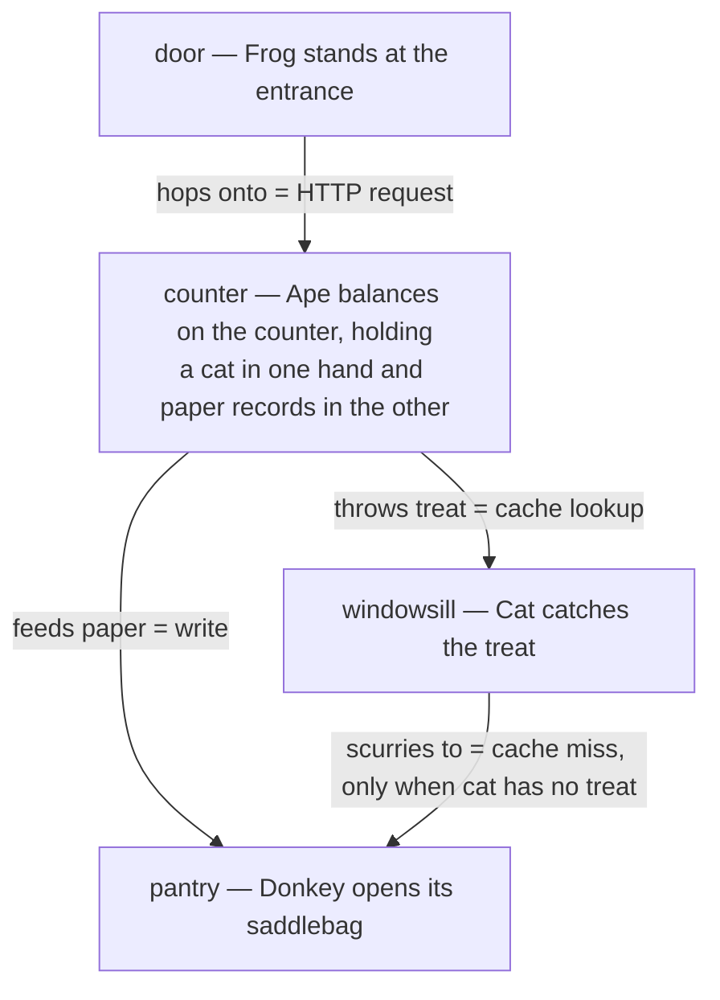

# CAST System Overview

**Summary**: CAST encodes a **graph** as palace + animal-nodes + verb-edges. Edges live *on* their source node, so retrieval moves through the graph the same way the mind walks through a palace.

**Sources**: CAST and Georgian Node System.md (1570 lines); CAST Maturity Levels.md

**Last updated**: 2026-08-31 — [Edge quantity](./encoding-quantities-in-cast.md) linked as a Tier-2 additive modifier (magnitude), sibling to [edge-sign](./edge-sign.md); 2026-08-20 (§Checksum authored — 3 falsifiable retrieval questions replace the TODO stub); 2026-08-20 (§Mnemonic authored — TODO stub replaced with a real device); 2026-08-20 (`glyph:` assigned — [representation-rules](./representation-rules.md) Rule 11); 2026-07-09 ([edge-sign](./edge-sign.md) added to integrations — candidate polarity variant); 2026-05-07 (retrofit pass: applied [representation-rules](./representation-rules.md) 1+2+3+5+7+8)

---

## Glyph

```p5 height=200
p.setup = () => { p.createCanvas(Math.min(el.clientWidth||600, 600), 200); p.noLoop(); };
p.draw = () => {
  const dark = p.isDark;
  p.background(dark ? 30 : 245);
  const ink = dark ? '#ECE4D3' : '#2B2620';
  const cx = p.width / 2, topY = 55, botY = 130, r = 11;
  const xs = [cx - 70, cx, cx + 70];
  p.stroke(ink); p.strokeWeight(2);
  for (const x of xs) p.line(cx, topY, x, botY);
  p.noStroke(); p.fill(ink);
  p.circle(cx, topY, r * 2);
  for (const x of xs) p.circle(x, botY, r * 2);
  p.textAlign(p.CENTER, p.TOP); p.textStyle(p.ITALIC); p.textSize(13);
  p.text('(graph)', cx, botY + 26);
};
```

Nodes (animals) connected by edges (verbs or scenes). The shape *is* the encoded structure.

## One-line

> Encode a graph as palace + animal-nodes + verb-edges; edges live at the source node, not in the air between nodes.

---

## Concrete example: encoding a 4-service web architecture

A real worked graph before any abstraction.

**The graph (text form — hard to recall)**:

- Frontend → API
- API → Cache
- API → DB
- Cache → DB (on miss)

**The graph as CAST (placed in a kitchen palace)**:



Each animal has a **fixed loci** (door / counter / windowsill / pantry) and a **fixed verb** for each outgoing edge. To recall the graph, walk the kitchen: Frog hops onto Ape; Ape simultaneously throws a treat to Cat and shoves paper into Donkey; Cat scurries to Donkey on miss.

**Why this beats the text list**:
- The list is 4 lines you have to remember in order
- The palace is a single embodied scene you walk through; edges fire by spatial adjacency
- Adding a 5th edge means adding *one* gesture to *one* animal — no list reordering
- The Cat→Donkey "miss" case is naturally placed (Cat looks up, scurries to Donkey on the same shelf), encoding the conditional

---

## Where CAST sits (2D placement among frameworks)

```p5 height=340
p.setup = () => { p.createCanvas(Math.min(el.clientWidth||600, 600), 340); p.noLoop(); };
p.draw = () => {
  const dark = p.isDark;
  p.background(dark ? 30 : 245);
  const ink = dark ? '#ECE4D3' : '#2B2620';
  const accent = '#5c7a54';
  const grid = dark ? '#6b7280' : '#9aa0a6';
  const w = p.width, h = p.height;
  const cx = w / 2, cy = h / 2;
  p.stroke(grid); p.strokeWeight(1.5);
  p.line(cx, 40, cx, h - 40);
  p.line(40, cy, w - 40, cy);
  p.noStroke(); p.fill(grid);
  p.triangle(cx - 5, 46, cx + 5, 46, cx, 36);
  p.triangle(cx - 5, h - 46, cx + 5, h - 46, cx, h - 34);
  p.triangle(46, cy - 5, 46, cy + 5, 36, cy);
  p.triangle(w - 46, cy - 5, w - 46, cy + 5, w - 34, cy);
  p.fill(ink); p.textStyle(p.ITALIC); p.textSize(12);
  p.textAlign(p.CENTER, p.CENTER);
  p.text('dynamic / changes over time', cx, 20);
  p.text('static / time-invariant', cx, h - 16);
  p.textAlign(p.LEFT, p.CENTER); p.text('single thing', 44, cy - 14);
  p.textAlign(p.RIGHT, p.CENTER); p.text('many things / network', w - 44, cy - 14);
  p.textStyle(p.BOLD); p.textSize(13); p.textAlign(p.CENTER, p.CENTER);
  p.fill(ink);
  p.text('SPEAR', cx * 0.5, cy * 0.55);
  p.text('HEART, ORACLE, GRACE', cx * 1.5, cy * 0.55);
  p.text('NEDF', cx * 0.5, cy * 1.45);
  p.fill(accent);
  p.text('CAST', cx * 1.5, cy * 1.4);
  p.textStyle(p.NORMAL); p.textSize(11);
  p.text('◀ this page', cx * 1.5, cy * 1.4 + 18);
};
```

**CAST's quadrant**: static + many-things. The graph itself doesn't change while you study it, but it has many connected parts. As soon as the graph starts *changing over time* (cascading failures, evolving systems), route to temporal CAST or [ORACLE](./oracle-overview.md).

---

## Two-layer architecture

### Layer 1 — Nodes (animals)

Each node is a [Georgian animal](./georgian-animals.md) with four facets:

| Facet | Encodes | Example |
|---|---|---|
| Identity | which animal | Frog, Ape, Cat, Donkey |
| Cluster | which palace/room (environment) | Kitchen vs. server-room palace |
| State | adjective (current condition) | glowing, chained, giant, tiny |
| Disambiguation | optional modifier | crowned Ape vs. plain Ape |

### Layer 2 — Edges (verbs at the source)

Each outgoing edge is a verb-scene **anchored to the source node**, not floating between nodes.

- **Tier 1** (verb-only scene): default; one distinctive verb per edge — *hops-onto*, *feeds-paper*, *throws-treat*
- **Tier 2** (full CAST): used when verbs collide; expands to **C**haracter-**A**ction-**S**tream-**T**ime to disambiguate

**Key rule**: edges live ON the source node. When you visit the source animal, its outgoing edges play as gestures. Targets are pointed-to, not co-located.

---

## Learning progression (10 maturity levels)

| Level | Focus | Example |
|---|---|---|
| 1 | Recognizing connection as the hard part | "Why is this system hard?" |
| 2 | Simple memory palaces | To-do list in a palace |
| 3 | Tier 1 verb encoding | API Gateway → Auth |
| 4 | Flat networks (5-12 nodes) | 10-node web service |
| 5 | Tier 2 for collisions | Same source, multiple distinct edges |
| 6 | Loops + Lego-skill patterns | Hub-spoke, cascade, bottleneck |
| 7 | Nested palaces for trees | Org charts, prereq trees |
| 8 | DAGs with cross-edges | Math program, diamond patterns |
| 9 | Temporal graphs | 2008 financial crisis |
| 10 | Mastery & teaching | Encoding 100-node systems |

See [Maturity Levels](./maturity-levels-overview.md).

---

## Boundary set

### What CAST is NOT

- Not a flashcard system — it's a palace + scene system; SR delivers but doesn't define it
- Not for single concepts — that's [NEDF](./nedf-overview.md)
- Not for procedures — that's [SPEAR](./spear-overview.md)
- Not generic mind-mapping — CAST has formal node identity (animal) and formal edge encoding rules

### What breaks CAST

- **Skipping Step 0 analysis** — encoding before understanding the graph produces a palace that doesn't match the structure
- **Edges placed between rooms** instead of at the source — destroys directional retrieval
- **Same animal for multiple distinct nodes** — collisions; Tier 2 disambiguation can't help if identity is reused
- **Tier 1 verbs that aren't distinct enough** — *uses* and *calls* and *invokes* will collide; promote to Tier 2
- **Generic palace** (a vague "kitchen") — placeholder loci don't anchor; needs *your* kitchen with sensory specificity
- **Encoding the graph but not the holes** — what the graph *cannot* do is part of its meaning; mark explicitly

### Adjacent but excluded (deliberate non-features)

- Tag-based notes (Obsidian-style) — tags ≠ directed typed edges
- Pure NEDF cards — too local; lose the network structure once node count > 5
- Formal ER / UML diagrams — accurate but disembodied; CAST insists on palace + scene
- Mind maps — radial only; CAST handles arbitrary graphs including loops

---

## One mental motion

> **Walk into the palace, point at the source animal, watch it perform the edge-verb on the target.** The hand-reach from source to target *is* the edge.

If you can't physically point in a direction while saying the verb, the edge isn't encoded.

---

## When to use CAST

Use CAST when the important question is not *"what is this thing?"* but:

- What calls it?
- What does it affect?
- What flows through it?
- What depends on it?
- What breaks if it changes?

If the difficulty is in the thing itself, use [NEDF](./nedf-overview.md). If it's in execution, use [SPEAR](./spear-overview.md). If it's in time-evolving behavior, escalate to temporal CAST or [ORACLE](./oracle-overview.md).

---

## UMTF tag stack

CAST as a [UMTF](./universal-mental-tagging-framework.md) stack:

| Tag | Role in CAST |
|---|---|
| **Spatial** | palace placement, nested rooms, sibling order, hubs central, bridges in doorways |
| **Relation** | core layer; edges are verbs or full CAST scenes |
| **State** | node adjectives — glowing, chained, giant |
| **Pattern** | Lego Skills — hub-spoke, cascade, bottleneck, bridge, diamond, loop |
| **Priority** | hubs and bridges get stronger encoding and more review |
| **Temporal** | biography, timelines, delays, route order when graph unfolds |
| **Sensory** | reinforcement and collision-breaking, not the primary organizer |

Practical: CAST is primarily **Relation + Spatial + State + Priority**, with **Pattern** and **Temporal** rising as graph complexity rises.

---

## Multi-resolution zoom

| Size | CAST representation |
|---|---|
| **Glyph** | Small graph sketch (3-4 connected nodes) |
| **Line** | "Encode a graph as palace + animal-nodes + verb-edges; edges live at the source." |
| **Paragraph** | CAST is for static relational graphs (5-100 nodes). Nodes are Georgian animals placed in palace loci; outgoing edges are verb-scenes anchored to the source animal. Tier 1 uses a distinctive verb per edge; Tier 2 (Character-Action-Stream-Time) handles edge collisions. |
| **Page** | This page |

Encoding a graph respects [structure-first](./structure-first.md): encode the top-level structure first, then zoom into sub-nodes (encode step 20; reading the structure before rushing to scenes is CAST Maturity Level 4). This table is CAST's own [zoom-in-zoom-out](./zoom-in-zoom-out.md) — the same relation held at four resolutions, so an empty slot at any level is visible before a label is read.

---

## Worked examples by complexity

| Example | Type | Nodes | Level | Key lesson |
|---|---|---|---|---|
| Web Service | Flat network | 5 | 3-4 | Tier 1, hub identification |
| [City Streets](./cast-example-city-streets.md) | Spatial graph | 5 | 4 | Real palace, one-way edges, merge scenes |
| [University Math Program](./cast-example-math-program.md) | DAG + hierarchy | 13 | 8-9 | Nested palaces, cross-edges, diamond patterns |
| 2008 Financial Crisis | Temporal + complex | 12 | 9-10 | Feedback loops, biography, temporal evolution |

---

## Integration with broader system

CAST integrates with:

- [UMTF](./universal-mental-tagging-framework.md) — cross-framework view
- PAO — natural language of CAST edges
- [Image Merging](./image-merging.md) — compressing node-edge-node into one inseparable scene
- [Edge Sign](./edge-sign.md) — 🟡 candidate per-edge polarity modifier (+/− on the Stream's arrival); additive OCP variant, canonical Tier 2 slots unchanged
- REMAPS — quality control for weak scenes
- Mnemonic Checksum — integrity verification at 4 levels
- Spaced Repetition — review schedules by structural importance
- [Lego Skills](./lego-skills-patterns.md) — pre-encoded pattern recognition (8 core patterns)
- [Chunking](./chunking.md) — cluster detection as compression
- SCAMPER — simplifying graphs before encoding

---

## Quick start

1. Read [Why graphs are hard to memorize](./nodes-and-edges.md)
2. Learn [the Georgian animal table](./georgian-animals.md)
3. Encode the worked example above in a palace you know
4. Identify your level via [maturity levels](./maturity-levels-overview.md)
5. Run [the CAST drill ladder](./cast-drill-ladder.md) for stage-based practice

---

## Constraint and extension notes

- **Graph won't come into focus.** Diagnostic: you have a list of nodes and edges but can't pick a palace, can't see the shape, and the verbs feel interchangeable rather than distinctive. That means you don't yet have a *source graph* to borrow from — the target graph is sitting as text and can't recruit spatial intuition. Run [BRIDGE LOAD](./bridge-load.md) before encoding, biased to BRIDGE's `map`, `flow`, `ecosystem`, or `market` analogy classes (graphs almost always borrow from one of these four families). Slot routing: Source-domain shape (city, factory floor, supply chain, ecosystem) → palace choice + room layout — the analogy *picks the palace* rather than letting the palace be arbitrary; Mapping (target nodes ↔ source parts) → animal/locus assignments per node; Mapping (target edges ↔ source relations) → Tier 1 verb choice per edge (and if two source-relations collide on the same verb, that's the trigger for Tier 2 CAST); Boundary / breakpoints → the *holes* in the graph — what the structure cannot do — already an encoded part of CAST per the "encoding the graph but not the holes" failure mode above. The two-finger / hand-reach mental motion is *the analogy enacted*, not separate. See [composability-index](./composability-index.md) *comprehension-protocol × encoder* row for the cross-encoder mapping.

---


## Mnemonic

**"Every animal carries its own leash."** The load-bearing oddity of CAST is that an edge lives **on its source node**, not floating between two nodes — so when you walk to an animal, its outgoing verbs are already in your hand. Walk-and-read, never search-and-join.

## Checksum 

1. What are the three things CAST encodes a graph as?
2. Where does an edge live in CAST — and what does that buy you at retrieval time?
3. CAST is not for single concepts and not for procedures. Which framework owns each of those?

## Related pages

- [Edge dynamics](./dynamic-edge-encoding.md) — additive Tier-2 modifier (🟡 candidate) for magnitude *changing over time*; its default is to derive rather than encode, since §System Behavior Patterns makes most variation follow from loop structure
- [Edge delay](./delay-encoding-in-cast.md) — additive Tier-2 modifier (🟡 candidate) for **latency**: a gap inside the edge scene, never a palace distance — this page's §Palace placement rules already allocate that axis six ways
- [Edge quantity](./encoding-quantities-in-cast.md) — additive Tier-2 modifier (🟡 candidate) for **magnitude**: how much moves through an edge, and whether it is a rate or a one-shot total. Rides on the Stream; unlocks the flow-balance checksum
- georgian-driving-exam-b-priority-lattice — first CAST graph of a statutory priority system (Georgian Priority Lattice)
- [representation-rules](./representation-rules.md) — the rules this page was retrofitted against
- [NEDF](./nedf-overview.md) — concept-focused sibling (single node)
- [SPEAR](./spear-overview.md) — procedure-focused sibling (single trajectory)
- [HEART](./heart-overview.md) — people-focused sibling (single dynamic agent)
- [UMTF](./universal-mental-tagging-framework.md) — synthesis layer
- [cast-drill-ladder](./cast-drill-ladder.md) — drill progression
- [cast-anki-requirements](./cast-anki-requirements.md) — why CAST gets no deck of its own; encode in CAST, deliver in topic decks
- [mental-markers-category-importance-order](./mental-markers-category-importance-order.md) — node tagging when nodes blur
- [orient-method](./orient-method.md) — capture protocol that feeds CAST graphs from live environments
- [memory-systems](./memory-systems.md) — broader memory architecture
- graphs-and-systems — graph theory fundamentals
- unfamiliar-codebase-protocol — Phase A applies CAST to a codebase's architecture directly: modules become nodes, dependency threads become verb-edges, and "what breaks if it changes" is CAST's own trigger question

---

## U — See (CAST)
1. Graph encoder: palace + animal-nodes + verb-edges
2. Edges live ON their source node (not floating)

## D — Name (NEDF)
1. CAST = graph encoder
2. Encodes graph as a palace walk
3. Retrieval moves through the graph the way you walk a palace

## F — Do (SPEAR)
1. New graph → place in a palace
2. Each concept → animal-node
3. Each relation → verb-edge from its source node

## B — Watch (HEART)
1. Floating edges (no source-node anchor)
2. Animals picked without contrast
3. Verb-edges that don't run as actions

## L — Predict (ORACLE)
1. Graph-shaped material → CAST > NEDF
2. Linear material → CAST is overkill

## R — Act (GRACE)
1. Graph spotted → reach for CAST
2. Recall failure → check verb-edge clarity