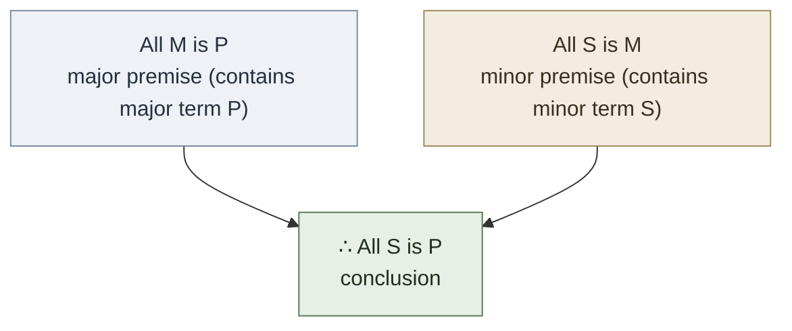

# Categorical Syllogism

**Summary**: A deductive argument with **three categorical propositions** (two premises, one conclusion) containing **three terms** (major, minor, middle), each appearing exactly twice. The Aristotelian engine of classical logic; the canonical example of validity-by-form. Specified by **mood** (the three letters from {A, E, I, O}, giving 64 mood-combinations) × **figure** (1-4, position of the middle term in the premises) = **256 candidate forms**, of which **15 are unconditionally valid** (24 if existential import is granted for universal premises). Evaluated by [Copi](./copi-introduction-to-logic.md) Ch 6 procedures: Venn diagram, six rules of syllogism, distribution analysis. Molecule-tier in [logic-atomic-design](./logic-atomic-design.md).

**Sources**:
- [Copi/Cohen/McMahon](./copi-introduction-to-logic.md) *Introduction to Logic* 14th ed, Ch 5 *Categorical Propositions* + Ch 6 *Categorical Syllogisms* + Ch 7 *Syllogisms in Ordinary Language*.
- Aristotle, *Prior Analytics* (c. 350 BCE) — the original treatise; the systematic founding of deductive logic. Aristotle worked Figure 1 + the convertible reductions to it; medieval logicians completed the four-figure analysis.
- Medieval mnemonic verses (Barbara · Celarent · Darii · Ferio · etc.) from Petrus Hispanus' *Summulae Logicales* (13th c.) and later — encoded mood + figure in vowel patterns of Latin names.

**Last updated**: 2026-05-25

---

## One-line

> Three propositions, three terms, each term appears twice. Aristotle 350 BCE; medieval logicians named the 24 valid forms; [Copi](./copi-introduction-to-logic.md) taught modern students to evaluate them with Venn diagrams.

## Unlocks (lead, not footer)

1. **The cleanest possible Molecule-tier example.** Every syllogism has *exactly* three propositions, *exactly* three terms, *exactly* one mood, *exactly* one figure. Atoms (A/E/I/O proposition + the three terms) compose into one named molecule (e.g. Barbara, EAE-2 Cesare). The structure is mechanical, evaluable in <60 s, and produces a definite valid/invalid verdict. **The wiki's atom-to-molecule transition is most visible here.**

2. **Venn diagrams as picture-theoretic validity test.** A three-circle Venn diagram is a *picture* (per [TLP picture theory](./picture-theory-of-language.md)) of the class relations. Shading and ×'s are structurally what the premises *assert*; the conclusion's claim is then either *visible* in the diagram (valid) or *not visible* (invalid). Validity becomes a *visual* property, not a verbal one. This is [show-vs-say](./show-vs-say.md) operationalized in the validity-test layer.

3. **24 valid forms — but only 15 *unconditionally* valid.** The 9 extra forms require *existential import* (assuming the subject-class is non-empty). Modern logic typically does NOT grant existential import for universal propositions (*"All unicorns are horses"* doesn't imply *"some unicorns exist"*). The 15-vs-24 distinction is the load-bearing modern-vs-traditional difference.

4. **The medieval mnemonic system is encoding artistry.** The Latin names — Barbara · Celarent · Darii · Ferio · Cesare · Camestres · Festino · Baroco · Datisi · Disamis · Bocardo · Ferison · Camenes · Dimaris · Fresison and the rest — encode mood (in vowels) and reduction-to-Figure-1 (in consonants). A single 3-syllable Latin word *shows* its entire syllogistic identity. This is **8th-century mnemonic engineering**, predating modern memory-palace research by twelve centuries.

## Mnemonic

**3-3-2-4** = *3 propositions · 3 terms · 2 letters per proposition · 4 figures.*

For the 15 unconditionally valid forms, by figure:

| Figure | Valid forms (Latin names) | Moods |
|---|---|---|
| 1 | Barbara · Celarent · Darii · Ferio | AAA · EAE · AII · EIO |
| 2 | Cesare · Camestres · Festino · Baroco | EAE · AEE · EIO · AOO |
| 3 | Datisi · Disamis · Ferison · Bocardo | AII · IAI · EIO · OAO |
| 4 | Camenes · Dimaris · Fresison | AEE · IAI · EIO |

The vowels in each name spell the mood. The first letter (B, C, D, F) anchors which Figure 1 form it reduces to via medieval transformations (conversion, obversion, contraposition).

## Memory checksum

If you can answer these in <60 s each from memory, the page is encoded:

1. **State the standard form structure.** (Three categorical propositions: 2 premises + 1 conclusion. Three terms: major, minor, middle. Each term appears exactly twice. Mood = 3 letters from {A, E, I, O}; figure = 1, 2, 3, or 4 based on middle-term position.)
2. **Name the 4 categorical proposition types.** (A: *All S is P* — universal affirmative; E: *No S is P* — universal negative; I: *Some S is P* — particular affirmative; O: *Some S is not P* — particular negative. Letters from Latin *AffIrmo* / *nEgO*.)
3. **Define major, minor, middle term.** (Major = predicate of the conclusion. Minor = subject of the conclusion. Middle = term in both premises but NOT in the conclusion.)
4. **State Barbara (AAA-1).** (*All M is P · All S is M · ∴ All S is P*. The canonical valid syllogism. Aristotle's Figure 1 dux.)
5. **What is the modern-vs-traditional distinction in valid form count?** (24 valid forms if you grant existential import for universal premises; only 15 unconditionally valid without it. Modern logic typically rejects existential import for universals, so the operational count is **15**.)

## Visual — the four figures

The four figures (each row is the term arrangement of a premise; the conclusion is always S — P):

| Figure | Major premise | Minor premise | Conclusion | Middle term position |
|---|---|---|---|---|
| 1 | M — P | S — M | S — P | subject of major premise + predicate of minor |
| 2 | P — M | S — M | S — P | predicate of both premises |
| 3 | M — P | M — S | S — P | subject of both premises |
| 4 | P — M | M — S | S — P | predicate of major + subject of minor |

**Venn-diagram evaluation (Barbara, AAA-1):**

- Premise 1: *All M is P* → shade out M ∩ ¬P
- Premise 2: *All S is M* → shade out S ∩ ¬M
- Conclusion: *All S is P?* → check whether S ∩ ¬P is shaded out

```p5 height=380
p.setup = () => {
  p.createCanvas(Math.min(el.clientWidth || 560, 560), 380);
  p.noLoop();
};
p.draw = () => {
  const dark = p.isDark;
  const ink = dark ? '#ECE4D3' : '#2B2620';
  p.background(dark ? 30 : 245);

  const R = 92;
  const cx = p.width / 2;
  const topY = 130, botY = 210, dx = 62;
  const M = { x: cx, y: topY };
  const S = { x: cx - dx, y: botY };
  const P = { x: cx + dx, y: botY };
  const inC = (px, py, c) => (px - c.x) * (px - c.x) + (py - c.y) * (py - c.y) < R * R;

  // Premise 1 (All M is P) shades M∩¬P; Premise 2 (All S is M) shades S∩¬M
  p.noStroke();
  p.fill(dark ? 'rgba(160,138,92,0.55)' : 'rgba(160,138,92,0.5)');
  for (let y = topY - R; y <= botY + R; y += 3) {
    for (let x = cx - dx - R; x <= cx + dx + R; x += 3) {
      const iM = inC(x, y, M), iS = inC(x, y, S), iP = inC(x, y, P);
      if ((iM && !iP) || (iS && !iM)) p.rect(x, y, 3, 3);
    }
  }

  p.noFill();
  p.stroke(ink);
  p.strokeWeight(1.6);
  p.circle(M.x, M.y, R * 2);
  p.circle(S.x, S.y, R * 2);
  p.circle(P.x, P.y, R * 2);

  p.noStroke();
  p.fill(ink);
  p.textFont('sans-serif');
  p.textSize(18);
  p.textAlign(p.CENTER, p.CENTER);
  p.text('M', M.x, M.y - R - 14);
  p.text('S', S.x - R + 14, S.y + R - 6);
  p.text('P', P.x + R - 14, P.y + R - 6);

  p.fill(dark ? '#b9b0a0' : '#6b6353');
  p.textSize(12);
  p.textAlign(p.CENTER, p.BASELINE);
  p.text('Barbara (AAA-1): shade M∩¬P and S∩¬M → S∩¬P ends up shaded → valid', p.width / 2, p.height - 16);
};
```

The Venn diagram *shows* the validity. If after shading the premises' regions, the conclusion's claim is visible without further shading, the syllogism is valid.

---

## The A/E/I/O scheme (Copi Ch 5)

Every categorical proposition has *quality* (affirmative/negative) × *quantity* (universal/particular):

| Letter | Form | Quantity | Quality | Distributes | Example |
|---|---|---|---|---|---|
| **A** | All S is P | Universal | Affirmative | Subject only | All humans are mortal |
| **E** | No S is P | Universal | Negative | Both subject and predicate | No politicians are saints |
| **I** | Some S is P | Particular | Affirmative | Neither | Some birds are flightless |
| **O** | Some S is not P | Particular | Negative | Predicate only | Some students are not lazy |

The letters come from Latin: **A**ff**I**rmo (the affirmative letters) / n**E**g**O** (the negative letters). The first vowel is universal; the second is particular.

**Distribution** is the load-bearing concept: a term is *distributed* in a proposition if the proposition refers to *all* members of the term's class. Distribution rules:

- A distributes only its **subject**.
- E distributes **both**.
- I distributes **neither**.
- O distributes only its **predicate**.

Distribution drives the syllogism evaluation rules.

## The three terms

In any categorical syllogism:

- **Major term** = the **predicate** of the conclusion. Appears in the **major premise**.
- **Minor term** = the **subject** of the conclusion. Appears in the **minor premise**.
- **Middle term** = the term that appears in *both premises* but **not** in the conclusion.

Convention: the major premise is written first.

Example (Barbara, AAA-1):



Here:
- Major term: P
- Minor term: S
- Middle term: M
- Mood: AAA (each proposition is type A)
- Figure: 1 (middle term is subject of major, predicate of minor)

## Mood and figure

**Mood** = the three-letter string of the proposition types in order: major / minor / conclusion. With 4 choices each, there are 4³ = 64 possible moods.

**Figure** = the position of the middle term:

| Figure | Major premise | Minor premise |
|---|---|---|
| 1 | M is P | S is M |
| 2 | P is M | S is M |
| 3 | M is P | M is S |
| 4 | P is M | M is S |

Total candidate forms: 64 × 4 = **256**.

Of these 256:
- **15** are unconditionally valid (the "modern" set).
- **9 more** are valid if existential import is granted for universal premises (the "traditional" extras).
- **24** total are traditionally valid.
- **232** are invalid.

The medieval logicians named the 24 valid forms with Latin mnemonic words encoding mood-in-vowels.

## The 15 unconditionally valid forms

| Figure | Latin name | Mood | Form |
|---|---|---|---|
| **1** | **Barbara** | AAA | All M is P · All S is M · ∴ All S is P |
| **1** | **Celarent** | EAE | No M is P · All S is M · ∴ No S is P |
| **1** | **Darii** | AII | All M is P · Some S is M · ∴ Some S is P |
| **1** | **Ferio** | EIO | No M is P · Some S is M · ∴ Some S is not P |
| **2** | **Cesare** | EAE | No P is M · All S is M · ∴ No S is P |
| **2** | **Camestres** | AEE | All P is M · No S is M · ∴ No S is P |
| **2** | **Festino** | EIO | No P is M · Some S is M · ∴ Some S is not P |
| **2** | **Baroco** | AOO | All P is M · Some S is not M · ∴ Some S is not P |
| **3** | **Datisi** | AII | All M is P · Some M is S · ∴ Some S is P |
| **3** | **Disamis** | IAI | Some M is P · All M is S · ∴ Some S is P |
| **3** | **Ferison** | EIO | No M is P · Some M is S · ∴ Some S is not P |
| **3** | **Bocardo** | OAO | Some M is not P · All M is S · ∴ Some S is not P |
| **4** | **Camenes** | AEE | All P is M · No M is S · ∴ No S is P |
| **4** | **Dimaris** | IAI | Some P is M · All M is S · ∴ Some S is P |
| **4** | **Fresison** | EIO | No P is M · Some M is S · ∴ Some S is not P |

Each Latin name is a memory device — its vowels are the mood, and its first letter signals the reduction-to-Figure-1 transformation (B reduces to Barbara, C to Celarent, D to Darii, F to Ferio).

The 9 additional "conditionally valid" forms (Barbari, Celaront, Cesaro, Camestrop, Camenop, Felapton, Darapti, Fesapo, Bramantip) all require existential import.

## The six rules of syllogism (Copi Ch 6)

A syllogism is valid iff it violates *none* of these rules:

1. **A syllogism must have exactly three terms.** Violations include equivocation (the middle term means two different things) — a [fallacy of ambiguity](./fallacy-taxonomy.md).

2. **The middle term must be distributed in at least one premise.** Violation = *fallacy of undistributed middle*.

3. **Any term distributed in the conclusion must be distributed in its premise.** Violation = *fallacy of illicit major* / *illicit minor*.

4. **No syllogism can have two negative premises.** Violation = *fallacy of exclusive premises*.

5. **If either premise is negative, the conclusion must be negative.** Violation = *fallacy of drawing affirmative conclusion from negative premise*.

6. **If both premises are universal, the conclusion cannot be particular** (under modern logic with no existential import). Violation = *existential fallacy*.

A valid syllogism passes all six. An invalid syllogism violates at least one. The six rules + Venn-diagram method are equivalent validity tests; use whichever is faster for the given form.

## Venn-diagram evaluation (the picture-theoretic method)

1. **Draw three overlapping circles** labeled S, P, M.
2. **Shade out regions made empty by universal premises** (A: shade S ∩ ¬P for "All S is P"; E: shade S ∩ P for "No S is P").
3. **Place ×'s in regions made non-empty by particular premises** (I: × in S ∩ P; O: × in S ∩ ¬P). If the × must go in one of two sub-regions, put it on the boundary between them.
4. **Check the conclusion's claim**: does the conclusion already follow from the diagram, without any further shading or ×?
   - **Yes** → syllogism is valid.
   - **No** → invalid.

The Venn diagram is a *picture* of the class relations in the [TLP picture-theory](./picture-theory-of-language.md) sense; the validity *shows itself* in the diagram.

## Reducing English to standard form (Copi Ch 7)

Real-world arguments rarely arrive in standard form. The translation steps:

1. **Identify the conclusion** (using [premise/conclusion indicators](./argument-anatomy.md)).
2. **Identify the premises**.
3. **Make each proposition categorical** — rewrite as "All/No/Some S is/is-not P".
4. **Eliminate synonyms** — ensure each term appears in exactly two propositions and is denoted the same way each time.
5. **Translate compound subjects/predicates into single-term categoricals**.
6. **Now you have a standard-form syllogism** and can apply mood + figure + validity test.

Steps 3–5 are non-trivial. *"Whales swim"* becomes *"All whales are swimming-things"*; *"Most cats hunt"* becomes *"Some cats are hunters"* (since "most" is particular for syllogistic purposes); *"None but doctors prescribe"* becomes *"All prescribers are doctors"*.

## Existential import — the modern-vs-traditional split

**Traditional Aristotelian logic** treats universal propositions as *implying their subject is non-empty*: *"All unicorns are horses"* implies *"some unicorns exist"*.

**Modern (Boolean) logic** treats universal propositions as *vacuously true* if the subject is empty: *"All unicorns are horses"* is true if there are no unicorns (vacuously); no existential claim implied.

Consequences:
- 9 traditional-only valid forms (Barbari · Celaront · Cesaro · Camestrop · Camenop · Felapton · Darapti · Fesapo · Bramantip) require existential import to be valid.
- In modern logic these 9 are **invalid**; the unconditionally valid count drops to 15.
- The wiki defaults to **modern logic** (15 forms); flag the 9 conditional forms when they appear.

## The wiki's molecule-tier integration

[logic-atomic-design](./logic-atomic-design.md) §Molecules registers Categorical Syllogism as a Molecule-tier shape. Each named form (Barbara, Celarent, etc.) is a *specific molecule* — a particular bonding of A/E/I/O proposition atoms via the middle-term structural-slot atom.

Drilled in the [Fallacy-Recognition Gym](./fallacy-taxonomy.md)'s sibling-gym: **Syllogism Mood-Figure Recognition Gym** (pending construction in Wave 3).

## METER integration

| Drill | Pass floor | Source | Owner |
|---|---|---|---|
| Mood-figure ID from a given syllogism | <60 s, ≥80% accuracy | [Copi](./copi-introduction-to-logic.md) Ch 6 exercises | this page |
| Recall the 15 unconditionally valid forms by figure | <60 s | this page §Visual + §15 forms | this page |
| Validity-test by Venn diagram | <90 s per syllogism | this page §Venn-diagram method | this page |
| Validity-test by six rules | <60 s per syllogism | this page §Six rules | this page |
| Translation: English → standard form | <120 s | Copi Ch 7 exercises | this page |
| Identify fallacy of undistributed middle / illicit major-or-minor | <30 s | this page §Six rules | [fallacy-taxonomy](./fallacy-taxonomy.md) |

## Related pages

- [copi-introduction-to-logic](./copi-introduction-to-logic.md) — source textbook (Ch 5-7)
- [argument-anatomy](./argument-anatomy.md) — prerequisite (premise/conclusion extraction)
- [validity-vs-soundness](./validity-vs-soundness.md) — what the test produces; valid + true premises = sound
- [fallacy-taxonomy](./fallacy-taxonomy.md) — the six syllogism rules name 6 specific fallacies
- [methods-of-deduction](./methods-of-deduction.md) — sister page for symbolic-logic deduction (Copi Ch 9)
- [picture-theory-of-language](./picture-theory-of-language.md) — Venn diagrams are pictures of class relations
- [show-vs-say](./show-vs-say.md) — Venn-diagram validity is shown, not said
- [logic-atomic-design](./logic-atomic-design.md) — Molecule tier; A/E/I/O atoms + middle-term atom bond into named syllogism molecules
- [logicomix-graphic-novel](./logicomix-graphic-novel.md) — Aristotle as the founder; mentioned in the historical arc
- [glossary](./glossary.md) — Logic layer registration
