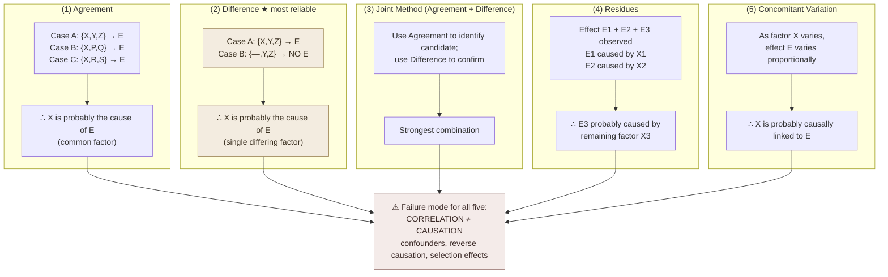

# Causal Reasoning (Mill's Methods)

**Summary**: John Stuart Mill's **five methods** for inferring causal relationships from observation, as presented in [Copi](./copi-introduction-to-logic.md) Ch 12. **Method of Agreement · Method of Difference · Joint Method · Method of Residues · Method of Concomitant Variation.** The 1843 classical articulation (Mill's *System of Logic*) of how the human mind moves from *correlation* to *causation*; still the operational substrate of every diagnostic / debugging / experimental-inference procedure, from medical differential diagnosis to bisecting a regression in software. **Cross-link**: [PS-OS](./problem-solving-os.md) Diagnose layer uses Mill's methods.

**Sources**:
- [Copi/Cohen/McMahon](./copi-introduction-to-logic.md) *Introduction to Logic* 14th ed, Ch 12 *Causal Reasoning*.
- John Stuart Mill, *A System of Logic, Ratiocinative and Inductive* (1843), Book III, Chs 8-9 — the original presentation.
- [problem-solving-os](./problem-solving-os.md) §Diagnose — wiki application layer.

**Last updated**: 2026-05-25

---

## One-line

> Five methods to move from observation to cause: **Agreement · Difference · Joint · Residues · Concomitant Variation**. Mill 1843; the substrate of every diagnostic procedure ever since.

## Unlocks (lead, not footer)

1. **Five methods = five diagnostic atoms.** Every diagnosis you ever do — medical, debugging, business-problem-solving, scientific experiment, Bible-study-hermeneutic — uses *one or more* of Mill's methods. **The wiki's [PS-OS](./problem-solving-os.md) §Diagnose layer is operationally Mill's methods rebranded**. Knowing the five lets you name what you're doing and explicitly check the others.

2. **Difference > Agreement.** Among Mill's five, the **Method of Difference** is the most reliable (and underlies controlled experiments). Agreement is weaker (correlation doesn't imply causation; the "agreed-on factor" might just be a common third cause). The wiki's reflex: when diagnosing, **try to construct a difference comparison** — *what was different between the case that failed and the case that worked?* — rather than only agreement (*what's common across all failing cases?*).

3. **Concomitant Variation as the dose-response substrate.** When the cause cannot be removed (only varied in degree), use Concomitant Variation: *as X increases, does Y increase proportionally?* This is the substrate of **dose-response curves in pharmacology**, **scaling tests in software**, **A/B testing with quantity variation**, **interest-rate macroeconomics**, etc. Every measurement-driven discipline uses it.

4. **Mill's methods have known failure modes.** Correlation isn't causation (the [*post hoc* fallacy](./fallacy-taxonomy.md) is exactly the failure mode of misusing Mill's methods); common causes can look like direct ones; reverse causation; selection effects. **Knowing the five methods is necessary but not sufficient** — the [Family 2 Presumption fallacies](./fallacy-taxonomy.md) (especially false cause) are the dark twins.

## Mnemonic

**A-D-J-R-C** = *Agreement · Difference · Joint · Residues · Concomitant variation.*

Read as *"Aged Joint Residues Concord"* or directly *"A-D-J-R-C"*. Five letters; five methods.

## Memory checksum

1. **State the five methods.** (1: Agreement — common factor across all cases of effect. 2: Difference — single factor differing between case and control. 3: Joint — combine Agreement + Difference. 4: Residues — subtract known causes, attribute residual to remaining factor. 5: Concomitant Variation — variation in cause produces variation in effect.)
2. **Which method is most reliable?** (Difference — it's the substrate of controlled experiments. Agreement is weaker.)
3. **Name the formal failure mode of misusing Mill's methods.** ([False cause / *post hoc ergo propter hoc*](./fallacy-taxonomy.md) — confusing temporal succession or correlation with causation. The dark twin.)
4. **Where does Mill's methods live in the wiki?** ([PS-OS](./problem-solving-os.md) §Diagnose layer uses them as the operational substrate. Cross-link to ORACLE for prediction + the scientific method ([science-and-hypothesis](./science-and-hypothesis.md)) for hypothesis-testing.)
5. **State one method as a procedure.** (e.g., Difference: identify a case where the effect occurs and a case where it doesn't; identify the one factor that differs; hypothesize that factor as cause.)

## Visual — the five methods

The five methods are five *partial* causal-inference tools, each with its own scope and failure modes.

---

## The methods in detail

### Method 1 — Agreement

**Procedure**: Identify multiple cases in which the effect occurs. Identify the factors present in each case. **The factor common to all cases is probably the cause** (or a necessary condition).

**Example**: Five people who ate at the same restaurant get food poisoning. Examining what they ate, the common factor is *the shrimp cocktail*. Hypothesis: the shrimp cocktail caused the food poisoning.

**Strengths**: useful when you can't manipulate the variables (epidemiology, history, accident investigation).

**Weaknesses**:
- The common factor may be a coincidence.
- The common factor may be a common cause of both the effect and a third factor.
- Selection bias in case selection can introduce spurious common factors.
- Multiple causes can produce the same effect via different pathways.

### Method 2 — Difference (the gold standard)

**Procedure**: Identify a case where the effect occurs and a case where it does *not* occur, with **only one factor differing**. **The differing factor is probably the cause**.

**Example**: Two identical patients receive identical treatment; one also receives drug X. Only the one who received drug X recovers. Hypothesis: drug X caused recovery.

**Strengths**: This is the substrate of **controlled experiments**. The Method of Difference is what makes RCTs (randomized controlled trials), A/B tests, and well-designed scientific experiments reliable.

**Weaknesses**:
- Real cases rarely have *only one* factor differing — control is hard.
- The effect may have a threshold; the "control" case may be just below the threshold.
- Unobserved confounders may differ between the cases.

### Method 3 — Joint Method (Agreement + Difference)

**Procedure**: Combine Agreement (across cases of the effect) and Difference (between cases of the effect and cases without). Use Agreement to identify candidates; use Difference to confirm.

**Example**: Epidemiological study finds *agreement* — most cancer patients in the affected village drank from the same well (common factor). Then finds *difference* — installing alternative water sources removes the cancer cluster. Hypothesis: the well water caused the cancer.

**Strengths**: stronger than either method alone; the standard reasoning structure of much real-world causal inference.

**Weaknesses**: inherits the weaknesses of both component methods, partially mitigated by their combination.

### Method 4 — Residues

**Procedure**: Observe a complex effect with several components. Subtract the components that are explained by known causes. **Attribute the remaining (residual) effect to the remaining (residual) factor**.

**Example**: Astronomer Le Verrier observed Uranus' orbit deviating from Newtonian predictions. Known causes (the Sun + Jupiter + Saturn) explained most of the orbit but left a residual deviation. Le Verrier (1846) hypothesized a residual cause — an unknown planet. **Neptune** was discovered where he predicted. **Mill's Method of Residues as gold-standard scientific inference.**

**Strengths**: powerful when you have well-established models for most factors and only one factor unknown.

**Weaknesses**: depends on the prior models being correct (Le Verrier's later attempt to apply the same method to Mercury's orbital anomaly led him to hypothesize a planet *Vulcan* between Mercury and the Sun — wrong; Mercury's anomaly turned out to require general relativity, not a new planet).

### Method 5 — Concomitant Variation

**Procedure**: As factor X varies in magnitude, effect E varies in magnitude proportionally (or anti-proportionally; the relationship can be monotonic in either direction). **The proportional variation suggests causal relationship**.

**Example**: Dose-response in pharmacology: as drug dose increases, therapeutic effect increases (and side effects), in measurable proportion. The proportionality establishes causal relevance.

**Strengths**: applicable when the cause cannot be removed (you can't *un-give* an organism caffeine, but you can vary the dose). Substrate of A/B testing with quantity variation, dose-response curves, scaling tests in software.

**Weaknesses**:
- The relationship may not be linear; non-linear concomitant variations are harder to detect.
- Threshold effects (no response below a certain dose) confound the analysis.
- Reverse causation: maybe E causes X rather than X causes E.

## Cross-link to [problem-solving-os](./problem-solving-os.md) Diagnose layer

The wiki's [PS-OS](./problem-solving-os.md) §Diagnose step operationalizes Mill's methods:

| PS-OS Diagnose move | Mill's method |
|---|---|
| List all cases where the issue occurred | (Setup for Agreement) |
| Find common factors across cases | Agreement |
| Find a working case and a broken case, identify what differs | Difference |
| For complex problems, subtract known sub-causes | Residues |
| When a factor varies in degree, test if the issue scales | Concomitant Variation |
| Combine the above | Joint Method |

**PS-OS Diagnose is Mill's methods + the wiki's substrate**. Every debugging session is operationally one of the five methods (often unconsciously).

## Cross-link to [fallacy-taxonomy](./fallacy-taxonomy.md)

Mill's methods have a famous family of failure modes — the **[fallacies of false cause](./fallacy-taxonomy.md)** (Family 2, Presumption):

| Fallacy | What it does wrong | Mill's method abused |
|---|---|---|
| **Post hoc ergo propter hoc** | Treats temporal succession as causation | Agreement gone wrong |
| **Cum hoc ergo propter hoc** | Treats correlation as causation | Agreement gone wrong |
| **Reverse causation** | E causes X, but X is hypothesized as cause | Concomitant Variation gone wrong |
| **Common cause** | A third factor causes both X and E | Agreement gone wrong |
| **Selection bias** | Sampled cases aren't representative | All methods gone wrong |
| **Confounders** | Unobserved factors drive the apparent relationship | All methods gone wrong |

**Knowing Mill's methods + knowing their failure modes is the operational pair.** Without the failure-mode awareness, the methods produce *post hoc* and confounding errors at scale.

## RCTs as institutionalized Method of Difference

The **randomized controlled trial** is institutionalized Method of Difference:

1. Take a population of similar cases.
2. Randomly assign half to the treatment (factor X) and half to the control (no factor X).
3. Measure the effect E in each group.
4. If E differs significantly between groups, attribute the difference to X.

The *randomization* step is what mitigates Agreement's weakness — randomly assigned groups have only one *systematic* differing factor (the treatment); other factors are randomized away. This is why RCTs are the gold standard in medicine.

## Cross-link to [science-and-hypothesis](./science-and-hypothesis.md)

Mill's methods are inputs to the [scientific method](./science-and-hypothesis.md):

1. Observation → Agreement/Difference/Joint suggests hypothesis.
2. Hypothesis → Difference (controlled experiment) tests it.
3. Replication → repeated Difference across cases.
4. Refinement → Concomitant Variation as dose-response.
5. Theory → integration with Residues (what's left unexplained).

The two layers are complementary: Mill's methods describe the *inferential atoms*; the scientific method describes the *organism-level workflow* that uses them.

## METER integration

| Drill | Pass floor | Source |
|---|---|---|
| State the five methods | <30 s | this page §Mnemonic |
| Identify which method a given diagnostic argument uses | <30 s | this page §Methods in detail |
| Identify the failure mode of misusing each method | <60 s | this page §Fallacy cross-link |
| Apply Method of Difference to a debugging scenario | <120 s, written | [problem-solving-os](./problem-solving-os.md) Diagnose layer |
| Distinguish Agreement-from-Difference rigor in a given argument | <30 s | this page §Method 2 |

## Related pages

- [copi-introduction-to-logic](./copi-introduction-to-logic.md) — Ch 12 source
- [problem-solving-os](./problem-solving-os.md) §Diagnose — operational application
- [fallacy-taxonomy](./fallacy-taxonomy.md) — failure modes (false cause family)
- [analogical-reasoning](./analogical-reasoning.md) — sister Copi inductive chapter (Ch 11)
- [science-and-hypothesis](./science-and-hypothesis.md) — sister Copi inductive chapter (Ch 13)
- [probability-as-logic](./probability-as-logic.md) — sister Copi inductive chapter (Ch 14)
- [oracle-overview](./oracle-overview.md) — ORACLE encoder; Mill's methods feed ORACLE's distributional + conditional modes
- [prism-pattern-discovery](./prism-pattern-discovery.md) — PRISM step I: the three case comparisons *are* Agreement · Difference · Residues; step R gives them a visual form (normalized small multiples)
- [validity-vs-soundness](./validity-vs-soundness.md) — inductive (strength), not deductive (validity)
- [logic-atomic-design](./logic-atomic-design.md) — Organism-tier (Mill's methods as a Diagnose pipeline)
- [glossary](./glossary.md) — Logic layer registration
