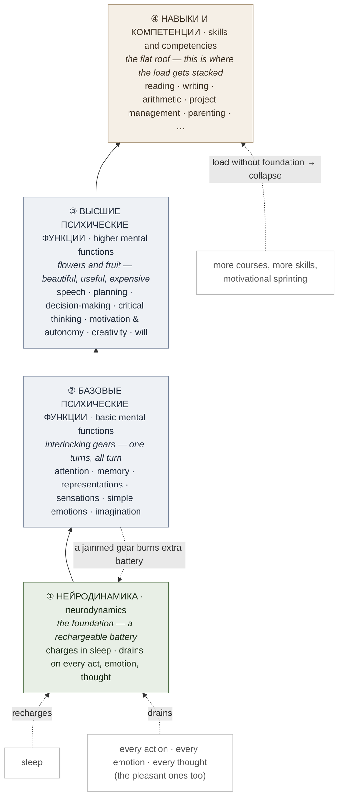

# The Cognitive House (Когнитивный домик)

**Summary**: The **Cognitive House** is Advance's named architectural model of the mind — a four-storey building whose foundation is **neurodynamics** (a rechargeable battery), whose lower floor is **basic mental functions** (interlocking gears), whose upper floor is **higher mental functions**, and whose flat roof carries **skills and competencies**. Its single load-bearing prediction: a narrow foundation cannot hold many heavy skills, so stacking courses on an untrained foundation ends in collapse — stress, burnout, dropped courses. This page owns the metaphor and the two skill-installation principles (Isolation and Intensity) that Advance derives from it; the lineage and method live on [yagodkin-advance-mnemonics](./yagodkin-advance-mnemonics.md).

**Sources**:
- `raw/05 Meta_Knowledge/Mnemonics/Ягодкин Н.А., Згода А.Н. - Учись учиться - 2023.pdf` — §Ликбез по формированию навыков, §Принципы постановки навыков, §Когнитивный домик, §Нейродинамика, §Базовые психические функции, §Высшие психические функции, §Общая теория изучения языков.
- Internal: [yagodkin-advance-mnemonics](./yagodkin-advance-mnemonics.md), [automaticity-and-reflex-training](./automaticity-and-reflex-training.md), [drill-generator](./drill-generator.md), [pulse-overview](./pulse-overview.md), [sleep-dependent-memory-consolidation](./sleep-dependent-memory-consolidation.md), [bdnf-and-neurogenesis](./bdnf-and-neurogenesis.md).

**Last updated**: 2026-07-16

---

## What the model is — and what it is not

The authors are explicit that this is a **working teaching diagram, not a scientific taxonomy**: they call it "a scientific conception stated in very free terms and images everyone understands", say they care about a usable schema of consciousness rather than terminological precision, and pre-apologize to psychologists and cognitive scientists for the liberties — including using "brain" as a synonym for "mind" (source: Ягодкин Н.А., Згода А.Н. - Учись учиться - 2023.pdf). Read it as a metaphor with predictions attached, not as a model of anatomy.

The figure starts life as a **pyramid** with a flat top, and then the authors swap it: "since we are not ancient Egyptians, instead of a pyramid we will build a more European construction — call it the Cognitive House" (source: Ягодкин Н.А., Згода А.Н. - Учись учиться - 2023.pdf). That one line is diagnostic. The house was chosen for how it teaches, not for what it explains — which is exactly why it earns a page as a *model*, and why its claims must be checked against the wiki's sourced pages rather than trusted on their own authority.

The basic/higher split is attributed in-source to **Wundt and Vygotsky**: "in psychology, since the time of Wundt and Vygotsky, basic and higher mental functions are distinguished. Basic functions exist in animals and people; higher ones develop in a human only in society and only through applied effort" (source: Ягодкин Н.А., Згода А.Н. - Учись учиться - 2023.pdf). The wiki records the attribution and stops there — the Advance framing is deliberately loose by the authors' own admission, and nothing on this page should be read as a statement of cultural-historical theory.

## Visual

## Storey 1 — Neurodynamics (the battery)

Neurodynamics sits at the very bottom: it is the "battery" from which the whole psyche is powered, and the source of intellectual tone and the capacity for intellectual work (source: Ягодкин Н.А., Згода А.Н. - Учись учиться - 2023.pdf). The metaphor is an accumulator: **it charges while we sleep and discharges while we are awake** — and the authors define tiredness itself as "the state of a discharged battery", claiming that ideally the charge should cover several days of work (source: Ягодкин Н.А., Згода А.Н. - Учись учиться - 2023.pdf). The charging half of that claim is exactly where [sleep-dependent-memory-consolidation](./sleep-dependent-memory-consolidation.md) supplies the sourced mechanism the metaphor gestures at.

The sharp part of the model is the **drain** side: energy is spent on *absolutely any* action, emotion, or thought — even pleasant emotions, even noticing sensations during a massage — "which is why you can get tired and worn out from rest itself" (source: Ягодкин Н.А., Згода А.Н. - Учись учиться - 2023.pdf). The book's worked examples are all zero-external-event drains: someone steps on your foot in transit and within a fraction of a second sensation → emotion → imagination → speech-planning → will-suppression have all fired and the day's charge is gone; a spam call, an anticipated hard conversation with a boss, deadline-fear, infatuation, "vacation mood" — nothing has happened yet and the battery is already flat (source: Ягодкин Н.А., Згода А.Н. - Учись учиться - 2023.pdf).

Deadline-driven self-motivation gets named as a specific failure loop: fear spins the emotional gear, which spins everything else, and the resulting state is misread as "flow" — a day or two of it does a month's work, and then it turns out neurodynamics has been spent a month in advance. The authors' terminus for living that way: professional burnout, depression, neurosis (source: Ягодкин Н.А., Згода А.Н. - Учись учиться - 2023.pdf).

The claimed trainers of neurodynamic capacity (source: Ягодкин Н.А., Згода А.Н. - Учись учиться - 2023.pdf):

- work at **high and very high speed**;
- work with **changes of activity type**, so that rest from one task happens while doing another;
- work sustained for a **long duration** — "even six minutes of concentration is a lot at the beginning stage, but after two weeks of training the work time is measured in hours, not minutes" **(needs verification — Advance-internal, no external citation)**;
- **quantity of actions over difficulty** — better to solve 1000 easy arithmetic examples fast than 100 hard ones or to sit an hour over a single unsolvable one;
- **personalized, not absolute, intensity** — everyone's starting level differs, so "easy" for one is impossible for another.

Neurodynamics-as-battery is the closest external analogue the wiki has to [PULSE](./pulse-overview.md)'s state model: PULSE reads energy and stress and modulates every other layer, which is structurally the same move as refusing to load the roof when the foundation is discharged. Where PULSE governs, the Cognitive House explains *why* the governor is needed.

## Storey 2 — Basic mental functions (the gears)

The basic functions named: **attention, memory, formation of representations, sensations, simple emotions, and imagination** (source: Ягодкин Н.А., Згода А.Н. - Учись учиться - 2023.pdf). The metaphor is **interlocking gears**: because a person is whole, "if one turns, it immediately sets all the others in motion; and conversely, if one is jammed, it will jam all the others — and the battery drain will be greater" (source: Ягодкин Н.А., Згода А.Н. - Учись учиться - 2023.pdf).

Two failure shapes, not one: basic functions can either **work badly** (slowing everything, burning energy) or be **overactive** (firing on their own, breaking the work rhythm and also burning energy) — "like a rifle that either doesn't fire or fires by itself; both are bad, and the ammunition is wasted either way" (source: Ягодкин Н.А., Згода А.Н. - Учись учиться - 2023.pdf). Isolated training of each function is offered as the way to unstick the first and bridle the second (source: Ягодкин Н.А., Згода А.Н. - Учись учиться - 2023.pdf).

A useful diagnostic falls out of the gear coupling: almost every defect in this layer surfaces in language as **"I don't remember"**, but the true cause often lies elsewhere — missing a meeting is usually attention, not memory; hearing a colleague while imagination wandered to the evening's plans is imagination + attention; losing the thread while retrieving a term mid-conversation is memory, but memory pointed inward rather than at the speaker (source: Ягодкин Н.А., Згода А.Н. - Учись учиться - 2023.pdf). The complaint is a symptom; the jammed gear is the fault.

The book's illustration of why imagery matters is worth keeping as an exercise: an arithmetic problem is stated with all images stripped out ("abstract physical quantity number one equals 15…") and becomes almost unsolvable in the head, then the images are restored ("how far does a boat travel downstream in 2 hours if the boat's speed is 15 km/h and the current is 12 km/h?") and it collapses to trivial (source: Ягодкин Н.А., Згода А.Н. - Учись учиться - 2023.pdf). The moral the authors draw: to understand something you must see it — not necessarily with your eyes, in imagination will do (source: Ягодкин Н.А., Згода А.Н. - Учись учиться - 2023.pdf).

## Storey 3 — Higher mental functions

Named here: **speech, planning, decision-making, critical thinking, motivation and autonomy, capacity for creativity, and will** — with abstract thinking added in the later restatement (source: Ягодкин Н.А., Згода А.Н. - Учись учиться - 2023.pdf). Their metaphor is botanical: "like flowers and fruit, higher mental functions are beautiful, useful, and expensive" — one decision can take more out of a person than a week of physical labour, and some decisions are gestated for years (source: Ягодкин Н.А., Згода А.Н. - Учись учиться - 2023.pdf).

The model puts each function in its own box on purpose. Critical thinking sits apart from goal-setting and decision-making because you *can* plan without it — the plan will be bad and won't survive criticism, but it will exist. Since unaided planning is resource-expensive, an untrained brain learns to emit exactly **one** plan per task (the shortest or habitual route to the shop) and, faced with something novel, still emits one plan — even a frankly bad one — instead of generating several and criticizing them (source: Ягодкин Н.А., Згода А.Н. - Учись учиться - 2023.pdf).

The cost structure produces the model's cruelest prediction, aimed at talented people: each higher function draws heavily, so with weak neurodynamics it discharges fast — rare flashes of talent burn the whole reserve, leaving nothing even for background good mood, and the result is depression (source: Ягодкин Н.А., Згода А.Н. - Учись учиться - 2023.pdf). The prescription is bottom-up: train basic functions and neurodynamics first, then move to the higher ones (source: Ягодкин Н.А., Згода А.Н. - Учись учиться - 2023.pdf).

The house also gives a mechanism for why writing and visualizing plans works, with the anti-esoteric caveat attached: writing a plan trains the brain to plan, and visualizing the whole process (not staring at a picture of the finished house) builds a direct link between the imagination gear downstairs and the planning function upstairs — "and no *Secret* about it" (source: Ягодкин Н.А., Згода А.Н. - Учись учиться - 2023.pdf).

## Storey 4 — Skills and competencies (the flat roof)

The pyramid's flat top invites you to put something on it, and what goes there is skills and competencies: reading, writing, arithmetic, solving equations, managing projects, raising children, growing beans, and much else — all of them resting on thinking (source: Ягодкин Н.А., Згода А.Н. - Учись учиться - 2023.pdf).

## What the model predicts

This is why the metaphor earns a page — it makes falsifiable-shaped claims rather than only decorating a curriculum.

1. **Foundation width caps roof load.** "If the base of the pyramid is not wide enough and there are very many skills, the construction will not be stable" — put many storeys full of heavy furniture and bathtubs on a weak foundation and sooner or later it all falls down, "and more likely sooner than later" (source: Ягодкин Н.А., Згода А.Н. - Учись учиться - 2023.pdf). Restated for skills generally: the strength, depth, and quality of the foundation determine the maximum possible height of the building (source: Ягодкин Н.А., Згода А.Н. - Учись учиться - 2023.pdf).
2. **The observed collapse is course-stacking burnout.** The trend the authors name is buying more and more complex skills — programming courses, robotics, ad infinitum — onto an untouched foundation; the money spent over a few years would buy a car and the result is "stress and burnout" (source: Ягодкин Н.А., Згода А.Н. - Учись учиться - 2023.pdf). The parallel image: weak wiring plus a powerful appliance trips the fuses at best (source: Ягодкин Н.А., Згода А.Н. - Учись учиться - 2023.pdf).
3. **Motivational sprinting discharges the battery.** Pass a motivational training and run for a week or two like the Energizer bunny and "you will fully discharge your own battery" (source: Ягодкин Н.А., Згода А.Н. - Учись учиться - 2023.pdf).
4. **The best training entry point is imagination + attention + memory together — i.e. mnemonics.** "What to do, where to start? With imagination, attention, and memory! If you start with them, progress will be maximal. Neither mathematics, nor reading, nor text analysis, nor any other methodology in our experience came close to the result mnemonics gave" (source: Ягодкин Н.А., Згода А.Н. - Учись учиться - 2023.pdf). The mechanism claimed is that mnemonics loads all three gears at once: representing anything at will engages imagination; holding the picture for several seconds trains attention; together they train memory — and the brain enjoys the work enough to do it almost without fatigue (source: Ягодкин Н.А., Згода А.Н. - Учись учиться - 2023.pdf). Hence the authors' own correction of their public image: Advance is often taken for a memory school, but memory is only the entry point used to shift a person out of cognitive stupor (source: Ягодкин Н.А., Згода А.Н. - Учись учиться - 2023.pdf). The full method sits on [yagodkin-advance-mnemonics](./yagodkin-advance-mnemonics.md).
5. **Volume records are not about the content.** Asked why anyone would learn 1000 foreign words in a day or 1000 digits of pi, the authors answer that the goal is not memory — "a tenth of those volumes is enough for life". Each of those tasks requires **three to eight hours of focused work**, so whoever completed one has demonstrated that they can hold attention that long and that their neurodynamics can power intensive work for that long; after such preparation, working through any textbook or acquiring new competencies is easy and pleasant (source: Ягодкин Н.А., Згода А.Н. - Учись учиться - 2023.pdf). The payoff claimed is transfer of *capacity*, not of content.

## Installing skills on the house — two named principles

Both principles come from the same slice and belong to the model: they are what you do once you accept that the roof rests on the foundation.

### Skill Isolation Principle (Advance)

**Not** the Von Restorff isolation effect. The wiki registers "isolation effect" in its memory-salience sense — distinctive items spiking recall — owned by [serial-position-curve](./serial-position-curve.md); Advance's isolation is a *training-attention allocation rule* and has nothing to do with item distinctiveness. Different concept, same word.

Advance's version: a skill is split into smaller simple sub-skills, each easily practised separately, and under isolated training **100% of attention goes to one sub-skill**, which produces multiplicatively faster growth (source: Ягодкин Н.А., Згода А.Н. - Учись учиться - 2023.pdf). The quantitative claim: "by our observations, if two skills are engaged with 50% of attention each, the speed of installing each drops **by four or more times**" **(needs verification — Advance-internal, no external citation)** — note the shape of the claim, which is that dividing attention is *super-linearly* costly, not merely halving. The rule that follows: at any moment 100% of attention on one task, one skill; everything else must be either removed or already driven to automatism so it costs no attention (source: Ягодкин Н.А., Згода А.Н. - Учись учиться - 2023.pdf).

The everyday illustration is the broom-and-twigs parable: the sons can't break the whole broom but snap it easily twig by twig — and each twig has its own most effective tool (mnemonics for words, reproduction patterns for grammar, articulation gymnastics with a proper consolidation cycle for pronunciation) (source: Ягодкин Н.А., Згода А.Н. - Учись учиться - 2023.pdf). The failure it predicts: learn ten new words and immediately try to use them in dialogue, and you consolidate neither the vocabulary nor the grammar — "several hours of exercises take all your strength and the next day nothing is left in your head" (source: Ягодкин Н.А., Згода А.Н. - Учись учиться - 2023.pdf).

Advance's "доведение до автоматизма" (driving to automatism) is the escape hatch that makes isolation composable — a sub-skill that costs no attention no longer competes for the 100%. In wiki terms that is the automaticity axis of [skill-progression-stages](./skill-progression-stages.md), levels 0–9, owned by [automaticity-and-reflex-training](./automaticity-and-reflex-training.md).

### Intensity Principle (Advance)

Advance's second principle is described as "the same isolation, only in time": the same action repeated without interruptions by other actions (source: Ягодкин Н.А., Згода А.Н. - Учись учиться - 2023.pdf). In real life skills install slowly precisely because neither holds — many skills participate in each action, and actions are interrupted by other actions (source: Ягодкин Н.А., Згода А.Н. - Учись учиться - 2023.pdf). At the foundation level the same word does double duty: "intensity for us is an approach to developing neurodynamics — it is through intensive training that a person develops their internal accumulator" (source: Ягодкин Н.А., Згода А.Н. - Учись учиться - 2023.pdf).

The sub-rule is the interesting part, because it is an explicit **contrast with muscle training**: when training muscles it is important to load them to fatigue or failure, "and growth comes from that" — but in intellectual training what matters is maximum *speed* of work, not effort under which work stalls, and driving yourself to strong fatigue or intellectual overwork is "unnecessary and even harmful" (source: Ягодкин Н.А., Згода А.Н. - Учись учиться - 2023.pdf). The prescribed shape (source: Ягодкин Н.А., Згода А.Н. - Учись учиться - 2023.pdf):

- Short sprints at maximum intensity, **stopping before the first signs of fatigue** — at loss of attention, dropping speed, or appearing errors, take a break on your own initiative.
- **30 seconds to 2 minutes** per sprint is excellent; that means you're holding a very high tempo.
- Each sprint ends **at the peak of possible speed**, not at exhaustion.
- Climb slowly, bringing each stage to maximum speed; move on when new training stops yielding speed gains.
- After moving up, keep training the previous stage in parallel — first 5–7 minutes of a session on the base exercises, which both train and warm you up.
- When speed falls at a transition, find *which operation* got slower or where errors appeared, and work that in isolation.
- Vary the exercises: alternate points of attention with new exercises that differ in surface but train the same function — the trainer's real secret is sensing when to change the exercise and the load type, so intensity and isolation both hold without burnout from monotony.

This converges, independently and from a different tradition, on [drill-generator](./drill-generator.md)'s isolation → automaticity → transfer ladder — the same insistence that you name the smallest stable unit, isolate the failing operation, and add speed only after the unit is clean.

## Plateaus and rung-swaps

The house rests on a claim about skills in general: any method always brings a skill onto a **plateau**, and beyond it, breaking the ceiling requires **disproportionately more effort** — or the "hacker" option, going to look for a *new skill* (source: Ягодкин Н.А., Згода А.Н. - Учись учиться - 2023.pdf).

The worked illustration (an illustrative progression, **not** a numbered stage ladder): don't memorize deliberately at all → start cramming (a qualitative jump) → add cyclic repetition to cramming (multiplied efficiency) → add the "funnel" (higher again) → add mnemonics. And the punchline: **the cramming experience is of no use whatsoever for mastering mnemonics** — you simply have to abandon it, though cyclic repetition and the funnel keep working alongside the mnemonic method (source: Ягодкин Н.А., Згода А.Н. - Учись учиться - 2023.pdf). The rule extracted: "always choose not only the most perfect *way* of developing a skill, but the most perfect *skill* available" (source: Ягодкин Н.А., Згода А.Н. - Учись учиться - 2023.pdf).

Supporting claims from the same slice (source: Ягодкин Н.А., Згода А.Н. - Учись учиться - 2023.pdf):

- **Skills do not drift upward with use.** Reading speed sits where it was at school graduation regardless of how many books you've read; single-digit addition is effortless while four-digit addition isn't, though it's the "same" skill. "Practice lets you perfect the abilities and skills you already have, but will not teach you to do what you never did before."
- **Seniority is not training.** The 20-year taxi driver is out-driven by the racer with three to five years of *training*; the champion runner is not a courier. "In the development of a skill, no transition of quantity into quality occurs."
- **Skills do not compose out of predecessors.** However much you steer a bicycle, it won't help much with a car; the toddler who just learned to walk drops to all fours when speed actually matters, and only stops once walking is reliable enough — a new skill appears only from targeted acquisition.

Advance's plateau is a claim about **methods having ceilings**, which is a different object from the [OK Plateau](./ok-plateau.md) (an autopilot-induced ceiling at the Autonomous stage). They are compatible and worth reading together: one says the tool has a ceiling, the other says the learner can stop climbing below it.

## Where the model touches the wiki

- **[bdnf-and-neurogenesis](./bdnf-and-neurogenesis.md)** — the book's folk metaphor for pruning is an **"internal quartermaster" (внутренний завхоз)**: the brain is rebuilt like Gaudí's Sagrada Família, but the quartermaster in charge of the build economizes on everything, disassembles first whatever is unfinished and unused, and will take apart a half-built language skill during the gaps between lessons; hence "no length of service forms new skills — only efforts and actions count, and regular use merely maintains the current level" (source: Ягодкин Н.А., Згода А.Н. - Учись учиться - 2023.pdf). That is a use-it-or-lose-it story, and it points the same way as the novelty-lever material on [bdnf-and-neurogenesis](./bdnf-and-neurogenesis.md) — recorded here as **alignment, not corroboration**: the metaphor carries no mechanism and no citation.
- **[pulse-overview](./pulse-overview.md)** — the battery is a state-readiness model in metaphor form; PULSE is the wiki's implemented governor for the same signal.
- **[sleep-dependent-memory-consolidation](./sleep-dependent-memory-consolidation.md)** — the charging half of the battery claim.
- **[drill-generator](./drill-generator.md)** · **[automaticity-and-reflex-training](./automaticity-and-reflex-training.md)** — independent convergence on isolate → automate → transfer, and on the automaticity axis that makes isolation composable ([skill-progression-stages](./skill-progression-stages.md)).

## Claims flagged for verification

Per the wiki's citation rules, these are Advance-internal assertions with no external citation given in the source. They are stated in the book as observations from practice; treat them as hypotheses, not findings.

| Claim | Status |
|---|---|
| Splitting attention 50/50 across two skills cuts installation speed **4× or more per skill** | **needs verification — Advance-internal, no external citation**; "by our observations" (source: Ягодкин Н.А., Згода А.Н. - Учись учиться - 2023.pdf) |
| Trained intellectual endurance raises the productivity of *any* mental activity **at minimum 2–3×** | **needs verification — Advance-internal, no external citation** (source: Ягодкин Н.А., Згода А.Н. - Учись учиться - 2023.pdf) |
| Six minutes of concentration is a lot for a beginner; after **two weeks** of training, work time is measured in hours | **needs verification — Advance-internal, no external citation** (source: Ягодкин Н.А., Згода А.Н. - Учись учиться - 2023.pdf) |
| Speaking and singing run on **different brain regions**, as do listening to speech vs to song — therefore "no accumulation of effect appears" from passive listening, and passive methods only work once a good foundation of neural connections exists | **needs verification — Advance-internal, no external citation**; a neuro-anatomical claim asserted without study reference (source: Ягодкин Н.А., Згода А.Н. - Учись учиться - 2023.pdf) |

## Mnemonic

**Stand in front of the house and look bottom-up.**

In the **cellar** hums a car battery on a trickle charger — the charger only runs at night. Every time anyone upstairs *thinks, feels, or twitches*, the ammeter jumps; even the man being massaged in the parlour is draining it.

On the **ground floor**, a wall of meshed brass gears: attention, memory, imagery, sensation, emotion, imagination. Turn one and they all turn. Jam one — and the cellar ammeter pegs.

On the **upper floor**, an orangery: speech, planning, decisions, critical thinking, will, creativity — flowers and fruit, beautiful and expensive, one bloom drinks a week's charge.

And on the **flat roof** somebody is stacking bathtubs and heavy furniture: every course you ever bought — programming, robotics, three languages. Nobody has been down to the cellar in twenty years.

The image *is* the argument: **battery → gears → orangery → bathtubs on the roof.** When the house comes down, it was never the bathtubs' fault.

## Checksum

1. Name the four storeys bottom-to-top and the metaphor attached to each. (Neurodynamics = battery charging in sleep and draining on any action/emotion/thought · basic mental functions = interlocking gears · higher mental functions = expensive flowers and fruit · skills and competencies = the flat roof carrying the load.)
2. Why did the authors swap the pyramid for a house, and what does the swap tell you about the model's status? ("Since we are not ancient Egyptians" — a more European construction. It is a teaching metaphor chosen for pedagogy, not an anatomical claim; the authors say so themselves and pre-apologize to cognitive scientists.)
3. What is the model's entry point for training, and why that one? (Imagination + attention + memory *together* — mnemonics loads all three gears in one exercise, so it moves the foundation, not the roof.)
4. Why memorize 1000 words in a day if a tenth is enough for life? (Not for the words. The task demands 3–8 hours of focused work, so it proves and builds attention span and neurodynamic capacity — the transfer is capacity, not content.)
5. State the sub-rule that separates intellectual from muscular training. (Muscle grows from load to failure; intellect trains on maximum speed in 30-second-to-2-minute sprints that stop at the *first* sign of fatigue or errors — training to failure is harmful here.)
6. What is Advance's isolation, and what is it *not*? (An attention-allocation rule for skill installation — split into sub-skills, 100% attention on one. It is not the Von Restorff isolation effect, which is about item distinctiveness and lives on [serial-position-curve](./serial-position-curve.md).)

## Related pages

- [yagodkin-advance-mnemonics](./yagodkin-advance-mnemonics.md) — the lineage and method this model is the architecture for
- [automaticity-and-reflex-training](./automaticity-and-reflex-training.md) — "доведение до автоматизма" in wiki terms; the automaticity axis
- [drill-generator](./drill-generator.md) — independent convergence on isolation → automaticity → transfer
- [pulse-overview](./pulse-overview.md) — the implemented state-readiness governor the battery metaphor gestures at
- [sleep-dependent-memory-consolidation](./sleep-dependent-memory-consolidation.md) — the charging half of the battery
- [bdnf-and-neurogenesis](./bdnf-and-neurogenesis.md) — the sourced counterpart to the "internal quartermaster" pruning metaphor
- [skill-progression-stages](./skill-progression-stages.md) — the registered axes; cite before writing any level number
- [serial-position-curve](./serial-position-curve.md) — owner of the *other* isolation (Von Restorff), kept separate on purpose
- [ok-plateau](./ok-plateau.md) — the learner-side ceiling, next to Advance's method-side ceiling

---

## U — See (CAST)
1. A four-storey house: battery in the cellar → gears → orangery → bathtubs stacked on a flat roof
2. Foundation narrower than the roof load → the whole thing comes down

## D — Name (NEDF)
1. Cognitive House = neurodynamics · basic functions · higher functions · skills — bottom to top
2. Distinguisher: the load-bearing claim is about the *foundation*, not the skills; a "house" not a pyramid because it teaches better
3. Failure mode: buying courses (roof) while never once training the cellar

## F — Do (SPEAR)
1. Before adding a skill, audit the foundation: sleep (charge), attention span (minutes to hours), gear jams
2. Train the entry point — imagination + attention + memory together, i.e. mnemonics — in 30s–2min sprints stopped at the first error

## B — Watch (HEART)
1. Deadline-fear read as "flow" → the battery is being spent a month ahead
2. "I don't remember" as the presenting complaint → suspect attention or imagination, not memory
3. Tiredness after *rest* → the drain claim is doing real work; something was running

## L — Predict (ORACLE)
1. Many heavy skills + untrained foundation → stress, burnout, dropped courses
2. Two skills at 50/50 attention → each installs multiples slower than either alone would
3. Any single method → plateau; the ceiling breaks by disproportionate effort or by swapping to a better skill

## R — Act (GRACE)
1. Plateaued → ask first "is this the best *skill* available?", not "should I try harder?"
2. Fatigue, errors, dropping speed mid-drill → stop the sprint now; do not train intellect to failure
3. Talented and burnt out → drop to the cellar: neurodynamics and basic functions before higher functions
