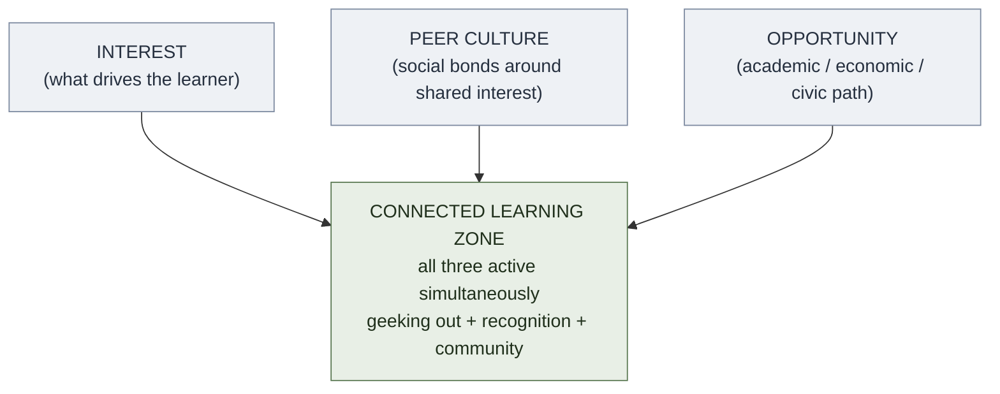

# Connected Learning

**Summary**: Connected Learning (Ito et al. 2013, *Connected Learning: An Agenda for Research and Design*) is a framework that argues **durable, high-achieving learning occurs when three spheres intersect: peer culture (interest-driven social bonds), academic and civic opportunity, and personal interest**. The failure mode of conventional education is that these three spheres are kept separate — school is disconnected from interest, interest is disconnected from achievement pathways, social bonds are disconnected from academic goals. Connected Learning maps the conditions under which that intersection happens spontaneously, so it can be designed. In the Neural OS context, connected learning informs the wiki's topology design: dense cross-links create the "openly networked" property that produces emergent insight when exploration follows genuine interest chains. This page is the canonical owner.

**Sources**:
- Ito, M., Gutierrez, K., Livingstone, S., Penuel, B., Rhodes, J., Salen, K., ... & Watkins, S. C. (2013). *Connected Learning: An Agenda for Research and Design*. Digital Media and Learning Research Hub.
- Ito, M., et al. (2009). *Hanging Out, Messing Around, and Geeking Out: Kids Living and Learning with New Media*. MIT Press. — ethnographic precursor; modes of participation.
- Vygotsky, L. S. (1978). *Mind in Society*. Harvard University Press. — Zone of Proximal Development; social mediation of learning.
- Wenger, E. (1998). *Communities of Practice: Learning, Meaning, and Identity*. Cambridge University Press. — practice communities as the social unit of learning.
- Internal: [deliberate-practice](./deliberate-practice.md), self-determination-theory, [elaboration](./elaboration.md), social-learning-theory, [directness-principle](./directness-principle.md).

**Last updated**: 2026-06-10

---

## The three spheres

Ito et al. identify three spheres that must intersect for learning to be truly connected:

| Sphere | Description | What it provides |
|---|---|---|
| **Interest** | Personal passions, hobbies, obsessions the learner brings to any context | Intrinsic motivation; willingness to tolerate difficulty |
| **Peer culture** | Social bonds, friendship networks, collaborative communities built around shared interest | Accountability, social reinforcement, collaborative challenge |
| **Opportunity** | Pathways to academic achievement, economic mobility, civic engagement | Stakes, recognition, real-world consequence for the learning |

Connected learning is the condition in which **all three are simultaneously active**. When even one is absent, engagement drops, transfer to life opportunity fails, or the learning is socially isolated and fragile.

## Why separation fails

Most conventional schooling keeps the three spheres apart:

- **Interest → absent**: curriculum is prescribed; learner's personal interests are irrelevant
- **Peer culture → marginalized**: peer relationships in school are treated as distractions from learning
- **Opportunity → delayed**: the connection to real-world achievement is abstract and deferred ("you'll need this someday")

The predictable result: students who comply but don't engage; students who engage outside school (in gaming, fandoms, hobbies) but don't connect that engagement to school achievement; and students who achieve in school but feel alienated from both their peers and their real interests.

## Three modes of participation (Ito et al. 2009)

The ethnographic work identified three levels of engagement with informal digital media:

| Mode | Description | Connected Learning potential |
|---|---|---|
| **Hanging out** | Socializing with friends; media is background | Low: social bonds without interest drive or achievement pathway |
| **Messing around** | Casual exploration; experimenting with tools and media | Medium: interest emerging; no sustained development or community |
| **Geeking out** | Deep, intense engagement with specialized interest; joins communities of practice | High: all three spheres can intersect; communities provide peer culture and achievement recognition |

"Geeking out" is the mode that produces connected learning — when it is also validated and channeled toward formal or civic opportunity. The failure is when deep interest is sealed off from legitimate recognition.

## Design principles

Ito et al. extract six design principles for connected learning environments:

| Principle | Description |
|---|---|
| **Shared purpose** | Learners, peers, educators, and family have common stakes in the learning activity |
| **Production-centered** | Learning is organized around creating something real (not just consuming/receiving) |
| **Openly networked** | Resources, knowledge, and mentors flow across institutional boundaries; not locked in school |
| **Academically oriented** | Pathways to academic achievement and civic/economic opportunity are explicit, not implicit |
| **Interest-powered** | Personal interests are the entry points; curriculum is shaped around them |
| **Peer-supported** | Social relationships with peers who share the interest are integral to the learning activity |

## Connection to Neural OS wiki design

The Neural OS wiki operationalizes several of these principles at the design level:

- **Openly networked**: `wiki-links` create the cross-boundary network; every page links out, creating emergent navigation paths that follow genuine interest chains
- **Production-centered**: pages are authored, not just read; the [generation-effect](./generation-effect.md) makes production the encoding event
- **Interest-powered**: ingest is driven by the user's reading interests; the wiki's topology reflects cognitive interest structures, not academic department organization
- **Peer-supported** (weak analog): the wiki builds an external "peer" network in the form of cross-referenced concepts that interrogate each other

The convergence: a dense, interlinked knowledge base explored via genuine interest = the openly networked + interest-powered conditions. The missing sphere in solo wiki work is peer culture — which explains why synthesis is harder to produce autonomously than in dialogue.

## The "equity concern" at the framework's core

Ito et al.'s political motivation: connected learning conditions occur *spontaneously* in high-resource, highly-connected families. Parents with social capital know how to link a kid's interest to achievement pathways. Schools in underserved communities cannot assume that external sphere; they must design for it explicitly.

This is the policy argument: if we want equity in educational outcomes, we must engineer the conditions for connected learning in institutions rather than relying on them to happen at home.

## Visual

**When only 2 spheres are active — a disconnected fragment:**

| Active spheres | Missing | Result |
|---|---|---|
| Interest + peers | opportunity | isolated hobby |
| Interest + opportunity | peers | lonely achievement |
| Peers + opportunity | interest | compliance, not engagement |

## Failure modes

| Failure | What it produces |
|---|---|
| **Interest without peers or pathways** | Deep personal passion that remains invisible, unvalidated, and unconnected to achievement |
| **Achievement without interest** | Compliance-driven performance; fragile at any intrinsic-motivation test |
| **Peer culture without interest or pathways** | Social bonding around media consumption with no developmental trajectory |
| **Openly networked but no shared purpose** | Information abundance without convergence or achievement goal |
| **Assuming connected learning happens at home** | Equity gap: high-resource families produce it spontaneously; institutions must engineer it |

## Related pages

- self-determination-theory — autonomy, competence, and relatedness are the motivational engine behind the interest and peer-culture spheres
- social-learning-theory — Bandura's observational learning as the mechanism behind peer-supported learning
- [directness-principle](./directness-principle.md) — production-centered connected learning is a form of directness: produce the real artifact, not a simulacrum
- communities-of-practice — Wenger's framework for the social unit of learning; peer culture sphere operationalized
- [elaboration](./elaboration.md) — interest-powered learning naturally produces elaboration (connecting new material to known interest domain)
- [generation-effect](./generation-effect.md) — production-centered principle is operationally the generation effect applied at the project level
- motivation-and-learning — interest-powered is the intrinsic-motivation condition

---

## U — See (CAST)
1. Three spheres: interest + peer culture + opportunity → when all three intersect, connected learning occurs
2. Geeking out is the mode; freely networked recognition is what closes the loop

## D — Name (NEDF)
1. Connected Learning = framework for the intersection of interest, peer community, and achievement pathway
2. Distinguisher: school seals spheres apart; connected learning engineering deliberately intersects them
3. Failure mode: interest isolated from social validation and opportunity → invisible personal passion, no development

## F — Do (SPEAR)
1. For any learning project: check which sphere is absent → design explicitly to add it
2. Wiki: exploit interest-chain navigation; deliberately expose inter-domain links where interest could intersect with achievement

## B — Watch (HEART)
1. Deep knowledge accumulation without peer dialogue or real-world application → likely missing sphere 2 or 3
2. Achievement without engagement → check whether personal interest is connected or merely compliance-driven

## L — Predict (ORACLE)
1. All three spheres active → intrinsically motivated, socially reinforced, achievement-visible learning
2. Any one sphere absent → engagement drops, transfer to opportunity fails, or peer fragility

## R — Act (GRACE)
1. New learning environment → map which of three spheres it addresses; fill the gap
2. Wiki use: follow genuine interest links; produce (don't just read) → activates interest + production-centered
