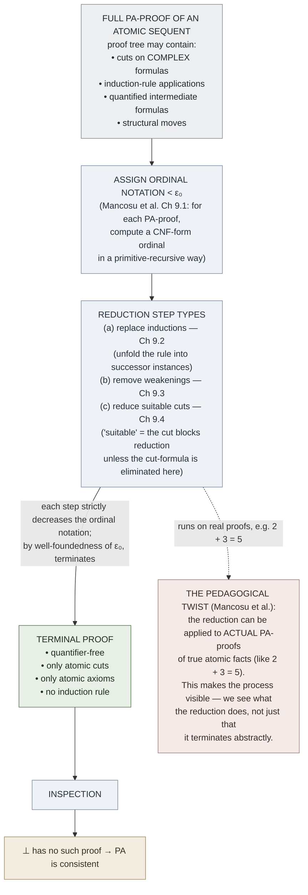

# Consistency of Peano Arithmetic (Gentzen 1936/1938)

**Summary**: Gentzen's 1936 theorem (refined 1938): **Peano arithmetic is consistent**, proved by exhibiting a reduction procedure that strictly decreases an [ordinal notation](./epsilon-zero-and-ordinal-induction.md) < ε₀ assigned to each PA-proof. Since ordinal notations < ε₀ are well-ordered, the reduction terminates; when it does, all cuts on complex formulas and all uses of the induction rule are gone, leaving a quantifier-free atomic-cut-only proof. By inspection, no such proof of the empty sequent (or of 0 = 1) exists. Goes beyond [Hilbert's](./hilberts-program.md) strict-finitary standpoint — needs ordinal induction along ε₀ — but stays *constructive* (BHK-acceptable). The first proof of Con(PA) that survived [Gödel's second incompleteness theorem](./godels-incompleteness.md).

**Sources**:
- [Mancosu, Galvan, Zach (2021)](./proof-theory-mancosu-galvan-zach.md) Ch 7 (the consistency proof; the simple-proof and worked examples) + Ch 9 (the ordinal-bounded extension with ordinals < ε₀ assigned to proofs).
- Gentzen, G. (1936) "Die Widerspruchsfreiheit der reinen Zahlentheorie," *Math. Ann.* 112: 493-565.
- Gentzen, G. (1938) "Neue Fassung des Widerspruchsfreiheitsbeweises für die reine Zahlentheorie," *Forschungen zur Logik und zur Grundlegung der exakten Wissenschaften* (new series) 4: 19-44.
- Tait, W. W. (2002) "Gödel's interpretation of intuitionism," *Philosophia Mathematica* 10: 224-235 (on the meaning of "finitary" in the Gentzen-Hilbert dialectic).

**Last updated**: 2026-05-27

---

## Unlocks (lead, not footer)

1. **Conservativity reframing × wiki's lint discipline.** Mancosu et al.'s pedagogical innovation: rather than deriving "no PA-proof of contradiction exists" by reductio, they reformulate it as a [conservativity](./godel-gentzen-translation.md) result — *induction and complex cuts can be eliminated from proofs of elementary arithmetical facts in PA*. This is the wiki's lint shape: every wiki page's claims can be reduced to glossary atoms or open citations; if reduction fails, the page has a bug. **The proof-theoretic ancestor of `/lint`.** Confirmed unlock.

2. **Termination by ordinal-bounded measure × [OK Plateau](./ok-plateau.md) × [skill-gym dynamics](./red-queen-skill-gym.md).** The reduction procedure on PA-proofs terminates because each step strictly decreases an ordinal notation < ε₀, and these are well-ordered. The same shape as: every skill-gym session strictly decreases an *error-rate* measure that's bounded below by a substrate floor. The OK Plateau is what happens when the substrate floor *is* the gym-measure's well-foundedness — you can't reduce below it without changing substrates. **Same architectural pattern at three layers**: arithmetic proofs (decrease ordinal); skill drills (decrease error-rate); ε₀ acts as the formal-logic ancestor of "substrate-bound on progress."

3. **The "reduction-procedure on actually existing proofs" pedagogical move × [FRAME FORGE Distill](./frame-forge.md).** Standard presentations of Gentzen's consistency proof show that a *putative* proof of contradiction reduces to nothing. Mancosu et al. instead apply the reduction to *real* proofs (e.g., proofs of 2 + 3 = 5) and exhibit the result. **This converts the consistency proof into a *worked-example* exercise** — exactly the shape of FRAME FORGE Distill, where the work is the example, not just the abstract guarantee.

## Mnemonic

**ROADS-T** = *Reduce-procedure · Ordinal-bound · Atomic-cuts-only-survive · Decreasing-measure · Sub-formula-restored · Terminates.*

Reads as "roads ⋅ T" — the reduction procedure paves *roads* through a putative contradiction proof, and the *T* (termination) at the end of each road is forced by the well-ordering of ε₀.

## Memory checksum

If you can answer these in <60 s each from memory, the page is encoded:

1. State **what the consistency proof shows** in one sentence. (*Peano arithmetic does not prove ⊥. Equivalently: no formal PA-proof of 0 = 1 exists. Proof: assign to each PA-proof an ordinal notation < ε₀; define a reduction procedure that strictly decreases this ordinal; ε₀ is well-ordered so the reduction terminates; the terminal proof is quantifier-free and uses only atomic cuts; by inspection it cannot prove ⊥.*)
2. Why does **standard [cut-elimination](./cut-elimination-hauptsatz.md) not directly prove Con(PA)**? (*PA has non-logical axioms (atomic) plus the induction rule. Cuts on complex formulas reduce as in pure logic, but **the induction rule can re-introduce high-rank cuts when the induction formula is complex**. Standard rank-and-degree induction fails. Gentzen's fix: use ordinal notations bounded by ε₀ as the complexity measure; ε₀-induction handles the induction rule.*)
3. State the **end-result of the reduction**. (*A proof in the restricted system [pure logic + atomic cuts + atomic-formula axioms of PA + no induction rule]. Such a proof is purely quantifier-free combinatorial. By inspection of cut-free atomic proofs: ⊥ has no derivation.*)
4. Why is the consistency proof **not in PA itself**? (*The reduction-procedure proof requires ordinal induction along ε₀. PA can prove transfinite induction along every α < ε₀ but cannot prove it along ε₀ itself. So the proof goes through in PA + ε₀-induction, which is strictly stronger than PA. **This is consistent with Gödel's second incompleteness theorem**: PA can't prove its own consistency, but PA + ε₀-induction can.*)
5. What is the **conservativity reframing** Mancosu et al. use? (*Standard Gentzen: reduce a putative proof of ⊥ to nothing. Mancosu et al.: reduce any PA-proof of an atomic-sequent to a proof using only atomic cuts and no induction. This is a **conservativity** result — PA proves nothing about atomic arithmetic that the restricted system doesn't. Side benefit: the reduction can be applied to **actually existing proofs**, not just putative non-existent ones — giving worked examples (Ch 7.7, Ch 7.10, Ch 9.5).*)

## Visual — the reduction architecture

The reduction is *constructive*: every step is a primitive-recursive transformation on the proof object. Termination is the only non-finitary step (needs ε₀-induction in the metatheory).

---

## What's in the proof (Mancosu et al. Ch 7 + Ch 9)

### Ch 7: the simple case

Mancosu et al. begin with **proofs of atomic sequents in pure logic + atomic axioms + induction rule, but with a single induction**. They show the reduction procedure works for this restricted shape — induction is replaced by its instance for the relevant numeral, cuts shrink, the proof reduces.

Examples in Ch 7.7 and Ch 7.10: an actual PA-proof of 2 + 3 = 5 reduces to a quantifier-free arithmetic computation. The student sees what the procedure does.

### Ch 9: the full case

The full PA-proof can contain *nested* inductions, quantified intermediate formulas, and arbitrary cuts. Ch 9.1 assigns to each such proof an *ordinal notation* < ε₀ in a primitive-recursive way:

- Atomic axioms get notation 0.
- A rule application combines the notations of its premises by ordinal arithmetic (ω-exponentiation of cut-rank, addition of preceding notations).
- The induction rule increases the ordinal by ω-multiplication.

Ch 9.2-9.4: the reduction steps strictly decrease this ordinal:
- **Replacing inductions** (Ch 9.2): the induction rule with conclusion P(t) is unfolded into instances P(0), P(0)→P(1), P(1)→P(2), …, P(t-1)→P(t) chained by [modus ponens](./logic-atomic-design.md). The ordinal drops because the *induction rule depth* decreases.
- **Removing weakenings** (Ch 9.3): a structural-rule cleanup that simplifies later steps.
- **Reducing suitable cuts** (Ch 9.4): the cut-elimination step adapted to the atomic-axiom setting. "Suitable" means: the cut blocks further reduction unless eliminated here. Suitable-cut reduction strictly decreases ordinal.

### Termination

By transfinite induction along ε₀, the reduction terminates. The terminal proof has:
- No complex cuts (only atomic cuts).
- No induction rule.
- No quantified intermediate formulas (they've been eliminated by ∀E-then-∃I or by induction-unfolding).

### Inspection

A quantifier-free, atomic-cut-only PA-proof of ⊥ would be a finite combinatorial object. Each atomic cut has a specific term-equality as cut-formula. The inspection: such a proof can only derive numerical facts that are *actually true* — atomic cuts cancel atomic facts, leaving only consistent numerical equalities at the leaves. ⊥ is *not* such a fact.

Therefore: no PA-proof of ⊥ exists.

## Why this answers (and doesn't answer) Hilbert

### What Gentzen achieved

- A **constructive** proof of Con(PA), in the BHK sense — the reduction procedure is given algorithmically, the well-foundedness of ε₀ is provable in elementary mathematics (with the caveat that PA itself can't prove it).
- A **finitary in the extended sense** proof — needs ε₀-induction, which is more than PRA but less than full second-order arithmetic.
- A **template** for proving consistency of stronger systems by using larger ordinals (Γ₀ for predicative analysis; Bachmann-Howard for impredicative; etc.). This is the entire research program of ordinal proof theory.

### What's left over

- **Hilbert's strict-finitary form is dead.** ε₀-induction is more than strict-finitism allows. The question of whether Gentzen's proof "completes Hilbert's program" depends on how broadly you read "finitary."
- **Three readings** (see [hilberts-program](./hilberts-program.md)): continuation (Gentzen succeeded in mildly-extended Hilbert); relativization (Hilbert relative to ε₀-well-foundedness); reductive proof theory (the technique generalizes; philosophy is secondary).
- **PA cannot prove its own consistency** (Gödel 2nd theorem). Gentzen's proof is *outside* PA. The wiki's [godels-incompleteness](./godels-incompleteness.md) page elaborates.

## The 1938 refinement

Gentzen's 1936 proof was technically complex. In 1938 he published a refinement using *trees of sequents with side-formulas* that is more uniform. The 1938 version is what most modern textbooks (including Mancosu et al.) present. The mathematical content is the same; the bookkeeping is cleaner.

## Connection to the wiki

### Substrate ceiling × OK Plateau (the load-bearing connection)

The consistency proof requires *one ordinal level beyond what PA permits*. The OK Plateau requires *one substrate level beyond what the current substrate permits*. The match isn't metaphor — both are well-founded ordinal hierarchies where the next level is not derivable from the previous.

Operational consequence for the wiki: when an automaticity ladder hits its ceiling, the fix is *not* more reps at the same level. The fix is *ascending one ordinal* — change the substrate, the encoding, or the cue/response shape. This is what [snap-back](./snap-back-effect.md) and the [Theater of the Mind](./theater-of-the-mind.md) 21-day cycle implement.

### Conservativity × ingest

Mancosu et al.'s reframing — *induction and complex cuts can be eliminated from proofs of atomic facts* — is a *conservativity* result. Conservativity is the wiki's discipline when ingesting new sources: a new ingest should not *change* the wiki's claims at the atomic-fact layer. It may *extend*, *refine*, or *sub-feature* prior claims, but not negate them.

The /lint pass enforces this. The Gentzen consistency proof is the formal-logic ancestor.

### The pedagogical worked-example move

Standard textbooks present consistency proofs as: *here's the abstract reduction; trust me, it terminates.* Mancosu et al. present them as: *here's the reduction applied to an actual proof of 2 + 3 = 5; watch it run.* This is exactly the wiki's discipline (per CLAUDE.md and the user feedback memory): every concept page must ship with a worked example or visual, not just an abstract characterization.

The Mancosu et al. consistency-proof chapters are themselves *templates* for the wiki's concept-page format.

## Related pages

- [proof-theory-mancosu-galvan-zach](./proof-theory-mancosu-galvan-zach.md) — source textbook (Ch 7 + Ch 9)
- [epsilon-zero-and-ordinal-induction](./epsilon-zero-and-ordinal-induction.md) — the ordinal-bound that powers the proof
- [cut-elimination-hauptsatz](./cut-elimination-hauptsatz.md) — the structural prerequisite
- [sub-formula-property](./sub-formula-property.md) — relevant to the terminal-proof inspection
- [hilberts-program](./hilberts-program.md) — the program this rescued (partly)
- [godels-incompleteness](./godels-incompleteness.md) — the limit-result this dances around
- [gentzens-proof-theory](./gentzens-proof-theory.md) — historical context
- [godel-gentzen-translation](./godel-gentzen-translation.md) — different relative-consistency result by the same Gentzen
- [ok-plateau](./ok-plateau.md) · [snap-back-effect](./snap-back-effect.md) — substrate-ceiling principle at the skill layer
- [frame-forge](./frame-forge.md) — wiki-layer instance of distillation/reduction
- [glossary](./glossary.md) — Logic layer registrations
