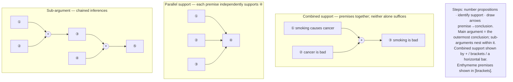
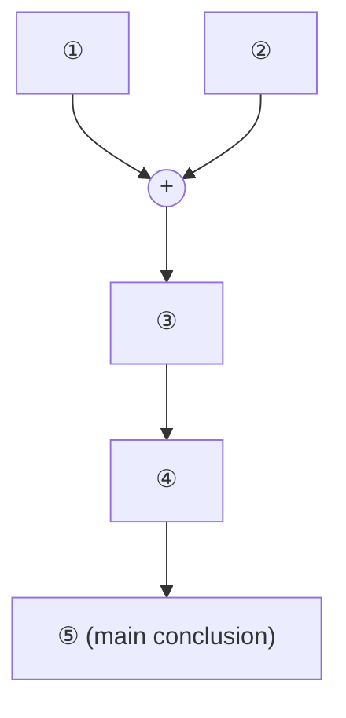
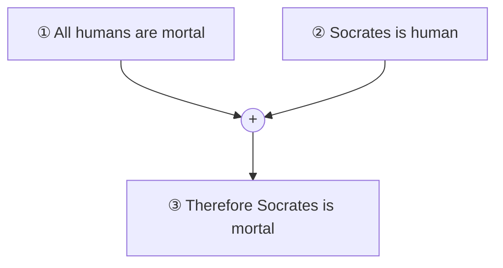
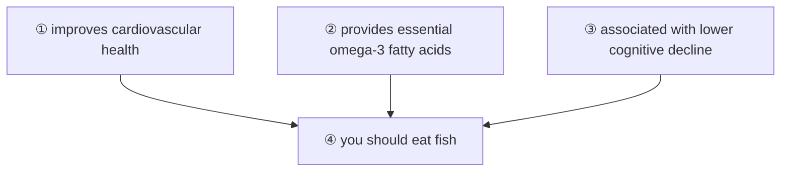
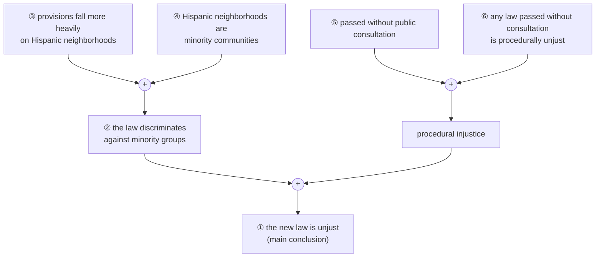
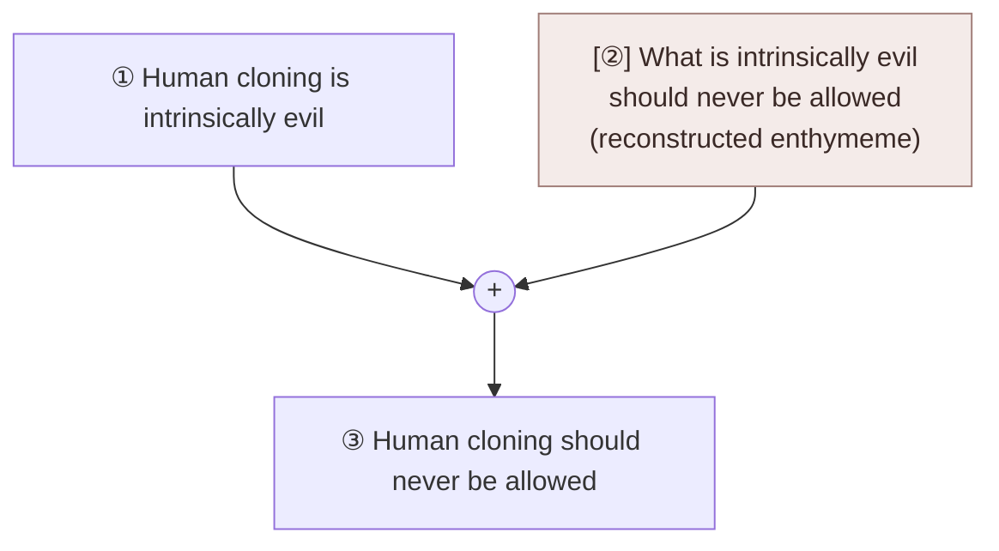

# Analyzing Arguments (Copi Ch 2)

**Summary**: [Copi](./copi-introduction-to-logic.md) Ch 2's procedural complement to [Ch 1](./argument-anatomy.md): how to **diagram** real-world arguments — identify main argument vs sub-arguments, map premise→conclusion relations as a directed graph, handle complex passages with multiple inferences. The Template-tier in [logic-atomic-design](./logic-atomic-design.md) for argument-extraction at scale. **Cross-link**: [argument-anatomy](./argument-anatomy.md) supplies the atoms (premise, conclusion, inference, enthymeme, indicators); this chapter teaches the *diagramming* template that organizes them.

**Sources**:
- [Copi/Cohen/McMahon](./copi-introduction-to-logic.md) *Introduction to Logic* 14th ed, Ch 2 *Analyzing Arguments*.
- [argument-anatomy](./argument-anatomy.md) — atom-tier prerequisite.

**Last updated**: 2026-05-25

---

## One-line

> Take an English passage. Identify each proposition. Diagram them as a directed graph: arrows from premises to conclusion. **Main argument** + **sub-arguments** + **support relations** are all visible at once.

## Unlocks (lead, not footer)

1. **Argument diagramming as the *organism* above premise-extraction atoms.** [argument-anatomy](./argument-anatomy.md) taught the atoms (premise · conclusion · inference · indicator · enthymeme). This chapter teaches the *organism*: how to extract, **number**, and **diagram** multiple arguments embedded in a single passage. The diagram is a *picture* (in the [TLP picture-theory](./picture-theory-of-language.md) sense) of the argument's logical form — its structure shown.

2. **Main vs sub-arguments make complex passages tractable.** A real op-ed or technical paper rarely contains *one* argument; it contains a main thesis supported by several sub-claims, each itself supported by further sub-claims. The diagram makes the hierarchy *visible at a glance*. **Without diagramming, the reader can lose track of which sub-claim supports which sub-conclusion**; with diagramming, the entire argumentative structure is laid bare.

3. **The diagram is a Venn diagram for arguments.** [categorical-syllogism](./categorical-syllogism.md) uses Venn diagrams to *picture* class-relations and test syllogism validity. Argument diagramming does the analogous picture-theoretic move for *premise-conclusion relations*. **The two together — Venn for class relations, argument diagrams for inferential relations — give you the picture-theoretic substrate for evaluating any deductive argument.**

4. **Reverse-engineering recognized arguments builds the gym.** Practicing on Copi exercises (diagramming 30+ arguments from real-world sources per chapter) builds the *reflex* of seeing argument structure under skim. **METER target**: extract + diagram a 5-proposition argument in <120 s with ≥80% correctness. Drilled in the wiki's [Red Queen Gym](./red-queen-skill-gym.md) infrastructure.

## Mnemonic

**N-S-A-D** = *Number propositions · Identify Support · Arrows from premise to conclusion · Diagram.*

Four steps to a clean argument diagram. Read directly as *N-S-A-D*.

## Memory checksum

1. **State the diagramming procedure.** (1: Number each proposition in the passage. 2: Identify which propositions are conclusions and which are premises (using [indicators](./argument-anatomy.md) + context). 3: Draw arrows from premises to the conclusions they support. 4: Identify the main argument vs sub-arguments.)
2. **What is a sub-argument?** (An argument whose conclusion serves as a premise in a higher-level argument. Sub-arguments support sub-conclusions, which in turn support the main conclusion.)
3. **What is the difference between *combined* and *parallel* support?** (Combined support: two premises *together* support a conclusion — neither alone is sufficient. Parallel support: each premise *independently* supports the conclusion — either alone would do. Different diagrammatic conventions.)
4. **What is a "missing premise"?** (An enthymeme premise — assumed but not stated. The diagrammer makes it explicit by adding a numbered node with brackets or italics to indicate it's reconstructed, not stated.)
5. **State the METER target for argument extraction + diagramming.** (Extract + diagram a 5-proposition argument in <120 s with ≥80% correctness.)

## Visual — the diagramming conventions

The diagram shows the argument's logical form. Multiple notation conventions exist (Copi's specific one + alternatives like Toulmin diagrams); the wiki uses Copi's for compatibility with Ch 2 exercises.

---

## The four steps in detail

### Step 1 — Number each proposition

Read the passage. For each sentence containing a proposition (declarative content with truth-value), mark it with a number. Multi-clause sentences may contain multiple numbered propositions.

**Example**:
> *"Since smoking causes cancer, and cancer is bad, therefore smoking is bad. Furthermore, since smoking is bad, it should be discouraged. And since it should be discouraged, taxation is justified."*

Numbering:
- ① Smoking causes cancer.
- ② Cancer is bad.
- ③ Smoking is bad.
- ④ Smoking should be discouraged.
- ⑤ Taxation is justified.

(*"Since"*, *"therefore"*, *"furthermore"* are connective + indicator words, not propositions themselves.)

### Step 2 — Identify roles (premise vs conclusion)

Apply the [indicator-word recognition](./argument-anatomy.md):
- *"Since"* → following clause is a premise.
- *"Therefore"* → following clause is a conclusion.
- *"And since"* → chaining a premise to the next sub-argument.

For our example:
- ① is a premise (preceded by "since").
- ② is a premise (chained from ① with "and").
- ③ is a conclusion (preceded by "therefore").
- ④ is a conclusion (preceded by "since" + ③ as premise).
- ⑤ is a conclusion (preceded by "since" + ④ as premise).

### Step 3 — Draw arrows

Premises → conclusions:
- ① + ② → ③ (combined: both premises together support the conclusion).
- ③ → ④ (sub-argument: ③ is now a premise for ④).
- ④ → ⑤ (sub-argument: ④ is now a premise for ⑤).

### Step 4 — Identify main argument

The **main argument** is the one whose conclusion is the *final* conclusion — the proposition the speaker most wants the audience to accept. Often the *last* conclusion in a chain, but not always.

For our example: ⑤ ("taxation is justified") is the main conclusion. The argumentative structure is:

A chain of inferences building toward the main conclusion.

## Combined vs parallel support

### Combined support

Two or more premises *together* support a conclusion; **neither alone is sufficient**.

Example:
- ① All humans are mortal.
- ② Socrates is human.
- ③ Therefore Socrates is mortal.

Diagram:

The plus sign (or brackets, or a horizontal bar) shows the combination. Removing either premise breaks the argument.

### Parallel support

Multiple premises *each independently* support the conclusion; **any one would do**.

Example:
- ① Eating fish improves cardiovascular health.
- ② Eating fish provides essential omega-3 fatty acids.
- ③ Eating fish is associated with lower rates of cognitive decline.
- ④ Therefore you should eat fish.

Diagram:

Each premise is a separate path to the conclusion. The argument loses some strength if a premise is removed, but doesn't collapse.

### Why the distinction matters

- **Validity testing**: combined arguments must be tested as a unit; parallel arguments can be tested separately.
- **Counter-argument strategy**: against a combined argument, refute one premise → collapse. Against a parallel argument, must refute *all* premises to collapse.
- **Argument strength**: combined arguments are precise but fragile; parallel arguments are robust but typically weaker (each path may be inductive).

## Sub-arguments

A sub-argument is an argument whose conclusion serves as a *premise* in a higher-level argument. The diagrammer recognizes the hierarchical structure.

**Worked example**:
> *"The new law is unjust. This is because, first, the law discriminates against minority groups. The law discriminates against minority groups because its provisions fall more heavily on Hispanic neighborhoods, and Hispanic neighborhoods are minority communities. Second, the law was passed without public consultation, and any law passed without public consultation is procedurally unjust."*

Numbering:
- ① The new law is unjust.
- ② The law discriminates against minority groups.
- ③ The law's provisions fall more heavily on Hispanic neighborhoods.
- ④ Hispanic neighborhoods are minority communities.
- ⑤ The law was passed without public consultation.
- ⑥ Any law passed without public consultation is procedurally unjust.

Diagram:

**The main argument is ① (the new law is unjust)**, supported by two sub-arguments:
- Sub-argument A: ③ + ④ → ② (the law discriminates).
- Sub-argument B: ⑤ + ⑥ → procedural injustice claim.

## Enthymeme premises in diagrams

Often a passage contains [enthymeme premises](./argument-anatomy.md) — assumed but unstated. The diagrammer:

1. Identifies the gap (the inference from stated premises doesn't quite work; a missing piece is needed).
2. Reconstructs the missing premise (the most plausible assumption that would make the inference work).
3. Marks the reconstructed premise with brackets or italics to indicate it was added.

**Example**:
> *"Human cloning is intrinsically evil; therefore human cloning should never be allowed."*

Stated:
- ① Human cloning is intrinsically evil.
- ③ Therefore human cloning should never be allowed.

Reconstructed:
- [②] What is intrinsically evil should never be allowed.

Diagram:

**Naming the enthymeme is the analyst's first sharp move** — it lets you check whether the implicit premise is plausible. In this case, the implicit premise [②] is at least controversial (some thinkers reject the notion of intrinsic moral properties).

## Cross-link to Toulmin's argument-model

The British philosopher Stephen Toulmin proposed an alternative argument-diagram convention in *The Uses of Argument* (1958). Toulmin's six elements:

| Toulmin element | Copi/wiki equivalent |
|---|---|
| **Claim** (C) | Conclusion |
| **Data** (D) | Premises |
| **Warrant** (W) | Inference rule connecting D to C; often the [enthymeme premise](./argument-anatomy.md) |
| **Backing** (B) | Support for the warrant; meta-premise |
| **Qualifier** (Q) | Strength of conclusion ("probably", "necessarily") |
| **Rebuttal** (R) | Conditions under which the argument fails |

Toulmin's model is **more granular than Copi's** — it explicitly separates the inference rule (Warrant) from the data (Data), and adds qualifiers + rebuttals.

The wiki cross-links: use Copi-style diagramming for *standard* deductive analysis; use Toulmin-style diagramming when you want to make warrants, backing, and rebuttals explicit (most useful in legal, policy, and ethical arguments).

## METER integration

| Drill | Pass floor | Source |
|---|---|---|
| Number the propositions in a 5-sentence passage | <30 s | Copi Ch 2 exercises |
| Identify main argument vs sub-arguments | <60 s | Copi Ch 2 exercises |
| Distinguish combined from parallel support | <30 s | this page §Combined vs parallel |
| Add bracketed enthymeme premises | <60 s | this page §Enthymeme |
| Diagram a 5-proposition argument | <120 s, ≥80% correctness | this page §Worked examples |

## Related pages

- [copi-introduction-to-logic](./copi-introduction-to-logic.md) — Ch 2 source
- [argument-anatomy](./argument-anatomy.md) — Ch 1 atoms (premise · conclusion · inference · indicator · enthymeme)
- [validity-vs-soundness](./validity-vs-soundness.md) — what the diagram is used for
- [fallacy-taxonomy](./fallacy-taxonomy.md) — common diagramming reveals fallacy structure
- [methods-of-deduction](./methods-of-deduction.md) — natural-deduction proofs are formal extensions of diagram-style argumentation
- [picture-theory-of-language](./picture-theory-of-language.md) — the diagram is a picture of the argument's logical form
- [show-vs-say](./show-vs-say.md) — diagram *shows* what prose only *says*
- [copi-language-and-definitions](./copi-language-and-definitions.md) — Ch 3 sister
- [copi-syllogisms-in-ordinary-language](./copi-syllogisms-in-ordinary-language.md) — Ch 7 sister; specialized for syllogisms
- [logic-atomic-design](./logic-atomic-design.md) §Templates — argument-extraction template registered
- [glossary](./glossary.md) — Logic layer registration
