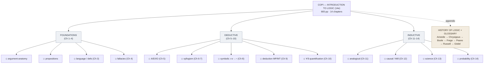

# Copi — Introduction to Logic

**Summary**: Irving M. Copi, Carl Cohen, and Kenneth McMahon's *Introduction to Logic*, 14th edition (Pearson 2014, ISBN 978-1-292-02482-0). Standard university textbook covering classical Aristotelian categorical logic, propositional and predicate symbolic logic, the canonical informal-fallacy taxonomy, inductive reasoning, and probability. The wiki's authoritative source for [argument-anatomy](./argument-anatomy.md), [validity-vs-soundness](./validity-vs-soundness.md), [fallacy-taxonomy](./fallacy-taxonomy.md), and the categorical / symbolic / quantification atoms in the [Logic Atomic Design](./logic-atomic-design.md) hub.

**Sources**:
- Irving M. Copi, Carl Cohen, Kenneth McMahon. *Introduction to Logic*, 14th ed. Pearson Education Limited 2014. 665 pp. Pearson Custom Library imprint; ISBN 10 1-292-02482-8 / ISBN 13 978-1-292-02482-0. Source PDF at `C:\Users\David\Documents\Book-Introductiontologic.pdf`; extracted text at `.tmp/logic_ingest/intro_*.txt`.
- The 14th edition's chapter order (basic concepts → analyzing arguments → language → fallacies → categorical propositions → categorical syllogisms → syllogisms in ordinary language → symbolic logic → methods of deduction → quantification theory → analogical reasoning → causal reasoning → science and hypothesis → probability) reflects the canonical pedagogical sequence going back to the 1953 first edition.

**Last updated**: 2026-05-25

---

## Unlocks (lead, not footer)

1. **Argument-anatomy reflex.** Copi's premise/conclusion-indicator vocabulary + enthymeme + the validity-vs-soundness distinction turn into a wiki-grade [Red Queen Gym](./red-queen-skill-gym.md) drill: extract premises and conclusion from any English paragraph in <60 s. Owner page: [argument-anatomy](./argument-anatomy.md). METER target: ≥80% extraction accuracy.

2. **Fallacy-recognition gym — promotes the recognition-gym pattern N=2 → N=3.** Copi's three-family fallacy taxonomy (Relevance · Presumption · Ambiguity, ~25 named fallacies) gives the third instance of the recognition-gym candidate-pattern in [composability-index](./composability-index.md). Construct-recognition (code) and crux-recognition (puzzles) were the first two; fallacy-recognition is the third — triggering the candidate-pattern's promotion rule.

3. **Categorical syllogism as Logic-Atomic-Design molecule.** The A/E/I/O distribution table + mood/figure schema instantiates the [logic-atomic-design](./logic-atomic-design.md) Molecule tier with a worked, drillable example. Sister to the symbolic-logic deduction molecules (Modus Ponens, Modus Tollens, Hypothetical Syllogism, Disjunctive Syllogism).

4. **Validity-vs-soundness as the wiki's load-bearing logic distinction.** The wiki has been using *valid argument* and *sound argument* informally; Copi's precise distinction is the canonical citation. Validity is about *form*; soundness adds *true premises*. The distinction underpins [problem-solving-os](./problem-solving-os.md)' deductive-check sub-step.

## Mnemonic

**ABFC-SQ-IP** = *Argument · Basic-concepts · Fallacies · Categorical · Symbolic · Quantification · Induction · Probability*.

The book's 14 chapters compress to 8 anchor blocks; the four-letter prefix **ABFC** plays as "All-British-Foundation-Course" (Aristotelian core); the three-letter middle **SQ-I** plays as the symbolic / quantification / induction shift to modern logic; **P** closes on probability as the bridge to Bayesian epistemology.

## Memory checksum

If you can answer these in <60 s each from memory, the page is encoded:

1. What is the difference between **validity** and **soundness**? (validity: if-premises-true-then-conclusion-true; soundness: validity + true premises)
2. Name the four **standard-form categorical propositions** and what each distributes. (A: All-S-is-P, distributes subject only; E: No-S-is-P, distributes both; I: Some-S-is-P, distributes neither; O: Some-S-is-not-P, distributes predicate only)
3. Name Copi's **three families of fallacies**. (Relevance · Presumption · Ambiguity)
4. State **Modus Ponens** and the invalid form it is confused with. (MP: *P → Q; P; ∴ Q*. Confusion: *affirming the consequent*: *P → Q; Q; ∴ P*.)
5. What is an **enthymeme**? (An argument with one or more premises unstated but understood; common in everyday discourse; surfacing the unstated premise is the first move of analysis.)

## Visual — the chapter spine

---

## Chapter map (atom inventory)

The 14 chapters map onto the [logic-atomic-design](./logic-atomic-design.md) five-tier spine as follows:

| Chapter | Tier | What it adds |
|---|---|---|
| Ch 1. Basic Logical Concepts | Atoms (Structural) | argument · proposition · premise · conclusion · inference · deductive vs inductive · validity vs truth |
| Ch 2. Analyzing Arguments | Templates | argument-diagramming schema; main vs sub-argument; premise/conclusion indicators |
| Ch 3. Language and Definitions | Atoms (Communicative) | three uses of language (informative · expressive · directive); five kinds of definition; emotive vs cognitive meaning |
| Ch 4. Fallacies | Molecules (~25 named) | three families (Relevance · Presumption · Ambiguity); detection signatures |
| Ch 5. Categorical Propositions | Templates | A/E/I/O schema; quantity (universal/particular); quality (affirmative/negative); distribution; copula; existential import |
| Ch 6. Categorical Syllogisms | Molecules + Organism | three terms (major · minor · middle); mood + figure; the 256 candidate forms; 24 valid; six rules; Venn-diagram evaluation |
| Ch 7. Syllogisms in Ordinary Language | Pages | reducing English to standard form; eliminating synonyms; converting/obverting/contraposing |
| Ch 8. Symbolic Logic | Atoms (Connectives) | ∧ · ∨ · → · ↔ · ¬; truth tables; tautology · contradiction · contingency; material implication |
| Ch 9. Methods of Deduction | Molecules (Rules) | 9 elementary inference rules (MP · MT · HS · DS · CD · DD · Simp · Conj · Add) + 10 replacement rules (DeM · Comm · Assoc · Dist · DN · Trans · Impl · Equiv · Exp · Taut); conditional proof; reductio |
| Ch 10. Quantification Theory | Atoms (Connectives) | ∀x · ∃x; UI · UG · EI · EG instantiation rules; multiply-quantified statements; identity |
| Ch 11. Analogical Reasoning | Molecules | six criteria for analogical argument strength (number of instances · variety · relevance · disanalogies · claim modesty · …) |
| Ch 12. Causal Reasoning | Organisms | Mill's five methods (Agreement · Difference · Joint · Residues · Concomitant Variation) |
| Ch 13. Science and Hypothesis | Templates | seven-stage scientific-method template; hypothesis evaluation criteria |
| Ch 14. Probability | Atoms + Molecules | a-priori vs relative-frequency theories; product theorem (joint); sum theorem (disjoint); calculation of complex events |

Plus: *A Very Brief History of Logic* (appendix) — Aristotle → Stoics (Chrysippus) → Medieval (Aquinas, Ockham) → Boole 1854 → Frege 1879 → Peano → Russell-Whitehead → Gödel 1931.

Plus: Glossary — Pearson's in-book glossary; ~120 entries. Cross-checked against the wiki's own [Logic layer](./glossary.md) section; no name collisions.

## Where the chapters slot into the wiki

| Copi chapter | Existing wiki neighbor | What gets added |
|---|---|---|
| Ch 1 Basic concepts | [methods-of-mathematical-argument](./methods-of-mathematical-argument.md) (Zeitz) — covers the *argument-construction* side | [argument-anatomy](./argument-anatomy.md) adds the *argument-extraction* side (read an English paragraph, identify premise + conclusion); [validity-vs-soundness](./validity-vs-soundness.md) adds the form/content distinction. Sister, not duplicate. |
| Ch 4 Fallacies | [anti-tactic-detection](./anti-tactic-detection.md) · [red-herring-resistance](./red-herring-resistance.md) · [lateral-thinking-puzzles](./lateral-thinking-puzzles.md) (Livingstone-Thomson) — puzzle-specific anti-patterns | [fallacy-taxonomy](./fallacy-taxonomy.md) is the *general* superset; the brain-teaser pages are the *puzzle-corpus instance*. Cross-link both ways. |
| Ch 5-7 Categorical | (no existing page) | New [logic-atomic-design](./logic-atomic-design.md) Molecules section; A/E/I/O schema as a Template |
| Ch 8-9 Symbolic / Deduction | [methods-of-mathematical-argument](./methods-of-mathematical-argument.md) (Zeitz, 4 methods: direct · contradiction · induction-standard · induction-strong) | Cross-link: the four Zeitz methods are *strategies*; Copi's 19 deduction rules are the *atoms* that compose into them. |
| Ch 10 Quantification | (no existing page) | Future Wave-2 page; for now, registered in [logic-atomic-design](./logic-atomic-design.md) §Templates |
| Ch 11-13 Inductive | (no existing page) | Future Wave-2 page; Mill's methods cross-link to [problem-solving-os](./problem-solving-os.md) §Diagnose |
| Ch 14 Probability | (no existing page) | Future Wave-2 page; cross-link to [ORACLE](./oracle-overview.md) distributional mode |
| History appendix | (no existing page) | Cross-link to [logicomix-graphic-novel](./logicomix-graphic-novel.md) which covers the same names with narrative depth |

## METER integration

| Drill | Pass floor | Source | Owner |
|---|---|---|---|
| Argument extraction (premise + conclusion ID from English paragraph) | <60 s, ≥80% accuracy | Copi Ch 1 exercises (≥30 per chapter) | [argument-anatomy](./argument-anatomy.md) |
| Validity test reflex | <30 s; name a counter-example for invalid, declare valid otherwise | Copi Ch 6 + Ch 8 exercises | [validity-vs-soundness](./validity-vs-soundness.md) |
| Fallacy recognition | <60 s, ≥70% naming accuracy | Copi Ch 4 worked examples + exercises | [fallacy-taxonomy](./fallacy-taxonomy.md) |
| Symbolic translation (English → ∧∨→¬ notation, ≤3 connectives) | <90 s | Copi Ch 8 exercises | [logic-atomic-design](./logic-atomic-design.md) §Templates |
| Syllogism form ID (name mood + figure given English argument) | <60 s | Copi Ch 6 exercises | [logic-atomic-design](./logic-atomic-design.md) §Molecules |

## Authority and limits

**Authoritative for**: the canonical taxonomies (fallacies, syllogism moods/figures, deduction rules), exercise sets, definitions, the 14th-edition glossary.

**Citation-grade**: Copi has been the standard US undergraduate logic textbook since 1953; 14 editions; cross-referenced in [methods-of-mathematical-argument](./methods-of-mathematical-argument.md) §Conventions and elsewhere.

**Not covered (gap)**: modal logic · model theory · type theory / Curry-Howard · non-classical logics · computational logic (SAT/SMT) · ~~modern proof theory~~ → **now covered by [Mancosu-Galvan-Zach (2021)](./proof-theory-mancosu-galvan-zach.md) ingested 2026-05-27** as the *metalogic tier* sitting above Copi's symbolic-logic atoms; gives [formal natural deduction](./natural-deduction.md), [sequent calculus](./sequent-calculus.md), [normalization](./normalization-theorem.md), [cut-elimination](./cut-elimination-hauptsatz.md), [ε₀](./epsilon-zero-and-ordinal-induction.md), [Gentzen's PA-consistency proof](./consistency-of-peano-arithmetic.md) · Bayesian/inductive logic beyond Ch 14. See [logic-atomic-design](./logic-atomic-design.md) §Gaps and the proposed Wave-2 supplements (Smullyan · Sider · Pierce or Sørensen-Urzyczyn for Curry-Howard).

## Related pages

- [logic-atomic-design](./logic-atomic-design.md) — the hub that organizes Copi's atoms/molecules/templates
- [argument-anatomy](./argument-anatomy.md) — Copi Ch 1 concept page
- [validity-vs-soundness](./validity-vs-soundness.md) — Copi Ch 1 + Ch 6 concept page
- [fallacy-taxonomy](./fallacy-taxonomy.md) — Copi Ch 4 concept page
- [methods-of-mathematical-argument](./methods-of-mathematical-argument.md) — Zeitz's sister page on proof-construction methods
- [tractatus-logico-philosophicus](./tractatus-logico-philosophicus.md) — paired primary text (1922) the wiki ingested simultaneously
- [logicomix-graphic-novel](./logicomix-graphic-novel.md) — paired narrative source (2009)
- [proof-theory-mancosu-galvan-zach](./proof-theory-mancosu-galvan-zach.md) — the metalogic-tier sequel; closes the "modern proof theory" gap (added 2026-05-27)
- [natural-deduction](./natural-deduction.md) · [sequent-calculus](./sequent-calculus.md) · [normalization-theorem](./normalization-theorem.md) · [cut-elimination-hauptsatz](./cut-elimination-hauptsatz.md) — the formal versions of Copi Ch 9's informal deduction system
- [problem-solving-os](./problem-solving-os.md) — operating sequencer that gains a validity-test sub-step from this ingest
- [glossary](./glossary.md) — Logic layer registration
