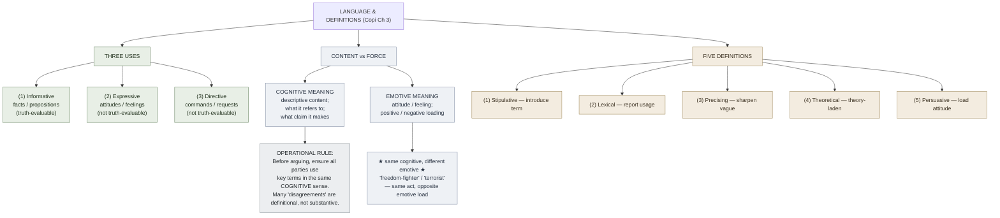

# Language and Definitions (Copi Ch 3)

**Summary**: [Copi](./copi-introduction-to-logic.md) Ch 3's treatment of the **three uses of language** (informative · expressive · directive) + the **five kinds of definition** (stipulative · lexical · precising · theoretical · persuasive) + the distinction between **cognitive and emotive meaning**. The Atom-tier in the Communicative family for [logic-atomic-design](./logic-atomic-design.md). **Load-bearing for resolving disputes** — many arguments fail because the disputants are using the same word in different senses, or are confusing emotive force with cognitive content.

**Sources**:
- [Copi/Cohen/McMahon](./copi-introduction-to-logic.md) *Introduction to Logic* 14th ed, Ch 3 *Language and Definitions*.
- C.L. Stevenson, *Ethics and Language* (1944) — the original distinction between cognitive and emotive meaning, formalized.
- [fallacy-taxonomy](./fallacy-taxonomy.md) §Ambiguity — equivocation, amphiboly, accent, composition, division all fail because of definitional issues addressed here.

**Last updated**: 2026-05-25

---

## One-line

> Language has three uses (informative · expressive · directive); definitions come in five kinds (stipulative · lexical · precising · theoretical · persuasive); meaning splits into cognitive content + emotive force. **Most disputes are definitional**; clarifying terms before arguing dissolves much disagreement.

## Unlocks (lead, not footer)

1. **Three uses of language clarify what an utterance is *for*.** When someone says *"You should care more"* — is it informative (asserting a fact about caring)? Expressive (expressing the speaker's frustration)? Directive (commanding the listener to care more)? The three uses are often **mixed in single utterances**; clarifying which is load-bearing prevents responding to the wrong dimension.

2. **Five kinds of definition handle different needs.** Each definition kind serves a different purpose: stipulative (you're introducing a new word); lexical (reporting standard usage); precising (sharpening a vague term for technical use); theoretical (proposing a definition that fits the theoretical landscape); persuasive (loading the definition with emotive content). **Knowing which kind a given definition aims for prevents talking-past-each-other.**

3. **Emotive meaning is the engine of most political language.** Stevenson's distinction: a word carries *cognitive meaning* (the descriptive content) + *emotive meaning* (the attitude/feeling associated with the word). *"Freedom-fighter"* vs *"terrorist"* have similar cognitive meanings (someone using violence for political ends) but opposite emotive meanings. **Political discourse runs largely on emotive substitution**; analytical rigor requires separating the two layers.

4. **Many fallacies are definitional.** [Equivocation](./fallacy-taxonomy.md) uses a word in two cognitive senses across an argument. [Persuasive definition](./fallacy-taxonomy.md) smuggles a contested claim into a term's definition. *"True conservatives believe X"* — anyone who doesn't believe X is excluded by definition, not by argument. **Most slippery-slope and no-true-Scotsman moves are persuasive-definition operations.**

## Mnemonic

**I-E-D** = *Informative · Expressive · Directive.*

Three uses of language. Read directly.

**S-L-P-T-P** = *Stipulative · Lexical · Precising · Theoretical · Persuasive.*

Five kinds of definition. Read as *"Stop Loving Pretty Theatrical Persuaders"* or directly *S-L-P-T-P*.

## Memory checksum

1. **State the three uses of language.** (Informative: communicates facts/propositions. Expressive: expresses feelings/attitudes. Directive: commands or requests action. Often mixed in single utterances.)
2. **State the five kinds of definition.** (Stipulative: introduce a new word/sense; cannot be true/false. Lexical: report standard usage; can be accurate/inaccurate. Precising: sharpen a vague term; partially stipulative. Theoretical: propose a definition that fits the theoretical landscape; contested by competing theories. Persuasive: load the definition with emotive content to influence attitude.)
3. **Distinguish cognitive from emotive meaning.** (Cognitive: descriptive content; what the word *refers to*. Emotive: attitude/feeling associated with the word. Same cognitive meaning may have opposite emotive meanings (*"freedom-fighter"* vs *"terrorist"*).)
4. **Why is persuasive definition fallacious?** (It smuggles a contested claim into a term's definition, making disagreement appear definitional rather than substantive. *"A true patriot believes X"* — anyone who doesn't believe X is excluded by definition, not by argument.)
5. **State the operational rule.** (Before arguing about a claim, ensure all disputants use key terms in the same cognitive sense. Many arguments dissolve into definitional disagreement, which is a different kind of dispute.)

## Visual — the language + definition map

The map shows the three dimensions: use (left), meaning (middle), definition kind (right). All three are needed for clean analysis.

---

## The three uses of language

### Informative use

Language communicating facts, propositions, descriptive content. **Truth-evaluable**: the utterance is true or false.

Examples:
- *"The capital of France is Paris."*
- *"Water boils at 100°C at sea level."*
- *"The defendant was in the building at 9 PM."*

This is the use [premises and conclusions](./argument-anatomy.md) live in; logic deals primarily with informative language.

### Expressive use

Language expressing feelings, attitudes, emotions. **Not truth-evaluable**: an expression of grief isn't *true* or *false*; it's *appropriate* or *inappropriate*.

Examples:
- *"How wonderful!"*
- *"That's terrible."*
- Most of poetry, lyrical writing, emotional outbursts.

Logic doesn't directly evaluate expressive uses — they aren't propositions in [Copi's sense](./argument-anatomy.md).

### Directive use

Language commanding, requesting, or instructing action. **Not truth-evaluable**: a command isn't *true* or *false*; it's *obeyed*, *defied*, *appropriate*, *inappropriate*.

Examples:
- *"Close the door."*
- *"Please pass the salt."*
- *"You should care more about your health."*

Logic doesn't directly evaluate directives; but [the argument structure supporting *why* the directive is appropriate](./argument-anatomy.md) is evaluable.

### Mixed uses (the common case)

**Most real utterances mix all three.**

Example: *"Smoking is killing you, and you should quit now!"*
- *"Smoking is killing you"* — primarily informative (a claim about smoking's effects).
- *"and you should quit now"* — primarily directive (command to quit).
- The exclamation mark + *"killing you"* — expressive (urgency, alarm).

**The analyst's reflex**: when evaluating an utterance, identify *which use is doing the load-bearing work*. Responding to the wrong dimension (e.g., debating the truth of a directive, or following a command that was meant expressively) is the standard failure mode of misreading communication.

## The five kinds of definition

### Stipulative definition

You're introducing a new word or a new sense for an existing word. **Cannot be true or false** — it's a proposal.

Examples:
- *"By 'snerg' I shall mean any pet I own."*
- *"In this paper, I'll use 'high resource' to mean households earning above the 90th percentile."*

Stipulative definitions are useful for technical clarity. They're not subject to evaluation as truth-claims; they're evaluated as *useful* or *not useful* for the discourse.

### Lexical definition

Reports standard usage of a term. **Can be true or false** — accurate or inaccurate reports of how the language community uses the word.

Examples:
- *"'Cat' means a small carnivorous mammal of the family Felidae."*
- *"'Inflation' in economics means a sustained increase in the general price level."*

Lexical definitions are what dictionaries do. They can be wrong (the lexicographer can mischaracterize usage); they're evaluated against actual community usage.

### Precising definition

Takes a vague term and *sharpens* it for technical use. Partly stipulative (the speaker is choosing where to draw the line) and partly lexical (the choice should align with normal usage).

Examples:
- *"For purposes of this study, an 'adult' is anyone 18 or older."* (precising the boundaries of an otherwise-vague term)
- *"A 'small business' is one with fewer than 100 employees."* (precising for legal/regulatory use)

Precising definitions are essential in technical, legal, and scientific work. They prevent disputes about borderline cases by stipulating the rule.

### Theoretical definition

Proposes a definition that **fits the theoretical landscape** — captures the term's role in a larger theory. Contested across competing theories.

Examples:
- *"Heat is mean kinetic energy of molecular motion."* (theoretical definition from kinetic theory of gases)
- *"Disease is a disorder of structure or function in an organism."* (theoretical definition; competes with germ-theory specific definitions and evolutionary-medicine alternatives)

Theoretical definitions are evaluated as parts of larger theories; they're *good* if the theory they fit is correct and predictive.

### Persuasive definition

Loads the definition with **emotive content** to influence attitudes. The cognitive meaning is altered to smuggle in a value judgment.

Examples:
- *"A true patriot believes in our nation's mission."* (smuggles the substantive claim "the nation's mission is good" into the definition of patriot)
- *"Real Christians oppose abortion."* (smuggles a substantive moral position into the definition of Christian)
- *"Genuine art is uplifting and morally instructive."* (smuggles aesthetic claim into the definition of art)

**Persuasive definitions are operationally a fallacy** — they make disagreement appear definitional rather than substantive. Anyone who disagrees with the smuggled claim is *by definition* not a patriot/Christian/art-appreciator. The wiki cross-links this to [persuasive-definition fallacy](./fallacy-taxonomy.md) and to the "no-true-Scotsman" rhetorical move.

## Cognitive vs emotive meaning

C.L. Stevenson (*Ethics and Language* 1944) formalized the distinction:

| Aspect | Cognitive meaning | Emotive meaning |
|---|---|---|
| Function | What the word *refers to* | The attitude/feeling associated with the word |
| Evaluability | True/false (when used in propositions) | Positive/negative (attitudinal) |
| Example pair | Same: act of using violence for political ends | Opposite: hero (positive) vs criminal (negative) |
| Standard pair | "freedom-fighter" vs "terrorist" | (same cognitive content; opposite emotive) |
| Standard pair | "frugal" vs "stingy" | (same cognitive content; opposite emotive) |
| Standard pair | "decisive" vs "stubborn" | (same cognitive content; opposite emotive) |
| Standard pair | "ambitious" vs "ruthless" | (same cognitive content; opposite emotive) |

**Most political and ethical discourse is loaded with emotive substitution.** Two speakers describing the same situation can produce wildly different reactions in the audience by choosing words with the same cognitive content but opposite emotive loading.

**The analyst's reflex**: when evaluating an utterance, **identify the cognitive content separately from the emotive load**. *Then* decide whether to accept the cognitive claim. The emotive content is information about the speaker's attitude; it isn't part of the truth-conditions of the claim.

## Operational rule — definitional clarification first

Many disputes are at root *definitional* — disputants are using a key term in different senses.

**Standard procedure**:

1. **Identify the key terms** that are doing load-bearing work in the dispute.
2. **Ask each disputant** for a definition (or characterization) of the key term.
3. **Compare the definitions**:
   - If they're using the same definition → the dispute is substantive; continue.
   - If they're using different definitions → identify whether the disagreement is *about which definition is correct* (a different kind of dispute) or *substantive* (then resolve definitions first).
4. **Stipulate or precise** if necessary — agree to use a precising or stipulative definition for the duration of the discussion.
5. **Then re-examine** the original dispute.

**Many "intractable" disputes dissolve** when both parties realize they were using the same word in different senses. (E.g., political debates over "socialism" — the speakers often mean very different things.)

## Cross-link to [fallacies of ambiguity](./fallacy-taxonomy.md)

[fallacy-taxonomy](./fallacy-taxonomy.md) Family 3 (Ambiguity) contains fallacies that fail because of definitional issues:

| Fallacy | What it does |
|---|---|
| **Equivocation** | Uses a word in two cognitive senses across the argument |
| **Amphiboly** | Structural ambiguity exploited |
| **Accent** | Meaning shift by emphasis change |
| **Composition** | Property of parts attributed to whole (often a definitional error) |
| **Division** | Property of whole attributed to parts (often a definitional error) |
| **Persuasive definition** | Smuggles a substantive claim into a definition |

All six are addressable by **clearly stating the cognitive content of key terms before arguing**. This chapter (Copi Ch 3) is the *prerequisite* for [Ch 4](./fallacy-taxonomy.md).

## METER integration

| Drill | Pass floor | Source |
|---|---|---|
| Identify the use of language (I/E/D) in a given utterance | <15 s | Copi Ch 3 exercises |
| Name the kind of definition being used | <30 s | this page §Five kinds |
| Distinguish cognitive from emotive meaning in a politically-loaded term | <30 s | this page §Cognitive vs emotive |
| Identify a persuasive definition and reformulate it neutrally | <60 s | this page §Persuasive definition |
| Apply the definitional-clarification rule to dissolve a dispute | <120 s, written | this page §Operational rule |

## Related pages

- [copi-introduction-to-logic](./copi-introduction-to-logic.md) — Ch 3 source
- [argument-anatomy](./argument-anatomy.md) — Ch 1 atoms; definitional clarity prerequisite for argument analysis
- [copi-analyzing-arguments](./copi-analyzing-arguments.md) — Ch 2 sister
- [fallacy-taxonomy](./fallacy-taxonomy.md) — Family 3 (Ambiguity); fallacies addressable by definitional clarity
- [validity-vs-soundness](./validity-vs-soundness.md) — soundness requires true premises which requires shared cognitive meanings
- [picture-theory-of-language](./picture-theory-of-language.md) — TLP picture-theory grounds the cognitive meaning side
- [show-vs-say](./show-vs-say.md) — emotive meaning often shows itself in tone; cognitive meaning is said in propositions
- [bridge-load](./bridge-load.md) — analogical clarification at the conceptual level
- [logic-atomic-design](./logic-atomic-design.md) — Atom-tier (Communicative family) registered
- [glossary](./glossary.md) — Logic layer registration
