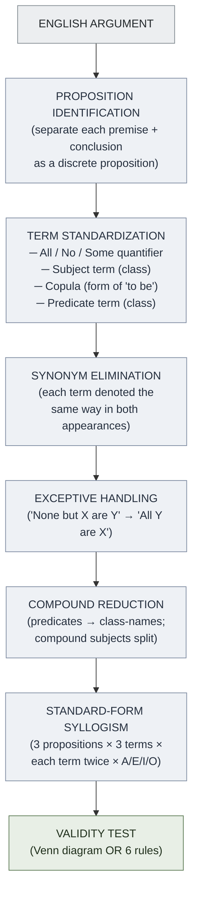
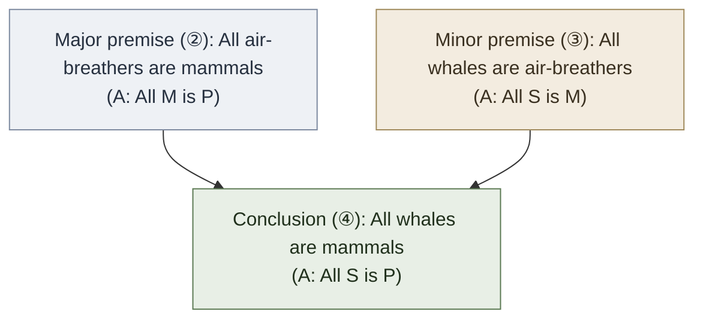

# Syllogisms in Ordinary Language (Copi Ch 7)

**Summary**: [Copi](./copi-introduction-to-logic.md) Ch 7's bridge from real-world English arguments to the [standard-form categorical syllogism](./categorical-syllogism.md) machinery of Ch 5-6. **The translation gym**: take a sloppy English argument, reduce it to A/E/I/O propositions with consistent terms, then apply Ch 6's validity test. **Cross-link to [copi-language-and-definitions](./copi-language-and-definitions.md)** (definitional clarity is the prerequisite) and to [equivocation/amphiboly](./fallacy-taxonomy.md) (translation failures = ambiguity fallacies).

**Sources**:
- [Copi/Cohen/McMahon](./copi-introduction-to-logic.md) *Introduction to Logic* 14th ed, Ch 7 *Syllogisms in Ordinary Language*.
- [categorical-syllogism](./categorical-syllogism.md) — what to translate *into*.
- [copi-language-and-definitions](./copi-language-and-definitions.md) — definitional clarity prerequisite.

**Last updated**: 2026-05-25

---

## One-line

> Take English arguments. Reduce each proposition to standard form: **All/No/Some S is/is-not P**. Ensure each term appears in *exactly two propositions*, denoted the *same way each time*. Then apply [Ch 6's validity test](./categorical-syllogism.md).

## Unlocks (lead, not footer)

1. **The translation step is where most real arguments break.** [Ch 6's validity test](./categorical-syllogism.md) is mechanical once you have a standard-form syllogism. **But translation from real English is non-trivial** — synonyms, compound subjects, exceptive propositions, hidden quantifiers, all need to be normalized. **The wiki's reflex**: when an English argument seems valid but produces a strange conclusion, suspect the translation, not the validity test.

2. **Compound terms must be reduced to single terms.** *"Most cats hunt"* must become *"Some cats are hunters"* (not *"Most cats are hunters"* — there's no "most" quantifier in Ch 6's machinery). *"Whales swim"* becomes *"All whales are swimming-things"* — the predicate becomes a class-name. **The reductions are not trivial; mistakes here propagate into invalid validity-test results.**

3. **Synonym-elimination is load-bearing.** A categorical syllogism requires *each term to appear in exactly two propositions, denoted the same way each time*. If one premise says *"mortal beings"* and another says *"creatures that die"*, the validity test will fail because there will be *four* terms instead of three. **The reflex**: replace synonyms before validity-testing.

4. **Exceptive propositions are tricky.** *"None but doctors prescribe"* doesn't mean *"No doctors prescribe"* — it means *"All prescribers are doctors"*. *"All except graduates may apply"* doesn't mean *"All non-graduates may apply"* — it can mean *"No graduates may apply"* (exclusive reading) or *"All non-graduates may apply"* (extensive reading), and the right reading depends on context. **Exceptive propositions are a major source of translation errors.**

## Mnemonic

**T-S-E-C** = *Term standardization · Synonym elimination · Exceptive handling · Compound reduction.*

Four translation moves. Read directly as *T-S-E-C*.

## Memory checksum

1. **State the standard form of a categorical syllogism.** ([Three propositions](./categorical-syllogism.md) in A/E/I/O form: two premises, one conclusion. Three terms (major · minor · middle), each appearing exactly twice. Quantifier-subject-copula-predicate.)
2. **State the four translation moves.** (Term standardization: make each proposition fit *"All/No/Some S is/is-not P"*. Synonym elimination: each term should be denoted the same way each time. Exceptive handling: *"None but X are Y"* = *"All Y are X"*. Compound reduction: predicates that aren't class-names become class-names (*"swim"* → *"swimming-things"*).)
3. **What is the "exactly three terms" rule?** ([Six rules of syllogism rule 1](./categorical-syllogism.md): a valid syllogism has exactly three terms, each appearing in exactly two propositions. More than three (often via synonyms) = invalid. Fewer than three = also invalid.)
4. **Translate "Most cats hunt" to standard form.** (*"Some cats are hunters"*. *"Most"* doesn't exist in Ch 6's machinery; the closest faithful translation is *"some"* — but note that *"most"* implies more than *"some"*, so information is lost in translation. The validity test will be more conservative than the original argument warrants.)
5. **Translate "Whales swim" to standard form.** (*"All whales are swimming-things"*. The predicate must become a class-name; the copula must be a form of *to be*.)

## Visual — the translation pipeline

The final step feeds the [validity test](./categorical-syllogism.md) (Venn diagram or the six rules).

The pipeline turns sloppy English into a testable categorical syllogism. **Each step is where errors enter; each step requires explicit attention.**

---

## The four translation moves

### Move 1 — Term standardization

Every proposition must fit the pattern: **Quantifier · Subject term · Copula · Predicate term**.

Sloppy English | Standardized form
---|---
"All dogs bark" | "All dogs are barking-things"
"Some students fail" | "Some students are failing-students" or "Some students are individuals-who-fail"
"No one likes broccoli" | "No people are broccoli-likers"
"Most cats hunt" | "Some cats are hunters" (lossy — "most" → "some")

**The predicate must be a class-name (a noun or noun-phrase)**, not a verb. *"All dogs bark"* needs *"barking-things"* as the predicate-class. This is awkward but necessary for Ch 6's machinery.

### Move 2 — Synonym elimination

Each term must appear in exactly two propositions, **denoted identically both times**.

Sloppy English:
- All humans are mortal beings.
- Socrates is a man.
- Therefore Socrates is a creature that dies.

Reduced (with synonyms eliminated):
- All humans are mortal beings.
- Socrates is a human (was "man" → "human").
- Therefore Socrates is a mortal being (was "creature that dies" → "mortal being").

Now we have three terms (humans · mortal beings · Socrates), each appearing exactly twice.

**The synonym-elimination move is the source of most translation errors.** A practitioner who fails to notice that "man" and "human" are being used interchangeably will end up with *four* terms instead of three, triggering [six-rules-of-syllogism rule 1](./categorical-syllogism.md) (exactly three terms).

### Move 3 — Exceptive handling

Exceptive propositions are the most-confusable:

| English form | Standard form |
|---|---|
| **"None but X are Y"** | "All Y are X" |
| **"None except X are Y"** | "All Y are X" |
| **"Only X are Y"** | "All Y are X" |
| **"All except X are Y"** | Ambiguous — usually "All non-X are Y" (extensive); sometimes "No X are Y" (exclusive). Context resolves. |
| **"X alone are Y"** | "All Y are X" |
| **"X are the only Y"** | "All Y are X" |

The reflex: **"none but" / "only" / "alone" → invert the subject and predicate, drop the "but"**.

Common error: confusing *"None but doctors prescribe"* with *"No doctors prescribe"*. The first means *"all prescribers are doctors"* (restrictive); the second means the opposite (exclusion). **The reflex to invert is the antidote.**

### Move 4 — Compound reduction

Compound subjects:
- *"Cats and dogs are mammals"* → *"All cats are mammals"* AND *"All dogs are mammals"* (split into two propositions).
- *"Either cats or dogs are mammals"* → *"All cats are mammals"* OR *"All dogs are mammals"* (logical disjunction).

Compound predicates:
- *"Whales swim and breathe air"* → *"All whales are swimming-things"* AND *"All whales are air-breathers"* (split into two propositions).

Numerical claims:
- *"Most cats hunt"* → *"Some cats are hunters"* (lossy — exact "more than half" lost).
- *"Few politicians are honest"* → *"Some politicians are not honest"* (lossy).
- *"All but 3 students passed"* → *"Some students are not pass-students"* (or compound: *"All students except 3 are pass-students"*).

**Compound reductions are lossy** — information is discarded. The Ch 6 machinery doesn't handle "most" / "few" / "almost all" precisely; precise numerical claims need predicate logic ([Ch 10 quantification](./methods-of-deduction.md)) or probability theory ([Ch 14](./probability-as-logic.md)).

## Worked example — full translation

**English passage**:
> *"Whales swim. None but mammals breathe air. Therefore, since whales breathe air, whales are mammals."*

Step 1: Proposition identification.
- ① Whales swim.
- ② None but mammals breathe air.
- ③ [implicit premise] Whales breathe air.
- ④ Therefore whales are mammals.

Step 2: Term standardization.
- ① All whales are swimming-things.
- ② [exceptive] All air-breathers are mammals.
- ③ All whales are air-breathers.
- ④ All whales are mammals.

Step 3: Synonym elimination. (None needed here — no synonyms in this example.)

Step 4: Exceptive handling.
- ② applied: *"None but mammals breathe air"* → *"All air-breathers are mammals"*. ✓ (already done in Step 2)

Step 5: Compound reduction. (None needed.)

**Result**: standard-form syllogism (focusing on ②-③-④, the actual syllogism):

Mood: AAA. Figure: 1 (middle term *air-breathers* is subject of major, predicate of minor).
**Form: AAA-1 (Barbara)** — [unconditionally valid](./categorical-syllogism.md).

The English argument was valid; the translation made it testable.

Note: proposition ① (*All whales are swimming-things*) is **not** part of the syllogism — it's just background context. Real arguments often contain extra propositions; the analyst must identify which form the actual syllogism.

## Common failure modes

- **Four-term fallacy** (synonym not eliminated). *"All humans are mortal; Socrates is a man; therefore Socrates is mortal"* — looks like 3 terms, but actually 4 (humans / mortals / Socrates / man) until synonym elimination unifies "human" and "man".
- **Exceptive misreading.** *"None but doctors prescribe"* misread as *"No doctors prescribe"*. The inversion rule must be applied.
- **Compound reduction loss.** *"Most cats hunt"* reduced to *"Some cats are hunters"* loses precision; the validity test is conservative.
- **Predicate verb not class-name.** *"All dogs bark"* left as-is; needs *"barking-things"* as predicate-class for Ch 6's machinery.
- **Quantifier confusion.** *"There is at least one X"* vs *"Some X"* are equivalent in Ch 6's machinery; *"There are many X"* vs *"Some X"* loses precision.

## When to abandon categorical-syllogism translation

[Categorical-syllogism](./categorical-syllogism.md) machinery handles a *fragment* of natural language. When the argument requires:

- **Numerical claims** (precisely "more than half", "exactly three", "at least N") → [probability](./probability-as-logic.md) or arithmetic.
- **Multiple quantifiers** (*"For every problem there is a solution"*) → [predicate logic Ch 10](./methods-of-deduction.md).
- **Counterfactuals** (*"If X had happened, Y would have"*) → modal logic (queued as Wave-2 supplement; Sider).
- **Causal claims** (*"X causes Y"*) → [Mill's methods](./causal-reasoning-mill-methods.md) + scientific method.
- **Probabilistic claims** (*"X is likely to cause Y"*) → [probability](./probability-as-logic.md) / Bayesian.

**Don't force everything into syllogistic form.** The categorical-syllogism machinery is one tool among several; recognizing its limits is part of effective logical analysis.

## METER integration

| Drill | Pass floor | Source |
|---|---|---|
| Translate an English proposition to standard form | <30 s | Copi Ch 7 exercises |
| Identify and eliminate synonyms | <30 s | this page §Move 2 |
| Handle exceptive propositions correctly | <30 s | this page §Move 3 |
| Reduce compound subjects/predicates | <60 s | this page §Move 4 |
| Translate a full English argument to standard-form syllogism + apply validity test | <300 s | Copi Ch 7 + [categorical-syllogism](./categorical-syllogism.md) |
| Identify when an argument *cannot* be reduced to categorical form (need different logic) | <60 s | this page §When to abandon |

## Related pages

- [copi-introduction-to-logic](./copi-introduction-to-logic.md) — Ch 7 source
- [categorical-syllogism](./categorical-syllogism.md) — Ch 5-6 machinery this chapter feeds into
- [copi-analyzing-arguments](./copi-analyzing-arguments.md) — Ch 2 sister
- [copi-language-and-definitions](./copi-language-and-definitions.md) — Ch 3 sister; definitional clarity is the prerequisite
- [argument-anatomy](./argument-anatomy.md) — Ch 1 atoms
- [fallacy-taxonomy](./fallacy-taxonomy.md) §Ambiguity — translation failures = ambiguity fallacies
- [methods-of-deduction](./methods-of-deduction.md) — Ch 10 predicate logic when categorical-syllogism isn't enough
- [probability-as-logic](./probability-as-logic.md) — when arguments require numerical/probabilistic precision
- [logic-atomic-design](./logic-atomic-design.md) §Templates — translation template registered
- [glossary](./glossary.md) — Logic layer registration
