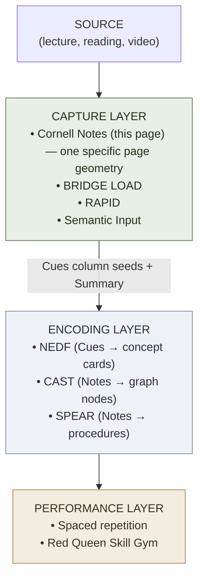

# Cornell Notes Method

**Summary**: The Cornell Notes layout is a three-zone page geometry (**Cues** column · **Notes** column · **Summary** strip) designed by Walter Pauk at Cornell University in the 1950s as a built-in retrieval scaffold for in-class notes. It is **not** a study method per se — it is a *page format* whose geometry forces three discrete operations: capture-during (Notes), cue-extraction-after (Cues), and compression (Summary). In the Neural OS stack, Cornell Notes sit in the **capture / scoping layer** beside [BRIDGE LOAD](./bridge-load.md) and [RAPID](./rapid-in-neural-os.md): it is one specific notebook geometry for getting raw class/lecture/book material into a form that the encoders ([NEDF](./nedf-overview.md) · [CAST](./cast-overview.md) · [SPEAR](./spear-overview.md)) can consume without re-transcribing.

**Sources**:
- Pauk, W. (1962, latest ed. 2013 with Owens). *How to Study in College*, Houghton Mifflin / Cengage. The Cornell Method is the load-bearing chapter; the rest of the book applies it to college study.
- Cornell University Learning Strategies Center — public reference layout (current canonical 3-zone diagram)
- **Internal cross-grounding**: [active-recall](./active-recall.md) (Cues column drives retrieval) · [generation-effect](./generation-effect.md) (Summary strip forces production) · [spaced-repetition](./spaced-repetition.md) (cue-cards extracted from the Cues column feed Anki) · [BRIDGE LOAD](./bridge-load.md) (companion capture-layer protocol for source-to-encoder bridge) · [RAPID](./rapid-in-neural-os.md) (encoder-routing capture layer)
- **Popular surface**: "How Harvard's Students Study" infographic (studytipsvault, 2025) names Cornell Notes as one of six Harvard practices — absorbed during the 2026-06-17 three-infographic `/validate-idea` decomposition (see [composability-index](./composability-index.md))

**Last updated**: 2026-06-17

---

## What it is — the page geometry

The Cornell Notes page is divided into three zones with fixed proportions:

```p5 height=440
p.setup = () => { p.createCanvas(Math.min(el.clientWidth||600, 600), 440); p.noLoop(); };
p.draw = () => {
  p.background(p.isDark ? 30 : 245);
  const ink = p.isDark ? '#ECE4D3' : '#2B2620';
  const sub = p.isDark ? '#b9c9b0' : '#5c7a54';
  const line = p.isDark ? '#6b6558' : '#8a8272';
  p.stroke(line); p.strokeWeight(1.5); p.noFill();

  const margin = 20, w = p.width - margin*2, h = p.height - margin*2;
  const x0 = margin, y0 = margin;
  const headerH = 36;
  const summaryH = h * 0.24;
  const bodyH = h - headerH - summaryH;
  const cuesW = w * 0.32;

  p.rect(x0, y0, w, h);
  p.line(x0, y0 + headerH, x0 + w, y0 + headerH);
  p.line(x0 + cuesW, y0 + headerH, x0 + cuesW, y0 + headerH + bodyH);
  p.line(x0, y0 + headerH + bodyH, x0 + w, y0 + headerH + bodyH);

  p.noStroke(); p.fill(ink); p.textAlign(p.CENTER, p.CENTER); p.textSize(13);
  p.text('Title · Date · Source  (header strip)', x0 + w/2, y0 + headerH/2);

  p.textAlign(p.CENTER, p.TOP);
  p.fill(ink); p.textSize(15);
  p.text('CUES', x0 + cuesW/2, y0 + headerH + 12);
  p.textSize(11);
  p.text('(~2.5 in)', x0 + cuesW/2, y0 + headerH + 32);
  p.text('keywords, questions,\nretrieval prompts', x0 + cuesW/2, y0 + headerH + 56);
  p.fill(sub);
  p.text('filled in AFTER\nthe lecture', x0 + cuesW/2, y0 + headerH + bodyH - 46);

  p.fill(ink); p.textSize(15);
  p.text('NOTES', x0 + cuesW + (w-cuesW)/2, y0 + headerH + 12);
  p.textSize(11);
  p.text('(~6 in)', x0 + cuesW + (w-cuesW)/2, y0 + headerH + 32);
  p.text('in-class capture — bullets,\nabbreviations, diagrams, formulas', x0 + cuesW + (w-cuesW)/2, y0 + headerH + 56);
  p.fill(sub);
  p.text('filled in DURING the\nlecture/reading', x0 + cuesW + (w-cuesW)/2, y0 + headerH + bodyH - 46);

  p.fill(ink); p.textSize(14);
  p.text('SUMMARY (~2 in)', x0 + w/2, y0 + headerH + bodyH + 10);
  p.textSize(11);
  p.text('2–4 sentences compressing the whole page —\nwritten WITHIN 24 HOURS, from memory of\nNotes, checked against Notes.', x0 + w/2, y0 + headerH + bodyH + 32);
};
```

Standard US-letter proportions: ~2.5 in left, ~6 in right, ~2 in bottom. The exact dimensions are not load-bearing; the three-zone *separation* is.

## Why the three zones — what each one forces

The geometry is the discipline. Each zone forces a different cognitive operation; the zones cannot collapse without losing the mechanism.

| Zone | When written | What it forces | Maps to |
|---|---|---|---|
| **Notes** (right) | During the lecture/reading | Selective capture under live pace; you cannot transcribe everything, so you compress in real time | Capture-layer raw input |
| **Cues** (left) | Within hours of class, NOT during | Re-reading your own notes from the production side: *what question would this answer?* — extracting retrieval prompts that did not exist when you wrote the notes | [active-recall](./active-recall.md) cue-extraction; Anki card seeds |
| **Summary** (bottom) | Within 24 hours, from memory | Compression to 2–4 sentences without looking — forces the [generation effect](./generation-effect.md) over the whole page | [generation-effect](./generation-effect.md) · 24-hour review window |

The Cues column is the move that distinguishes Cornell from generic two-column or outline notes. It is written **from memory** after the lecture: you cover the Notes column, look at the Cues, and try to reproduce the relevant content. The Cues column is, in effect, the **first deck of [spaced-repetition](./spaced-repetition.md) cards** for the material — extracted by the student, in their own words, without the cost of building a separate flashcard system.

## Distinguisher — vs. its nearest neighbors

Cornell Notes is often confused with adjacent capture techniques. The differences are operational:

| If you only do… | You miss… | And you have… |
|---|---|---|
| **Notes column** | Cues + Summary | Standard outline notes (no retrieval scaffold) |
| **Notes + Summary** | Cues column | Compressed re-reading (still passive) |
| **Notes + highlighting** | Cues + Summary | Highlighter illusion (recognition-feel, no retrieval) |
| **Mind map** | The 3-zone separation | A different geometry — graph not three-strip; see [buzan-mind-map-mastery](./buzan-mind-map-mastery.md) |
| **Outline only** | The cue-column retrieval prompt slot | Linear hierarchy without retrieval cues |
| **Cornell Notes (all three)** | — | A capture + retrieval-cue + compression stack on one page |

The Cues column is the **non-negotiable** element. A "Cornell Notes" page without a filled Cues column is just outline notes with extra margin.

## Where it sits in the Neural OS stack

Cornell Notes is a **capture-layer geometry**, not an encoder. It produces material that the encoders consume.



**Handoff rule**: Cornell Notes is the **first hour after the lecture**. By the end of that hour, the Cues column is filled and the Summary strip is written. By the end of the day, the Cues column has been mined for [spaced-repetition](./spaced-repetition.md) cards — typically 3–10 cards per page, depending on density. After that, the page is reference material; the durable artifact is the SR deck plus whatever encoder cards the Notes column spawned.

If the page is never mined, you have notes, not encoded knowledge — same failure mode as taking notes and never reviewing them.

## Failure modes

| Failure | Looks like | Mitigation |
|---|---|---|
| **Cues column never filled** | Notes column only, blank left margin | Treat the Cues column as a non-negotiable Step 2 — within 6 hours of class |
| **Cues column written DURING lecture** | Filling both columns in real time | Cues by definition are extracted *from outside* the live-capture flow — write them after |
| **Summary written by re-reading** | Bottom strip is a copy-paste of the Notes column highlights | Summary must be written *from memory* with Notes covered, then checked |
| **Notes column too verbatim** | Trying to transcribe the lecture | Real-time capture must compress; if you can transcribe, you are not thinking |
| **No 24-hour review** | Summary written days later | The Pauk protocol depends on the 24-hour window — sleep-dependent consolidation works on what you reviewed *before* sleep |
| **Pages never mined for SR cards** | Stack of Cornell pages, no Anki deck | The Cues column IS the SR seed list — extract or the protocol stops one step short |
| **Substituting highlighter for Cues** | Marking up the Notes column with colors instead of writing Cues | Highlighting is recognition; Cues are retrieval prompts. The two operations are not interchangeable. |

## Mnemonic

**C·N·S** — *Cues · Notes · Summary*. Read top-down: you live in the **N**otes during class; you write the **C**ues after class; you compress to the **S**ummary before sleep.

Or: the page reads like a **newspaper article** — headlines in the margin (Cues), body copy in the column (Notes), pull-quote at the foot (Summary).

## Memory checksum

After 24 hours, from the page title alone, you should be able to produce:

1. The **three zone names** in their layout positions (Cues left, Notes right, Summary bottom)
2. The **timing rule** for each zone (Notes during, Cues after, Summary within 24h)
3. The **one non-negotiable element** (Cues column written from memory after the lecture)
4. The **handoff**: Cues column → [spaced-repetition](./spaced-repetition.md) deck seeds within the same day
5. **One failure mode** — typically *Cues column never filled* or *Summary by re-reading*

Fail any of these → the page geometry is decorative; you have outline notes with extra margin.

## Visual

The visual identity of this page is the **three-zone newspaper page** itself — see the ASCII diagram above. The canonical drawn version is the Cornell Learning Strategies Center's published layout (US-letter, 2.5/6/2 inch proportions). A Velvet Aeon scene of a single feminine figure writing in the right column with question-marks rising in the left margin and a glowing condensed sentence at the foot of the page would render the protocol; the *figure-forward over environment* rule applies — she is the protocol, the page is her attribute.

(If a rendered PNG is added later, drop it at `wiki/diagrams/cornell-notes-method.png` and reference it here.)

## Related pages

- [bridge-load](./bridge-load.md) — capture-layer sibling (analogy-grounded source absorption)
- [rapid-in-neural-os](./rapid-in-neural-os.md) — capture-layer sibling (encoder-routing protocol)
- [active-recall](./active-recall.md) — the mechanism the Cues column rides on
- [generation-effect](./generation-effect.md) — the mechanism the Summary strip rides on
- [spaced-repetition](./spaced-repetition.md) — Cues column extracts feed this deck
- [encoded-spaced-repetition](./encoded-spaced-repetition.md) — Neural OS extension layered on SR
- [once-seen-never-forget-protocol](./once-seen-never-forget-protocol.md) — per-concept owner; Cornell Notes feeds OSNF Stage A (Assess) raw material
- neural-os-daily-loop — daily cadence in which Cornell pages get mined
- [nedf-overview](./nedf-overview.md) · [cast-overview](./cast-overview.md) · [spear-overview](./spear-overview.md) — encoders that consume Cornell-extracted material
- [buzan-mind-map-mastery](./buzan-mind-map-mastery.md) — alternative capture geometry (graph instead of three-strip)
- [composability-index](./composability-index.md) — registers Cornell as a Tier-2 gap-filler under the 2026-06-17 three-infographic absorption

---

## U — See (CAST)
1. Three-zone page geometry: Cues / Notes / Summary
2. Edges: Notes → Cues (extract); Notes+Cues → Summary (compress); Cues → SR deck (mine)

## D — Name (NEDF)
1. Cornell Notes = three-zone page geometry whose layout forces capture + cue-extraction + compression
2. Distinguisher: Cues column is written **from memory after**, not during; this is the move that separates Cornell from outline notes
3. Failure mode: blank Cues column → outline notes with extra margin

## F — Do (SPEAR)
1. During lecture → fill the Notes column under live pace
2. Within 6 hours → cover Notes, fill the Cues column from memory
3. Within 24 hours → write the Summary strip from memory, then check
4. Same day → mine Cues for spaced-repetition cards
5. After → page becomes reference; durable artifact is the SR deck + encoder cards

## B — Watch (HEART)
1. Cues column blank → student stopped at Step 1
2. Cues written during class → recognition not retrieval
3. Summary copy-pasted from Notes → no generation
4. Page stack with no SR deck → one step short of encoding

## L — Predict (ORACLE)
1. Cues column filled within 6h → SR cards exist by EOD → 24h retention >70%
2. Cues column blank → 24h retention <30%, indistinguishable from re-reading
3. Summary written from memory and corrected → 1-week retention compounds

## R — Act (GRACE)
1. New lecture/reading → Cornell page set up before it starts
2. Page Cues column blank at end of day → fill before sleep; do not let the protocol stop one step short
3. Stack of Cornell pages, no Anki deck → schedule a mining session this week
