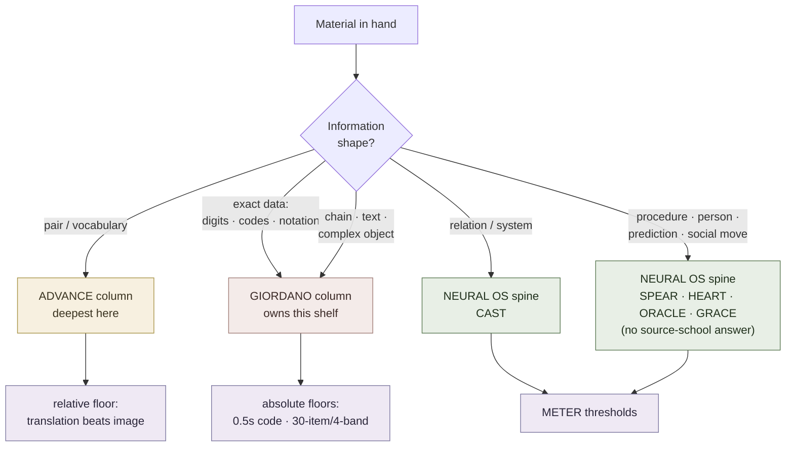

# Cross-School Encoding Router

**Summary**: The material-indexed router across the wiki's three complete mnemonics schools — Advance ([Ягодкин/Згода](./yagodkin-advance-mnemonics.md)), Giordano ([Козаренко](./kozarenko-mnemotechnics.md)), and Neural OS's own encoder spine ([mnemonic-methods-master](./mnemonic-methods-master.md)). The three existing pages are each indexed by *their own constructs*; this page inverts the index: **given the material in front of you, what does each school say to encode it with, and what pass-floor does each hand you.** It mints no framework and no acronym — it is a lookup table over three owners. Its one substantive finding is a **coverage map**: Advance names seven material types and operationalizes one; Giordano operationalizes six, owns the exact-data end outright, and — per the Course-2 completeness check — reaches further into people and tables than the Advance-derived spine predicted; the Neural OS spine covers all seven and adds four material classes no Russian-school taxonomy names, plus a fifth it covers only in part. It also records the three axes a material→encoding table cannot answer on its own — **packing density**, **scene quality**, and **review mode** — each with its owner.

**Sources**:
- `Ягодкин Н.А., Згода А.Н. - Учись учиться - 2023.pdf` — the seven information types, the nine principles, the per-word-type routing, the relative pass-floor.
- `GMS_V.Kozarenko.pdf` · `Мнемотехника шаг за шагом.pdf` · the *Мнемоника* HTML export — the Giordano technique catalogue, code tables, drill floors, and graded rubric.
- Internal owners: [mnemonic-methods-master](./mnemonic-methods-master.md) · [kozarenko-mnemotechnics](./kozarenko-mnemotechnics.md) · [yagodkin-advance-mnemonics](./yagodkin-advance-mnemonics.md) · [vocabulary-word-type-routing](./vocabulary-word-type-routing.md) · [giordano-graded-curriculum](./giordano-graded-curriculum.md) · [skill-progression-stages](./skill-progression-stages.md) · [meter-overview](./meter-overview.md).

**Last updated**: 2026-07-22.

---

## Why this page exists

Three complete schools now sit in the wiki, and each already carries a doctrine map. But every one of those maps is indexed the same way — **by construct**: *"you met the word Воронка, here is its owner."* That answers the question a reader of the source has. It does not answer the question a learner has, which runs the other direction: *"I have a table of eleven irregular verbs / a network diagram / a PIN / a person, what do I do with it, and how do I know when I'm done?"*

[mnemonic-methods-master](./mnemonic-methods-master.md) answers that question for the Neural OS spine alone. This page widens it to three columns, so a routing decision can be made with all three schools' answers visible at once — including the cases where two schools disagree, and the cases where only one of them has an answer.

**Scope discipline.** Nothing is defined here. Every cell points at an owner page and, where the claim is external, at its source. If a cell seems to define a technique, that is a bug — fix it by linking.

## The spine — whose taxonomy indexes the rows

Each school types material differently, and the three taxonomies are not competitors so much as three different resolutions:

| School | How it types material | Grain |
|---|---|---|
| Giordano | **three** taxonomies at different altitudes: *образная · вербальная · точная* (imageable / verbal / exact) (source: step_by_step_0001.html); the Course-2 list of **25 named information types** (phones, historical dates, constants, schedules, names, formulas…) per [giordano-graded-curriculum](./giordano-graded-curriculum.md); and the cell-payload ladder in §The packing axis | coarse at the top, the most operationally granular of the three at the bottom |
| Advance | seven information types (source: Ягодкин Н.А., Згода А.Н. - Учись учиться - 2023.pdf) | fine — splits Giordano's *точная* into digits and graphics, and adds relations + composite objects |
| Neural OS | by **question shape** — what you will be asked to do with it — via the [mnemonic-methods-master](./mnemonic-methods-master.md) router | orthogonal — a functional axis, not an information-shape axis |

Advance's seven is the cleanest *conceptual* partition of material, so it supplies the row spine below — but note that Giordano is not the coarse-grained school here, which an earlier reading of his three-way sort suggested. His 25-type Course-2 list is the most granular material index in the corpus; it is a **worked catalogue** rather than a taxonomy, which is why it does not make a good row spine and does make an excellent completeness check against the rows below.

The Neural OS axis is genuinely orthogonal to the other two rather than finer or coarser: [NEDF](./nedf-overview.md) types a card by *slot*, not by information shape, which is why the encoder spine ends up covering material classes that no information-shape taxonomy has a name for. That independence is the source of the coverage gap in §What only one school covers.

**Why three columns and not six.** The wiki holds other complete memory sources — [Buzan](./buzan-your-memory.md), [Lorayne](./substitute-word-system.md), [Wyner](./fluent-forever-wyner.md), [Foer](./foer-moonwalking-with-einstein.md) — and none of them earns a column here, for a specific reason each: Buzan's 12 principles are a **lever taxonomy** (see §The quality axis), not a material router; Lorayne owns one move rather than a curriculum; Wyner routes language only; Foer is reportage. A column requires a school that answers *the whole material space*, and only three do.

## The router

Rows 1–7 are Advance's seven types. Rows 8–11 are material classes **neither Russian school names**. Read a row left to right and pick the column you have the substrate for.

|  #  | Material                                                                       | Advance / Ягодкин                                                                                                                                                                                         | Giordano / Козаренко                                                                                                                                                                                                                                                                                                                                                                                                                                                                                                                     | Neural OS (yours)                                                                                                                                             |
| :-: | ------------------------------------------------------------------------------ | --------------------------------------------------------------------------------------------------------------------------------------------------------------------------------------------------------- | ---------------------------------------------------------------------------------------------------------------------------------------------------------------------------------------------------------------------------------------------------------------------------------------------------------------------------------------------------------------------------------------------------------------------------------------------------------------------------------------------------------------------------------------- | ------------------------------------------------------------------------------------------------------------------------------------------------------------- |
|  1  | **Single images** — one standalone term or item                                | Word→image via [созвучие](./substitute-word-system.md); short word = one image, long word = an image chain (source: Ягодкин Н.А., Згода А.Н. - Учись учиться - 2023.pdf)                                     | *Образный код* — a **recalled fixed code**, not a freshly imagined picture; must be concrete, watermelon-sized, stable, sub-imageable (source: GMS_V.Kozarenko.pdf)                                                                                                                                                                                                                                                                                                                                                                      | [NEDF](./nedf-overview.md) card; Name-hook slot enforces the same discriminability the Giordano image criteria do                                                |
|  2  | **Pairs** — L2 word ↔ translation, term ↔ definition                           | **The only type the book operationalizes.** Sound-image + meaning-image merged, said aloud 3×, blocks halved, both-direction written recall (source: Ягодкин Н.А., Згода А.Н. - Учись учиться - 2023.pdf) | Course 3 foreign vocabulary; meaning-image carrying phonetic image-codes written onto it (source: GMS_V.Kozarenko.pdf)                                                                                                                                                                                                                                                                                                                                                                                                                   | [NEDF](./nedf-overview.md) + [ESR](./encoded-spaced-repetition.md); link coverage audited by [word-knowledge-links](./word-knowledge-links.md) (a pair is up to six directed links, not one) |
|  3  | **Chains** — ordered sequences, routes, verse                                  | *Named but not covered* — the book is explicit that it treats only type 2 (source: Ягодкин Н.А., Згода А.Н. - Учись учиться - 2023.pdf)                                                                   | *Цепочка* + *Матрешка*, ranked among many *приёмы* and **subordinated** to fixed loci systems; collision-guarded by *Приём возврата* (source: GMS_V.Kozarenko.pdf)                                                                                                                                                                                                                                                                                                                                                                       | [memory-palace](./memory-palace.md) loci for order; verse-memorization for surface-form load; [spatial-coding](./spatial-coding.md) rides order off position for free                          |
|  4  | **Digits** — exact numbers                                                     | Pre-built 00–99 image alphabet; notes it encodes 2- and 4-digit numbers ~2× faster than an 0–9 one (source: Ягодкин Н.А., Згода А.Н. - Учись учиться - 2023.pdf)                                          | **БЦК** — the Cyrillic two-consonants-per-digit phonetic alphabet owned by [kozarenko-mnemotechnics](./kozarenko-mnemotechnics.md); 000–999 codes; row-compression before encoding                                                                                                                                                                                                                                                                                                                                                                                   | [PAO](./person-action-object-system.md) + Major System (standing ruling, [mnemonic-methods-master](./mnemonic-methods-master.md)); challenger [number-codec-ladder](./number-codec-ladder.md) pending its falsifier  |
|  5  | **Graphics** — diagrams, formulas, notation, signs                             | *Named but not covered* (source: Ягодкин Н.А., Згода А.Н. - Учись учиться - 2023.pdf)                                                                                                                     | Two dedicated Course-2 classes — *сложные знаки* (complex signs, with their own long-term-consolidation method) and *формулы* — plus [spatial-coding](./spatial-coding.md), where triangle geometry and vertical/horizontal placement carry formula structure at no image cost (source: Мнемотехника шаг за шагом.pdf)                                                                                                                                                                                                                                      | Glyph grammars (aws-glyph-grammar, code-glyph-grammar); [major-system-for-mathematical-notation](./major-system-for-mathematical-notation.md) for operators                                      |
|  6  | **Links** — causal, semantic, associative relations                            | *Named but not covered* (source: Ягодкин Н.А., Згода А.Н. - Учись учиться - 2023.pdf)                                                                                                                     | *Соединение образов* — but this is the **encoding mechanism**, not a material class with its own artifact                                                                                                                                                                                                                                                                                                                                                                                                                                | **[CAST](./cast-overview.md)** — the only one of the three that treats a relation as a first-class thing to store, with [nodes-and-edges](./nodes-and-edges.md) as its grammar       |
|  7  | **Complex objects** — a chapter, a system, a whole domain                      | *Named but not covered* (source: Ягодкин Н.А., Згода А.Н. - Учись учиться - 2023.pdf)                                                                                                                     | Course 4 text ladder; two-axis *образный конспект* ([prose-memorization](./prose-memorization.md)); [four-level-blocks](./four-level-blocks.md) / [table-of-support-images](./table-of-support-images.md) as the addressable store                                                                                                                                                                                                                                                                                                                                                                                | Palace + CAST + NEDF composed; compression-for-comprehension-framework for the compression pass                                                           |
|  8  | **Procedures / algorithms**                                                    | — (would be a chain)                                                                                                                                                                                      | — (would be a chain)                                                                                                                                                                                                                                                                                                                                                                                                                                                                                                                     | **[SPEAR](./spear-overview.md)** — a chain loses branch and failure structure; SPEAR keeps both                                                                  |
|  9  | **People** — *split; see below*                                                | —                                                                                                                                                                                                         | **Identity half only**: the distinctive-feature method — refuse to encode the face, designate the person by an occupation/hobby object, hang the name-record off it ([kozarenko-mnemotechnics](./kozarenko-mnemotechnics.md) §Person identity)                                                                                                                                                                                                                                                                                                                       | **[HEART](./heart-overview.md)** for the behavioral half; [name-face-fast-encode](./name-face-fast-encode.md) for the sub-5s first-meeting case                                            |
| 10  | **Predictive material / anomalies**                                            | —                                                                                                                                                                                                         | —                                                                                                                                                                                                                                                                                                                                                                                                                                                                                                                                        | **[ORACLE](./oracle-overview.md)**                                                                                                                               |
| 11  | **Graded social moves**                                                        | —                                                                                                                                                                                                         | —                                                                                                                                                                                                                                                                                                                                                                                                                                                                                                                                        | **[GRACE](./grace-overview.md)**                                                                                                                                 |
| 12  | **Motor programs** — pronunciation, fingering, physical procedure              | Named as its own instrument: articulation gymnastics for pronunciation, *not* mnemonics (principle 2) (source: Ягодкин Н.А., Згода А.Н. - Учись учиться - 2023.pdf)                                       | Speech memory trained by *мысленное проговаривание и прорисовка* — a distinct repetition mode, not an encoding move (source: GMS_V.Kozarenko.pdf)                                                                                                                                                                                                                                                                                                                                                                                        | [automaticity-and-reflex-training](./automaticity-and-reflex-training.md) + Tier-3 [motoric-encoding-systems](./motoric-encoding-systems.md); drill ladders, not cards                                                          |
| 13  | **Audio-native material** — sound, song, prosody                               | —                                                                                                                                                                                                         | Review-side only: *файлы регенерации*, dictated link-structure rehearsed as audio (source: GMS_V.Kozarenko.pdf)                                                                                                                                                                                                                                                                                                                                                                                                                          | [peg-audio-visual-matrix](./peg-audio-visual-matrix.md); sung realizations e.g. [famous-clocks-mnemonic-song](./famous-clocks-mnemonic-song.md); [l2-phonology-gym](./l2-phonology-gym.md)                                                     |
| 14  | **Tabular / matrix data** — schedules, timetables, unit tables, reference rows | —                                                                                                                                                                                                         | **The most-repeated shape in his catalogue.** One visual image per **row**, redundant structure compressed away first, the *unique discriminator* placed in the row's first cell ([kozarenko-mnemotechnics](./kozarenko-mnemotechnics.md) §Metronome); a table of 5–10 rows is one rung of the cell-payload ladder              **[table-memorization](./table-memorization.md)** — opened 2026-07-22 in response to this row; routes on *retrieval demand* (replay · cell lookup · inverse · compare) rather than row shape, and restores the column axis both Giordano variants fuse away |                                                                                                                                                               |

### Domain cases — where a row above splits into a real playbook

| Case | Route |
|---|---|
| Foreign vocabulary by word-type (irregular verbs, phrasal verbs, false friends, abstracts, function words) | [vocabulary-word-type-routing](./vocabulary-word-type-routing.md) — Advance's table, the most complete per-type router in the corpus; owns МегаЛоция |
| Foreign phrases rather than words | [phrase-based-acquisition](./phrase-based-acquisition.md) — Giordano's *речевой штамп*, phrase as the acquisition unit |
| Pronunciation / spelling exactness | Giordano's fixed image per IPA sign or hiragana (source: GMS_V.Kozarenko.pdf); Advance's per-syllable *образный алфавит*; both are instances of the Major-System pattern, **not variants of БЦК** |
| PINs, passwords, account numbers | [mnemonic-pin-password-encoding](./mnemonic-pin-password-encoding.md) — Giordano Course 5, with the modern-security caveat attached |
| Source code | code-memorization — structure is the load, verbatim rarely the target |
| Expository prose / textbooks | [prose-memorization](./prose-memorization.md) |
| Class membership across a group | Two rival moves, both live: per-item attribute tagging ([mental-markers-category-importance-order](./mental-markers-category-importance-order.md)) vs whole-environment re-skin (МегаЛоция, owned by [vocabulary-word-type-routing](./vocabulary-word-type-routing.md)) |
| Loci exhausted and no building available | [table-of-support-images](./table-of-support-images.md) (~900 numeric cells) or [four-level-blocks](./four-level-blocks.md) (125 per-topic cells) — both self-generating, no photography |

## Completeness check against Giordano's Course-2 catalogue (2026-07-22)

The rows above were derived from Advance's taxonomy, so they inherit its blind spots. The independent check is Giordano's **Course-2 catalogue** — a worked list of the commonest information types, each with its own drilled technique, which the course text claims numbers **25** (source: Мнемотехника шаг за шагом.pdf). Every catalogue entry was mapped onto a row. Four results:

- **Every catalogue entry lands somewhere.** No Giordano type falls outside rows 1–14 — after row 14 was added because of this pass.
- **It forced row 14.** Five-plus catalogue entries are *tables* — class schedules, train timetables, international dialling codes, weight measures, the "waterfalls of the world" and "planets" reference tables. Tabular data was the largest shape in his catalogue and had **no row at all**. The technique already existed in the wiki ([kozarenko-mnemotechnics](./kozarenko-mnemotechnics.md) §Metronome, one image per row); the router simply never asked for it.
- **It fired falsifier 1 on row 9.** The catalogue contains *Ф.И.О.* and *блок информации о человеке*, and the course carries a full person-identity method. Row 9 previously read "no source-school answer" — **that was wrong**, and the row is now split: the identity half has a Giordano answer, the behavioral half does not.
- **It sharpened row 4.** Where the router says "digits", the catalogue splits four ways — historical dates, start/end date *ranges*, exact day-month-year dates, and life-dates of people — each drilled separately. Consistent with §The spine's note that his catalogue is the granular index; a date-range is not a number, and treating it as one loses the interval.

**Count tension, recorded not smoothed.** The course states 25 types; the appendix headings enumerate about 24 clearly-labelled classes, and two of them are two instances of one shape (two reference tables). Read the way [yagodkin-advance-mnemonics](./yagodkin-advance-mnemonics.md)'s "all blocks contain ten words" is read: the **catalogue** is what survives, the round number is a design intention. Do not cite "25" as an itemized list — cite it as the course's own claim. **(needs verification — the exercise archive the lessons reference was not available; enumeration is from the printed appendix only.)**

## Three axes the router does not answer

Material→encoding is one question, not the whole decision. Three further axes are load-bearing, each already owned somewhere, none of them derivable from the table above. A routing decision that answers only the table is under-specified.

**The packing axis — how much goes at one address.** Owned by [kozarenko-mnemotechnics](./kozarenko-mnemotechnics.md) §Cell payload: an ascending payload ladder from one image per cell (which the source marks as *uneconomical*, not as the safe default) up to a *ярлык* holding five tables of 5–10 rows. Independent of the encoding choice — the same association can sit alone or as one part among five. A store's real capacity is cell count × payload depth, so under-packing wastes an addressable store as surely as collision corrupts it.

**The quality axis — what makes the scene good.** The router picks an encoder; it says nothing about whether the resulting image will hold. Two schools answer, and they answer compatibly: Giordano's **correct-image criteria** (concrete · watermelon-sized · stable · sub-imageable) and [Buzan](./buzan-your-memory.md)'s **12 Secret Principles** as the lever checklist any weak scene can be audited against. This is the axis to reach for when the complaint is *"I encoded it and it didn't stick"* — which is a quality failure, not a routing failure, and re-routing will not fix it.

**The review-mode axis — which kind of repetition.** §The pass-floor shelf says *when to stop*; it does not say *what to run*. Giordano names four repetition modes at different decode depths (see [kozarenko-mnemotechnics](./kozarenko-mnemotechnics.md) §Repetition modes) — including the cheap loci-only maintenance pass most schedulers cannot express, and the only audio channel in that corpus. [ESR](./encoded-spaced-repetition.md)'s four retrieval operations slice the same reviews by cognitive demand instead, and [word-knowledge-links](./word-knowledge-links.md) adds a third coordinate for vocabulary: *between which stores*. A card carries a coordinate on each; they do not substitute for one another.

## What all three agree on

Five invariants survive all three schools independently. Convergence across lineages that share no table is the strongest evidence the corpus offers that a primitive is real rather than one author's taste — the reading [kozarenko-mnemotechnics](./kozarenko-mnemotechnics.md) already applies to *соединение образов* ≙ [REMAPS](./remaps.md).

1. **Pre-build a fixed image alphabet for anything you will re-encode forever.** Digits, syllables, phonetic signs — pay the creative cost once per alphabet unit, never per item.
2. **Substitution is the on-ramp.** Unpicturable word → sound-alike concrete image. Three lineages, one move, owned by [substitute-word-system](./substitute-word-system.md).
3. **Never leave an image isolated.** Connection is the load-bearing operation, not vividness.
4. **Address before you store.** Loci, support-image tables, or blocks — a fixed addressable store precedes the content that goes in it.
5. **Retrieval is the study event, and known items leave the queue.** Advance's Воронка and Giordano's *активное повторение* are two manual realizations of what [active-recall](./active-recall.md) and [spaced-repetition](./spaced-repetition.md) own.

## Where they genuinely disagree

Recorded, not averaged. Averaging destroys the finding.

| Question | Advance | Giordano | Neural OS stance |
|---|---|---|---|
| **Does chaining lead or follow?** | leads (story-linked blocks) | subordinated to fixed loci systems | [memory-palace](./memory-palace.md) ranks it; palace leads once material is ≥5 related items |
| **Is passive input useful before vocabulary is installed?** | no — myths 1 & 2 attack it directly | not addressed | **unresolved** — rival to [krashen-sla-hypotheses](./krashen-sla-hypotheses.md); the wiki records and does not adjudicate |
| **What counts as evidence?** | publishes throughput figures with no protocol | argues untested *приёмы* are anecdote | [METER](./meter-overview.md) sides with Giordano on *standing*, without calling the figures false |
| **What does a metronome beat buy?** | ~1 s = bare word→image call-up, take the first image | 6 s = full encode incl. locus placement | **granularity, not contradiction** — do not average into 3 s |

## What only one school covers

This is the page's actual result.

- **Advance names seven types and delivers one.** Types 3, 5, 6, and 7 are named in its own taxonomy and explicitly out of scope for the book (source: Ягодкин Н.А., Згода А.Н. - Учись учиться - 2023.pdf). Its depth is entirely in type 2, where it is the best in the corpus — the per-word-type router in [vocabulary-word-type-routing](./vocabulary-word-type-routing.md) has no Giordano equivalent.
- **Giordano delivers six of seven, and owns the exact-data end outright.** БЦК, the phonetic image-codes, the addressable-store generators, the collision rule (*затирание* / *Приём возврата*), and the graded volume ramp are all things the Neural OS spine had described only in principle before this school was ingested.
- **The Neural OS spine covers all seven and adds four more outright, plus one shared.** Procedures, predictive material, graded social moves, and audio-native material have no name in either Russian taxonomy; **people is shared** — Giordano owns the identity half, the spine owns the behavioral half. Row 6 is the sharpest case: both schools treat a *link* as a **mechanism for encoding something else**, while [CAST](./cast-overview.md) treats it as **material with its own artifact and its own drill ladder**. That is not a difference of technique; it is a difference about what counts as a thing worth storing.
- **Row 14 ran the other way, and has since been closed.** It was the one row where Giordano had a drilled technique and the spine had *no* dedicated artifact — tables being the most repeated shape in his catalogue while the spine dissolved them into cards. [table-memorization](./table-memorization.md) now holds it, and the closure did not simply adopt his technique: it kept both his row-encoding variants as strategies and added the axis they fuse away (column addressability) plus the demand-routing that decides between them. A gap found by a completeness check turned out to contain a design decision, not just a missing entry.
- **Row 12 is the one all three answer and none answers with mnemonics.** For a motor program, every school routes *away* from encoding and into drill — Advance names articulation gymnastics as a separate instrument, Giordano puts it in a repetition mode rather than an encoding move, and the spine sends it to [automaticity-and-reflex-training](./automaticity-and-reflex-training.md). Unanimity about what a technique *cannot* do is worth as much as unanimity about what it can.
- **Row 13 is asymmetric in an interesting direction.** Giordano's only audio construct (*файлы регенерации*) sits on the **review** side; nothing in either Russian school encodes *into* sound. The spine's audio work ([peg-audio-visual-matrix](./peg-audio-visual-matrix.md), sung realizations) has no source-school precedent at all.

The practical consequence: for exact data and foreign vocabulary, prefer the Russian schools' concrete playbooks over improvising from the spine. For structure, behavior, prediction, and sound, the spine is the only one of the three with an answer at all. For motor programs, stop routing and start drilling.

## The pass-floor shelf

Every routing decision should come with a stopping rule. The three schools supply **two different instruments**, and they are complementary rather than rival — an absolute floor says *how good*, a relative floor says *when to stop*.

| Floor | Type | Source |
|---|---|---|
| Number-image code recognition ≤ 0.5 s, no hesitation | absolute | Giordano (source: Мнемотехника шаг за шагом.pdf) |
| 100 two-digit numbers in 10 min at ≤ 10% error, shown once | absolute | Giordano (source: GMS_V.Kozarenko.pdf) |
| ~6 s to bind one image-pair, trainable toward 4 s | absolute | Giordano (source: GMS_V.Kozarenko.pdf) |
| 30-item timed recall, four error bands, ≤ 1 h | absolute, graded | [giordano-graded-curriculum](./giordano-graded-curriculum.md) |
| **Translation retrieved faster than its mnemonic image** | **relative** — no stopwatch, learner-local | Advance (source: Ягодкин Н.А., Згода А.Н. - Учись учиться - 2023.pdf) |
| Stall budget: 10 s at recall, 2–3 s at encode | absolute, per-item | Advance (Антибаран) |
| Session-volume ramp as an external reference curve | load | [giordano-graded-curriculum](./giordano-graded-curriculum.md) |
| METER pass/floor thresholds per layer | absolute | [meter-overview](./meter-overview.md) |

Stage and level numbering for any of this belongs to [skill-progression-stages](./skill-progression-stages.md); this page assigns none and restates none. The internal ladder these external floors calibrate is [cast-drill-ladder](./cast-drill-ladder.md).

## What to learn, in what order

If the question behind the router is *"which of all this do I actually install, and when"* — the acquisition order, with each rung's owner:

1. **The spine first.** [memory-palace](./memory-palace.md) → [NEDF](./nedf-overview.md) → SR → [CAST](./cast-overview.md) → [SPEAR](./spear-overview.md), per [mnemonic-methods-master](./mnemonic-methods-master.md)'s discipline rule. Nothing below is worth starting before this is fluent.
2. **One number alphabet, over-learned to the 0.5 s floor.** Giordano's is the model here regardless of which table you use — the floor and the isolation rule matter more than the mapping.
3. **The collision rule, immediately after.** *Затирание* and *Приём возврата* are cheap to learn and prevent a failure that is **undetectable at encode time** — the single most transferable operational rule in the Giordano corpus.
4. **An addressable store that generates itself.** [table-of-support-images](./table-of-support-images.md) or [four-level-blocks](./four-level-blocks.md), once palaces start running out.
5. **The relative floor, applied to everything already built.** It costs nothing, needs no instrument, and retro-fits onto every encoder you already run.
6. **Only then, per-domain playbooks** — [vocabulary-word-type-routing](./vocabulary-word-type-routing.md) for language, [mnemonic-pin-password-encoding](./mnemonic-pin-password-encoding.md) for credentials, [prose-memorization](./prose-memorization.md) for text.
7. **[spatial-coding](./spatial-coding.md) last, as a free channel** layered onto encodings that already work.

The ordering principle is the one both Russian schools state and the wiki's own ladders agree with: **stabilize attention and isolate the base vocabulary before raising volume** (source: Мнемотехника шаг за шагом.pdf).

## Failure modes of routing itself

| Failure | What it looks like | Fix |
|---|---|---|
| **Column tourism** | Running the same material through all three schools' techniques to compare | Pick one column, commit long enough for METER to measure it |
| **Averaging a disagreement** | "6 s and 1 s, so call it 3 s" | The disagreements in §Where they genuinely disagree are findings; preserve them |
| **Type-1 collapse** | Treating every material as a pair because that's what Advance drills | Rows 3–11 exist precisely because pairs are not the general case |
| **Importing a floor without its instrument** | Quoting the relative floor as "under N seconds" | Relative and absolute floors measure different things |
| **Adopting unaudited throughput as fact** | Carrying Advance's 50–100 words/hour into a plan | The figures keep their verification flag or don't travel |
| **Row-8-to-11 improvisation from a Russian playbook** | Encoding a person as a chain of images | Those rows have no source-school answer; use the spine |

## Falsifiers

The page makes three claims that can be killed by evidence, and should be:

1. ~~**"Rows 8–11 and 13 have no source-school answer."**~~ — **FIRED, 2026-07-22, and partially killed.** The §Completeness check against Giordano's Course-2 catalogue found a full person-identity method, so **row 9 was wrong** and is now split (identity: covered; behavioral: not). The surviving claim is narrower: *rows 8, 10, 11, and 13 — procedures, prediction, graded social moves, and encoding-into-sound — have no source-school answer.* It is killed the same way, by any published construct routing one of them. Note the asymmetry the firing exposed: this claim was refuted by reading **further into a course catalogue**, not by a new source, which means the remaining four rows are only as safe as the catalogues already read.
2. **"Only CAST treats a relation as material."** Killed by a Giordano construct whose stored artifact *is* an edge rather than a scene containing two images.
3. **"Three columns is the right number."** Killed by any of the four rejected sources in §Why three columns turning out to route the whole material space rather than one slice of it.

If a claim survives a deliberate attempt on it, that survival is worth more than the original assertion — and if one dies, the row dies with it, not the page.

## Mnemonic

**Three columns, one shelf, four orphan rows, one shared, one owed, three axes off the page.** Advance holds a single very deep column (pairs). Giordano holds six columns and the whole exact-data shelf. Your spine holds all seven *plus four rows nobody else named* — procedures, predictions, social moves, and sound. **People is shared** (he owns the name, you own the behavior) and **tables are owed** — the one row where he has a technique and you have none. And three questions do not live in the table at all: how densely you pack it, whether the scene is any good, and which kind of review you run. Picture three bookcases — one a single overloaded shelf, one full but ending at the wall, the third running four shelves past where the wall was, with one shelf shared between the second and third and one conspicuously empty.

## Checksum

- If you read this page as a **new framework or acronym** → wrong; it is a lookup table over three existing owners. New framework: NONE. New acronym: NONE.
- If a cell here **defines** a technique rather than pointing at its owner → that's a defect, not the design.
- If you wrote that Advance covers the **seven information types** → wrong; it names seven and operationalizes **one** (pairs), by its own statement.
- If you routed a **procedure** through a Russian-school playbook → wrong; rows 8, 10, 11, and 13 have no source-school answer.
- If you said **people has no source-school answer** → wrong as of 2026-07-22; Giordano owns the identity half (distinctive-feature method). The behavioral half is still spine-only. This claim was corrected by a falsifier firing — do not restore the old version.
- If you looked for a **table** artifact in the spine → there isn't one; row 14 is the gap running the other direction, and Giordano's one-image-per-row technique is the thing to borrow.
- If you cited Giordano's **"25 information types" as an itemized list** → wrong; 25 is the course's own claim, the printed appendix enumerates about 24 labelled classes.
- If you called Giordano the **coarse-grained** school on the strength of his three-way sort → wrong; his Course-2 catalogue is the most granular material index in the corpus.
- If you tried to route a **motor program** (pronunciation, fingering) to an encoder → wrong; all three schools route it out of encoding and into drill.
- If a routing decision answered only the table → **under-specified**; packing density, scene quality, and review mode are three further choices, none derivable from the row.
- If the complaint is **"I encoded it and it didn't stick"** → that is a quality failure, not a routing failure; re-routing will not fix it.
- If Giordano's **6 s/element** and Advance's **1 s/word** got averaged → wrong; different units of work.
- If the **relative** floor got restated as an absolute time → wrong; that is exactly the property that makes it runnable on paper.
- If a **link** got filed as a mere encoding mechanism → that is both Russian schools' reading; CAST's claim is that it is material.
- Advance's own **myth 5** denies mnemonics are a universal tool — which is the honest reason this router has three columns instead of one.

## Visual

## Related pages

- [mnemonic-methods-master](./mnemonic-methods-master.md) — the Neural OS column's owner and the by-question-type router this page widens
- [kozarenko-mnemotechnics](./kozarenko-mnemotechnics.md) — the Giordano column's lineage Facade; owner of БЦК
- [yagodkin-advance-mnemonics](./yagodkin-advance-mnemonics.md) — the Advance column's lineage Facade; owner of the relative floor, Воронка, Антибаран
- [vocabulary-word-type-routing](./vocabulary-word-type-routing.md) — the deepest single cell in the table (Advance, row 2)
- [giordano-graded-curriculum](./giordano-graded-curriculum.md) — the external reference curve behind the absolute floors
- [substitute-word-system](./substitute-word-system.md) — the on-ramp all three schools converge on
- [cast-overview](./cast-overview.md) · [nodes-and-edges](./nodes-and-edges.md) — the encoder behind row 6's claim that relations are material
- [spear-overview](./spear-overview.md) · [heart-overview](./heart-overview.md) · [oracle-overview](./oracle-overview.md) · [grace-overview](./grace-overview.md) — rows 8–11
- [table-of-support-images](./table-of-support-images.md) · [four-level-blocks](./four-level-blocks.md) · [spatial-coding](./spatial-coding.md) · [prose-memorization](./prose-memorization.md) · [mnemonic-pin-password-encoding](./mnemonic-pin-password-encoding.md) · [phrase-based-acquisition](./phrase-based-acquisition.md) — the Giordano playbooks the domain-case table routes into
- [skill-progression-stages](./skill-progression-stages.md) — owner of every stage/level/count claim; none is made here
- [meter-overview](./meter-overview.md) · [cast-drill-ladder](./cast-drill-ladder.md) — where the floors on this page get measured
- [composability-index](./composability-index.md) — registry of the convergence unlocks §What all three agree on draws on

---

## U — See (CAST)

1. Three schools' answers laid side by side, indexed by material rather than by construct
2. Edges: every cell points outward to an owner; the only content owned here is the comparison itself

## D — Name (NEDF)

1. Cross-school encoding router = material-indexed lookup over Advance, Giordano, and the Neural OS spine
2. Distinguisher: indexed by *what you have to learn*, where the three source pages are indexed by *what the school calls it*
3. Failure mode: reading it as a framework, or letting a cell define what it should be linking

## F — Do (SPEAR)

1. New material arrives → find its row → read three columns → pick the one you have substrate for
2. Encoding built → attach a floor from the shelf, relative for *when to stop*, absolute for *how good*

## B — Watch (HEART)

1. Cells drifting from pointers into definitions (parallel-definition risk against three owner pages)
2. Disagreements getting smoothed into a compromise number
3. Rows 8–11 quietly acquiring an improvised Russian-school answer

## L — Predict (ORACLE)

1. A fourth school enters → predict it re-derives the five invariants and deepens exactly one column
2. Material with no row → predict it is a composite, and decomposes into rows that already exist

## R — Act (GRACE)

1. Routing question spanning schools → answer from this page, cite the owner, don't re-derive
2. A column looks empty for your material → say so plainly rather than borrowing a technique built for a different shape
