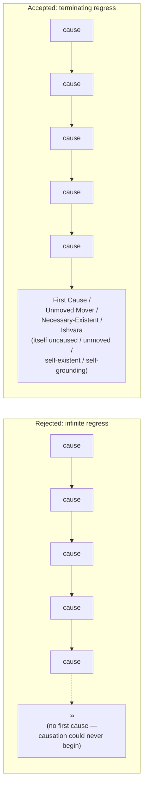

# Cross-Tradition Convergence — Unmoved Mover / First Cause

**Summary**: A **worked instance** of the [cross-tradition convergence META-pattern](./cross-tradition-convergence-pattern.md) (Wave 7's 5th confirmed architectural primitive). **4 traditions independently arrive at structurally similar unmoved-mover / first-cause arguments**: Aristotle (*Metaphysics* Book XII, 4th c. BCE) · Aquinas (5 ways, 13th c. CE) · Avicenna (necessary-existent argument, 11th c. CE) · classical Indian theistic schools (Nyaya/Yoga 2nd-6th c. CE). **The convergence cannot be explained by causal lineage**: Aristotle preceded the others; Aquinas read Aristotle but not Avicenna directly or Indian sources; Avicenna read Aristotle but not Aquinas; classical Indian arguments developed largely independently from Mediterranean traditions. **The structural convergence is the evidence.**

**Sources**:
- [cross-tradition-convergence-pattern](./cross-tradition-convergence-pattern.md) — Wave 7 architectural primitive; this page is a worked instance.
- Aristotle, *Metaphysics* Book XII (Lambda) c. 350 BCE — the *prime mover* argument.
- Thomas Aquinas, *Summa Theologica* Part I, Question 2, Article 3 (1265-1274) — the *5 ways*.
- Avicenna (Ibn Sina), *Kitab al-Shifa* (early 11th century CE) — the *necessary-existent (wajib al-wujud)* argument.
- Classical Indian theistic philosophy: Nyaya (Vatsyayana c. 4th-6th century CE), Yoga (Yoga Sutras of Patanjali ~2nd-4th century CE), early Vedanta.

**Source-discipline note**: This page applies the cross-tradition convergence pattern to first-cause/unmoved-mover arguments. **Provisional in two senses**: (a) each tradition has internal variations not exhaustively captured here; (b) the *equivalence* claims between traditions require closer technical analysis. **Take seriously enough to recognize the structural convergence; hold lightly enough to allow specific tradition-internal disputes.** Per [memory-paradox](./memory-paradox.md).

**Last updated**: 2026-05-25

---

## One-line

> 4 traditions across 2500 years on 3 continents independently argue: *a series of caused/moved things must terminate in an uncaused/unmoved first cause/mover*. The structural form is the same; the metaphysical commitments differ; the convergence is evidence the underlying structural insight is real.

## Unlocks (lead, not footer)

1. **Validates the cross-tradition convergence pattern.** [cross-tradition-convergence-pattern](./cross-tradition-convergence-pattern.md) (Wave 7's 5th confirmed architectural primitive) claims that 3+ traditions with no causal lineage independently articulating the same structural distinction is evidence of META-substantive reality. **The unmoved-mover instance** has 4 traditions across 25 centuries with limited causal lineage. **The convergence is itself evidence** of the structural insight: causation has a terminating regress.

2. **The convergence operates at the *structural* level, not the *content* level.** Aristotle's prime mover is *physical-cosmological* (the source of motion in the cosmos). Aquinas's first cause is *metaphysical-theological* (God as Creator). Avicenna's necessary-existent is *modal-logical* (the being whose essence is its existence). Classical Indian arguments are *cosmogonic + soteriological* (Ishvara as efficient cause of the world and basis of yogic liberation). **The structural shape — terminating regress in causation/motion/contingency — recurs; the specific applications and metaphysical conclusions differ substantially.**

3. **The convergence pattern's *not-claim* applies sharply here.** The wiki is NOT claiming the 4 traditions agree on the *content* of what the first cause is — Aristotle's Prime Mover is impersonal pure-actuality; Aquinas's First Cause is the Christian Trinity; Avicenna's Necessary-Existent is unitary in a way that influenced Islamic theology; classical Indian Ishvara is variously interpreted across schools. **The convergence is on the structural shape of the argument, not on the conclusion's substance.**

4. **The pattern blocks naive cultural-relativist dismissal of first-cause reasoning.** A common move: *"first-cause arguments are a Western philosophical/theological move."* The cross-tradition convergence forces a substantial response: 4+ traditions in 4+ cultural-linguistic regions over 25 centuries arrived at structurally similar arguments. **The structural insight has cross-cultural corroboration even where the metaphysical-theological conclusions differ.**

## Mnemonic

**A-A-A-I** = *Aristotle · Aquinas · Avicenna · Indian classical*.

4 traditions; 4 names (initials all start with letters early in the alphabet, A or I).

For the structural form: **regress → termination → first cause/mover/necessary-existent/Ishvara**.

## Memory checksum

1. **State the structural argument shared by all 4 traditions.** (A series of caused/moved things cannot extend infinitely. Therefore the series must terminate in an uncaused/unmoved first member. The structural shape: regress → termination → first cause.)
2. **Name the 4 traditions + their canonical figures + canonical texts.** (Aristotle — *Metaphysics* Book XII (Lambda), c. 350 BCE. Aquinas — *Summa Theologica* I.2.3, 13th c. CE. Avicenna (Ibn Sina) — *Kitab al-Shifa*, early 11th c. CE. Classical Indian — Nyaya (Vatsyayana, c. 4th-6th c. CE) + Yoga Sutras (Patanjali, c. 2nd-4th c. CE) + early Vedanta.)
3. **What is the *not*-claim?** (NOT claiming the 4 traditions agree on the *content* of what the first cause is. Aristotle: impersonal pure-actuality. Aquinas: Christian Trinity. Avicenna: unitary necessary-existent influencing Islamic theology. Indian: Ishvara variously interpreted. The convergence is on **structural shape**, not on substance.)
4. **What evidence does the convergence provide?** (META-substantive evidence that the structural insight — causation has a terminating regress — is real. The 4 traditions have limited causal lineage; they couldn't have copied from each other for the structural argument. The convergence is evidence the structure is genuinely there, not an artifact of one tradition.)
5. **What does this NOT prove?** (It does NOT prove any specific theological conclusion about God. It proves the *structural argument* recurs cross-tradition. Whether the structural argument is *sound* — whether causation actually terminates — is a separate question requiring substantive metaphysical analysis. The cross-tradition convergence shows the argument is *taken seriously across traditions*, not that it succeeds.)

## Visual — the 4 traditions in parallel

**The 4 traditions**:

| Tradition (language) | Period | Figure | Canonical text | Argument structure | Conclusion |
|---|---|---|---|---|---|
| Aristotle (Greek) | ~350 BCE | Aristotle | *Metaphysics* Book XII (Lambda) | Motion needs a mover; motion can't go on forever; ∴ unmoved mover (the Prime Mover) | Pure act (energeia); impersonal; thought thinking itself |
| Classical Indian (Sanskrit) | ~2nd-6th c. CE | Patanjali (Yoga) · Vatsyayana (Nyaya) | *Yoga Sutras* (~2nd-4th c. CE) · *Nyaya Sutra Bhasya* (~4th-6th c. CE) | Multiple arguments converging: cosmological (world has order; needs orderer), moral (karma needs administrator), soteriological (liberation requires divine grounding) | Ishvara as efficient cause; varies across schools (some accept, some reject) |
| Avicenna (Arabic) | early 11th c. CE | Ibn Sina | *Kitab al-Shifa* (Healing) | Modal argument: contingent beings have contingent essence; their existence requires a cause; the chain terminates in a being whose essence IS its existence | Wajib al-wujud (necessary existent); unique; ground of being |
| Aquinas (Latin) | 13th c. CE | Thomas Aquinas | *Summa Theologica* I.2.3 (1265-74) | Five ways (only 3 are first-cause arguments): 1. from motion (Aristotle); 2. from efficient causation; 3. from contingency (Avicenna). (4. from perfection; 5. from design) | God (Christian Trinity); ipsum esse subsistens; personal Creator |

**Shared structural claim** — causation/motion exhibits a terminating regress:

Specific arguments for why the regress terminates:

- **Aristotle**: motion requires a motion-source; circular regress is impossible (chicken-egg argument applied to motion).
- **Aquinas**: efficient causation requires a cause; infinite regress would lack a *first* cause, meaning *no* causation could begin.
- **Avicenna**: contingent existence requires a reason; the reason must terminate in a self-existent being whose essence is existence.
- **Indian classical**: cosmic order requires an orderer; karmic administration requires an administrator; both terminate in Ishvara.

**Why the convergence is evidence** — 4 traditions × limited causal lineage:

- Aristotle preceded the others (so didn't read them).
- Aquinas read Aristotle but NOT Avicenna directly (Avicenna's influence reached Aquinas via translations + commentary tradition, attenuated).
- Avicenna read Aristotle (Arabic translations) but NOT Aquinas (Aquinas postdates him).
- Indian classical developed largely independent of Mediterranean philosophy; some indirect contact (e.g., Greek-Buddhist contact in Gandhara) but the first-cause arguments were not borrowed.

The convergence is structural, not historical. 4 traditions independently noticing that causation has a terminating regress is evidence the regress-termination insight is genuine structural philosophy, not a cultural artifact.

The convergence is the evidence. The differences in metaphysical commitments remain real.

---

## Aristotle (Greek, c. 350 BCE)

**Primary text**: *Metaphysics* Book XII (Lambda), especially chapters 6-10.

**Argument structure**:

1. *Motion exists in the cosmos.* (Observable.)
2. *Motion requires a mover.* (Aristotle's physics — nothing moves itself entirely without a cause.)
3. *An infinite regress of movers is impossible.* (Argued separately; circular regresses among coeval movers would amount to no first mover, hence no motion at all.)
4. *Therefore, there must be a first mover that is itself unmoved.*

**Aristotle's first mover**:
- **Pure actuality** (*energeia*) — no potentiality.
- **Eternal** — not a temporal first cause but a perpetual ground of motion.
- **Impersonal** — Aristotle's prime mover is *thought thinking itself* (noēsis noēseōs).
- **One** — Aristotle argues for uniqueness, though tensions remain.
- **Moves by being loved** — the prime mover causes motion by being the object of desire/aspiration, not by physical contact.

**Aristotle's argument is cosmological + physical**, grounded in the observation that motion exists.

## Avicenna (Arabic, early 11th century CE)

**Primary text**: *Kitab al-Shifa* (*The Book of Healing*), especially the Metaphysics section.

**Argument structure** (the *modal* or *contingency* argument):

1. *Every being is either contingent or necessary in its existence.* (Contingent: could exist or not exist. Necessary: cannot not exist.)
2. *Contingent beings require a cause for their existence.* (Their essence doesn't entail existence; something must give them existence.)
3. *The chain of contingent causes cannot continue infinitely.* (An infinite chain of contingents leaves the entire chain itself contingent and uncaused.)
4. *Therefore, the chain must terminate in a Necessary Existent (Wajib al-Wujud)* — a being whose essence IS its existence.

**Avicenna's necessary existent**:
- **Unitary** — not composite in essence or attributes.
- **Self-existent** — essence = existence.
- **Ground of all contingent being** — every contingent thing exists by being caused (directly or indirectly) by the necessary existent.
- **Influenced Islamic theology + Latin medieval philosophy** via Arabic-to-Latin translations (especially through Toledo translators).

**Avicenna's argument is modal-logical**, grounded in the contingent/necessary distinction.

## Aquinas (Latin, 13th century CE)

**Primary text**: *Summa Theologica* Part I, Question 2, Article 3 — the **Five Ways** (*quinque viae*).

The first three ways are first-cause arguments:

1. **From motion** (essentially Aristotle's argument): things in motion require movers; regress can't be infinite; ∴ Unmoved Mover.
2. **From efficient causation**: things have efficient causes; nothing is efficient cause of itself; regress can't be infinite; ∴ First Efficient Cause.
3. **From contingency** (essentially Avicenna's argument, mediated through Maimonides + Latin Avicennians): contingent beings exist; contingent beings require non-contingent ground; ∴ Necessary Being.

The 4th and 5th ways differ in structure (perfection-gradation, design). The first three are structural cousins of Aristotle + Avicenna.

**Aquinas's God**:
- **Christian Trinity** — Aquinas identifies the philosophical First Cause with the Christian God of revelation.
- ***Ipsum esse subsistens*** — "subsistent being itself"; Aquinas adapts Avicenna's essence/existence identity.
- **Personal** — Aquinas's God acts intentionally and personally, unlike Aristotle's impersonal Prime Mover.
- **Creator** — God brings the world into existence from nothing (creation *ex nihilo*), not just moves it.

**Aquinas synthesizes** Aristotle + Avicenna + Augustine + biblical theology. The structural argument is shared with Aristotle and Avicenna; the metaphysical-theological conclusion differs substantially.

## Classical Indian (Sanskrit, c. 2nd-6th century CE)

**Primary texts**: Yoga Sutras of Patanjali (~2nd-4th c. CE), Nyaya Sutra Bhasya of Vatsyayana (~4th-6th c. CE), early Vedantic commentary literature.

**Argument structures** (multiple converging in classical Indian philosophy):

1. **Cosmological / order-from-orderer**: the cosmos exhibits order, structure, regularity; order requires an orderer; ∴ Ishvara as cosmic orderer.
2. **Karmic / moral**: karma binds actions to consequences across lifetimes; this binding requires administration; ∴ Ishvara as karma's administrator.
3. **Soteriological**: yogic liberation (moksha) requires a path; the path requires grounding in unconditioned reality; ∴ Ishvara as liberation's basis.

**Indian classical Ishvara**:
- **Variously interpreted** across schools. Nyaya: theistic, Ishvara as efficient cause. Yoga: theistic-leaning, Ishvara as object of devotion + meditation focus. Advaita Vedanta (later, Shankara 7-8th c.): Ishvara as conventional reality, ultimately collapsed into brahman. Mimamsa: explicitly *atheist* — rejects need for Ishvara.
- **Not a Creator in the Aquinas sense** — Indian metaphysics tends toward cyclic/eternal cosmos; Ishvara is an efficient cause within the cosmos, not its absolute origin from nothing.
- **Influences of devotion + practice** — Ishvara features in religious practice (bhakti, surrender, meditation) more than as a metaphysical conclusion alone.

**Classical Indian arguments developed largely independently** of Mediterranean philosophy. Some indirect contact existed (Hellenistic kingdoms in northwest India after Alexander; Greek-Buddhist Gandhara art; ambassadorial exchanges), but the first-cause arguments were not borrowed from Greek philosophy. **The Sanskrit philosophical tradition developed in parallel.**

## What's NOT shared across the traditions

**Important boundaries**:

- **Personal vs impersonal**: Aristotle's Prime Mover is impersonal; Aquinas's God is personal (Trinitarian). Avicenna's necessary-existent is debated; Indian Ishvara varies.
- **Creator vs eternal universe**: Aquinas's God creates the universe *ex nihilo*; Aristotle's universe is eternal (Prime Mover doesn't create, only moves); Indian metaphysics generally accepts cyclic eternal cosmos.
- **Theological commitments**: Aquinas's God is the Christian Trinity; Avicenna's is the unitary Islamic Allah (philosophical, though distinct from kalam theology); Aristotle's is non-religious; Indian Ishvara varies by school.
- **Argument's *target audience***: Aristotle was doing physics + metaphysics; Aquinas was integrating revelation + reason; Avicenna was systematizing Islamic philosophy + medicine; Indian classical was integrating practice + speculative philosophy.
- **What "first" means**: Aristotle's "first" is at the *top* of a hierarchy of motion-causes; Aquinas's "first" is *original* in efficient causation; Avicenna's "first" is *necessary* in modal contingency; Indian "first" is *prior* in causal-cosmic order or *grounding* in liberation.

The 4 traditions share the **structural shape** of the regress-terminating-in-first-cause argument; they differ substantially on **what the first cause is, does, or means**.

## Why the convergence is genuinely evidential

The cross-tradition convergence pattern (Wave 7's [architectural primitive](./cross-tradition-convergence-pattern.md)) claims that ≥3 traditions with no causal lineage independently articulating the same structural distinction is evidence of META-substantive reality. **This page's instance is a strong example** because:

### 1. Substantial cultural-linguistic separation

- Aristotle: Greek-speaking, Mediterranean.
- Aquinas: Latin-speaking, Catholic medieval Europe.
- Avicenna: Arabic + Persian-speaking, Islamic Golden Age.
- Indian classical: Sanskrit-speaking, Indian subcontinent.

**4 cultural-linguistic regions, 2500+ years.** The conditions for independent emergence are present.

### 2. Limited causal lineage

- Aristotle predates the others (so didn't read them).
- Aquinas read Aristotle directly (Latin translations of Greek). Aquinas's contact with Avicenna was mediated through Latin Avicennians (Algazel, William of Auvergne, Gundissalinus) — the Avicennian argument reached Aquinas in *translated, commentary-refracted form*, not Avicenna's original text.
- Avicenna read Aristotle (Arabic translations of Greek). Avicenna couldn't have read Aquinas (postdates him).
- Indian classical philosophical literature in Sanskrit had **no documented contact with Mediterranean first-cause arguments** before its core developments. Some Hellenistic influence on Indian astronomy is documented; first-cause philosophy is not.

**The causal influences are limited and asymmetric.** Aquinas's argument is partly shaped by Aristotle + Avicenna (via mediators); Aristotle's was not shaped by the others; Indian classical was largely independent.

### 3. Structural similarity at the argument level

All 4 traditions share:
- A series of caused/moved/contingent/world-things.
- The claim that this series cannot extend infinitely.
- A first/uncaused/unmoved/necessary/grounding member.

This **structural form is not trivial**. It requires:
- Identifying a causal/motion/contingency series.
- Recognizing the series's potential infinitude as a problem.
- Concluding to a first member with special properties.

**Each step could be denied**. Each tradition arrives at the same shape independently (with respect to non-Aristotelian traditions' arguments).

### 4. The convergence's strength is asymmetric vs causal explanations

If the convergence were *only* explained by causal lineage (Aristotle → Aquinas via Avicenna), then Indian classical would be **inexplicable as part of the convergence**. But Indian classical arrived at structurally similar arguments without contact. **The Indian classical instance is critical to the convergence's claim of META-substantive reality.**

## The *not-claim* boundary (critical)

The wiki is NOT claiming:

- **The first-cause argument is sound.** Plenty of philosophers across traditions reject various premises (e.g., infinite regress is impossible — Hume + Kant; cause requires cause — Hume; the structural argument doesn't conclude to anything theologically substantial — many).
- **Any specific theology follows from the structural argument.** Aristotle's Prime Mover ≠ Aquinas's Trinity ≠ Avicenna's Allah ≠ Indian Ishvara. Each tradition's theological commitments require *additional* arguments beyond the structural first-cause one.
- **The convergence proves the existence of any specific God.** It proves that the *argument* recurs structurally cross-tradition. Whether the argument *succeeds* is a separate question.
- **All Indian schools accept Ishvara.** Mimamsa explicitly rejects; Advaita Vedanta accepts only at conventional level; classical Buddhism rejects the personal-Ishvara form. The convergence is across Nyaya + Yoga + early Vedanta + theistic strands of Indian philosophy.
- **Cultural relativism is broadly wrong.** Cross-tradition convergence on the structural argument is evidence about that argument; it doesn't generalize to all philosophical claims.

The wiki claims:
- The **structural argument** recurs across 4 traditions with limited causal lineage.
- The convergence is evidence the structural insight (regress-terminating-in-first-cause) is META-substantively real.
- This pattern blocks dismissal of first-cause arguments as merely a Western philosophical move.

## Cross-link to the wiki

| Wiki layer | Connection |
|---|---|
| [cross-tradition-convergence-pattern](./cross-tradition-convergence-pattern.md) | This page is a worked instance of the 5th architectural primitive |
| [hypostasis-elenchos-and-tlp-show-vs-say](./hypostasis-elenchos-and-tlp-show-vs-say.md) | Sister cross-tradition convergence instance (show-vs-say structure) |
| [methods-of-mathematical-argument](./methods-of-mathematical-argument.md) | Aquinas's first three ways use proof-by-contradiction-style arguments (infinite regress = absurdity) |
| [methods-of-deduction](./methods-of-deduction.md) | The structural arguments use MT (infinite regress → no causation; we have causation; ∴ regress finite) |
| [per-rule-modus-tollens](./per-rule-modus-tollens.md) | MT is the load-bearing inference move in all 4 traditions' arguments |
| [memory-paradox](./memory-paradox.md) | Take seriously enough to recognize the structural argument; hold lightly enough on tradition-internal disputes |
| [logic-atomic-design](./logic-atomic-design.md) §Pages | This page realizes a worked instance of cross-tradition convergence |
| [composability-index](./composability-index.md) | The cross-tradition convergence primitive's instance count grows |

## METER integration

| Drill | Pass floor | Source |
|---|---|---|
| Name the 4 traditions + canonical figures | <30 s | this page §Mnemonic |
| State the shared structural argument | <30 s | this page §Memory checksum |
| Distinguish what's shared (structure) from what differs (content) | <60 s | this page §What's NOT shared |
| Identify the MT inference within the first-cause argument | <30 s | this page §Cross-link |
| State the *not-claim* boundary | <60 s | this page §Not-claim |

## Related pages

- [cross-tradition-convergence-pattern](./cross-tradition-convergence-pattern.md) — Wave 7 architectural primitive
- [hypostasis-elenchos-and-tlp-show-vs-say](./hypostasis-elenchos-and-tlp-show-vs-say.md) — sister cross-tradition convergence instance
- [cross-tradition-convergence-meditative-witness](./cross-tradition-convergence-meditative-witness.md) — sister Wave-8 cross-tradition convergence instance
- [methods-of-mathematical-argument](./methods-of-mathematical-argument.md) §Argument by contradiction — structural cousin
- [methods-of-deduction](./methods-of-deduction.md) § + [per-rule-modus-tollens](./per-rule-modus-tollens.md) — MT is load-bearing in the arguments
- [memory-paradox](./memory-paradox.md) — take-seriously-but-hold-lightly
- [logic-atomic-design](./logic-atomic-design.md) §Pages — worked instance
- [composability-index](./composability-index.md) — primitive's instance count grows
- [glossary](./glossary.md) — Logic layer registration
