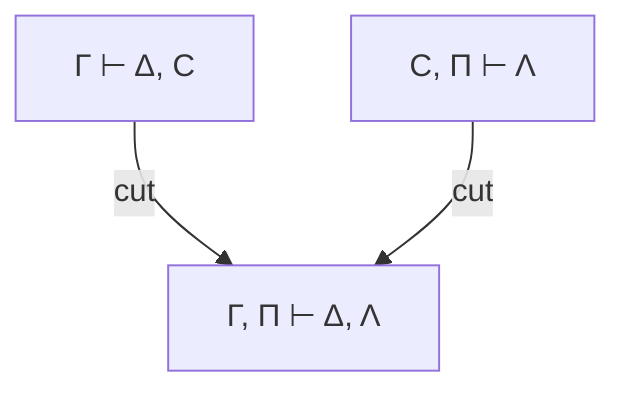
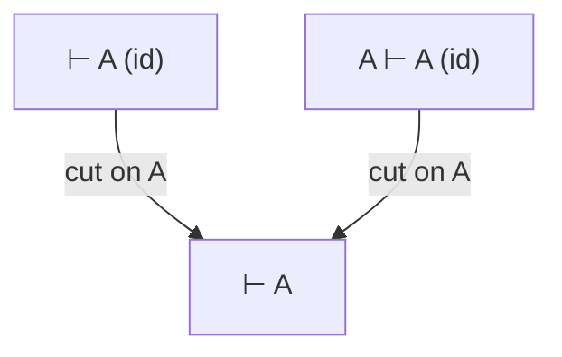
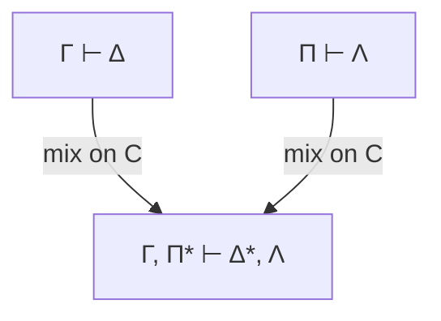
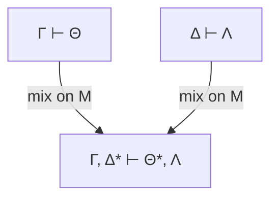

# Cut-Elimination Theorem (Gentzen's Hauptsatz)

**Summary**: Gentzen's 1935 *Hauptsatz* ("main theorem"): every proof in the [sequent calculus](./sequent-calculus.md) LK (classical) or LJ (intuitionistic) can be effectively transformed into a *cut-free* proof of the same end-sequent. Cut is the only sequent rule that can introduce formulas not in the end-sequent; eliminating it gives the [sub-formula property](./sub-formula-property.md) for sequent calculus. The Hauptsatz is the *engine* under structural proof theory: decidability of propositional logic, consistency of pure first-order logic, Herbrand's theorem, [normalization](./normalization-theorem.md) (in dual presentation), and the bootstrapping step for Gentzen's [consistency proof for PA](./consistency-of-peano-arithmetic.md) all rest on it.

**Sources**:
- [Mancosu, Galvan, Zach (2021)](./proof-theory-mancosu-galvan-zach.md) Ch 6 — primary source for this page.
- dokumen.pub_an-introduction-to-proof-theory...pdf (Mancosu, Galvan, Zach, *An Introduction to Proof Theory*, OUP 2021) Ch 5-6 and Appendix G — deepen pass (mix formulation, rank/degree double induction, mid-sequent, effective-vs-efficient flag).
- Gentzen, G. (1935c) "Untersuchungen über das logische Schließen II," *Math. Z.* 39: 405-431.
- Buss, S. R. ed. (1998) *Handbook of Proof Theory*, Ch I (Cut-elimination).
- Negri, S. and von Plato, J. (2001) *Structural Proof Theory.*

**Last updated**: 2026-06-10

---

## Unlocks (lead, not footer)

1. **Cut = lemma; cut-elimination = inline-the-lemma.** The cut rule formalizes lemma-use. Cut-elimination unfolds every lemma into the direct proof that uses only material from the conclusion. This is structurally what the wiki's retrieval pipeline does — surface load-bearing facts directly rather than via long citation chains; what [FRAME FORGE Distill](./frame-forge.md) does — drop working hypotheses that don't appear in the final claim; what `/lint`'s parallel-definition check does — collapse redundant intermediate definitions. **Three wiki disciplines, one proof-theoretic ancestor.**

2. **Cut-rank reduction × ordinal complexity × [ok-plateau](./ok-plateau.md).** The Hauptsatz proof works by *strictly decreasing* a complexity measure at each step. For LK without axioms, that measure is *natural-number* complexity (rank, degree). For LK+PA (Peano arithmetic), the measure must be *ordinal* (notations up to [ε₀](./epsilon-zero-and-ordinal-induction.md)) — because PA's induction rule can re-introduce high-rank cuts. **The complexity-measure substrate gates how far cut-elimination reaches** — same shape as OK Plateau's "you can't lift the ceiling using only operations the ceiling permits."

3. **Mid-sequent / Herbrand × wiki [recognition-gym](./red-queen-skill-gym.md) finitary bound.** Mid-sequent theorem: a cut-free LK proof of a sequent with quantifiers ∃y₁…∃yₙ A can be split at a point where the antecedent has no quantifiers — the part below the split is purely propositional. Herbrand's corollary: such a sequent has only *finitely many* witness-tuples to check. **The recognition-gym's "60-s budget for which-archetype-fits" has the same shape** — a finite bound on the witnesses any successful classification needs (candidate-pattern, not yet confirmed).

## Mnemonic

**HAULER** = *Hauptsatz · Algorithmic · Unfolds · Lemmas · Eliminates · Reduces-by-rank.*

The Hauptsatz is the *hauler* that pulls lemmas out of proofs and leaves the direct argument behind.

## Memory checksum

If you can answer these in <60 s each from memory, the page is encoded:

1. State **Gentzen's Hauptsatz**. (*Every LK (resp. LJ) proof can be effectively transformed into a cut-free LK (resp. LJ) proof of the same end-sequent. The transformation is constructive — given an algorithm.*)
2. State the **cut rule** and define **cut-formula, cut-rank, cut-degree**. (*Cut rule: from Γ ⊢ Δ, C and C, Π ⊢ Λ infer Γ, Π ⊢ Δ, Λ. **Cut-formula** is C. **Cut-rank** of an inference = the length of the longest cut-segment ending in it. **Cut-degree** of the cut-formula = number of logical symbols in C. The Hauptsatz proof strictly decreases (degree, rank) lexicographically.*)
3. Name three **consequences** of cut-elimination for pure LK / LJ. (*(i) **Sub-formula property** — every formula in a cut-free proof is a sub-formula of the end-sequent. (ii) **Consistency** of pure first-order logic — no cut-free proof of the empty sequent exists. (iii) **Decidability of propositional fragment** — cut-free proof search terminates. (iv) **Mid-sequent / Herbrand theorem** — witness extraction for quantified sequents in LK; **disjunction property** and **existence property** for LJ.*)
4. Why does **Mancosu et al. use "mix" rather than "cut"** in the proof? (*Mix is a generalized cut that handles multiple occurrences of the cut-formula at once. Gentzen originally used "mix" to avoid case-analysis on whether the cut-formula appears in Γ or Π by contraction. The proof goes through more cleanly. Translation: mix-elimination ↔ cut-elimination is straightforward.*)
5. Why does cut-elimination **fail for LK + axioms** in general? (*Axioms can introduce formulas that aren't sub-formulas of the end-sequent. If axioms contain only atomic formulas (as in PA: equations like 0 ≠ S(x)), cuts on complex formulas can still be eliminated but cuts on atomic formulas may remain. Gentzen's PA-consistency proof uses this restricted cut-elimination + ordinal-bounded induction.*)

## Visual — cut-elimination at a glance

**The cut rule**:

**Cut-elimination algorithm**:

1. Pick a topmost cut (its cut-formula has no further cuts above it).
2. If cut-formula is principal on BOTH sides → REDUCE DEGREE (replace high-degree cut with cuts on its sub-formulas).
3. If cut-formula is NOT principal → REDUCE RANK (push the cut upward past the non-principal inference).
4. Eventually rank = 0 (cut applied directly to axiom); cut disappears.
5. Each step strictly decreases (degree, rank) lex order; termination by induction.

**Example — cut with atomic cut-formula against an axiom**:

Reduces to the right premise A ⊢ A (cut against axiom collapses; the axiom on the left was the same formula).

The algorithm always picks a *topmost* cut to handle, ensuring that the sub-proofs above it are already cut-free or handled inductively.

---

## What cut is and why it's special

The cut rule:

Cut is the only sequent rule with the property that the *cut-formula* C disappears in the conclusion. Every other sequent rule (axiom, structural, logical) has the property that the formulas in its conclusion are sub-formulas of the formulas in its [premises](./argument-anatomy.md) (or of the principal formula of the rule).

This means: in a cut-free proof, formulas only *get smaller* as we move from premises to conclusions. The sub-formula property follows immediately.

Cut breaks this. The cut-formula C in the premises is replaced by *nothing* in the conclusion — so it can be any formula whatsoever. C might mention concepts that don't appear in Γ, Π, Δ, Λ at all.

Cut formalizes the practice of **using a lemma**: prove the lemma C, then use it. The Hauptsatz says: lemma-use is in principle always eliminable.

## Proof sketch (after Mancosu et al. Ch 6)

The proof works by:

1. **Mix instead of cut.** Mix is a single rule that handles multiple occurrences of the cut-formula in a single step:

where Δ* and Π* are obtained by deleting all occurrences of C from Δ and Π respectively, and C appears at least once in Δ and at least once in Π. Mix-elimination implies cut-elimination (a single cut is a mix on one C).

2. **Mix-rank.** The rank of a mix inference is the number of consecutive sequents above the mix (on either side) whose principal formula was C — counting how far the mix-formula was "carried up" through preceding inferences.

3. **Mix-degree.** The degree of the mix-formula = number of logical symbols in it.

4. **Two reductions:**
   - **Degree reduction**: when the mix-formula is principal on both sides (i.e., the immediately-preceding rule on each side was a rule for the connective whose introduction created C), replace the mix with mixes on C's *sub-formulas*. Strictly decreases degree.
   - **Rank reduction**: when the mix-formula is *not* principal on at least one side, push the mix past the non-principal inference. Strictly decreases rank.

5. **Termination**: lexicographic (degree, rank) is well-founded on ℕ × ℕ. The algorithm terminates.

When termination occurs, all mix/cut inferences have rank 0 and degree 0 — i.e., they've been pushed to axioms where they collapse. The result is cut-free.

## Why mix instead of cut

If you try to do the reduction directly with cut, you hit case-explosion: cut-formula C can appear multiple times in Δ (by contraction), and the algorithm has to handle each occurrence separately. Mix bundles all occurrences into a single inference. The mix-rule's auxiliary action of deleting *all* occurrences of C makes the rank-reduction step clean.

Mancosu et al. Ch 6.9 ("Why mix?") explains this in detail. After the mix-elimination is done, converting back to cut is trivial (mix on a single occurrence is a cut).

## Mix as Gentzen's original formulation

The "Proof sketch" above states *that* mix is used; this section pins down *what mix is* in Gentzen's own terms and *why it is interderivable with cut*, following the source closely.

Gentzen does not prove the Hauptsatz for cut directly. He proves it for a different rule, the **mix rule**, which he shows is deductively equivalent to cut, and then transfers the result back (source: dokumen.pub_an-introduction-to-proof-theory...pdf). The mix rule is the *bulk-deletion* generalization of cut:

The defining move is the asterisk. Δ* and Θ* are obtained from Δ and Θ by **erasing every occurrence of the mix-formula M** — not one occurrence, *all* of them — where M is required to occur at least once in Θ (the succedent of the left premise) and at least once in Δ (the antecedent of the right premise) (source: dokumen.pub_an-introduction-to-proof-theory...pdf). A cut targets a single named occurrence; a mix targets the whole population of M at once. That bulk deletion is precisely what makes the rank-reduction step clean — there is never a leftover copy of M smuggled in by a contraction that the algorithm has to chase separately.

**Mix ↔ cut derivability** is the bridge that licenses the whole detour, and the source proves it both directions (source: dokumen.pub_an-introduction-to-proof-theory...pdf):

- **Mix is derivable in LK** (Proposition 6.1). Given the two premises, interchange/contraction collect all the M's to one side (IR/CR on the left to gather M in the succedent, IL/CL on the right), then a single cut on M removes them, yielding `Γ, Δ* ⊢ Θ*, Λ`. So adding mix to LK adds no theorems.
- **Cut is derivable in LK − cut + mix** (Proposition 6.2). A cut on M is a mix on M followed by the structural inferences (weakening + interchange) that restore the occurrences of M the mix happened to delete but the cut would have kept. So removing cut and keeping mix loses no theorems either.

The two propositions together say mix and cut are *deductively equivalent modulo the structural rules*. Therefore "every proof can be transformed into a cut-free proof" and "the mix rule is eliminable" are the same theorem in two costumes — and Gentzen states the Hauptsatz in the second costume because mix-elimination is where the induction actually goes through (source: dokumen.pub_an-introduction-to-proof-theory...pdf).

## The two-phase reduction: rank then degree

The "Proof sketch" lists degree-reduction and rank-reduction as two moves; this section makes explicit that they are the *two coordinates of a single double induction*, and which coordinate is reduced first.

**Two measures on a proof ending in a mix.** The source attaches two numbers to a proof π whose last inference is a mix (source: dokumen.pub_an-introduction-to-proof-theory...pdf):

- **Degree** `dg(π)` = the number of logical symbols in the mix-formula (Definition 6.4-6.5). This measures *how complex the lemma is*.
- **Rank** `rk(π) = rk_l(π) + rk_r(π)` (Definition 6.7) — the **left rank** plus the **right rank**. The left rank is the longest path up from the left premise along which the mix-formula keeps occurring in the succedent; the right rank is the analogous path up from the right premise with the mix-formula in the antecedent. This measures *how far the mix-formula was carried before the mix fired*. Because the mix-formula must occur in the succedent of the left premise and the antecedent of the right premise, each side contributes at least 1, so **rank ≥ 2 always** (source: dokumen.pub_an-introduction-to-proof-theory...pdf).

**The order of the induction is lexicographic ⟨degree, rank⟩, with degree the heavier coordinate.** A proof π₁ counts as *less complex* than π₂ iff `dg(π₁) < dg(π₂)`, **or** `dg(π₁) = dg(π₂)` and `rk(π₁) < rk(π₂)` (source: dokumen.pub_an-introduction-to-proof-theory...pdf). The source is explicit about *why* degree is weighted more: a one-unit drop in degree lets the inductive hypothesis fire for *any* value of the rank, whereas a drop in rank gives nothing about higher degrees. So the algorithm must be allowed to *trade rank for degree* — push rank back up if that buys a degree decrease — and only the lexicographic order makes that trade well-founded.

**Which phase runs first: reduce rank, then degree.** Operationally the cases split on rank, and the source handles them in this order (source: dokumen.pub_an-introduction-to-proof-theory...pdf):

1. **rank > 2 → reduce rank first.** When the rank exceeds its minimum, the mix-formula is *not* the principal formula of the rule immediately above on at least one side — it was carried up by some earlier inference. The algorithm permutes the mix *upward past that inference*, shortening the path and strictly decreasing rank while keeping degree fixed. Repeat until rank hits 2 (§6.5).
2. **rank = 2 → reduce degree.** Now the mix-formula *is* principal on both sides — it was just introduced by a right-rule on the left and the matching left-rule on the right (e.g. ∀R against ∀L). Here the mix is replaced by one or more mixes on the **sub-formulas** of M (e.g. on B(t) instead of ∀x B(x)), which have strictly smaller degree (§6.4). The new mixes have lower degree, so the inductive hypothesis applies (source: dokumen.pub_an-introduction-to-proof-theory...pdf).

So the control flow is: *grind the rank down to 2, then peel one logical symbol off the degree* — and the lower-degree sub-mixes restart the loop. Termination is exactly the well-foundedness of the lexicographic pair on ℕ × ℕ, which is the certificate the double induction page abstracts. The source emphasizes that it rearranges Gentzen's original presentation specifically so this double induction "can be made explicit and fully clear," and Appendix G is its one-page roadmap of the lemma chain (source: dokumen.pub_an-introduction-to-proof-theory...pdf).

## Consequences

### Consistency of pure first-order logic

In pure LK (no non-logical axioms), the empty sequent ⊢ has no cut-free proof. By inspection: every cut-free proof rooted at the empty sequent would have to have some inference at the bottom; no LK rule produces an empty sequent except cut (which is eliminated) or an axiom A ⊢ A (which is non-empty). Therefore, ⊢ is unprovable. So LK is consistent.

The proof of consistency is *finitary* — purely combinatorial inspection of cut-free proof shapes.

### Sub-formula property → decidability

In a cut-free LK proof of Γ ⊢ Δ, every formula appearing anywhere is a sub-formula of some γ ∈ Γ ∪ Δ. Since each formula has finitely many sub-formulas, there are only finitely many possible "lines" in such a proof. Cut-free proof search is therefore a finite tree search — decidable for propositional logic.

This *fails* for first-order LK (the existential quantifier blow up gets infinitary because term-instantiations can be arbitrary). Decidability of propositional logic via cut-elimination predates more efficient tableau and resolution methods but matches them in principle.

### Mid-sequent theorem

Mancosu et al. Ch 6.11: in a cut-free LK proof of a sequent of shape ⊢ ∃y₁…∃yₙ A(y₁,…,yₙ), there is a *mid-sequent* — a place in the proof where the succedent has no quantifiers — such that everything above the mid-sequent is purely propositional and everything below is just ∃R, weakening, contraction, and interchange on the succedent.

#### Deepening: precondition, the split, and the induction on proof order

Three things the brief statement above leaves implicit are load-bearing, and the source spells them out (source: dokumen.pub_an-introduction-to-proof-theory...pdf).

**Prenex precondition.** The theorem is *not* about arbitrary quantified sequents — it requires every formula in the end-sequent Δ ⊢ Λ to be in **prenex normal form** `Q₁x₁…Qₙxₙ A(x₁,…,xₙ)` (all quantifiers out front, a quantifier-free matrix behind; Definition 6.36). This is a real restriction, but a harmless one, because every predicate-logic formula is provably equivalent in LK to a prenex one — so one prenexes first, then applies the theorem (source: dokumen.pub_an-introduction-to-proof-theory...pdf). A preliminary purification step also rewrites any axioms that still carry quantifiers (forms like ∀x B(x) ⊢ ∀x B(x)) into quantifier-free initial sequents, so that *no* quantifier in the proof is an accident of the axioms (source: dokumen.pub_an-introduction-to-proof-theory...pdf).

**The propositional-above / quantifier-below split.** Given the prenex precondition, a cut-free proof can be reshaped so that there is a single sequent — the mid-sequent — that *quantifier-free* cleanly partitions the proof into two phases (source: dokumen.pub_an-introduction-to-proof-theory...pdf):

- **Above the mid-sequent**: only axioms, **propositional** rules, and structural rules (weakening, interchange, contraction). No quantifier rule appears.
- **Below the mid-sequent**: only **quantifier** rules (∀R/∃R/∀L/∃L) and structural rules. No propositional rule appears.

Because every rule below the mid-sequent is one-premise, the part of the proof below it is a single non-branching path; the quantified formulas in the end-sequent are *assembled* from the quantifier-free matrix by quantifier rules acting on terms already present (source: dokumen.pub_an-introduction-to-proof-theory...pdf). The sub-formula property — which the page links to [sub-formula-property](./sub-formula-property.md) — is what forbids any quantifier from sneaking in as a principal propositional formula, since that formula would then have to be a non-prenex sub-formula of the end-sequent, contradicting the precondition.

**Appendix-G-style induction on the order of a proof.** The reshaping is proved not by induction on proof size but by induction on a tailored measure, the **order** `o(π)` (Definition 6.38): the *order of a quantifier inference* I is the number of **propositional rules that lie below it**, and `o(π)` is the sum of these over all quantifier inferences in π (source: dokumen.pub_an-introduction-to-proof-theory...pdf). A proof with `o(π) = 0` already has every propositional rule above every quantifier rule — it is already split. The inductive step takes a topmost quantifier inference J that is immediately followed by a propositional inference I (no rule between them) and **permutes I above J**, which strips one propositional rule from beneath J and so strictly lowers J's order — hence `o(π)`. Iterating drives the order to 0, at which point the mid-sequent is the upper sequent of the lowest quantifier rule (source: dokumen.pub_an-introduction-to-proof-theory...pdf). This "push the propositional rule above the quantifier rule, measure by order, induct down to 0" is exactly the Appendix-G roadmap style the source uses for the whole cut-elimination chain — a tailored complexity measure plus a permutation that decreases it.

### Herbrand's theorem (corollary of mid-sequent)

If LK ⊢ ⊢ ∃y₁…∃yₙ A(y₁,…,yₙ) with A quantifier-free, then there exist finitely many witness-tuples t̄₁, t̄₂, …, t̄ₖ from terms appearing in the proof such that

⊢ A(t̄₁), A(t̄₂), …, A(t̄ₖ)

is provable in pure propositional LK. The "exists" is *constructive* — the t̄ᵢ are extracted from the proof.

For LJ: a stronger conclusion — only *one* witness-tuple is needed (the **existence property**). And LJ ⊢ ⊢ A ∨ B implies LJ ⊢ ⊢ A or LJ ⊢ ⊢ B (the **disjunction property**).

### Cut-elimination with axioms

Adding non-logical axioms breaks cut-elimination in general (cut on a non-sub-formula axiom can't be eliminated). But if axioms are *atomic* (no logical connectives), cut-elimination still works on cuts whose cut-formula has at least one logical connective. *Cuts on atomic formulas may remain.*

Peano arithmetic's axioms are nearly all atomic (e.g., 0 ≠ S(x), S(x) = S(y) → x = y, x + 0 = x). The exception is the induction axiom — a *schema* with infinitely many instances. Gentzen replaced it by an inference rule. Result: a restricted cut-elimination applies, removing all cuts on complex formulas. The remaining atomic cuts + induction rule are handled by the ordinal-bounded reduction in the [consistency proof](./consistency-of-peano-arithmetic.md).

## Dual: normalization for natural deduction

For each LK cut-elimination step, there is a corresponding NJ/NK [normalization](./normalization-theorem.md) step — and vice versa:

| Sequent calculus | Natural deduction |
|---|---|
| Cut on C with C principal both sides | Detour: intro of C followed by elim of C |
| Cut on C with C not principal on one side | Detour: intro/elim on C interleaved with permutable rules |
| Cut-rank reduction | Permutation conversion |
| Cut-degree reduction | Detour conversion |
| Cut-free proof | Normal deduction |

The two theorems are *equivalent* in content but each has a context where it's more natural. Cut-elimination is cleaner for the meta-mathematical applications (consistency, Herbrand, Curry-Howard); normalization is cleaner when you care about the constructive content of intuitionistic proofs.

## STALE-FLAG — effective ≠ efficient

> **Flag for any future reader who reads "effectively transformed" as "cheaply transformed."** The Hauptsatz is **constructive**, not **feasible**. These are different claims and the page must not let the first one masquerade as the second.

What the source actually guarantees is *effectiveness* in the recursion-theoretic sense: there is a mechanical procedure (Appendix G calls the Main Lemma's proof "effective," meaning a mechanical way of transforming a derivation with mix into one without) and the witness terms it extracts are "effectively determined from the proof" (Corollary 6.44, existence property) (source: dokumen.pub_an-introduction-to-proof-theory...pdf). Effective means *an algorithm exists and terminates* — guaranteed by the well-founded ⟨degree, rank⟩ double induction.

It says **nothing** about how large the cut-free proof is. And the blow-up is severe:

- **Propositional LK**: eliminating cuts can make the proof **doubly exponentially** larger than the cut-using proof. This is the flip side of the source's own observation that allowing cut can make proofs *non-elementarily* shorter (the page's [sequent-calculus](./sequent-calculus.md) sibling records this as the Statman 1979 bound under "Why the cut rule is included anyway") (source: dokumen.pub_an-introduction-to-proof-theory...pdf).
- **First-order LK**: the gap is **non-elementary** — the cut-free proof's size is not bounded by any fixed tower of exponentials in the size of the original. Quantifier instantiation during rank-reduction is what unleashes this (the same reason the [sub-formula property](./sub-formula-property.md) yields decidability in the propositional case but *not* in the first-order case).

**Consequence for how this page should be read.** Every downstream claim that leans on cut-elimination — decidability of propositional logic, Herbrand witness extraction, the consistency arguments — inherits *existence* and *termination*, never *tractability*. "Cut-elimination decides propositional logic" is true as a finite search and false as a practical algorithm; resolution and tableau methods are used in practice precisely because naive cut-free search is hopeless. Do not silently upgrade "the cut-free proof exists and is computable" to "the cut-free proof is small" anywhere this theorem is cited.

## Connection to the wiki

- **Retrieval pipeline × Distillation × `/lint`**: three wiki disciplines that share the cut-elimination shape. Surfaced as a confirmed unlock in [composability-index](./composability-index.md) this ingest.
- **[ok-plateau](./ok-plateau.md)'s well-founded measure**: Hauptsatz terminates because (degree, rank) is well-founded; PA-consistency reduction terminates because ε₀-notations are well-founded; OK-Plateau crossing requires a well-founded ladder.
- **[TLP show-vs-say](./show-vs-say.md)**: a cut-free proof shows only what the conclusion requires. The Hauptsatz is *the* formal expression of 4.121.
- **[Memory Paradox](./memory-paradox.md) application**: lemma-use is essential (cut makes proofs short and natural) AND eliminable (cut isn't required for theorem-power). Both true. *Take seriously enough to use, hold lightly enough to eliminate.*

## Related pages

- [proof-theory-mancosu-galvan-zach](./proof-theory-mancosu-galvan-zach.md) — source textbook (Ch 6)
- [sequent-calculus](./sequent-calculus.md) — what gets cut-eliminated
- [sub-formula-property](./sub-formula-property.md) — the central consequence
- [normalization-theorem](./normalization-theorem.md) — the ND analog
- [consistency-of-peano-arithmetic](./consistency-of-peano-arithmetic.md) — the application
- [epsilon-zero-and-ordinal-induction](./epsilon-zero-and-ordinal-induction.md) — the ordinal-bound for PA case
- double-induction — the ⟨degree, rank⟩ termination certificate
- [gentzens-proof-theory](./gentzens-proof-theory.md) — historical context
- [godels-incompleteness](./godels-incompleteness.md) — sets the limits of what cut-elimination can do
- [show-vs-say](./show-vs-say.md) — TLP grounding
- [frame-forge](./frame-forge.md) — wiki-layer instance
- [ok-plateau](./ok-plateau.md) — substrate-layer instance of well-founded termination
- [glossary](./glossary.md) — Logic layer registrations
