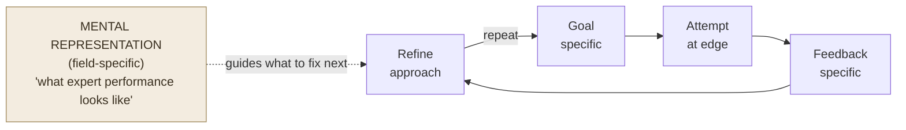

# Deliberate Practice

**Summary**: Deliberate practice is K. Anders Ericsson's term for the **specific kind of practice that produces expert-level performance**: highly structured activity at the edge of current ability, with full attention, immediate informative feedback, repetition with refinement, and a representation of the target skill (a "mental model") that guides what to fix next. Ericsson distinguished it sharply from *naive practice* (just doing the activity, accumulating hours) and *purposeful practice* (focused, with goals, but lacking the field-specific mental-representation engine). The deliberate-practice claim is the experimental backbone of the [10,000-hour](./10000-hour-rule-mythbusting.md) popularization (which Ericsson himself rejected as a distortion). This page is the canonical owner.

**Sources**:
- Ericsson, K. A., Krampe, R. Th., & Tesch-Römer, C. (1993). "The Role of Deliberate Practice in the Acquisition of Expert Performance." *Psychological Review*, 100(3), 363-406. — the foundational paper; Berlin Music Academy violinist study.
- Ericsson, K. A., & Pool, R. (2016). *Peak: Secrets from the New Science of Expertise*. Houghton Mifflin Harcourt. — popular synthesis; the canonical Naive/Purposeful/Deliberate ladder.
- Ericsson, K. A. (ed., 2006). *The Cambridge Handbook of Expertise and Expert Performance*. — review of 20+ domains.
- Macnamara, B. N., Hambrick, D. Z., & Oswald, F. L. (2014). "Deliberate Practice and Performance in Music, Games, Sports, Education, and Professions: A Meta-Analysis." *Psychological Science*, 25(8), 1608-1618. — finds deliberate practice explains substantial but **not all** variance (~26% music, ~21% games, ~18% sports, ~4% education, ~1% professions).
- Brown, Roediger & McDaniel (2014). *Make It Stick* — popular synthesis aligned with Ericsson.
- Internal: [skill-progression-stages](./skill-progression-stages.md), [practice-is-required-not-optional](./practice-is-required-not-optional.md), [novice-vs-expert-cognition](./novice-vs-expert-cognition.md).

**Last updated**: 2026-06-09

---

## The ladder: naive → purposeful → deliberate

Ericsson's three-level distinction (the [skill-progression](./skill-progression-stages.md) frame this maps onto in the wiki):

| Level | Defining feature | Output |
|---|---|---|
| **Naive practice** | "Doing the thing" — repetition without specific goals or feedback | Plateau at low-to-mid competence; hours don't compound |
| **Purposeful practice** | Specific goal, full attention, feedback, push past comfort zone | Real progress, but limited by absence of field-specific technique-base |
| **Deliberate practice** | Purposeful + a *mental representation* of expert performance built by the field, taught by a teacher who can route the learner to *the specific weakness to fix next* | Expert-level performance |

The Berlin violinist study (Ericsson 1993): three groups of violin students — "best", "good", "music teachers" — differed in lifetime deliberate-practice hours by ~7,400 / 5,300 / 3,400. The hours were not "any practice"; they were the *alone-and-focused, technique-targeting* subset.

## The five constituents

Deliberate practice (Ericsson & Pool 2016) requires **all five**:

1. **Well-defined, specific goal** — not "play better" but "play this 4-bar phrase at tempo with the bow lift on beat 3."
2. **Full attention and conscious effort** — not autopilot; the engagement of the [Cognitive stage](./automaticity-and-reflex-training.md) deliberately re-engaged.
3. **Immediate informative feedback** — what's wrong, specifically, in this attempt.
4. **Repetition with refinement** — same target, attempt after attempt, modifying the approach based on feedback.
5. **A mental representation that guides what to fix** — the field-specific model of what expert performance *is*, internalized enough to evaluate one's own attempts against it.

The fifth constituent is the load-bearing distinction from purposeful practice. Without it, the learner doesn't know what to fix; with it, every attempt becomes diagnostic.

## What does NOT count

- **Tournament play / live performance** — execution, not refinement
- **Group lessons without individual diagnosis** — feedback isn't specific
- **Re-reading / re-watching** — no production
- **Comfort-zone repetition** — not at the edge
- **Generic skill-building exercises** — no field-specific representation

A surgeon doing 30 years of routine appendectomies is not engaged in deliberate practice; a pianist running through favorite pieces is not. The hours don't compound unless the structure is present.

## Visual

Without the representation: the same loop runs, but the Refine step has no direction — that's purposeful practice. Hours accumulate but the ceiling sits below expert.

## Common misreadings

- **"10,000 hours and you're an expert"** — Ericsson never said this; Gladwell's compression is the source. See [10000-hour-rule-mythbusting](./10000-hour-rule-mythbusting.md). The Berlin violinist average is closer to 10,000 by age 20, but variance is huge and the hours are not interchangeable with playing-time hours.
- **"Talent doesn't matter"** — Ericsson argued *prior* genetic talent is overstated. Macnamara et al. (2014) re-analysis: deliberate practice explains substantial variance in domains with stable rules (music, games, sport) and much less in domains with unstable structure (professions, education).
- **"More hours = more skill"** — only if the five constituents are met; naive hours are nearly inert.

## Failure modes

| Failure | Symptom | Mitigation |
|---|---|---|
| **No mental representation** | "I practice but don't improve" — feedback can't be routed because there's no target model | Find a teacher with expert representation, or borrow one via deliberate model-study |
| **Plateau by autopilot** | Skill flatlines at the [Autonomous stage](./automaticity-and-reflex-training.md) | See [ok-plateau](./ok-plateau.md); re-engage Cognitive control with metronome / forced edge |
| **Feedback latency** | Days/weeks between attempt and informative correction | Build a faster loop; tighten the field's natural feedback delay if possible |
| **Comfort-zone repetition** | Same easy material, no specific goal | Push the goal 10–20% past current edge per session |

## Neural OS implementations

- [automaticity-and-reflex-training](./automaticity-and-reflex-training.md) — the wiki's named-stage protocol implementing deliberate practice's structure
- [red-queen-skill-gym](./red-queen-skill-gym.md) — Lamp/Scale/Sword phases are deliberate-practice instantiations
- [drill-generator](./drill-generator.md) — drills emit goal + feedback + repetition structure by construction
- [ok-plateau](./ok-plateau.md) — the failure mode Ericsson studied (Bryan & Harter 1899 telegraphers); Foer's metronome protocol is deliberate-practice's anti-plateau move
- [skill-progression-stages](./skill-progression-stages.md) — the canonical naive/purposeful/deliberate ladder
- [METER](./meter-overview.md) — every gym/drill ships with measurable target = goal-specificity constituent
- [practice-is-required-not-optional](./practice-is-required-not-optional.md) — sister principle

## Related pages

- [skill-progression-stages](./skill-progression-stages.md)
- [10000-hour-rule-mythbusting](./10000-hour-rule-mythbusting.md) — the popularization to be careful of
- [practice-is-required-not-optional](./practice-is-required-not-optional.md)
- [novice-vs-expert-cognition](./novice-vs-expert-cognition.md)
- [automaticity-and-reflex-training](./automaticity-and-reflex-training.md)
- [ok-plateau](./ok-plateau.md)
- [red-queen-skill-gym](./red-queen-skill-gym.md)
- [active-recall](./active-recall.md)
- [desirable-difficulties](./desirable-difficulties.md)

---

## U — See (CAST)
1. Edge + goal + feedback + refine + representation = deliberate
2. Without the representation, hours don't compound

## D — Name (NEDF)
1. Deliberate practice = 5-constituent expert-formation protocol
2. Distinguisher: field-specific mental representation guides refinement
3. Failure mode: naive-hours masquerading as deliberate

## F — Do (SPEAR)
1. Specific goal → attempt at edge → specific feedback → refine
2. Repeat with representation-guided correction

## B — Watch (HEART)
1. Practicing on autopilot → re-engage Cognitive control
2. No specific feedback → seek teacher or build it

## L — Predict (ORACLE)
1. All 5 constituents present → measurable progress per session
2. Any missing → ceiling below expert

## R — Act (GRACE)
1. Plateau → audit which constituent is missing
2. Improvement-without-effort → not at the edge; push 10–20% past comfort
