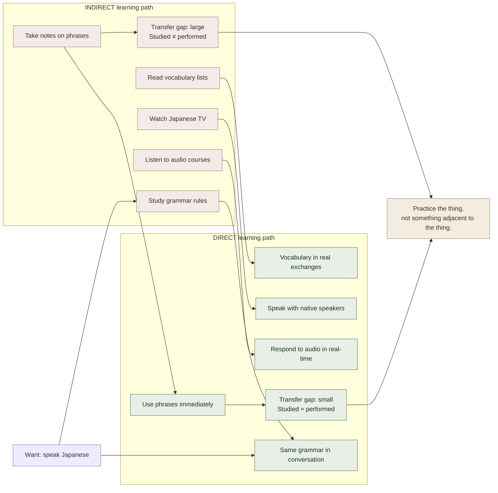

# Directness Principle

**Summary**: The Directness Principle (Scott Young, *Ultralearning* 2019, Principle 3) states that **learning transfers most reliably when the practice activity closely matches the ultimate performance context** — in terms of mental process, output type, physical environment, and social/emotional conditions. The closer the practice resembles the test, the more learning transfers. The principle is not obvious because learners routinely substitute indirect preparation (reading about a skill, watching demonstrations, studying prerequisites) for the direct activity. Direct learning is often harder, slower, and more uncomfortable than indirect preparation — which is why it is systematically avoided and why the Directness Principle must be stated as a design constraint. This page is the canonical owner.

**Sources**:
- Young, S. (2019). *Ultralearning: Master Hard Skills, Outlast the Competition, and Accelerate Your Career*. Harper Business. — Principle 3 Directness; pp. 69-98.
- Brown, P. C., Roediger, H. L., & McDaniel, M. A. (2014). *Make It Stick*. Harvard University Press. — transfer and contextual specificity.
- Ericsson, K. A. (1993). "The Role of Deliberate Practice in the Acquisition of Expert Performance." *Psychological Review*, 100(3), 363-406. — deliberate practice and domain-specificity.
- Morris, C. D., Bransford, J. D., & Franks, J. J. (1977). "Levels of Processing Versus Transfer-Appropriate Processing." *Journal of Verbal Learning and Verbal Behavior*, 16(5), 519-533. — transfer-appropriate processing framework.
- Internal: [deliberate-practice](./deliberate-practice.md), [practice-is-required-not-optional](./practice-is-required-not-optional.md), [novice-vs-expert-cognition](./novice-vs-expert-cognition.md), [making-smaller-circles](./making-smaller-circles.md), [desirable-difficulties](./desirable-difficulties.md).

**Last updated**: 2026-06-10

---

## The core claim

**Practice the thing, not something adjacent to the thing.**

Transfer of learning — the ability to apply what was learned in a new context — is the ultimate goal of learning. But transfer is more context-specific than most learners assume. Morris, Bransford & Franks (1977) showed that encoding conditions must *match* retrieval conditions for maximum transfer ("transfer-appropriate processing"). The Directness Principle is the design rule that follows: structure your practice so the encoding context approximates the performance context as closely as possible.

Indirect preparation feels productive because it is cognitively smooth and safe: reading about programming, watching cooking videos, studying chess theory. Direct practice is uncomfortable because it exposes current incompetence: actually writing code, actually cooking, actually playing chess against real opponents. This discomfort is a signal that you're in the right place — the [desirable-difficulties](./desirable-difficulties.md) literature shows that effortful conditions produce more durable learning precisely because they match real-world performance demands.

## The four dimensions of directness

| Dimension | What it means | Indirect substitute (common) |
|---|---|---|
| **Mental process** | Same cognitive operation required as in real performance | Reading about the operation instead of doing it |
| **Output type** | Same form of output (speaking, writing code, making decisions) | Noting, annotating, summarizing instead of producing |
| **Environment** | Same physical/social/tool context | Practice in quiet; perform in noisy office |
| **Stakes/pressure** | Same emotional conditions | Low-stakes drilling; high-stakes real performance |

All four matter. A programmer who studies algorithms conceptually (mental process mismatch) and reads code but doesn't write it (output mismatch) and practices in a sterile testing environment (environment mismatch) will underperform in a job interview where they must produce working code, in front of people, under time pressure.

## Directness as a learning design rule

Young's operational rule: **when designing a learning project, identify the real-world performance you ultimately want, then structure as much practice as possible to directly resemble that performance.**

Implications:
- **Language learning**: want to speak → speak; don't only study grammar
- **Programming**: want to build software → build software; don't only read documentation
- **Public speaking**: want to present to audiences → present to audiences; don't only rehearse in private
- **Writing**: want to write publishable work → write and publish; don't only outline
- **Medical diagnosis**: want to diagnose patients → practice on real cases; don't only study textbooks

This is uncomfortable because each of these direct activities exposes you to failure in a context where failure is visible. That exposure is not a bug — it is the learning.

## Project-based learning as directness

Young advocates for "project-based learning" as the canonical implementation of directness: frame your learning as producing a real artifact or performing a real task from the beginning. The project forces directness because the output criterion (working code, published article, coherent conversation) is incompatible with purely indirect preparation.

Examples from *Ultralearning*:
- Learning a language in a country (immersion) before formal study
- Building a portfolio project before knowing all the tools required
- Teaching a subject to real students while still learning it
- Competing in an event (chess tournament, speech competition) before feeling ready

The discomfort of these approaches is the directness — they pull the learner into the performance context immediately rather than postponing it.

## Directness vs. deliberate practice isolation

Young's Directness Principle and Ericsson's [deliberate-practice](./deliberate-practice.md) are not in conflict but operate at different levels:

- **Directness**: the learning project should resemble the real performance (macro-level design)
- **Deliberate practice**: within the project, specific sub-skills should be isolated and practiced at the edge (micro-level drill)

The drill ladder ([making-smaller-circles](./making-smaller-circles.md)) drills isolated sub-skills; the project ensures those sub-skills are assembled in a context that resembles the final performance. Both are necessary. Pure directness without deliberate isolation misses the targeted skill-building; pure drill without direct application misses the integration and transfer.

## Transfer-appropriate processing (Morris et al. 1977)

The cognitive-science backing: encoding context and retrieval context should match. Morris et al. showed that "rhyme processing" at encoding (think of words that rhyme with "eagle") produces better recall on a "which of these rhymes with X?" test than on a standard recognition test — even though standard recognition is the "easier" task. The encoding must match the retrieval in terms of mental process, not just in terms of the material.

Directness operationalizes this: if your performance requires you to *generate* spoken words in real-time in a conversation, practice must involve generating spoken words in real-time in conversation — not just reading about how conversations work.

## Visual

## Failure modes

| Failure | What it produces |
|---|---|
| **Preparatory loop** | "I'll start the real practice once I know enough" — never starts; the loop is substitute-activity |
| **Output mismatch** | Reading and annotating instead of producing; notes are not the output; the artifact is |
| **Environment mismatch** | Practicing in comfort; performing in pressure; skills don't transfer across the gap |
| **Only drilling, never integrating** | Expert at isolated exercises; fails at full performance; [making-smaller-circles](./making-smaller-circles.md) without re-embedding |
| **Treating directness as permanence** | Don't abandon drills; directness is the framing for the whole project, not the elimination of targeted sub-skill work |

## Related pages

- [deliberate-practice](./deliberate-practice.md) — micro-level complement to macro-level directness
- [practice-is-required-not-optional](./practice-is-required-not-optional.md) — directness is one dimension of what "practice" means
- [making-smaller-circles](./making-smaller-circles.md) — drill isolation that must be re-embedded in direct performance
- [novice-vs-expert-cognition](./novice-vs-expert-cognition.md) — expert schemas are built through direct domain-specific practice
- [desirable-difficulties](./desirable-difficulties.md) — directness is uncomfortable precisely because it creates desirable difficulty
- [krashen-sla-hypotheses](./krashen-sla-hypotheses.md) — comprehensible input in real acquisition context = directness for language
- [metalearning](./metalearning.md) — designing a learning project begins with identifying the direct performance target

---

## U — See (CAST)
1. Practice resembles performance → transfer is high; indirect preparation → transfer is low
2. Four dimensions: mental process · output type · environment · stakes

## D — Name (NEDF)
1. Directness Principle = design practice so encoding context matches performance context
2. Distinguisher: indirect preparation (adjacent to the thing) vs. direct practice (the actual thing)
3. Failure mode: preparatory loop — never starting the real practice because "not ready yet"

## F — Do (SPEAR)
1. For any learning project: name the real-world performance first → design practice to match all 4 dimensions
2. Use project-based learning: produce a real artifact from the beginning, not only when "ready"

## B — Watch (HEART)
1. Preparation feels productive but target performance hasn't been attempted → indirect-practice trap
2. Performance worse than practice → check environment/stakes mismatch

## L — Predict (ORACLE)
1. Direct practice → reliable transfer to real performance
2. Indirect preparation → strong performance in practice conditions; weak transfer to real conditions

## R — Act (GRACE)
1. New skill → identify the end performance → ask "how close does this study activity come to that?"
2. Comfortable study → challenge: can I produce the output right now, in the actual context?
