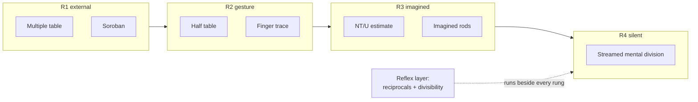

# Division Drill Ladder

**Summary**: A worked [drill-generator](./drill-generator.md) instantiation for division, built around the one property that separates division from the other arithmetic operations — its bottleneck is **state**, not recall. You are holding a partial remainder while guessing the next quotient digit, and that is a working-memory problem, so the ladder starts by putting the state outside your head and then removes the support one rung at a time. Two parallel ramps run the same stages on different substrates: the **paper ramp** (Trachtenberg's multiple table → [NT/U streaming](./trachtenberg-division.md)) and the **board ramp** ([soroban-learning-method](./soroban-learning-method.md) Stage 4 → Stage 7). A reflex layer of reciprocal decimals and divisibility rules runs beside both from day one and converts a large share of live divisions into a multiplication you already own.

**Sources**:
- [drill-generator](./drill-generator.md) — the generic ladder this instantiates
- [trachtenberg-division](./trachtenberg-division.md) — the simple (multiple-table) and fast (NT/U) methods; Trachtenberg 1960 Ch 5
- [vedic-speed-math](./vedic-speed-math.md) §6 Transpose-and-Apply, §7 Flag method — the near-base and general Vedic routes
- [soroban-learning-method](./soroban-learning-method.md) §Division, §Stage 6 Scaffold Fade — the board ramp and the fade protocol
- [soroban-drill-ladder](./soroban-drill-ladder.md) · [symbolic-fluency-drill-ladder](./symbolic-fluency-drill-ladder.md) · [drill-ladder-patterns](./drill-ladder-patterns.md) — sibling ladders and the shared meta-pattern
- Design conversation 2026-07-22 (operator request: "tools for easy start and then moving to mental"). No new raw source ingested.

**Last updated**: 2026-07-22

---

## Why division gets its own ladder

Multiplication is a *recall* problem: the times table is a lookup, and the finger trick for the 6–9 corner is a lookup prosthesis. Division is not. Even with a perfect times table you still have to hold a partial remainder, choose a quotient digit that may be wrong, and recover cleanly when it is. That is a working-memory load, and working-memory loads are solved by **externalising the state and then withdrawing the external support gradually** — which is exactly the [Scaffold Fade](./soroban-learning-method.md) protocol.

So this ladder is unusual in one respect: the first rung is deliberately a *tool*, not a technique. You are not supposed to be doing this in your head at Stage 1, and trying to is the main way people stall.

## Skill definition

```yaml
skill: division
skill_type: procedure
why_this_skill_now: division is the last unautomated arithmetic operation in the stack
target_performance: any 2-digit divisor, mentally, correct first time, under 15s
real_use_case: mental arithmetic in live settings, estimation, unit conversion, interview whiteboard work
time_horizon: 8-12 weeks
session_length: 15-25m
weekly_frequency: 5x
```

## Real target

Zenith for division is not:

- being able to *do* long division (you already can)
- memorising more of the times table
- fast division with a written scratch column

Zenith means:

- the quotient's first digit is estimated, not searched for
- the partial remainder survives the next step without being rewritten
- a wrong quotient digit is caught within one step, not at the end
- the answer is verified by digit-sum before it is used ([vedic-digit-sum-check](./vedic-digit-sum-check.md))
- divisor shape selects the method automatically

## The two ramps and the fade

Both ramps run the same rung sequence from [soroban-learning-method](./soroban-learning-method.md) §Stage 6 Scaffold Fade. The difference is what physically holds the state at R1.

| Rung | Paper ramp | Board ramp |
|---|---|---|
| **R1** — external object | The written multiple table: `D, 2D, 3D … 10D` built by repeated addition, with the digit-sum check column | The soroban: divisor set left, quotient forming centre, remainder living right |
| **R2** — gesture, no object | Write only `D, 2D, 5D`; double and add for the rest | Finger-trace the rod positions on the desk |
| **R3** — imagined object | No table. Estimate the quotient digit from the leading-digit ratio; NT/U products carry the rest | Eyes closed, imagined rods |
| **R4** — silent | Streamed mental division, answer written directly | Mental soroban |

Run **one ramp as primary**. The other is review, not a second curriculum. If you already own the soroban's addition and subtraction, take the board ramp; if you do not, take the paper ramp, because Trachtenberg's R1 requires nothing you don't have — the multiple table is built with addition alone, and it makes the operation nearly impossible to get wrong.



**The promotion rule is accuracy, never speed.** Advance a rung only when the current one is clean at low speed. Forcing R3 early is the single most common way this ladder stalls — the same warning [soroban-learning-method](./soroban-learning-method.md) gives twice about mental soroban.

## Stage map

Drill stages 0–7 per [skill-progression-stages](./skill-progression-stages.md), mapped to division focus and fade rung:

| Drill stage | Division focus | Rung |
|---|---|---|
| `0 Orientation` | read a division as a shape: divisor size, dividend length, expected quotient length | R1 |
| `1 Isolation` | build the multiple table cleanly; one lookup-and-subtract step in isolation | R1 |
| `2 Clean Repetition` | full divisions, one divisor family at a time, table always present | R1 |
| `3 Controlled Variation` | half table; divisor shapes vary; digit-sum check on every answer | R2 |
| `4 Automaticity` | leading-digit-ratio estimation becomes immediate; NT/U products land without pause | R2→R3 |
| `5 Mixing` | method selection by divisor shape (near-base vs general vs repeated) | R3 |
| `6 Pressure And Noise` | timed sets, interruption mid-remainder, recovery without restart | R3 |
| `7 Transfer And Zenith` | live mental division inside real problems; verified, not guessed | R4 |

## Primary failure modes

- `cannot recognize` → divisor shape is not read, so the wrong method is chosen
- `cannot recall` → the multiple table is being *computed* rather than looked up (stay at R1)
- `cannot execute` → the quotient digit is right but the subtraction misaligns
- `confuses neighbors` → NT and U products swapped (the signature fast-method error, and it is silent — only the digit-sum check catches it)
- `too slow` → each quotient digit is searched by trial multiplication instead of estimated
- `fails when mixed` → near-base and general divisors both get the general method
- `fails after disruption` → losing the partial remainder ends the whole division rather than one step
- `fails in real conditions` → the mental image of the remainder collapses past three digits

## Stage 0: Orientation

Goal: read the shape of a division before touching it.

Best drills:

- given `27,483,624 ÷ 62`, state the quotient's digit count before dividing (six)
- name the divisor family out loud: near-base · small · general · repeated
- state what the remainder can possibly be (`0 ≤ r < D`)

Pass rule: quotient length called correctly eight times out of ten, before any computation.

## Stage 1: Isolation

Goal: own the table and one subtract step, separately.

Best drills:

- build the ten-entry multiple table for one divisor by addition only; verify the last row equals `D` with a zero appended
- build the parallel digit-sum check column and catch a deliberately planted addition error
- one lookup-and-subtract step, given a partial dividend

Daily block:

1. 5 min table building (one divisor, timed only for smoothness)
2. 5 min planted-error hunting in a prebuilt table
3. 5 min single subtract steps

Pass rule: a correct ten-entry table with check column in under 90 s, and a planted error found without recomputing the whole column.

Common error owner: `cannot recall`.

## Stage 2: Clean Repetition

Goal: complete divisions, table always visible, zero errors.

Anchor drill: ten divisions by the **same** divisor (the table is built once and reused — this is what the simple method is for).

Stretch drill: five divisions with the divisor changing each time, so the table cost is paid every problem.

Repair drill: when a wrong multiple is picked, name which error mode fired — *too large* (the subtraction fails immediately) or *too small* (the next quotient digit would be ten). Both are caught within one step; say which one before fixing it.

Pass rule: ten out of ten correct with the table present, plus a digit-sum verification on every answer.

Fallback rule: any silent error (one that the two structural checks did not catch) sends you back to Stage 1.

## Stage 3: Controlled Variation

Goal: prove you own the operation, not the table.

Best drills:

- half table only (`D`, `2D`, `5D` written; `3D = D+2D`, `4D = 2D+2D`, `6D = 5D+D`, and so on derived in place)
- integer and decimal dividends in the same set
- exact and remainder-producing divisions alternating
- the same dividend divided by a near-base divisor and by a general one, back to back

Pass rule: nine out of ten with the half table, and the two divisor families still get different methods.

## Stage 4: Automaticity

Goal: remove the search from quotient-digit selection.

Best drills:

- **leading-digit ratio flash**: given the first digits of dividend and divisor, name the next quotient digit in under 2 s (`19 ÷ 3 → 6`)
- **NT/U flash**: given a two-digit number and a single-digit multiplier, name both products (`43 × 6 → NT 25, U 5`) — see [trachtenberg-division](./trachtenberg-division.md) for the primitive definitions
- timed short divisions with the table gone

Target metrics: fewer than one hesitation per quotient digit; no rewriting of the partial remainder.

Pass rule: 95% accuracy on timed sets. NT/U flash under 2 s.

Fallback rule: if timing produces NT/U swaps, drop the timer and return to Stage 3. A swap is silent, which makes it the one error worth over-correcting.

## Stage 5: Mixing

Goal: divisor shape selects the method without deliberation.

The routing table is owned by [trachtenberg-division](./trachtenberg-division.md) §When to use which and [vedic-speed-math](./vedic-speed-math.md) §When to use which method — do not re-derive it here. Drill the *recognition*, not the methods:

- **shape flash**: see a divisor, name the method in under 2 s (`98 → near-base, Transpose-and-Apply`; `47 → general, Flag or NT/U`; `62` repeated across a page `→ build the table once`)
- mixed sets where the method changes every problem
- one set where the *wrong* method is prescribed, and the drill is to notice and override

Pass rule: 80% or better on mixed sets with no hints, and every override caught.

## Stage 6: Pressure And Noise

Goal: keep the remainder alive under load.

Best drills:

- timed mixed ladders
- deliberate interruption mid-division, then resume **from the current partial remainder** rather than restarting
- backward explanation: state what the previous quotient digit was and why
- long dividend, short divisor (the streaming case, where a lost remainder costs the most)

Pass rule: recover from one interruption without restarting, twice in a session.

Common error owner: `fails after disruption`.

## Stage 7: Transfer And Zenith

Goal: division as a live reflex inside real work.

Zenith tests:

- any 2-digit divisor, mentally, correct first time, under 15 s
- a division met inside a real problem (unit conversion, estimate, percentage) answered without switching context
- the answer verified by digit-sum before it is used
- a deliberately wrong answer rejected by the check rather than by re-doing the division

Pass rule: one live session with mixed real divisions, no scratch paper, all answers sealed by digit-sum.

## The reflex layer — runs beside every rung

This layer is not on the ladder. It is pure lookup, installed like the 6–9 finger trick, and it starts on day one because it shortens every rung above it.

### Reciprocal decimals

| `1/n` | Decimal | Note |
|---|---|---|
| `1/2` `1/4` `1/5` `1/8` | `.5` `.25` `.2` `.125` | already reflex for most operators |
| `1/3` `1/6` `1/9` | `.333…` `.1666…` `.111…` | one repeating digit |
| `1/7` | `.142857` repeating | the six-digit cycle — see below |
| `1/11` | `.0909…` | pairs with the alternating-sum divisibility rule |
| `1/12` `1/16` `1/20` `1/25` | `.08333…` `.0625` `.05` `.04` | the money-and-measurement group |
| `1/13` | `.076923` repeating | two distinct six-digit cycles; second-tier card |

**The sevenths are one card, not six.** Every `n/7` is a rotation of the same cycle `142857`:

```
   1/7 = .142857      4/7 = .571428
   2/7 = .285714      5/7 = .714285
   3/7 = .428571      6/7 = .857142
```

Checksum: the six leading digits are `1 2 4 5 7 8` — which is the cycle `142857` with its own digits sorted. If a recalled seventh starts with `3`, `6`, `9`, or `0`, it is wrong before you check anything else.

### Divisibility rules

| Divisor | Test |
|---|---|
| `2` `5` `10` | last digit |
| `4` | last two digits | 
| `8` | last three digits |
| `3` `9` | digit sum ([vedic-digit-sum-check](./vedic-digit-sum-check.md) substrate, reused) |
| `6` | passes 2 **and** 3 |
| `7` | double the last digit, subtract from the rest; repeat |
| `11` | alternating digit sum |
| `13` | four times the last digit, added to the rest; repeat |

Pass floor for the whole reflex layer: any entry named in under 1.5 s, cold.

### Why this layer pays

A division whose divisor is `7`, `8`, `11`, `12`, `16`, or `25` stops being a division — it becomes "multiply by the reciprocal and shift", which is an operation you have already automated. The reflex layer does not make you better at the ladder; it removes problems from the ladder's workload entirely.

## First two weeks

### Week 1 — R1 only

- Day 1: quotient-length calling; build one multiple table
- Day 2: table plus check column; planted-error hunting
- Day 3: ten divisions, one divisor, table present
- Day 4: same, second divisor; reciprocals `1/2`–`1/9` installed
- Day 5: ten divisions, divisor changing; digit-sum check on every answer

Exit test: ten consecutive correct divisions with the table, every answer sealed, no silent errors.

### Week 2 — R1 → R2

- Day 1: half table (`D`, `2D`, `5D`)
- Day 2: half table plus decimals
- Day 3: leading-digit ratio flash introduced
- Day 4: NT/U flash introduced, untimed
- Day 5: five divisions with the half table plus five NT/U flashes

Exit test: half table stable at nine out of ten; NT/U products named without swapping.

## Minimum daily session

If time is short, do only this:

1. 3 min reciprocal and divisibility flash
2. 7 min one clean division family at the current rung
3. 3 min leading-digit ratio or NT/U flash
4. 2 min digit-sum verification of every answer produced

## Weekly review questions

- Is the failure in method selection, table recall, quotient estimation, or remainder holding?
- Am I at the rung I claim, or am I secretly peeking at a written remainder?
- Which divisor family still gets the wrong method?
- Did any error get past both structural checks this week? (That is the only kind worth alarm.)
- Has the reflex layer removed any problems from the ladder yet, or am I still dividing by 8 the hard way?

## Worked drill-generator snapshot

```yaml
skill: division, two-digit divisor
skill_type: procedure
target_performance: correct first time, table absent, under 20s
current_stage: 3
failure_mode: too slow
rung: R2

anchor_drill:
  family: clean repetition
  prompt_shape: 10 divisions by one divisor, half table only
  reps: 10
  constraint: derive missing multiples in place, never rebuild the full table
  pass_rule: 9/10 correct, all digit-sum sealed

stretch_drill:
  family: controlled variation
  prompt_shape: 5 divisions, divisor family changing every item
  reps: 5
  constraint: name the method aloud before starting
  pass_rule: 4/5 correct with correct method chosen

repair_drill:
  family: quotient-estimation repair
  prompt_shape: leading-digit ratio flash on the digits that were guessed wrong
  reps: 10
  constraint: under 2s per item
  pass_rule: 10/10
```

## METER pass-floors

Measurement per [METER](./meter-overview.md) convention:

| Skill | Pass-floor |
|---|---|
| Reciprocal or divisibility rule named cold | <1.5 s |
| Sevenths cycle rotation (`5/7 → .714285`) | <2 s |
| Divisor shape → method named | <2 s |
| Leading-digit ratio → next quotient digit | <2 s |
| NT/U product pair named | <2 s |
| Ten-entry multiple table built with check column | <90 s |
| Four-digit dividend ÷ two-digit divisor, R2 | <45 s |
| Four-digit dividend ÷ two-digit divisor, R4 | <15 s |
| Digit-sum verification of a completed division | <10 s |
| Interruption recovery from a held partial remainder | resumes, does not restart |

Suggested event names: `division_reciprocal_recall` · `division_method_selection` · `division_quotient_estimate` · `division_ntu_product` · `division_full_mental` · `division_seal_verify`.

## Related pages

- [trachtenberg-division](./trachtenberg-division.md) — owns the simple and fast methods; this page is the training path for them
- [vedic-speed-math](./vedic-speed-math.md) — owns Transpose-and-Apply (§6) and the Flag method (§7)
- [soroban-learning-method](./soroban-learning-method.md) — owns the board ramp and the Scaffold Fade protocol
- [soroban-drill-ladder](./soroban-drill-ladder.md) — sibling ladder; division sits at its Stage 7
- [squaring-reflexes](./squaring-reflexes.md) — the companion operation, which is a lookup problem rather than a state problem
- [symbolic-fluency-drill-ladder](./symbolic-fluency-drill-ladder.md) — the equation-side ladder, third member of this trio
- [vedic-digit-sum-check](./vedic-digit-sum-check.md) — the verification layer used at every stage
- [speed-math-unifying-generator](./speed-math-unifying-generator.md) — why division is the inverse direction of one identity, not a separate system
- [drill-generator](./drill-generator.md) · [drill-ladder-patterns](./drill-ladder-patterns.md) · [skill-progression-stages](./skill-progression-stages.md) — the generic machinery

---

## U — See (CAST)
1. Two ramps (table and board) converging on one silent mental stream
2. A partial remainder held in the air while the next digit is chosen

## D — Name (NEDF)
1. Division drill ladder = the state-holding ladder
2. Distinguisher: the only arithmetic ladder whose first rung is a physical tool by design
3. Failure mode: forcing R3 before R2 is clean; silent NT/U swaps

## F — Do (SPEAR)
1. Pick a ramp → stay at R1 until accuracy is boring
2. Read divisor shape → select method → estimate, don't search
3. Seal every answer with the digit-sum check

## B — Watch (HEART)
1. Peeking at written state while claiming a higher rung
2. Dividing by 8 or 25 the hard way when the reflex layer already covers it

## L — Predict (ORACLE)
1. Divisor near a power of ten → predict Transpose-and-Apply wins
2. Repeated divisor across a page → predict the table pays for itself

## R — Act (GRACE)
1. Live division → shape first, method second, estimate third
2. Seal mismatch → locate the digit before acting on the answer
