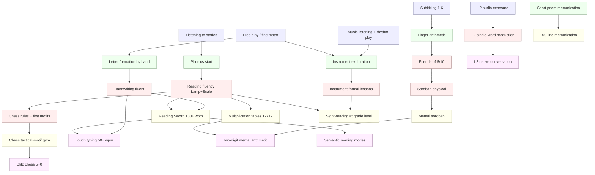

# Early Childhood Skill Stack

**Summary**: The eight academic skills with the highest evidence base and the largest compounding return when started before age ~10, each paired with a concrete training recipe to drive it from first exposure to reflex using the [automaticity-and-reflex-training](./automaticity-and-reflex-training.md) framework. Reading fluency, mental arithmetic, and an instrument are the load-bearing three; everything else stacks on top.

**Sources**: synthesized from [automaticity-and-reflex-training](./automaticity-and-reflex-training.md), [skill-progression-stages](./skill-progression-stages.md), Soroban Learning Method, [language-learning-protocol](./language-learning-protocol.md), [semantic-reading-system](./semantic-reading-system.md), [chunking](./chunking.md), [motoric-encoding-systems](./motoric-encoding-systems.md). Working memory and deliberate practice referenced as concept stubs (no owner pages yet).

**Last updated**: 2026-05-11

---

## Why early matters

Two forces make the early window special, and they are different forces:

1. **Closing windows.** Some capacities (phonological discrimination, native-accent production, fine-motor pen control) get harder to acquire after a developmental window. Missing the window does not make the skill impossible, but the cost rises sharply. Second-language phonology and handwriting are the clearest cases.
2. **Compounding capacity.** Most early skills are not valuable for their own content — they free up working memory for the next layer. A child reading at 200 wpm can absorb a textbook; a child reading at 60 wpm spends all attention on decoding and learns nothing else from the page. Reading, arithmetic, handwriting, and typing are pure substrate skills: their value is what they unlock above them.

Both forces argue for the same thing — drive a small set of foundational reflexes to high [automaticity level](./skill-progression-stages.md) early, then build on top.

---

## The eight-skill stack

| # | Skill | Dominant element | Closing window? | Substrate for | Target [automaticity level](./skill-progression-stages.md) |
|---|---|---|---|---|---|
| 1 | Phonics-based reading fluency | Water (perceptual) | Soft (~age 9) | Every later subject | 7 |
| 2 | Mental arithmetic / number sense | Earth + Water | Soft (~age 7) | Math, physics, finance, programming | 6 |
| 3 | Handwriting | Earth (procedural) | Hard (~age 8) | Composition, note-taking, spelling | 6 |
| 4 | Memorization habit | Air + Earth | None — but easier early | Every subject | 6 |
| 5 | Musical instrument with notation | Earth + Water | Soft (~age 7 for ear) | Math, focus stamina, working memory | 5–6 |
| 6 | Second language with native exposure | Water + Earth | Hard (~age 7 for accent) | Cognitive flexibility, opens a culture | 7 (comprehension), 5 (production) |
| 7 | Chess or Go | Air + Aether | None | Planning, branching look-ahead | 5 (motifs) |
| 8 | Touch typing | Earth | None — but free win at age 8 | All future text production | 7 |

Element column uses the [Five Elements taxonomy](#) defined in [automaticity-and-reflex-training](./automaticity-and-reflex-training.md) (Water = perceptual, Air = conceptual, Earth = procedural, Fire = generative, Aether = strategic).

Target levels are on the [automaticity level axis (0–9)](./skill-progression-stages.md). Substrate skills (1, 3, 8) need level 7+ because anything less leaves a working-memory tax that handicaps every later layer. Generative or strategic skills (5, 7) plateau usefully at level 5–6.

---

## Per-skill training recipe

Every recipe below uses the same three-phase structure from [automaticity-and-reflex-training](./automaticity-and-reflex-training.md):

- **Lamp** — recognition drills (see the signal before reasoning)
- **Scale** — discrimination drills (separate near-confusables)
- **Sword** — pressure drills (act under time, noise, fatigue)

For each skill the recipe lists the trigger, the drill progression, the pass criterion, and the most common failure mode.

---

### 1. Phonics-based reading fluency

**Element**: Water. **Window**: soft — most recoverable kids are caught by grade 3; after that the gap widens permanently.

**Reflex unit** (see [automaticity-and-reflex-training](./automaticity-and-reflex-training.md) reflex card format):
```
When I see a written word,
I automatically produce its sound,
and I check by whether comprehension keeps pace with my voice.
```

**Lamp drills**: grapheme-phoneme flashcards (44 English phonemes), CVC blending, sight-word recognition under <1 s timer. Use spaced repetition via [anki-reflex-deck-builder](./anki-reflex-deck-builder.md); phonics is one of the cleanest possible deck targets.

**Scale drills**: minimal-pair discrimination (`bit`/`bet`/`bat`), digraph vs blend (`sh` vs `s+h`), nonsense-word reading (forces decoding instead of guessing from memory).

**Sword drills**: timed oral reading sprints (target 90 wpm by end of grade 1, 130 by grade 2, 180+ by grade 4). Repeated reading of the same passage three times — speed and prosody improve every pass.

**Pass criterion** ([automaticity level 7](./skill-progression-stages.md)): silent reading at >200 wpm with comprehension intact under a distracting environment.

**Failure mode**: whole-word / sight-only memorization without phonics — child appears to read in K-2, then collapses around grade 3 when novel multisyllabic words arrive. Drill nonsense words to prevent this.

---

### 2. Mental arithmetic and number sense

**Element**: Earth (procedural) wrapped around Water (subitizing perception). **Window**: soft — pre-7 number-line intuition is the strongest single predictor of later math achievement.

This is the skill the Neural OS already has full coverage for: see Soroban Learning Method and [soroban-drill-ladder](./soroban-drill-ladder.md). The early-childhood version is a subset of that pipeline, run in this order:

1. **Subitizing** (ages 3–5): instant recognition of dot patterns 1–6 without counting. Pure Lamp drill.
2. **Number line / quantity comparison** (ages 4–6): which is bigger, 7 or 4? — without counting up.
3. **Friends-of-5 and friends-of-10 complements** (ages 5–7): the only "facts" worth memorizing before times tables. They unlock mental addition.
4. **Soroban or finger abacus** (ages 5–8): see Soroban Learning Method for the four-layer method (quantity, complement, procedure, mnemonic).
5. **Multiplication tables to 12×12** (ages 6–9): drilled to [automaticity level 6](./skill-progression-stages.md) (90% under timer). Skip-counting first, then random-order recall.

**Pass criterion**: any single-digit-times-single-digit fact retrieved in <2 s with no finger counting; two-digit mental addition under 5 s.

**Failure mode**: drilling speed before accuracy — fossilizes wrong tables. Apply the [automaticity-and-reflex-training](./automaticity-and-reflex-training.md) "Never automate before feedback" rule strictly here. The child must hit 90% accuracy untimed before any timer is added.

---

### 3. Handwriting

**Element**: Earth. **Window**: hard — the hand-eye motor map for letter formation is much harder to install after age 8, and reading suffers if it never installs.

Handwriting matters more than parents think because it is **also** a perceptual training: the motor act of forming a letter strengthens the visual recognition of that letter, which strengthens reading. This is part of why typing-first kids read worse — the encoder is missing the motor channel that [motoric-encoding-systems](./motoric-encoding-systems.md) describes.

**Lamp drills**: trace letter shapes; name letters by their motor formula ("c, up, down" for `a`).

**Scale drills**: similar-letter discrimination under speed (`b` vs `d`, `p` vs `q`, `m` vs `w`), correct letter formation when the start position is varied.

**Sword drills**: copying short sentences with both speed and legibility scored; dictation at conversational pace (forces handwriting to keep up with thought).

**Pass criterion** ([automaticity level 6](./skill-progression-stages.md)): can write a 100-word passage from dictation with legible cursive at >40 letters/min, attention free for content rather than letter shapes.

**Failure mode**: introducing keyboards before handwriting is fluent. The child loses the motor reinforcement of letter recognition and often never recovers fluent handwriting.

---

### 4. Memorization habit

**Element**: Air + Earth. **Window**: none — but the habit is massively easier to install in a child who has not yet decided "I'm bad at memorizing."

This skill is partly meta: it teaches the child that they *can* hold structured material in their head, which most adults have lost. Targets:

- Poems (50–100 lines by age 8, building to a long passage like a Shakespeare soliloquy by age 12)
- Multiplication tables (covered in skill 2)
- Scripture, Quran, or culturally-significant text appropriate to the family
- Lists with internal structure (capitals, periodic table, chronological lists)

**Lamp drills**: recite under cue (book-open prompt, looking-away response).

**Scale drills**: recite from any random starting line; recite the line *before* a given line (much harder — forces the chain to be bidirectional).

**Sword drills**: recite under distraction (with a metronome, while walking, in front of family). Recite the next line in <1 s after a random cue line.

**Pass criterion** ([automaticity level 6](./skill-progression-stages.md)): 100-line passage recalled with >95% accuracy under random-start prompts.

**Substrate effect**: a child who has memorized one long structured text has built the [chunking](./chunking.md) muscle and the retrieval-under-pressure muscle. Both transfer.

---

### 5. Musical instrument with notation

**Element**: Earth + Water. **Window**: soft for fine motor (~age 7), soft for absolute-pitch ear (~age 6, although the practical value of absolute pitch is debated).

Piano or violin chosen for two reasons: both require notation reading (which builds a second symbolic-decoding reflex parallel to reading text), and both require fine bilateral motor coordination.

**Lamp drills**: note-name recognition (flashcards of staff positions), rhythm recognition (clap back what you hear).

**Scale drills**: sight-reading new pieces at slow tempo (recognition under unfamiliarity is the actual hard skill); interval ear training (hear two notes, name the gap).

**Sword drills**: tempo sprints — play a passage at 60 bpm, then 80, then 100, with accuracy gate before each speed-up. This is a clean instance of the "Never automate before feedback" rule.

**Pass criterion** ([automaticity level 5–6](./skill-progression-stages.md)): can sight-read a piece at the child's grade level on first attempt at performance tempo with <3 errors.

**Substrate effect**: practicing an instrument is the only common childhood activity that demands sustained attention with immediate auditory feedback for 20+ minutes. It builds focus stamina more than anything else on this list.

---

### 6. Second language with native-speaker exposure

**Element**: Water (phonological recognition) + Earth (production motor patterns). **Window**: hard for accent and phonological perception (~age 7); soft for grammar and vocabulary (lifelong).

If you do nothing else with the second language, get the **ear** trained before the window closes. Vocabulary and grammar can be added at any age; native phoneme discrimination cannot.

The Neural OS treatment is in [language-learning-protocol](./language-learning-protocol.md) and [language-learning-architecture](./language-learning-architecture.md) — the early-childhood version emphasizes the phonology layer:

**Lamp drills**: minimal-pair listening (Mandarin tones, Russian palatalization, Arabic emphatic consonants — whatever the L2 demands). Native-speaker audio; no romanization once the basic sounds are installed.

**Scale drills**: sentence repetition (shadowing) at conversational speed. Pick out a target word inside a fast sentence.

**Sword drills**: live conversation with a native speaker for 10+ minutes at the child's level. Production drilled at full speed against a real interlocutor — the only Sword drill that matters for language.

**Pass criterion**: comprehension at [automaticity level 7](./skill-progression-stages.md) (understands native-speed speech in normal contexts). Production at level 5 is plenty for a child — they will catch up if comprehension is automatic.

**Failure mode**: classroom L2 with no native exposure — produces a reading knowledge that never converts to listening, which never converts to speaking. The phonology window closes, and the child carries a permanent accent and a permanent ear gap.

---

### 7. Chess or Go

**Element**: Air + Aether. **Window**: none — but the habit forms easily in children and rarely in adults.

The value is not chess specifically; it is the **branching look-ahead** muscle and the experience of holding 3–5 candidate moves in working memory while evaluating each. Both sides of pattern recognition (tactical motif Lamp drills) and strategic planning (Aether) are exercised.

**Lamp drills**: tactical motif recognition (fork, pin, skewer, discovered attack) under <5 s puzzle-rush format. This is structurally identical to the algorithm-pattern-gym for LeetCode patterns — pattern flash + classification.

**Scale drills**: motif discrimination ("is this a fork or a pin?"), endgame technique drills (king-and-pawn, opposition).

**Sword drills**: blitz games (5+0 or 3+0 time control). Forces every learned pattern into reflex.

**Pass criterion** ([automaticity level 5](./skill-progression-stages.md)): tactical motifs identified in <5 s on unseen positions with >85% accuracy.

**Why this and not video games**: chess gives social, narrative, and verbal-reasoning byproducts that screen games do not. Plays well with parents and grandparents — the social transfer is part of the value.

---

### 8. Touch typing

**Element**: Earth. **Window**: none — but install at age ~8 (after handwriting is fluent) and it pays back forever.

A 2× typing speed difference is a permanent ~30% productivity multiplier over a lifetime of computer use, and the skill plateaus quickly with deliberate practice. The cost is ~20 hours of focused practice; the return is decades.

**Lamp drills**: home-row finger-to-key flash drills; single-letter accuracy under <500 ms.

**Scale drills**: common bigram and trigram sprints (`th`, `ing`, `tion`); minimal-pair finger discrimination (`ed` vs `de`).

**Sword drills**: timed paragraph copying, then timed dictation. WPM is scored *only* with accuracy ≥ 98% — never trade accuracy for speed.

**Pass criterion** ([automaticity level 7](./skill-progression-stages.md)): >50 wpm with ≥98% accuracy, eyes never on the keyboard.

**Failure mode**: hunt-and-peck habits installed before formal training. The child has to *unlearn* a working-but-wrong pattern, which is harder than starting from zero.

---

## Roadmap with dependencies

The age-bucketed table below is the calendar view; the dependency graph and per-skill progression chains underneath are the structural view. Use the structural view to decide *what to start next*; use the calendar view to sanity-check the pace.

### Calendar view (approximate ages)

| Age | Add | Don't yet |
|---|---|---|
| 3–4 | Subitizing, number-line games, songs, listening to stories read aloud, exposure to L2 audio | Formal handwriting, formal phonics |
| 4–5 | Phonics (start), letter formation by hand, finger arithmetic, instrument exploration | Reading speed pressure, multiplication tables |
| 5–7 | Phonics (drive to fluency), friends-of-5/10, instrument lessons, L2 ear training, memorization (short poems) | Touch typing, formal chess study |
| 7–9 | Reading fluency Sword phase, multiplication tables, soroban or mental abacus, instrument notation, chess motifs, longer memorization | — |
| 8–10 | Touch typing, two-digit mental arithmetic, sight-reading on instrument, blitz chess, longer-form L2 production | — |

### Dependency graph

Each node is a sub-skill milestone, not a whole skill. Arrows are hard prerequisites — do not advance the downstream node until the upstream node is at its target gate.



Three load-bearing edges to notice:

1. **Phonics → Reading fluency → almost everything in Wave 3.** Reading is the universal substrate — five downstream nodes wait on it. If a child is behind on one thing, prioritize this.
2. **Letter formation → Handwriting fluent → Reading Sword + Touch typing.** The motor-perceptual coupling means handwriting is a quiet bottleneck for both reading speed and later typing.
3. **Subitizing → Finger arithmetic → Friends-of-5/10 → Soroban → Mental soroban → Two-digit mental.** The math chain is the longest; start its first node earliest (subitizing at age 3) so the chain has time to complete.

### Per-skill internal progression

Each skill is a chain of sub-stages with explicit advancement gates. Move to the next sub-stage *only* when the gate is met; this is the [automaticity-and-reflex-training](./automaticity-and-reflex-training.md) "Never automate before feedback" rule applied at the within-skill level.

| Skill | Sub-stage chain (advance gate in parens) |
|---|---|
| Reading | phoneme awareness (44 phonemes named) → blending CVC (90% on novel CVC) → sight-words top 100 (<1 s each) → connected text fluency (60 wpm) → Sword sprints (130 wpm grade 2, 200+ wpm by grade 4) → [semantic-reading-system](./semantic-reading-system.md) (silent reading with comprehension tags) |
| Mental arithmetic | subitize 1–6 (instant, no count) → number-line comparison (no count) → finger arithmetic (within 10) → friends-of-5/10 (90% untimed) → soroban physical (per [soroban-drill-ladder](./soroban-drill-ladder.md)) → soroban mental → two-digit mental addition <5 s |
| Handwriting | trace shapes → form unsupported letters (correct start position) → join cursive → speed dictation 40 letters/min → 100-word passage from dictation legibly |
| Memorization | short rhymes recited cued → 20-line poem uncued → 50-line poem from any random start line → 100-line passage under distraction (>95% accuracy) |
| Music | rhythm clap-back → note-name flash (staff position <1 s) → simple piece at slow tempo → tempo sprints with accuracy gate per speed-up → grade-level sight-reading first attempt |
| Second language | minimal-pair listening (90% on tested pair) → single-word production → sentence shadowing at conversational speed → 10-min live conversation with native speaker |
| Chess | rules clean → motif recognition Lamp (fork/pin/skewer flash) → motif Scale (discrimination under variation) → puzzle-rush <5 s/motif → blitz at 5+0 |
| Touch typing | home-row finger-key flash → all keys with no eye → bigram sprints (`th`, `ing`, `tion`) → timed paragraph copy → dictation at 50+ wpm with ≥98% accuracy |

Each chain is a [drill ladder stage](./skill-progression-stages.md) progression in miniature — Lamp drills at the front, Scale drills in the middle, Sword drills at the back. The advancement gate **is** the corresponding [automaticity level](./skill-progression-stages.md) gate (see the per-skill recipes earlier on this page for the specific drill format at each sub-stage).

### Concurrency rule

Run **at most three skills in active Sword phase at once**. The other skills sit in maintenance (occasional review, real use) — see neural-os-daily-loop for the adult version of the same rotation principle. Children have less working memory and energy than adults; the daily total focused-practice budget is roughly age-in-years × 5 minutes.

A practical rotation pattern at age 7:

- **Active Sword** (3 skills, ~20 min/day total): the three skills currently behind their target, drilled with timer and pressure.
- **Active Lamp/Scale** (2–3 skills, embedded in the day): newly introduced or sub-stage-advancing skills, drilled for accuracy without time pressure.
- **Maintenance** (everything else): real use only — the child reads books, plays the instrument for fun, speaks the L2 with a relative, plays a non-blitz chess game.

### How to continue once a skill hits its target

Hitting the per-skill target [automaticity level](./skill-progression-stages.md) is not the end of training — it is the transition to maintenance + transfer. The pattern for every skill:

1. **Confirm the gate.** The child meets the per-skill pass criterion under fair conditions twice in a row, on different days. One success is variance.
2. **Drop active drilling, install maintenance.** Replace daily timed drill with weekly review at target speed. If the level holds for four consecutive weeks, drop further to monthly.
3. **Replace drill with real use.** A skill at automaticity level 7 should be *used* (read for content, play music for music, speak the L2 to communicate). Real use *is* the maintenance drill — but only if the child is doing it weekly. If real use stops, formal maintenance must continue.
4. **Promote to substrate.** Mark the skill as available substrate for the next layer up (e.g. reading fluent → start Wave-4 [semantic-reading-system](./semantic-reading-system.md); soroban mental → start algebra mental work; touch typing → start essay drafting).
5. **Free a Sword slot.** With one skill demoted to maintenance, a new skill from the dependency graph downstream becomes eligible for Sword phase. Pick the one with the most unblocked downstream nodes.
6. **Re-rotate every 4–6 weeks.** Even substrate skills regress under pure neglect. The weekly review is non-negotiable for the first six months after the gate is hit.

### Hand-off to the adult Neural OS pipeline

Once the eight-skill stack is at target (typically around age 10–12), the child has the substrate to enter the regular Neural OS pipeline as it operates for any learner:

- The drill mechanics handed off here are owned by [automaticity-and-reflex-training](./automaticity-and-reflex-training.md) and [red-queen-skill-gym](./red-queen-skill-gym.md) — no early-childhood-specific tooling continues into the adult pipeline.
- The daily / weekly / monthly rhythm becomes neural-os-daily-loop; the 30-day onboarding for new content becomes neural-os-30-day-rollout.
- New domain content goes through the same [Great Work](./automaticity-and-reflex-training.md) pipeline (Calcination → Coagulation), routed via the appropriate encoder — concepts to [NEDF](./nedf-overview.md), procedures to [SPEAR](./spear-overview.md), graphs to [CAST](./cast-overview.md), people to [HEART](./heart-overview.md).
- Memorization habit (skill 4) is now a general capacity that powers any palace work — see [Memory Palace](./memory-palace-architecture-for-neural-os.md).
- Chess pattern recognition (skill 7) generalizes to algorithm-pattern-gym-style pattern gyms in any domain — same Lamp / Scale / Sword structure, different content.

The continuity is the engine, not the content. A child who reaches age 12 with the eight-skill stack at target has, in effect, already been running the Neural OS for years — the framework just becomes explicit at that point.

---

## Anti-patterns

These mistakes recur. Each one breaks an automaticity rule from [automaticity-and-reflex-training](./automaticity-and-reflex-training.md):

1. **Speed before accuracy on math facts** — fossilized errors, [automaticity level](./skill-progression-stages.md) caps at 4 forever. Apply 90%-untimed gate.
2. **Whole-word reading without phonics** — comprehension collapses on novel multisyllabic words around grade 3.
3. **Typing before handwriting** — letter recognition stays weak; reading suffers. Install handwriting first.
4. **Classroom L2 with no native ear input** — phonology window closes; permanent accent and listening gap.
5. **Recognition-only memorization** ("can the child recognize the word?") instead of recall — fails [automaticity level 3](./skill-progression-stages.md) gate, never builds the working-memory muscle.
6. **Five active skills at once** — none of them progress. Cap at three in Sword phase, rest in maintenance.
7. **Reward for activity, not for reps** — child practices an instrument while watching TV; no perceptual feedback loop, no automaticity. Mass time without feedback is wasted.
8. **Skipping Scale phase** — child can recognize and can perform under no time pressure, but cannot discriminate near-confusables. Looks competent in homework, collapses on tests.

---

## How this connects to the rest of the wiki

- [automaticity-and-reflex-training](./automaticity-and-reflex-training.md) — the engine; every recipe above is a tailored instance of The Great Work + Lamp/Scale/Sword.
- [skill-progression-stages](./skill-progression-stages.md) — canonical numbering for all the level claims on this page; cite this page rather than restating the levels.
- Soroban Learning Method and [soroban-drill-ladder](./soroban-drill-ladder.md) — full owner pages for skill 2 (mental arithmetic).
- [language-learning-protocol](./language-learning-protocol.md), [language-learning-architecture](./language-learning-architecture.md) — full owner pages for skill 6 (second language).
- [semantic-reading-system](./semantic-reading-system.md) — once skill 1 (decoding fluency) is solved, this is the next reading layer (comprehension modes, function tags).
- [anki-reflex-deck-builder](./anki-reflex-deck-builder.md) — concrete tool for building Lamp-phase decks for skills 1, 2, 5, 6, 7.
- [red-queen-skill-gym](./red-queen-skill-gym.md) — the Sword-phase structure that the recipes for skills 1, 2, 6, 7, 8 borrow from.
- [motoric-encoding-systems](./motoric-encoding-systems.md) — explains why handwriting (skill 3) and instrument (skill 5) are perceptual investments, not just motor skills.
- [chunking](./chunking.md) and working memory — the substrate that every skill on this list expands.
- deliberate practice — the principle behind every Sword-phase recipe (focused, effortful, immediately corrected).

## Related pages

- [automaticity-and-reflex-training](./automaticity-and-reflex-training.md)
- [skill-progression-stages](./skill-progression-stages.md)
- Soroban Learning Method
- [soroban-drill-ladder](./soroban-drill-ladder.md)
- [language-learning-protocol](./language-learning-protocol.md)
- [language-learning-architecture](./language-learning-architecture.md)
- [semantic-reading-system](./semantic-reading-system.md)
- [anki-reflex-deck-builder](./anki-reflex-deck-builder.md)
- [red-queen-skill-gym](./red-queen-skill-gym.md)
- [motoric-encoding-systems](./motoric-encoding-systems.md)
- [chunking](./chunking.md)


---

## U — See (CAST)
1. 8 academic skills with highest evidence base for early childhood
2. Each paired with training recipe via automaticity framework

## D — Name (NEDF)
1. Early childhood skill stack = compounding-skill stack for <10yr
2. Distinguisher: load-bearing 3 (reading fluency, mental arithmetic, instrument)
3. Failure mode: random skill picks without compounding analysis

## F — Do (SPEAR)
1. Pick child age → consult skill order
2. Apply training recipe for current skill

## B — Watch (HEART)
1. Skill-list drift
2. Skipping the load-bearing 3

## L — Predict (ORACLE)
1. Age → predict skill priority
2. Skill mastery → predict downstream stack unlock

## R — Act (GRACE)
1. Child learning → consult stack
2. Skill chosen → load recipe