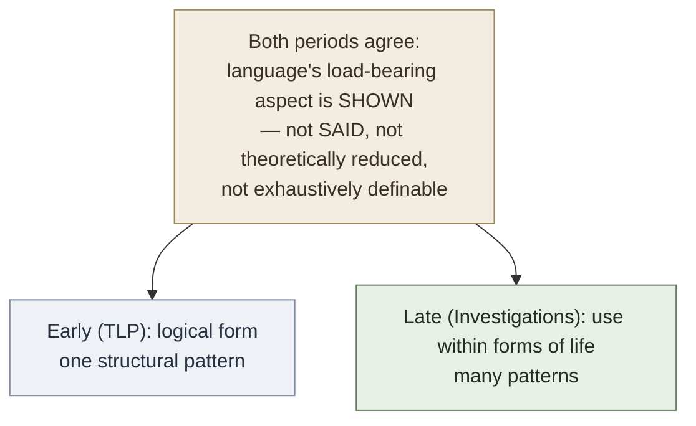

# Early vs Late Wittgenstein

**Summary**: Ludwig Wittgenstein is the only major 20th-century philosopher whose two foundational works occupy **opposed positions on most central questions**. Early Wittgenstein = the 1921 [*Tractatus Logico-Philosophicus*](./tractatus-logico-philosophicus.md): picture theory, truth-function reduction, show-vs-say, the ladder, proposition 7. Late Wittgenstein = the posthumous 1953 [*Philosophical Investigations*](./philosophical-investigations-overview.md): language games, family resemblance, meaning as use, the private language argument. **Late Wittgenstein argues that early Wittgenstein was confused.** This page maps the comparison and tells you how the wiki handles each.

**Sources**:
- [Wittgenstein TLP](./tractatus-logico-philosophicus.md) (1921 German / 1922 English).
- Ludwig Wittgenstein, *Philosophical Investigations* (posthumous 1953, ed. G.E.M. Anscombe + Rush Rhees).
- Ray Monk, *Ludwig Wittgenstein: The Duty of Genius* (Free Press 1990) — the biographical bridge between the two periods.
- [wittgenstein-ludwig](./wittgenstein-ludwig.md) · [philosophical-investigations-overview](./philosophical-investigations-overview.md) · [memory-paradox](./memory-paradox.md) — wiki context.

**Last updated**: 2026-05-25

---

## One-line

> **TLP (1921)**: language pictures facts; meaning is correspondence; logical form is the shared structure; what cannot be said must be shown; throw away the ladder. **Investigations (1953)**: language is many activities, not one; meaning is use within a form of life; *family resemblance* not essence; private language is impossible; *don't think — look*. **The same man, 32 years apart, on opposite sides of his own boundary.**

## Unlocks (lead, not footer)

1. **Reading TLP without Investigations is reading half the man.** The TLP is famously self-cancelling (proposition 6.54: throw away the ladder after climbing). The *Investigations* operationalizes the cancellation — it shows what philosophy looks like *after* the TLP picture is rejected. **Reading both is reading Wittgenstein's complete arc**; reading only one is reading a snapshot that the man himself would have considered partial.

2. **The wiki's [take-seriously-but-hold-lightly](./memory-paradox.md) meta-rule is most exemplified by Wittgenstein's own arc.** Wittgenstein took TLP seriously enough to spend a decade writing it; he held it lightly enough to spend another two decades partially refuting it. **The arc is what the meta-rule looks like in a single life.** The wiki cites Wittgenstein's own biography as the load-bearing example of holding-lightly.

3. **The shift from "shown" to "shown-by-use" is the structural bridge.** TLP's *show-vs-say* boundary becomes, in *Investigations*, the recognition that **meaning is always shown by use, never by definition or correspondence**. *"What can be shown cannot be said"* (TLP 4.1212) becomes *"Don't ask for the meaning, ask for the use"* (*Investigations* §43). **The bridge is continuous**: both periods agree that language's load-bearing aspect is *shown* in something other than propositions. The disagreement is *what* shows it — logical form (early) vs language-game use (late).

4. **Late Wittgenstein doesn't refute TLP; it dissolves the questions TLP asked.** This is the deeper move: TLP's question *"what is the logical form a proposition must share with the fact it pictures?"* presupposes that language has a single logical structure underwriting all meaningful uses. The *Investigations* questions the presupposition — *"language" is not a single thing*; it's a *family of activities* (language games), each with its own internal grammar. The TLP question doesn't get a different answer; it gets dissolved as wrongly framed. **This is Wittgenstein's own version of the [TLP 6.53 right-method-of-philosophy](./the-mystical-tlp.md) applied to his earlier self.**

## Mnemonic

**T-I** = *Tractatus · Investigations.*

For the contrast: **C-U** = *Correspondence (early) · Use (late).*

For the bridge: **S-L-U** = *Shown · Logical-form (early) · Use (late).* (Both periods agree on *Shown*; they disagree on *what shows it.*)

## Memory checksum

1. **State the early position in one sentence.** (Language pictures facts; meaning = picture-theoretic correspondence + truth-function operations on elementary propositions; what cannot be said must be shown.)
2. **State the late position in one sentence.** (Language is a family of activities (language games); meaning = use within a form of life; family resemblance, not essence; don't ask what a word means, ask how it's used.)
3. **What is the structural bridge between early and late?** (Both periods agree that language's load-bearing aspect is *shown* in something other than propositions. They disagree on *what* shows it — logical form (early) vs language-game use (late). The "shown" is the continuity.)
4. **State the wiki's reading discipline for handling both periods.** ([Take-seriously-but-hold-lightly](./memory-paradox.md): take TLP seriously enough to ingest picture theory + show-vs-say (the wiki's encoder paradigm draws from it); hold it lightly enough to allow that *Investigations* dissolves several TLP presuppositions. **Wittgenstein's own arc is the meta-rule made into a biography.**)
5. **Why does the late position not "refute" the early position simply?** (It *dissolves* rather than refutes. The TLP asks *"what is the logical form of language?"* — presupposing language has one. *Investigations* questions the presupposition: language is a family of activities. The question doesn't get a different answer; it gets reframed as a wrongly-shaped question.)

## Visual — the two periods compared

| Question | Early Wittgenstein — TLP (1921) | Late Wittgenstein — Investigations (1953) |
|---|---|---|
| What is language? | Language pictures facts; one logical structure underwrites all meaning. | Language is a family of activities; no single structure. |
| What is meaning? | Picture-theoretic correspondence — logical form shared between proposition and fact. | Use within a form of life. "Don't ask the meaning; ask for the use." §43 |
| What is the structure of complex sentences? | Truth-function operations on elementary atomic propositions. Universal reduction (TLP 5). | Open-ended; depends on the language game in question. No universal reduction possible. |
| What is the method of philosophy? | The TLP machinery itself — rigorous logical analysis + the show-vs-say discipline. | "Don't think — LOOK!" §66. Empirical, not theoretical. Description of language use. |
| What is non-propositional meaning? | What cannot be SAID in propositions — mystical · ethics · aesthetics · the form of language itself. SHOWN. | Equivalent: many uses of language don't aim at propositional truth at all (commands, exclamations, promises, language games). SHOWN by use, not by hidden logical form. |
| What about a private language? | Private language is handled by the picture-theory's neutrality — a private logical-form could in principle obtain. | Private language is IMPOSSIBLE (§§243-315). Meaning requires public criteria; a "language" only one person could understand isn't language. |
| Famous sentence | "The world is all that is the case." (TLP 1) · "What we cannot speak about, we must pass over in silence." (TLP 7) | "Don't think — look." · "What we cannot speak about, we must pass over in silence." (TLP 7, but late Wittgenstein adds — what shows itself in use we don't pass over; we describe.) |

**The bridge** — the two periods converge on *shown*, diverge on *what shows*:

The two periods are not opposed across the board; they share the *show-vs-say* discipline. The disagreement is about *the shape of what shows*.

---

## Pivot points — where the two periods diverge

### 1. The unit of meaning

- **TLP**: the *proposition* is the unit; meaning is propositional. Sub-propositional units (names of objects, predicates) get meaning via their role in propositions. Meaning ultimately bottoms out at elementary propositions and their atomic-fact correlates.
- **Investigations**: the *use* within a *language game* is the unit. There is no single "language" with a single "meaning"; there are *innumerable* uses, each with its own grammar.

### 2. The role of essence

- **TLP**: language has an *essential* structure — picture-theoretic correspondence — common to all meaningful propositions. The essence is the logical form.
- **Investigations**: language does *not* have an essential structure. Different uses of language share *family resemblance* — overlapping similarities without a single defining feature.

### 3. The function of analysis

- **TLP**: analysis reduces complex propositions to truth-functions of elementary propositions. The reduction is the philosophical method.
- **Investigations**: analysis is *description* of how language is used in specific contexts. "Don't think — look." (§66) The descriptive method replaces the reductive method.

### 4. Ethics, aesthetics, the mystical

- **TLP**: these belong to the *unspeakable* — they show themselves but cannot be said in propositions. The mystical (6.44+) is real but inexpressible.
- **Investigations**: these are *practices* — what we *do* in ethical or aesthetic life. Ethics and aesthetics show themselves in how lives are lived, but late Wittgenstein adds: *we can describe these practices* (we just shouldn't expect propositional theory). The mystical disappears as a separate category; everything is practice + description.

### 5. Private language

- **TLP**: doesn't explicitly address; the picture theory is neutral about whether the picture-relation could obtain privately.
- **Investigations**: famous **private language argument** (§§243-315). A language only one person could understand is not language at all. Meaning requires public criteria; rule-following requires a community.

### 6. The role of philosophy

- **TLP**: philosophy is an *activity* (4.112) — it clarifies thoughts by showing the logical structure. The right method (6.53) is to confine oneself to natural-science propositions and refute attempts to say the unsayable.
- **Investigations**: philosophy is *therapeutic* — it "leaves everything as it is" (§124). The philosopher *describes* language use to dissolve confusions, not to construct theories.

### 7. The author's relation to the work

- **TLP**: Wittgenstein wrote in the preface that the truth of TLP's thoughts is "unassailable and definitive." He spent a decade not doing philosophy after writing it.
- **Investigations**: Wittgenstein wrote in the preface (1945) that the *Investigations* should be published alongside TLP, because the new ideas can only be properly understood against TLP's mistakes. **Wittgenstein himself proposed they be read together.**

## The continuity — what both periods share

Despite the divergences, four substantial continuities:

### 1. Show-vs-say discipline

Both periods agree that language's load-bearing aspect is *shown*, not *said*. Early: logical form is shown. Late: use is shown (in how the practice unfolds). The boundary between sayable and shown survives the period shift.

### 2. Anti-metaphysical orientation

Both periods are *anti-metaphysical*. TLP's 6.53 (the right method of philosophy: confine yourself to propositions of natural science) is consistent with the *Investigations*' therapeutic conception. Wittgenstein never endorsed traditional philosophy at any career stage.

### 3. The world's existence as the mystical

TLP 6.44 (*not how the world is, but that it is, is the mystical*) survives into the late period — the *Investigations* doesn't recapture this language but the contemplative orientation toward "form of life" preserves the same epistemic shape.

### 4. The self as not-in-the-world

TLP 5.633 (*the metaphysical subject is the limit of the world*) anticipates the *Investigations*' refusal to locate the self as a fact among facts. The self is shown in how a life is lived; it isn't an object of inner observation. Both periods reject naive introspection.

## How the wiki handles both periods

The wiki's [take-seriously-but-hold-lightly](./memory-paradox.md) meta-rule applied to Wittgenstein:

| Take seriously | Hold lightly |
|---|---|
| Picture theory as antecedent of encoder paradigm | TLP 5's truth-function reduction (Gödel demolished its scope) |
| Show-vs-say as the visual-per-concept rule's home | TLP's claim that all non-propositional matters are "the mystical" |
| TLP's structural insight that internal limits are real | TLP's specific machinery for handling them |
| Wittgenstein's seriousness about the unsayable | The claim that the unsayable is a single thing |
| Investigations' language-games + family-resemblance + meaning-as-use | Whether *Investigations* has a single doctrine (it doesn't — and that's the point) |
| Investigations' private-language argument | Whether the argument is conclusively valid (debated) |

**Both periods are sources of operational insight**; neither is a doctrine. **The wiki's encoder paradigm uses picture theory** (Wave 1 unlock); **the wiki's visual-per-concept rule uses show-vs-say** (Wave 1 unlock); **the wiki's language-as-tool-not-doctrine stance descends from Investigations** (Wave 5 awareness).

## Wittgenstein's own statement on reading both

From the preface to *Philosophical Investigations* (written 1945):

> *"Four years ago I had occasion to re-read my first book (the *Tractatus Logico-Philosophicus*) and to explain its ideas to someone. It suddenly seemed to me that I should publish those old thoughts and the new ones together: that the latter could be seen in the right light only by contrast with and against the background of my old way of thinking. […] I should not like my writing to spare other people the trouble of thinking. But, if possible, to stimulate someone to thoughts of his own."*

**Wittgenstein himself proposed reading both together.** The wiki follows this guidance.

## Cross-link to the substrate thesis

[wittgenstein-ludwig](./wittgenstein-ludwig.md) notes that Wittgenstein is case 5 of the [logicians-madness-substrate-thesis](./logicians-madness-substrate-thesis.md) — the deepest worked instance. The late-vs-early arc is itself *part* of the substrate story:

- The 1918-1929 hiatus (post-TLP, pre-Investigations) was Wittgenstein's [Russell-style field-leaving](./bertrand-russell.md) — village schoolteacher, monastery, architect.
- The return to Cambridge in 1929 was a *partial* return; Wittgenstein never fully re-entered the institutional life of philosophy.
- The *Investigations* was never published in his lifetime; he didn't want to be the author of a doctrine.

**The arc itself is substrate stewardship via reframing.** Wittgenstein protected himself from doctrinaire engagement with his own work by *refuting it* — a unique form of intellectual humility that may have contributed to his (relative) survival to age 62.

## METER integration

| Drill | Pass floor | Source |
|---|---|---|
| State the early position in one sentence | <15 s | this page §One-line |
| State the late position in one sentence | <15 s | this page §One-line |
| Name 3 pivot points where the two periods diverge | <30 s | this page §Pivot points |
| State the structural bridge | <30 s | this page §Bridge |
| Apply the wiki's take-seriously-but-hold-lightly rule to Wittgenstein | <60 s | this page §How the wiki handles both |

## Related pages

- [tractatus-logico-philosophicus](./tractatus-logico-philosophicus.md) — early-period primary text
- [philosophical-investigations-overview](./philosophical-investigations-overview.md) — late-period primary text
- [wittgenstein-ludwig](./wittgenstein-ludwig.md) — author biography with both periods in context
- [picture-theory-of-language](./picture-theory-of-language.md) · [show-vs-say](./show-vs-say.md) · [truth-function-machine](./truth-function-machine.md) · [the-mystical-tlp](./the-mystical-tlp.md) · [limits-of-language-tlp](./limits-of-language-tlp.md) · [atomic-fact-tlp](./atomic-fact-tlp.md) · [russells-introduction-to-tlp](./russells-introduction-to-tlp.md) — TLP concept pages (early)
- [memory-paradox](./memory-paradox.md) — the meta-rule for handling both periods
- [bertrand-russell](./bertrand-russell.md) — Russell's evolving view across Wittgenstein's career
- [logicians-madness-substrate-thesis](./logicians-madness-substrate-thesis.md) — Wittgenstein as case 5; the late-vs-early arc as substrate stewardship
- [logic-atomic-design](./logic-atomic-design.md) — Wave 5 deepening
- [glossary](./glossary.md) — Logic layer registration
