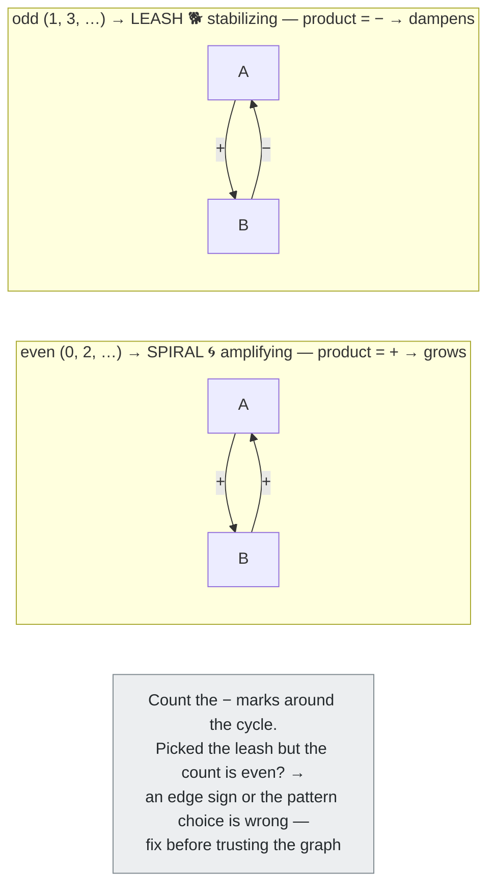
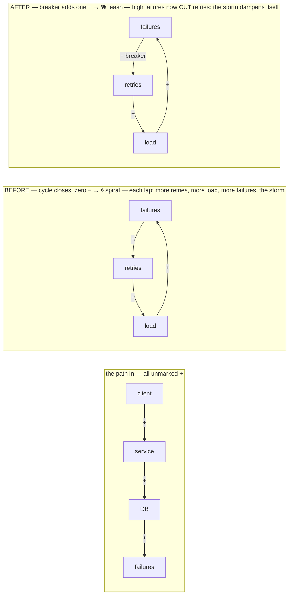
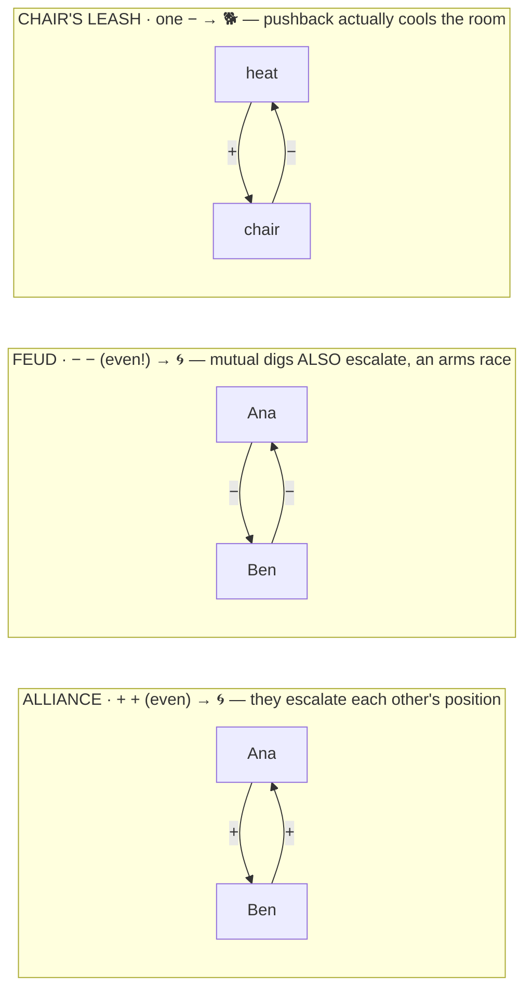
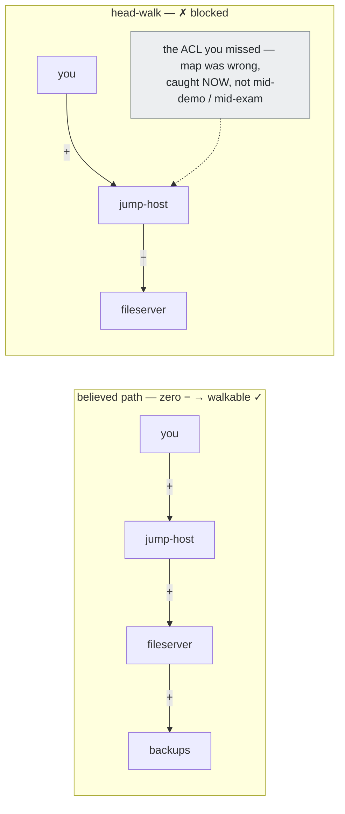
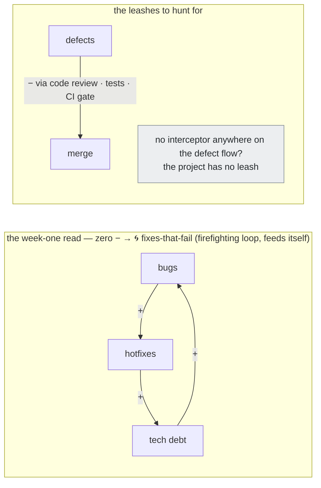

# Edge Sign — per-edge polarity modifier (Tier-2 CAST variant)

**Summary**: An **additive, opt-in modifier** for [CAST](./cast-overview.md) edges carrying the one dimension Tier 2's four constrained slots cannot express: **polarity** — does this edge *promote* (+) or *inhibit* (−) its target? Unmarked = promotes; a marked interceptor = inhibits. An OCP variant: it re-maps nothing, renames nothing, and leaves the canonical Character · Action · Stream · Time slots untouched.

**Sources**:
- 2026-07-09 `/validate-idea` session (verdict: keep-with-modification — polarity yes, axis-swap no); log entry of same date
- CAST and Georgian Node System.md §Tier 2 cheat sheet (the baseline this page extends, never modifies)
- [UMTF](./universal-mental-tagging-framework.md) §Relation Tags — the pre-existing "wall/block = prevents" form this modifier standardizes
- [nodes-and-edges](./nodes-and-edges.md) §Feedback Loops — the loop-level polarity encoding (amplifying/stabilizing holds) this extends downward to single edges
- [lego-skills-patterns](./lego-skills-patterns.md) — the spiral/leash pattern pair whose choice this modifier makes verifiable

**Last updated**: 2026-08-31 — [Edge quantity](./encoding-quantities-in-cast.md) registered as the sibling additive modifier; §Related pages notes how the two compose (quantity on the Stream body, the interceptor at the target end). Spec prose unchanged; 2026-07-09 (evening) — added §Worked micro-examples for David's four live arenas (interview · social · new environment · new project) + ASCII visualizations (definition glyph, loop-sign product rule, one diagram per arena); spec prose unchanged. Original: 2026-07-09.

**Status**: 🟡 **Candidate** — adopted structure, imagery pending David's pick, promotion gated (see §Promotion gate).

---

## The gap this closes

Tier 1 edges use an open verb vocabulary, so inhibition is already expressible — *blocks*, *prevents*, *throttles* are legitimate Tier 1 verbs, and [UMTF](./universal-mental-tagging-framework.md)'s Relation forms list "wall/block = prevents" explicitly. But when a collision forces promotion to Tier 2, the constrained slots have nowhere to put polarity:

- **Promotion destroys inhibition.** None of the four Action options is negative; the nearest, *Exploding (transforms or breaks)*, conflates benign transformation (a compiler stage, an ETL step) with destruction.
- **Loop signs are asserted, not derivable.** [lego-skills-patterns](./lego-skills-patterns.md) encodes loop polarity at the pattern level (spiral = amplifying, leash = stabilizing) and [nodes-and-edges](./nodes-and-edges.md) at the loop-scene level (held-overhead vs held-close), but nothing at the edge level lets you *check* that classification.
- **Systems-thinking edges are signed.** Causal-loop material (see archetype-encoding-in-cast) is built from +/− edges; CAST currently drops the sign at encode time.

Why a *variant page* and not a slot change: the 2026-07-09 validation found that swapping the Character axis would violate the Open/Closed principle ("open to extension but closed to constant redesign of core frameworks", source: [software-design-principles-for-neural-os](./software-design-principles-for-neural-os.md)), UMTF's assign-once rule, and the dialect orthogonality lock ("never re-map an existing spine tag's meaning"). This page is the OCP-compliant alternative: pure addition.

## Definition

**Edge sign** is a binary modifier riding on the edge scene's Stream delivery:

| Sign | Meaning | Scene form | Cost |
|---|---|---|---|
| **+ promotes** (default) | more/stronger source → more/stronger target | the Stream *arrives*: reaches, enters, lands on the target | **zero** — every existing edge is already a valid + edge |
| **− inhibits** | more/stronger source → less/weaker target | an **interceptor** cuts the Stream just before the target | one added scene element |

```p5 height=240
p.setup = () => { p.createCanvas(Math.min(el.clientWidth||600, 600), 240); p.noLoop(); };
p.draw = () => {
  const dark = p.isDark;
  p.background(dark ? 30 : 245);
  const ink = dark ? '#ECE4D3' : '#2B2620';
  const green = '#5c7a54';
  const rose = dark ? '#c98a80' : '#a07d78';
  const w = p.width;
  const sx = 74, tx = w - 84, r = 9;
  const y1 = 74;
  p.noStroke(); p.fill(ink); p.textStyle(p.BOLD); p.textSize(13); p.textAlign(p.LEFT, p.BASELINE);
  p.text('+ promotes  (default, unmarked)', 40, y1 - 34);
  p.stroke(green); p.strokeWeight(4); p.line(sx, y1, tx - 16, y1);
  p.noStroke(); p.fill(green); p.triangle(tx - 16, y1 - 7, tx - 16, y1 + 7, tx, y1);
  p.fill(ink); p.circle(sx, y1, r * 2); p.circle(tx, y1, r * 2);
  p.textStyle(p.NORMAL); p.textSize(11); p.textAlign(p.CENTER, p.TOP);
  p.text('source', sx, y1 + 12); p.text('target', tx, y1 + 12);
  p.text('the stream ARRIVES', (sx + tx) / 2, y1 + 12);
  const y2 = 174, barX = tx - 58;
  p.noStroke(); p.fill(ink); p.textStyle(p.BOLD); p.textSize(13); p.textAlign(p.LEFT, p.BASELINE);
  p.text('\u2212  inhibits  (marked interceptor)', 40, y2 - 34);
  p.stroke(ink); p.strokeWeight(4); p.line(sx, y2, barX, y2);
  p.stroke(rose); p.strokeWeight(5); p.line(barX, y2 - 16, barX, y2 + 16);
  p.noStroke(); p.fill(ink); p.circle(sx, y2, r * 2); p.circle(tx, y2, r * 2);
  p.textStyle(p.NORMAL); p.textSize(11); p.textAlign(p.CENTER, p.TOP);
  p.text('source', sx, y2 + 12); p.text('target', tx, y2 + 12);
  p.fill(rose); p.text('cut by the bar \u2014 the bar IS the minus sign', (sx + barX) / 2, y2 + 12);
};
```

Rules:

1. **Unmarked = promotes.** Only inhibition costs imagery — the same deviation-encoding economics as [lego-skills-patterns](./lego-skills-patterns.md) ("only encode the deviations").
2. **The mark lives on the Stream's arrival**, not on either animal — node scenes and the source-anchoring rule are untouched.
3. **Locally decidable.** The encoding question is the classic causal-loop one — "does more of A make more or less of B?" — answerable per edge, without knowing the global topology.
4. **Applies to both tiers.** Tier 1: keep using negative verbs (*blocks*); the modifier just formalizes what they mean. Tier 2: the interceptor is the only way to say −.

## What it composes with the existing slots

No canonical option changes name or meaning; combinations gain expressiveness:

| Edge meaning | Encoding | Previously |
|---|---|---|
| benign transformation (compiler, ETL) | Exploding, unmarked (+) | conflated with "breaks" |
| breaks / destroys | Exploding + interceptor (−) | conflated with "transforms" |
| throttles / rate-limits | Flowing + interceptor (−) | inexpressible |
| veto / lockout | Crushing + interceptor (−) | inexpressible |
| dampening notification ("stop" signal) | Spreading + interceptor (−) | inexpressible |

## Imagery — PENDING (David picks)

The interceptor's concrete image is deliberately not fixed here. Candidates: **clamp**, **wall**, **bar laid across the stream**. One constraint from the validation: **not the leash** — the leash is the reserved [lego-skills-patterns](./lego-skills-patterns.md) cue for the stabilizing *loop pattern*; reusing it for a per-edge mark would collide pattern-level and edge-level vocabulary.

The bar candidate has a free hook: a bar across the stream *is literally a minus sign*.

## The unlock: loop-sign checksum

With signed edges, loop classification becomes **verifiable instead of asserted**: walk any cycle and multiply the edge signs — an even count of − (or none) must land on the **spiral** (amplifying), an odd count on the **leash** (stabilizing). Mismatch = either an edge sign or the pattern choice is wrong. This is a graph-level integrity check that complements the existing four-level mnemonic-checksum (it does not renumber those levels; see [skill-progression-stages](./skill-progression-stages.md) for registered counts). Registered as a candidate composition in [composability-index](./composability-index.md).



## Worked micro-examples — live fast-comprehension arenas

*Added 2026-07-09 on David's request. The job in these four arenas is building the graph in-head **fast and exact** while the situation unfolds. All four run at Tier 1 speed — verb + sign, no Tier 2 assembly unless a collision forces it (use no more framework than the task needs). The live protocol:*

1. *node the moment it's named;*
2. *every edge defaults to unmarked (+) — zero cost;*
3. *spend imagery only on − edges — they are scarce and load-bearing;*
4. *every time a cycle closes, multiply the signs.*

### 1. Google interview (system design) — the retry storm

The interviewer talks; you sign as they speak: client →+ service (requests) · service →+ DB (queries) · DB latency →+ failures · failures →+ retries · retries →+ load →+ failures. The moment that last edge closes the cycle, the product check fires: **zero − in the loop → spiral** — retry amplification. You say it out loud before they ask: *"this loop has no damping; I'd add a circuit breaker or exponential backoff"* — which is literally *inserting a − edge* (failures −→ retries) to convert the spiral into a leash. Exactness bonus: any system claimed to be stable must contain an odd-− loop somewhere; if you can't find one in your head-graph, either the design or your map is wrong — say which, that's the interview.



### 2. Social interaction — reading the room

Nodes = people; live signing: endorsements and amplifications ("as X said…") = +, interruptions and dismissals = −. A room is mostly + by politeness, so the − marks *are* the information. Two loop reads the signs make instant: A endorses B, B endorses A → **+ + → spiral** (alliance — they will escalate each other's position); A digs at B, B digs back → **− − → even count → also spiral** (a feud is an *amplifying* loop, an arms race — the non-obvious read the product rule hands you for free, per the spiral's "arms races" row in [lego-skills-patterns](./lego-skills-patterns.md)). Then hunt the leash: whose pushback actually dampens (the odd-− loop, usually through the chair)? No leash in the room → the meeting escalates.



### 3. New environment — sign-first triage

First week in an unfamiliar org, or first hour on an unfamiliar network (same move in a bloodhound-ad-graph-style lab): map **what blocks before what enables**. Badge system −→ server room, VPN policy −→ lateral traffic, approval gate −→ deploy, GPO −→ install; everything else (who feeds whom data, which service calls which) stays unmarked +. Because the default is free, the environment "comes into focus" at the speed you can spot constraints — a handful of − marks instead of dozens of edges. Exactness payoff: a path you believe is open must contain **zero − edges end to end**; walking it mentally and hitting a forgotten interceptor means your map was wrong — caught now, not mid-demo (or mid-exam). [orient-method](./orient-method.md) is the capture protocol feeding this.




THE LADDER — GRADUATE A STAGE ON 2 PASSES IN A ROW
0
Kinesthetic SeedLamp · Any felt presence at all
0/2 ▰▰
1
Afterimage CaptureLamp · Holding/tracing an afterimage
0/2 ▰▰
2
Object ObservationLamp · Recall from memory, not afterimage
0/2 ▰▰
3
Object ManipulationScale · Controllable imagery
0/2 ▰▰
4
Hub BuildingScale · A stable spatial anchor
0/2 ▰▰
5
Intensity IntervalsSword · Peak clarity on demand
0/2 ▰▰
6
Image StreamingSword · Sustained generation under pressure
0/2 ▰▰
7
Passive IntegrationSword · Spontaneous, unprompted imagery
0/2 ▰▰
### 4. New project — find the leashes in the codebase

Onboarding: module-call and feed edges are + and stay unmarked; hunt the − edges — feature flag gating a path, validator rejecting input, rate limiter, CI gate blocking merge, review required before deploy. Two payoffs: (a) the − edges are where the system is *safe to touch* — a change downstream of a strong leash is low-blast-radius; (b) the firefighting check: bugs →+ hotfixes →+ tech debt →+ bugs is an all-+ spiral — archetype-1-fixes-that-fail spotted in week one, by sign product alone. If the only − edges on the defect loop are "heroics", the project has no leash; that's your first architectural observation as the new person.



*First real use in any of these arenas starts the §Promotion gate clock — an interview-prep session or onboarding week is exactly the worked-graph evidence the gate wants.*

## METER

Measurement per [METER](./meter-overview.md), `cast::*` namespace (see [cast-drill-ladder](./cast-drill-ladder.md) for the existing flash floors):

- `cast::edge_sign_used {graph, edge, sign}` — fired when a − edge is encoded (the + default doesn't log; it's free)
- `cast::loop_sign_check {loop, product, pattern_cue, match}` — fired on each loop-sign checksum walk; `match=false` is the event that promotes this page
- If promoted, the `cast::tier2_vocab_flash` pool grows 16 → 18 (two new items: interceptor form ↔ inhibits; unmarked ↔ promotes). Floors unchanged.

## Promotion gate (falsifiable)

Within **~4 weeks of first use** on a real encoded graph, at least one of:

1. a `cast::loop_sign_check` with `match=false` that caught a genuine classification error, or
2. a real Tier-2 collision that the four canonical slots alone could not break but the sign did.

Neither → **park** (same treatment as the 2026-07-06 parking of the 2-bit codec layer; see log). Both this gate and the codec parking exist because CAST's current mission is *perceptual* comprehension of large graphs — a mechanism earns its place by doing perceptual work, not by being formally elegant.

## Not to be confused with

- **[and-polarity-thinking](./and-polarity-thinking.md)** — a cognitive move (holding paradox tension); different register entirely
- **Polarity, the ORACLE Timing Signal** — a C-slot cue type (see [timing-operative](./timing-operative.md)); prediction-layer, not edge encoding
- **Road signs** — georgian-driving-exam-b-sign-glyph-grammar's "sign" is a physical glyph corpus; an edge sign is a scene modifier (the driving-exam priority lattice may legitimately contain both)

## Mnemonic

> **Reach or bar.** A stream that *reaches* its target feeds it (+). A stream that *hits the bar* is cut (−) — and the bar lying across the stream **is the minus sign**.

## Checksum

1. An existing Tier-2 edge has no interceptor anywhere in the scene — what is its sign, and did the encoder have to do anything to say so? *(+ promotes; nothing — unmarked is the default, so all pre-existing edges are already valid)*
2. How do you now encode "breaks" without renaming any drilled vocabulary item? *(Exploding + interceptor; benign transform is Exploding unmarked)*
3. You walk a 3-edge loop and count one interceptor. Which [lego-skills-patterns](./lego-skills-patterns.md) cue must the loop carry, and what does a mismatch mean? *(odd − count → the leash / stabilizing; mismatch means an edge sign or the pattern choice is wrong — fix before trusting the graph)*

## Related pages

- [Edge delay](./delay-encoding-in-cast.md) — the third additive modifier (latency, 🟡 candidate). All three ride one Stream at disjoint positions: quantity is its thickness, delay the gap it crosses, and this page's interceptor sits at the target end, past the gap.
- [Edge quantity](./encoding-quantities-in-cast.md) — the sibling additive modifier (magnitude, 🟡 candidate). The two compose without colliding: quantity modifies the **body** of the Stream, this page's interceptor cuts it **at the target end**. A thick stream meeting an interceptor is a large inhibitory flow — a throttle on a hot path.
- [CAST](./cast-overview.md) — the encoder this extends; owner of Tier 2's canonical slot definitions
- [nodes-and-edges](./nodes-and-edges.md) — edge-layer owner; loop-level polarity holds that this extends downward
- [lego-skills-patterns](./lego-skills-patterns.md) — spiral/leash, the pattern pair the loop-sign checksum verifies
- archetype-encoding-in-cast — where signed causal edges come from
- feedback-loops — the dynamics the signs summarize
- mnemonic-checksum — the integrity family the loop-sign check joins
- [cast-drill-ladder](./cast-drill-ladder.md) — hosts the flash pool this would extend 16 → 18
- [image-merging](./image-merging.md) — merge rule interaction: the interceptor must survive the weld (it cuts the stream *inside* the composite scene)

---

## U — See (CAST)
1. Binary modifier on the Stream's arrival: reach (+) vs intercepted (−)
2. Unmarked = +, so only deviations cost imagery

## D — Name (NEDF)
1. Edge sign = per-edge polarity for CAST edges
2. Distinguisher: additive variant — canonical Tier-2 slots untouched
3. Failure mode: reusing the leash image (reserved for the loop pattern)

## F — Do (SPEAR)
1. Encoding an edge → ask "does more of A make more or less of B?"
2. Less → add the interceptor; more → do nothing
3. Closed a loop → multiply signs, verify spiral/leash choice

## B — Watch (HEART)
1. Interceptor drawn on an animal instead of the stream
2. Signs assigned globally ("this node is negative") instead of per edge
3. Loop-sign mismatches ignored instead of investigated

## L — Predict (ORACLE)
1. Systems-thinking graphs → signs pay off first there
2. No `match=false` in 4 weeks → this page parks

## R — Act (GRACE)
1. Inhibitory edge spotted at Tier 2 → interceptor, not a bent Action choice
2. Spiral/leash uncertainty → walk the loop, multiply signs
