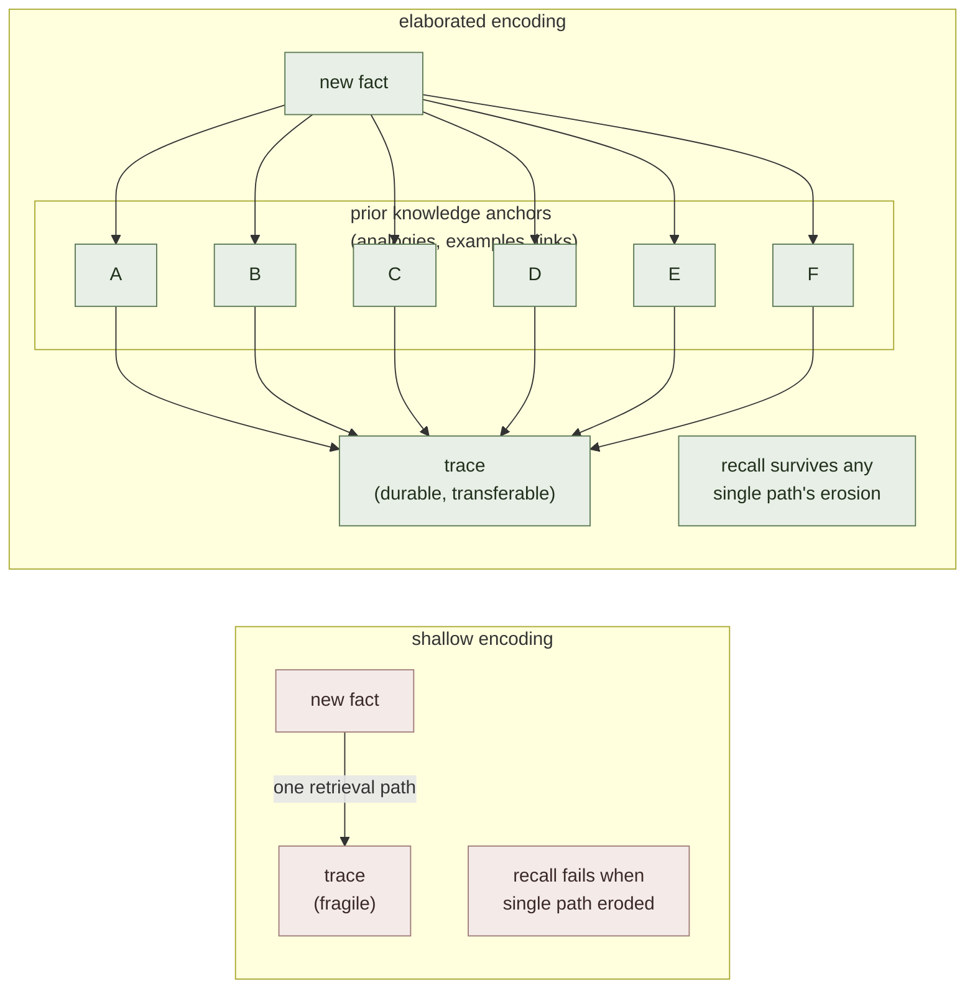

# Elaboration

**Summary**: Elaboration is the **deliberate process of connecting new material to what you already know** — explaining it in your own words, generating examples, drawing analogies, linking it to other concepts, and asking "why?" / "how?" / "what would happen if?" The principle is one of the canonical [desirable-difficulties](./desirable-difficulties.md) and is rated **moderate-to-high utility** in Dunlosky et al.'s 2013 meta-review (under the heading "elaborative interrogation"). Mechanism: each elaborative connection creates an *additional retrieval path* to the trace and embeds the new content into a denser semantic network, which both strengthens the trace and supports transfer. Elaboration is the **encoding-side partner** of [retrieval practice](./active-recall.md) (the retrieval-side strengthening move) — they multiply, not add. This page is the canonical owner.

**Sources**:
- Pressley, M., McDaniel, M. A., Turnure, J. E., Wood, E., & Ahmad, M. (1987). "Generation and Precision of Elaboration Effects on Memory." *Journal of Experimental Psychology: Learning, Memory, and Cognition*, 13(2), 291-300.
- Dunlosky, J., Rawson, K. A., Marsh, E. J., Nathan, M. J., & Willingham, D. T. (2013). "Improving Students' Learning With Effective Learning Techniques." *Psychological Science in the Public Interest*, 14(1), 4-58.
- Smith, B. L., Holliday, W. G., & Austin, H. W. (2010). "Students' Comprehension of Science Textbooks Using a Question-Based Reading Strategy." *Journal of Research in Science Teaching*, 47(4), 363-379.
- Craik, F. I. M., & Lockhart, R. S. (1972). "Levels of Processing: A Framework for Memory Research." *Journal of Verbal Learning and Verbal Behavior*, 11, 671-684. — depth-of-processing parent claim.
- Brown, Roediger & McDaniel (2014). *Make It Stick* — Ch 3 "Mix Up Your Practice" elaboration discussion.
- Internal: [active-recall](./active-recall.md), [self-explanation](./self-explanation.md), [bridge-load](./bridge-load.md), [desirable-difficulties](./desirable-difficulties.md).

**Last updated**: 2026-06-09

---

## Core claim

Two encodings of the same material produce different traces:

- **Shallow** — re-read, transcribe, highlight, restate verbatim. Trace is fragile and context-locked.
- **Elaborated** — explain in own words, generate examples, draw analogies, link to prior knowledge, generate why/how questions. Trace is durable, transferable, and supports inference.

Mechanism is **multiple retrieval paths**: each elaborative connection becomes a separate cue→trace pathway. A trace with 5 retrieval paths is far more accessible than one with 1, and survives the loss of any individual path. This is also why elaborated knowledge supports **transfer** to novel problems — the connections that grew during encoding are the same connections that route to novel applications.

## Operational forms

| Move | What you do | When it shines |
|---|---|---|
| **Elaborative interrogation** | Ask why each fact is true; produce the answer | Dense factual content (history dates, biology mechanisms) |
| **Self-explanation** | Explain each step of a worked example to yourself; see [self-explanation](./self-explanation.md) | Procedural / problem-solving content |
| **Analogy generation** | "X is like Y because…" — see [bridge-load](./bridge-load.md) | Abstract / unfamiliar content |
| **Example generation** | Produce three of your own examples beyond the textbook | Concept-mastery content |
| **Concept mapping** | Map the new content onto existing concepts (see [mental-models-for-learning](./mental-models-for-learning.md)) | Domain-overview content |
| **Why / how / what-if questioning** | Generate and answer three questions per paragraph | Reading material |
| **Translation** | Express the same idea in different format (words → diagram, math → story, etc.) | Any content where format is restrictive |

## The "elaborate then retrieve" stack

Maximum effect comes from pairing elaboration (encoding-side) with retrieval (recall-side):

1. **Read** the material — comprehension first
2. **Elaborate** — generate explanations, examples, analogies, why-questions (encoding strengthens)
3. **Retrieve** — close the book; produce what you can from memory (recall strengthens)
4. **Re-elaborate** — for the gaps, generate new connections
5. **Space** — return next day; retrieve again

Dunlosky 2013 ranks **practice testing (retrieval)** and **distributed practice (spacing)** as the two "high utility" strategies and **elaborative interrogation** and **self-explanation** as "moderate utility" (their bar for "high utility" is robust across age/material/setting; elaboration is robust in most settings but less universal than retrieval/spacing). In practice, the trio runs together — elaboration without retrieval is restudy, retrieval without elaboration is naked rehearsal.

## Visual

## Failure modes

| Failure | Symptom | Mitigation |
|---|---|---|
| **Pseudo-elaboration** | "I get it" feeling without producing actual connections | Write the connection down; if the page is blank, no elaboration happened |
| **Highlighting masquerading as elaboration** | Coloured passages with no generated content | Replace highlights with margin notes that *say something new about* the passage |
| **Elaboration without retrieval** | Material studied deeply but not tested | Pair every elaboration pass with closed-book recall |
| **Wrong-knowledge anchoring** | Connecting to a misconception → embedding the misconception deeper | Check elaborations against expert source before they harden |
| **Over-elaboration** | Hours of analogy-spinning on simple material | Match elaboration depth to material complexity; simple facts don't need it |
| **Group elaboration only** | Group-talk feels productive; individual recall doesn't follow | Add closed-book individual retrieval after the group |

## Elaboration vs the other desirable difficulties

| Difficulty | Phase | What it strengthens |
|---|---|---|
| [Spacing](./spaced-repetition.md) | Schedule | Storage strength via retrieval at intervals |
| [Retrieval](./active-recall.md) | Recall | Cue→trace pathway via effortful retrieval |
| [Interleaving](./interleaving.md) | Practice | Classification via type-mixing |
| **Elaboration** | **Encoding** | **Trace richness via multiple retrieval paths** |

The four are complementary phases of a learning event. Elaboration is the *encoding-stage* desirable difficulty — the others operate downstream.

## Neural OS implementations

- [self-explanation](./self-explanation.md) — SEAL / WWHB / FAKE protocols are elaboration variants
- [bridge-load](./bridge-load.md) — analogy-as-elaboration; the BRIDGE framework instantiates the analogy-generation form
- [mental-models-for-learning](./mental-models-for-learning.md) — building the model IS elaboration
- [5-gates-of-comprehension](./5-gates-of-comprehension.md) — Gate 2 (REPRESENT) and Gate 3 (MINIMIZE) are elaboration-then-compression
- [active-recall](./active-recall.md) — the retrieval-side partner
- compression-for-comprehension-framework — Generator+Delta production IS elaboration applied across examples

## Related pages

- [active-recall](./active-recall.md)
- [self-explanation](./self-explanation.md)
- [bridge-load](./bridge-load.md)
- [mental-models-for-learning](./mental-models-for-learning.md)
- [desirable-difficulties](./desirable-difficulties.md)
- [spaced-repetition](./spaced-repetition.md)
- [5-gates-of-comprehension](./5-gates-of-comprehension.md)
- [chunking](./chunking.md)
- [interleaving](./interleaving.md)

---

## U — See (CAST)
1. Connect new to known via your own explanations, examples, analogies, why-questions
2. Each connection = one more retrieval path

## D — Name (NEDF)
1. Elaboration = encoding-stage process of connecting new to known
2. Distinguisher: encoding-side strengthening (vs retrieval-side recall)
3. Failure mode: pseudo-elaboration (feels deep, generates nothing)

## F — Do (SPEAR)
1. Read → ask why/how/what-if → produce explanation + 3 examples + 1 analogy
2. Pair with retrieval; pair with spacing

## B — Watch (HEART)
1. "I get it" feeling without written generation → no elaboration happened
2. Anchoring to misconception → check against source

## L — Predict (ORACLE)
1. Elaborated trace → transfer to novel problems
2. Shallow trace → can recite, can't apply

## R — Act (GRACE)
1. New material → don't restudy; elaborate
2. Stuck on concept → generate analogy; map to known
