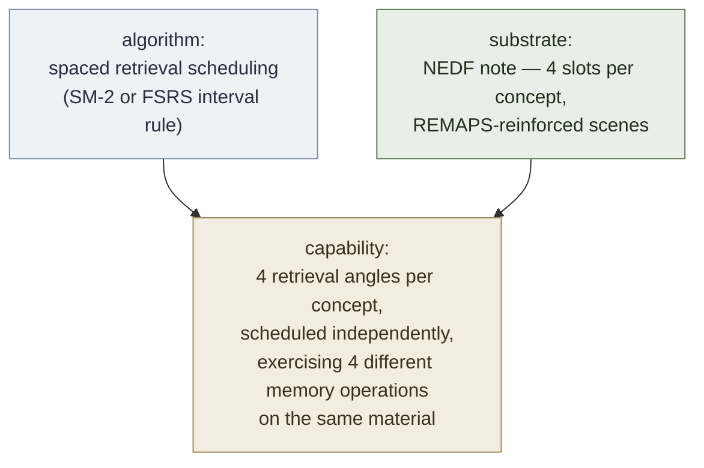

# Encoded Spaced Repetition — NEDF × SR

**Summary**: An **unlock** from [composability-index](./composability-index.md) — combine [NEDF](./nedf-overview.md)'s 4-slot encoding (Name-hook · Essence · Distinguisher · Failure) with spaced-repetition scheduling and you get **4× retrieval pressure per concept without 4× authoring cost**. One NEDF note generates four independently-scheduled cards, each exercising a different cognitive operation: recognition, recall, discrimination, and diagnosis. Lowest-cost-largest-payoff unlock from the [composability-index](./composability-index.md) candidate list — pure recombination of two existing artifacts.

**Sources**:
- Conversation synthesis with the user (2026-05-11)
- [nedf-overview](./nedf-overview.md) — the encoding rule and 4-slot scene template
- [remaps](./remaps.md) — the encoding-reinforcer applied to each slot
- [spaced-repetition](./spaced-repetition.md) — interval-based retrieval scheduling
- Composes downstream of java-vocabulary-nedf, algorithm-pattern-nedf-deck, graph-network-nedf-deck
- Architectural primitive: [substrate-algorithm-composition](./substrate-algorithm-composition.md)

**Last updated**: 2026-05-11

---

## The unlock



The qualitative unlock: not just more reps, but reps that **exercise different cognitive operations**. A standard SR card drills *recognition* (front → back). An encoded-SR note drills recognition, recall, discrimination, *and* diagnosis — four different memory pathways through the same material. This is the difference between "I remember the name" and "I see this in the wild and react correctly."

Cost: authoring effort doesn't quadruple because the 4 slots already exist in every NEDF note — the card templates just expose each slot as its own scheduled prompt. Total time per concept rises by maybe 2× (more retrievals to do), and most cards become easy fast (high ease factor → wide intervals), so steady-state daily review time grows by perhaps 1.3–1.5× while retrieval pressure quadruples.

---

## The four card types

For one NEDF note with slots `{N, E, D, F}`, generate four card templates:

| Card | Prompt | Answer | Cognitive operation drilled |
|---|---|---|---|
| **1. Name → Content** | Show: `N` (the name-hook image) | Reveal: `E`, `D`, `F` | **Recognition** — given a known handle, retrieve associated knowledge |
| **2. Content → Name** | Show: `E` (essence statement, no name) | Reveal: `N` | **Recall** — given a definition or property, produce the name (and image) |
| **3. Discrimination** | Show: a prompt that fits *either* this concept or its named neighbour from `D` | Reveal: which one + why | **Discrimination** — pick the correct concept under interference |
| **4. Diagnosis** | Show: a scenario matching `F` (the failure mode) | Reveal: name of the concept + correction | **Diagnosis** — recognise a failure in the wild and name the fix |

Each card is scheduled independently. Anki's note/card model supports this natively — one note, four card templates, four schedule streams.

---

## Why each retrieval is structurally different

| Operation | What it strengthens | When it pays off |
|---|---|---|
| Recognition (Card 1) | Forward association `name → content`. Fast for "did I cover this?" check. | Reading docs, scanning lists, casual recall |
| Recall (Card 2) | Backward association `content → name`. Required when you encounter a phenomenon and need to look it up by knowing *what* you're looking for. | Writing, debugging, explaining to others |
| Discrimination (Card 3) | Boundary against the most-confused neighbour. Strengthens distinctness, not just presence. | Real use, where similar-looking concepts compete for retrieval |
| Diagnosis (Card 4) | Pattern-matching against failure scenarios. Drives the highest-value operational knowledge: *don't make this mistake*. | Production work, code review, defensive design |

Standard front/back flashcards only drill Card 1 (and sometimes Card 2). Cards 3 and 4 are where the qualitative unlock lives — they don't exist in raw SR decks unless someone manually authors them, and they're the cards that translate "I know this" into "I notice this when I'm doing real work."

---

## Anki note structure (concrete)

A NEDF note has fields:

```
   Note type: NEDF
   Fields:
     - Name           (text)
     - NameHook       (image / vivid scene description)
     - Essence        (1-2 sentence definition)
     - Distinguisher  (vs which concept; one-line contrast)
     - Failure        (one-line failure mode + correction)
     - Notes          (optional commentary)
```

Card templates generated from one note:

```
   Card 1 — Recognition:
     Front: {{NameHook}}
     Back:  {{Name}}<br>{{Essence}}<br>vs {{Distinguisher}}<br>!{{Failure}}

   Card 2 — Recall:
     Front: {{Essence}}
     Back:  {{Name}}<br>{{NameHook}}

   Card 3 — Discrimination:
     Front: "Which is {{Distinguisher.prompt}}?"
     Back:  {{Name}} — because {{Distinguisher.reason}}
     (Requires structuring Distinguisher as a {prompt, reason} pair, not free text.)

   Card 4 — Diagnosis:
     Front: "{{Failure.scenario}} — what's happening, and how do you fix it?"
     Back:  {{Name}} — {{Failure.correction}}
     (Requires structuring Failure as a {scenario, correction} pair.)
```

Cards 3 and 4 are slightly more authoring work because they need the Distinguisher and Failure slots to be **structured pairs** rather than free text. This is a one-time refactor of the NEDF schema; the existing java-vocabulary-nedf, algorithm-pattern-nedf-deck, and graph-network-nedf-deck artifacts can be migrated mechanically — see Migration section below.

---

## Worked example — BFS from graph-network-nedf-deck

A standard NEDF card might encode BFS (breadth-first search) as:

```
   Name           : BFS
   NameHook       : "Bouncer Frisks Slowly" — a bouncer at a club door checks
                    everyone on the entry line layer by layer, refusing to let
                    anyone go deeper until the current layer is fully searched
   Essence        : Graph search exploring nodes layer-by-layer using a FIFO queue
   Distinguisher  : { prompt: "Why does this use a queue instead of a stack?",
                      reason: "FIFO produces layer-order traversal; LIFO (stack)
                              would dive depth-first instead" }
   Failure        : { scenario: "I implemented graph search with a stack and got
                                 depth-first traversal when I wanted shortest-path
                                 layer order",
                      correction: "BFS uses a QUEUE (FIFO). Stack gives DFS." }
```

Generated cards:

- **Card 1**: Bouncer-frisking-slowly image → "BFS — layer-by-layer with FIFO queue, vs DFS which uses LIFO stack, watch for: using stack instead of queue."
- **Card 2**: "Graph search exploring nodes layer-by-layer using a FIFO queue" → "BFS — bouncer-frisks-slowly."
- **Card 3**: "Why does this use a queue instead of a stack?" → "BFS — FIFO produces layer-order; LIFO would dive depth-first."
- **Card 4**: "Implemented graph search with a stack and got depth-first traversal when I wanted shortest-path layer order — what happened?" → "Used the wrong substrate: stack gives DFS, queue gives BFS."

Each card targets a different operation. Card 4 is the one most likely to fire in real coding work, and it's the one a normal flashcard deck would never have.

---

## Scheduling implications

Naive expectation: 4× cards = 4× daily review time. Actual experience:

- **New-card rate**: limit to ¼ the normal rate of NEDF notes introduced per day. One NEDF note = 4 cards entering the new-card queue.
- **Steady-state daily reviews**: rises by ~1.3–1.5×, not 4×. Reason: Card 1 (recognition) is the easiest and saturates ease quickly, becoming a long-interval card. Cards 2–4 take longer to reach long intervals but settle there eventually.
- **Time per card**: Cards 3 and 4 take 2–3× longer per review than Card 1 because they require active synthesis, not just recognition. Net retrieval pressure per minute is still significantly higher than a same-time-cost raw deck.
- **Failure cascade**: if a note is forgotten, all 4 cards reset. This is a feature: forgetting one angle implies the whole concept needs reinforcement, and resetting all 4 retrieves the concept through all 4 pathways in close succession.

Recommended Anki settings for encoded-SR decks:
```
   New cards per day:      ¼ of your usual NEDF rate
   Maximum interval:       longer than usual (90+ days; the multiple-angle
                           drilling means longer intervals retain better)
   Lapse handling:         reset all sibling cards on any lapse
                           (Anki: "siblings burying" enabled; lapse propagation
                           via add-on if needed)
```

---

## When to skip a card type

Not every NEDF note has all 4 angles meaningfully. Use the following rule:

- **Card 1 (Recognition)** — always. Every concept can be recognised by its name-hook.
- **Card 2 (Recall)** — always. Every essence statement can be reversed into a recall prompt.
- **Card 3 (Discrimination)** — *if and only if* the Distinguisher slot names a specific neighbour, not a generic warning. "Vs DFS" → yes; "different from other algorithms" → no.
- **Card 4 (Diagnosis)** — *if and only if* the Failure slot is a concrete scenario, not a generic caution. "Forgetting to mark visited → infinite loop" → yes; "be careful with edge cases" → no.

If Cards 3 or 4 don't apply, the note generates 2 or 3 cards rather than 4. The discipline is to *strengthen the slots* rather than to *omit the cards*: a weak Distinguisher or Failure slot is a signal the concept isn't fully encoded yet.

---

## Migration — retrofitting an existing NEDF deck

Three steps to convert an existing NEDF deck to encoded-SR:

1. **Schema refactor.** Restructure the Distinguisher and Failure fields from free-text into `{prompt, reason}` and `{scenario, correction}` pairs. This is mechanical for well-written cards (the structure is implicit in the text); requires rewrites for vague cards.
2. **Card-template addition.** Add Card 2, 3, 4 templates to the Anki note type. Anki will auto-generate the new cards from existing notes on next sync.
3. **Scheduling reset.** Either (a) let Anki schedule the new cards as "new" from the next session — gentlest, but takes a few weeks to bake in — or (b) bulk-mark them as "young" at a medium interval to match the existing card's maturity. Option (a) is safer.

For the user's existing decks:
- java-vocabulary-nedf (~120 notes) → ~480 cards after migration; estimated retrofit time ~8–12 hours for schema refactor
- algorithm-pattern-nedf-deck (12 patterns) → ~48 cards; ~2 hours
- graph-network-nedf-deck (15 terms) → ~60 cards; ~2 hours

Total retrofit cost: ~12–16 hours for the existing NEDF deck library, producing ~600 cards drilling 4 angles each.

---

## Failure modes

1. **Slot weakness exposed.** A weak Distinguisher or Failure slot that survived in a recognition-only deck becomes a *card the user fails repeatedly* in encoded-SR. This is good — it surfaces the encoding gap. Fix is to strengthen the slot, not to delete the card.
2. **Discrimination card overlap.** If two NEDF notes both have Card-3 prompts that fit each other's answers, drilling one accidentally trains the other. Mitigation: vary the Distinguisher prompt language across related cards, or co-author them as a pair.
3. **Diagnosis card staleness.** Real-world failures change as the user's work changes. A Card-4 scenario that was sharp two years ago may feel artificial now. Periodic Failure-slot refresh (one note per week reviewed and updated) keeps the diagnosis cards live.
4. **Sibling cascade noise.** Linking lapses across all 4 sibling cards makes a single bad review day produce 4× the relearn load. Mitigation: only cascade on *fail* (Again button), not on *hard* (Hard button).

---

## Cross-references and next moves

- This unlock is now **confirmed** in [composability-index](./composability-index.md) (was candidate row #2 in the May 11 commit).
- Immediate pairing with [calendar-reflex](./calendar-reflex.md): the 13 anchor dates and 4 century anchors of Doomsday are *exactly* the small-fact-set that benefits from 4-angle SR drilling. Author one NEDF note per anchor; encoded-SR provides the retention.
- Future tooling: extend `tools/reflex-anki/` schema to natively support `{prompt, reason}` and `{scenario, correction}` slot structures; auto-generate the 4 card templates from one YAML entry. Currently a one-time manual setup per deck.
- Sister unlock candidate: [remaps](./remaps.md) × encoded-SR — apply REMAPS moves to *each card type's* scene independently, not just the Name-hook. Strengthens the substrate side rather than the algorithm side. Worth flagging in [composability-index](./composability-index.md) as a follow-up candidate.

## Sleep-windowed scheduling (added 2026-05-24, sleep ingest)

Encoded SR runs on the substrate of [sleep-dependent-memory-consolidation](./sleep-dependent-memory-consolidation.md). The wiki's **2026-05-24 sleep ingest** registered a *confirmed unlock* in [composability-index](./composability-index.md): **sleep-spindle consolidation × spaced repetition**. The operational form is the **pre-sleep rinse + post-sleep lock-in loop**:

```
Day N evening (last 20 min before sleep):
  - Review the most fragile cards from today's encoding work
    (high-lapse-count cards, freshly-introduced cards, near-leech cards)
  - Do NOT introduce new material — this is rinse-prep, not encoding
  - Tag reviewed cards with `pre_sleep_review: true` in METER

Day N night:
  - Sleep ≥7h (both early-night deep NREM AND late-night REM intact)

Day N+1 morning (within 30 min of waking):
  - Retrieval test on the rinsed cards
  - Tag retrieval result; expect documented lift vs unrinsed control
```

**Mechanism**: Walker's lab documented the **spindle-paced hippocampus → cortex pulse** (every 100–200 ms) during deep NREM that physically transfers a memory trace. Spindle count correlates with restored learning capacity (Walker p. 635). Sleep BEFORE learning *rinses* the hippocampus (40% encoding deficit without it, p. 666); sleep AFTER learning *locks it in* and **cannot be recovered by Day N+2 sleep** (Stickgold study, Walker p. 83).

**Operational impact on this page's protocol**:
- Pre-sleep review window becomes a first-class slot in neural-os-daily-loop (last 20 min of evening, fragile cards only, no new material).
- METER gains a `pre_sleep_review` event per session; dashboard tracks rinsed-vs-unrinsed retention deltas.
- Card-prioritisation rule: cards in the **0–2 lapse window** benefit most from the rinse (consolidation gap still open). Cards already at long intervals don't need nightly rinse.
- **Conflict warning**: the rinse uses `last 20 min before sleep`. Same window cannot also be used for *new encoding* (which would corrupt the consolidation target). Choose one purpose per evening's window.

For full discussion of the substrate, see [sleep-dependent-memory-consolidation](./sleep-dependent-memory-consolidation.md). For the confirmed-unlock row, see [composability-index](./composability-index.md).

---

## Related pages

- georgian-driving-exam-b-sr-deck — distractor-aware card design (cards encode why the near-miss is wrong)
- georgian-driving-exam-b-learning-protocol — exam protocol routing encoded cards into the daily loop
- [substrate-algorithm-composition](./substrate-algorithm-composition.md) — the architectural primitive (algorithm × substrate)
- [composability-index](./composability-index.md) — the unlock registry; this page promotes encoded-SR from candidate to confirmed
- [nedf-overview](./nedf-overview.md) — the substrate (4-slot encoding scheme)
- [remaps](./remaps.md) — strengthens each card's scene; pairs naturally with encoded-SR
- [spaced-repetition](./spaced-repetition.md) — the scheduling algorithm
- java-vocabulary-nedf — primary candidate for retrofit; ~120 notes → ~480 encoded cards
- algorithm-pattern-nedf-deck — secondary retrofit candidate; 12 patterns × 4 angles
- graph-network-nedf-deck — secondary retrofit candidate; 15 terms × 4 angles
- [calendar-reflex](./calendar-reflex.md) — companion unlock; encoded-SR is the ideal drill substrate for Doomsday anchor dates
- [automaticity-and-reflex-training](./automaticity-and-reflex-training.md) — the drill engine these cards feed into
- [memory-atomic-design](./memory-atomic-design.md) — Encoded-SR is one of the lens's flagship *organisms* (consumes NEDF molecule + 4 retrieval atoms FRC/CRC/RCG/PRD + SR atom); slots into the NEDF card schema *template*
- [sleep-dependent-memory-consolidation](./sleep-dependent-memory-consolidation.md) — **the biological substrate** under SR; sleep-windowed scheduling registered as confirmed unlock 2026-05-24
- sleep-and-cognition — sleep ingest topic spine
- neural-os-daily-loop — pre-sleep rinse window slot


---

## U — See (CAST)
1. NEDF × SR composition unlock
2. 4 retrieval angles per concept (recognition/recall/discrimination/diagnosis)

## D — Name (NEDF)
1. Encoded spaced repetition = NEDF × SR unlock
2. Distinguisher: 4 angles without 4× authoring cost
3. Failure mode: treating cards as single-field flashcards

## F — Do (SPEAR)
1. Concept → write NEDF card
2. Generate 4 SR variants from one card

## B — Watch (HEART)
1. Single-angle drift
2. Skipping the multi-angle generation

## L — Predict (ORACLE)
1. NEDF slot → predict SR variant
2. Variant performance → predict mastery angle

## R — Act (GRACE)
1. Concept needs durability → encoded SR
2. Single-angle weakness → generate other angles