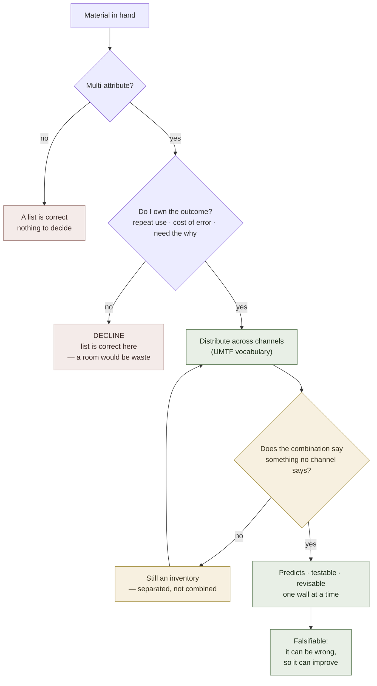

# Encoding Dimensionality

**Summary**: The axis that separates *what the material is* from *how it is held*: **unidimensional** encoding keeps an item's attributes on one channel (a verbal list), **multidimensional** encoding distributes them across independent channels that then combine. The distinction is load-bearing because the failing case is invisible from the inside — a list reads back perfectly and fails only under time pressure. Owner of the term; [multi-attribute-encoding](./multi-attribute-encoding.md) is the applied procedure and [HEART](./heart-overview.md) the worked people-instance.

**Sources**:
- `MULTIDIMENSIONAL_vs_UNIDIMENSIONAL_ENCODING.md` (`raw/templates/`) — the whole axis, the list-vs-room contrast, the three advantages, the when-to-use-each boundary, the conversion recipe, and the pattern-multiplier claim. Previously cited in the Sources of [universal-mental-tagging-framework](./universal-mental-tagging-framework.md) and [heart-overview](./heart-overview.md) with no page behind it.
- Internal owners: [universal-mental-tagging-framework](./universal-mental-tagging-framework.md) (the channel vocabulary this page counts) · [multi-attribute-encoding](./multi-attribute-encoding.md) (the per-item procedure) · [image-merging](./image-merging.md) (fusion) · [memory-palace](./memory-palace.md) (the spatial substrate) · [nedf-overview](./nedf-overview.md) (the per-slot encoder the source assumes).

**Last updated**: 2026-09-02 — page authored; ingest of `MULTIDIMENSIONAL_vs_UNIDIMENSIONAL_ENCODING.md`.

---

## The axis

Two different things hide under the word *multi*, and keeping them apart is the point of this page:

- **Multi-attribute** is a property of the **material** — how many attributes an item carries. Not a choice; the world hands it to you.
- **Encoding dimensionality** is a property of the **encoding** — how many independent channels those attributes are distributed across. Entirely a choice, and the only one you control.

**Unidimensional encoding** holds every attribute on a single channel. In practice that is the verbal channel: a list. **Multidimensional encoding** distributes them across channels that answer different questions — position, condition, relation, time — and lets the combination be read as one thing.

The source states the failing combination in its first line:

> "Most people use **one-dimensional encoding with multiple attributes**. This looks like memorizing a list." (source: MULTIDIMENSIONAL_vs_UNIDIMENSIONAL_ENCODING.md)

|  | **Unidimensional encoding** | **Multidimensional encoding** |
|---|---|---|
| **Single-attribute item** | Correct, trivially | Over-engineering |
| **Multi-attribute item** | **The list — the default failure** | The target |

**Vividness is not a dimension.** The most common near-miss is not a bulleted list but a set of loose vivid images, one per attribute — which is the same cell, reached by more effort. A second dimension is a different *question answered*, not a brighter picture. This is why adding effort never repairs a list and only redistribution does.

## The worked contrast

The source holds one child two ways. As a list: high energy · explosive · quick remorse · persistent · poor adaptation · high intensity · needs explanation first · craves connection · good at sports, struggles with reading. As a [HEART](./heart-overview.md) room: the same content distributed over a walked space — face in the doorway, formative history on the left wall, a temperament totem at the centre, the trigger→appraisal→reaction→relief loop on the right wall, treatment rules on the back wall, a pattern tag on the ceiling (source: MULTIDIMENSIONAL_vs_UNIDIMENSIONAL_ENCODING.md).

Same facts. The difference is not how much is stored but **how many questions the storage can answer at speed**.

## Three reasons the multidimensional cell wins

**One — the substrate.** A list lives in working memory and has no anchor; a room lives in spatial memory and is walked. This is the ordinary [memory-palace](./memory-palace.md) argument and needs no separate defence here.

**Two — dimensional interaction.** This is the reason that changes practice, and it is the one most often skipped. Attributes held separately are inert: *high energy*, *rigid*, *high intensity* sit in a list and answer nothing — *so what does that combination do?* Fused into one totem — a fierce tiger with a tender heart — the combination becomes readable and **predicts**: explodes fast (energy + intensity), cannot climb down (rigidity), but carries remorse (source: MULTIDIMENSIONAL_vs_UNIDIMENSIONAL_ENCODING.md).

So dimensions are worth separating **because they can then combine**. Separation without combination is a tidier list. That gives the merge a second test beside [image-merging](./image-merging.md)'s removability check — *does the combination say something no single channel says?* — and it is the test a mechanically-welded scene fails.

**Three — falsifiability.** The strongest and least obvious claim: **dimensionality determines whether the content can be wrong at all.** "He is an angry kid" absorbs its own counterevidence — he roared, he also calmed down, therefore "he has good days and bad days," and the model never updates. A dimensional claim names trigger, appraisal, and the alternative it excludes ("*because* he reads it as disrespect, *not* from low impulse control"), which produces tests that can fail and a revision that touches one wall instead of shaking the whole list (source: MULTIDIMENSIONAL_vs_UNIDIMENSIONAL_ENCODING.md).

A list is not merely harder to recall. It is **unfalsifiable**, which means it cannot improve.

## The decline gate — when unidimensional is correct

The source is not a blanket recommendation, and this is the half most likely to be dropped in transmission. Stay unidimensional when (source: MULTIDIMENSIONAL_vs_UNIDIMENSIONAL_ENCODING.md):

- information is thin (a first meeting),
- speed matters more than depth,
- the relationship or use is shallow — you will not meet this item again,
- you are **not responsible for predicting** the item's behaviour.

Go multidimensional when you own the outcome, interactions repeat, mistakes cost, you need the *why* rather than the *what*, or you are building a pattern library that will pay off across items.

**The operative reading**: dimensionality is spent, not maximized. Building a room for a stranger is the mirror-image failure of holding a list for a person you are responsible for, and it is the one the wiki has historically under-named — every page here argues for richer encoding and none until now said when to stop. Together with [multi-attribute-encoding](./multi-attribute-encoding.md) §Step 0 this forms one budget gate: Step 0 deletes *attributes*, the decline gate declines *the encoding*.

## Conversion — list to dimensions

The source's recipe, run on a second child, in two phases (source: MULTIDIMENSIONAL_vs_UNIDIMENSIONAL_ENCODING.md):

| Phase | What gets built | Cost |
|---|---|---|
| **Quick** | Doorway (recognition) · centre (a three-axis totem) · one loop on the right wall (trigger → reaction → relief) · a pattern tag | Minutes; enough to act on |
| **Deep** | Formative history · the full nine-dimension temperament grid · secondary loops · five to seven treatment rules | Hours; only for items you own |

The staging is the useful part: the quick phase is already multidimensional. Dimensionality is not something you earn after a long study — it is a *layout decision* available immediately, and the deep phase adds resolution to a structure that already exists rather than converting a list late.

## The pattern-library multiplier — registered, not accepted

The source's largest claim is that patterns amortize: tag the tenth person as *Attention-Seeker* and you inherit everything already learned about that pattern, so per-item cost falls as the library grows (source: MULTIDIMENSIONAL_vs_UNIDIMENSIONAL_ENCODING.md).

**Its own arithmetic does not support it.** The worked case gives: thirty items at five minutes each = **150 minutes** unidimensional, against ten patterns at fifteen minutes plus twenty items at two minutes = **190 minutes** multidimensional — then concludes for multidimensional with *"but patterns compound."* The comparison it presents is a loss of forty minutes, and the compounding that is supposed to reverse it is asserted and never computed. The summary table's "10x pattern speedup" appears nowhere in the body.

The idea is the right shape — amortization across items is exactly what [chunking](./chunking.md) and [lego-skills-patterns](./lego-skills-patterns.md) do elsewhere — so it is registered in [composability-index](./composability-index.md) as a **candidate with a measurement gate**, not as a confirmed unlock. The gate: **per-item encode time must be shown to fall with library size** — record encode minutes per item against the count of patterns already held, and require the marginal cost of a *pattern-matched* item to sit below the unidimensional baseline for a run of consecutive items. Until that curve exists, the multiplier is a hypothesis with a counterexample in its own source.

## What this page does not carry

Four claims from the source are quoted and quarantined rather than absorbed, per the wiki's citation rules (`CLAUDE.md` §Citation rules: a claim with no source is marked as needing verification) — none is load-bearing for anything above.

| Claim | Status |
|---|---|
| Recall 15–30s (list) vs 2–3s (room) | **Illustrative.** No method, sample, or instrument given |
| Accuracy ~40% vs ~85% in the body; 40–60% vs 80–95% in the summary table | **Illustrative, and internally inconsistent** between body and table |
| "Spatial memory is 10x stronger than conceptual memory," offered as a research fact | **Uncited.** Direction is consistent with the wiki's palace evidence; the multiplier is unsupported |
| "10x pattern speedup" | **Contradicted by the source's own worked arithmetic** (150 vs 190 minutes) |

The argument for distributing attributes across channels rests on the free-channel law in [multi-attribute-encoding](./multi-attribute-encoding.md), on interaction, and on falsifiability — not on any of these numbers.

## Pass floors

Measured here rather than inherited, because the source's figures are not measurements. Registered under [meter-overview](./meter-overview.md).

| Event | Test | Floor |
|---|---|---|
| `dimensionality.decline` | Given material plus a use context, call room-or-list | **<10s**, scored **both ways** — wrongly building is a miss exactly as wrongly declining is |
| `dimensionality.access` | From an encoded item, emit the situation-specific action | **<5s** — the source's own use case: what do I do right now |
| `dimensionality.convert` | A list of N attributes → a channel assignment | **<90s** for N ≤ 6 |

The decline event is the one worth instrumenting first: it is the only floor here that can catch over-encoding, and over-encoding leaves no symptom to notice on its own.

## Failure modes

| Failure | What it looks like | Fix |
|---|---|---|
| **Unidimensional by default** | Multi-attribute material held as a list | Redistribute; the list reads back fine, which is why nothing warns you |
| **Vividness mistaken for dimension** | Loose vivid images, one per attribute | A dimension is a different question answered, not a brighter picture |
| **Separated but not combined** | Every attribute on its own channel, still an inventory | Run the interaction test |
| **Dimensionality maximized, not spent** | A full room for a one-off item | The decline gate is half the method |
| **Deep phase treated as the entry price** | Waiting for hours of study before structuring | The quick phase is already multidimensional |
| **Multiplier assumed** | Pattern library credited with a speedup nobody measured | Candidate status and the gate above |
| **Numbers absorbed** | Citing 10x or 85% as findings | They are illustrative; the argument does not need them |

## Mnemonic

**A list is a line; a room has volume.** You cannot tell what a picture shows from loose puzzle pieces, and you can navigate it instantly once assembled — the source's own image, and the reason the glyph is a cube. Three questions in order: **Is the material multi-attribute? Do I own the outcome? Then does the combination say anything?** The first decides whether dimensionality is even at issue, the second whether to spend it, the third whether spending it worked.

## Checksum

1. Which of the two axes is a property of the material and which of the encoding, and which one do you actually choose?
2. Name the failing cell of the 2×2 and say why it does not announce itself. (Multi-attribute material held unidimensionally; reading a list back works, so only use under time pressure fails.)
3. Give the four conditions under which unidimensional is the *correct* call.
4. Why is a list said to be unfalsifiable, and what does a dimensional claim add that makes it testable?
5. State the interaction test in one sentence, and say how a scene can pass removability and still fail it.
6. What breaks the source's pattern-multiplier claim, and what measurement would repair it?

## Visual

New framework minted: NONE. One glossary row registered — **Encoding dimensionality (unidimensional · multidimensional)**, owner this page. The bare word *dimension* is deliberately **not** registered: it is already carrying unrelated senses in [seven-strategic-thinking-dimensions](./seven-strategic-thinking-dimensions.md) and in [universal-mental-tagging-framework](./universal-mental-tagging-framework.md)'s tag families, and a bare-word row would trip first-mention lint across both.

## Related pages

- [multi-attribute-encoding](./multi-attribute-encoding.md) — the applied procedure: which channel each attribute takes, the budget, and the promotion rule. This page owns the axis; that one owns the per-item method
- [heart-overview](./heart-overview.md) — the source's worked instance, and the reason the document exists
- [universal-mental-tagging-framework](./universal-mental-tagging-framework.md) — the channel vocabulary this page counts; orthogonality is what makes a second dimension a second *question*
- [image-merging](./image-merging.md) — removability; the interaction test above is its companion, not its replacement
- [memory-palace](./memory-palace.md) — the spatial substrate behind reason one
- [chunking](./chunking.md) · [lego-skills-patterns](./lego-skills-patterns.md) — where amortization across items already works, and the comparison the pattern multiplier has to beat
- [table-memorization](./table-memorization.md) — the set-level sibling of the applied procedure
- [composability-index](./composability-index.md) — where the multiplier sits as a gated candidate
- [meter-overview](./meter-overview.md) — the three floors above

---

## U — See (CAST)

1. Two axes crossed: material dimensionality × encoding dimensionality, with one failing cell
2. Edges: attributes → channels (distribution); channels → one readable combination (interaction); combination → a claim that can fail (falsifiability)

## D — Name (NEDF)

1. Encoding dimensionality = how many independent channels an item's attributes are distributed across
2. Distinguisher: a property of the **encoding**, not of the material — [multi-attribute-encoding](./multi-attribute-encoding.md) routes the material, this names the treatment; and unlike every other encoding-quality axis here, more is not automatically better
3. Failure mode: unidimensional encoding of multi-attribute material, invisible because a list reads back fine

## F — Do (SPEAR)

1. Material arrives → is it multi-attribute? → do I own the outcome?
2. If yes to both → distribute across channels → test the combination → check it can be wrong
3. If no to the second → decline, deliberately, and record the call

## B — Watch (HEART)

1. Drift toward vividness when the problem is dimensionality
2. Rooms built for items nobody is responsible for
3. The pattern multiplier being cited as though it were measured

## L — Predict (ORACLE)

1. Multi-attribute material held as a list → predict fluent read-back and failure under time pressure, not forgetting
2. A model that absorbs every counterexample → predict it is unidimensional, and that no amount of study will improve it
3. Channels assigned with no interaction → predict recall of parts and no read of the whole

## R — Act (GRACE)

1. "I know everything about it and still freeze in the moment" → dimensionality, not volume
2. "My model is never wrong" → that is the symptom, not the achievement
3. New item, shallow stake → decline the room on purpose and note it, so the gate gets scored
