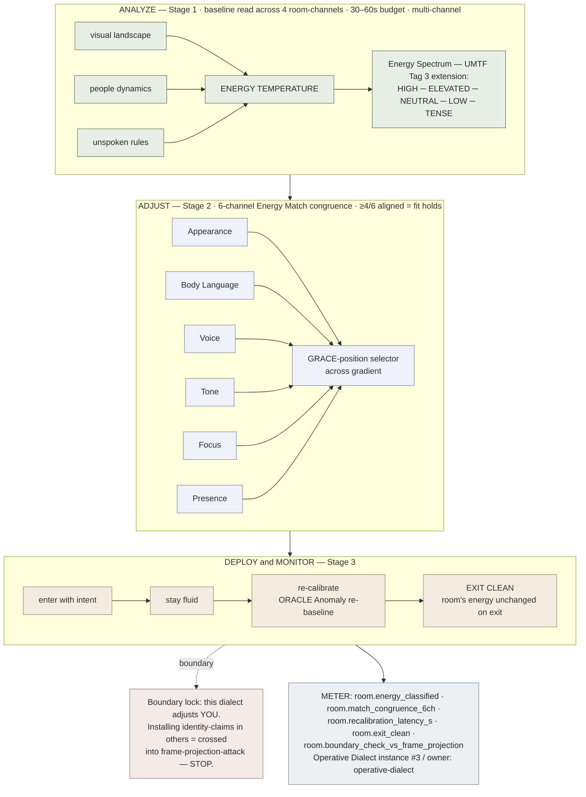

# Environment Matching — Operative Dialect ("Match the Room")

**Summary**: A 4-stage Composite (Analyze → Adjust → Deploy & Monitor → Exit Clean) for fitting yourself to a social environment without forcing it — the RDCTD.PRO "Match the Room" infographic absorbed as **Operative Dialect instance #3** over a substrate that already exists in the wiki: nonverbal-baseline-detection (read the room's baseline), [GRACE](./grace-overview.md) (pick the graded social move that matches), [SPEAR](./spear-overview.md) (execute), [ORACLE](./oracle-overview.md) Anomaly mode (re-baseline continuously while inside). Loadbearing new content: the **Energy Spectrum** 5-level *ambient room-state* taxonomy and the **6-channel Energy Match congruence** check. No new encoder slot, no new acronym.

**Sources**:
- "Match the Room" operational framework infographic (RDCTD.PRO; 2026-06-17 `/validate-idea`)
- nonverbal-baseline-detection — Hadnagy ch.8 baseline-establishment protocol (7-channel PBEV-HSF) ported from per-person to per-room reading
- [GRACE](./grace-overview.md) — graded social-move selection (the 5 example environments are GRACE positions across a context gradient)
- [SPEAR](./spear-overview.md) — execution chain for the Deploy & Monitor stage
- [ORACLE](./oracle-overview.md) — Anomaly mode for continuous re-baselining inside the room
- pretexting-principles §Principle 4 (practice dialects) — the SE's own embodied congruence discipline
- proxemics-four-zones — the physical-distance regulator the infographic's "Presence" channel rides on
- Operative Dialect — register owner page
- [software-design-principles-for-neural-os](./software-design-principles-for-neural-os.md) §Domain Dialects — Composite + Strategy + the legitimacy contract

**Last updated**: 2026-06-17

---

## Unlocks (lead, not footer)

> **GRACE × baseline-detection × SPEAR → social-environment blend reflex — the defensive twin of frame-projection-attack.** Same identity-layer machinery, opposite direction: blending adjusts *your own* baseline to fit the room's; frame-projection installs a false self-image *in another person*. The line is the direction the modification travels. Match-the-Room belongs to the defensive identity layer ([self-image](./self-image.md), [heart-overview](./heart-overview.md) §Recognition, [Cancel! protocol](./failure-mechanism.md)); frame-projection is its hostile inverse on the same layer.

> **Energy Spectrum (5-level room-state taxonomy) extends [UMTF](./universal-mental-tagging-framework.md) State Tags (family 3) for *environments* rather than persons** — the spine's State tags describe a target's condition; the dialect adds *room conditions*. Orthogonality lock: no existing UMTF state vocabulary is re-mapped; the dialect only extends.

> **Operative Dialect promotion fires here.** With this page registering as instance #3 within ~4 weeks of provisional registration, the dialect-pattern legitimacy contract (see [software-design-principles-for-neural-os](./software-design-principles-for-neural-os.md) §Domain Dialects §METER fit) graduates the Operative Dialect from "provisional owner = [pattern-recognition-operative](./pattern-recognition-operative.md)" to a dedicated owner page operative-dialect. This page, [pattern-recognition-operative](./pattern-recognition-operative.md), and sleep-hygiene-protocol §Operative Dialect now point to that owner.

---

## Framework Decomposition

The 4 stages are a **Composite** (SDP §Composite pattern). Each stage maps to an existing Neural OS layer:

| Stage | Neural OS owner | What it does |
|---|---|---|
| 1 — ANALYZE (visual landscape · people dynamics · unspoken rules · energy temperature) | nonverbal-baseline-detection read at room scale + [ORACLE](./oracle-overview.md) Anomaly baseline phase | Establish the *room's* baseline across 4 channels in 30–60s of low-stakes scanning before any active move |
| 2 — ADJUST YOUR ENERGY (appearance · body language · voice · emotional tone · focus · presence) | [GRACE](./grace-overview.md) graded-move selection + nonverbal-baseline-detection §"Your own baseline" + pretexting-principles §Principle 4 | Select the GRACE position whose 6-channel signature matches the room; align your own baseline to the pretext-of-fit |
| 3 — DEPLOY & MONITOR (enter with intent · stay fluid · re-calibrate · exit clean) | [SPEAR](./spear-overview.md) response chain + ORACLE Anomaly continuous re-baselining | Execute the move; treat any deviation in the room's energy as a re-baseline trigger; exit without changing the room's energy |
| 5 EXAMPLES (boardroom · house party · upscale lounge · tense negotiation · street environment) | [GRACE](./grace-overview.md) graded-move positions across a context gradient | The infographic's 5 example contexts are GRACE positions; each fixes the dominant Energy Spectrum level and dictates 1–2 of the 6 channels |

**Why not a new acronym?** SRP (see [software-design-principles-for-neural-os](./software-design-principles-for-neural-os.md) §S): each existing framework already owns one job. Stages 1 is baseline-detection verbatim, stage 2 is GRACE verbatim, stage 3 is SPEAR + ORACLE Anomaly verbatim. A "MTR" or "EBO" acronym would add ceremony without payoff and risk [glossary](./glossary.md) collision.

---

## §Boundary — Environment Matching vs Frame-Projection Attack

The two operations sit on the same identity-layer machinery in opposite directions. Confusing them is the single biggest read failure for this page.

| Axis | Environment Matching (this page) | Frame-Projection Attack |
|---|---|---|
| **Direction of modification** | Inward — you adjust *your own* baseline to fit a room | Outward — the operator installs a *fabricated self-image* in the target's mind |
| **Substrate** | Your own [self-image](./self-image.md) (Maltz, defensive, inward-facing) | The target's mental model of you (Maltz, weaponised outward) |
| **Goal** | Belong; stay absent; do not disturb the room | Make the target *defend* a fake-you to outsiders; bind via commitment-consistency |
| **Signature phrase pattern** | None — you say less, observe more | "I see in you…" / "you are the kind of person who…" / "your essence is…" (identity-installation language) |
| **Counterparty's experience** | Nothing surprising — you look like you belong | Counterparty's identity-claims about you exceed what they could have inferred from interaction so far |
| **Defense / verification check** | The room's energy is unchanged on exit | RAP §Layer 3 pre-explain test — would you draft context for your spouse before she reads the thread? |
| **Authorization** | Always defensive (social fit, OPSEC, harm-prevention) | **Defensive-only documentation** in the wiki — never use offensively (see frame-projection-attack §Things to watch) |

**The bright line**: if your adjustment changes how *the room* perceives *itself* — if you start installing identity-claims into other attendees' minds about who they are, what kind of group this is, or who you are — you have crossed from blending into frame-projection. Stop. The Match-the-Room discipline ends at *yourself*; modifying others is a different operation with different ethics.

---

## The Energy Spectrum — 5-Level Ambient Room-State Taxonomy

Loadbearing new content. Extends [UMTF](./universal-mental-tagging-framework.md) State Tags (family 3) into a *room-level* state vocabulary, with the orthogonality lock that no existing person-state tag meaning is re-mapped.

| Level | Signature | Characteristic channels | Match-implication |
|---|---|---|---|
| **HIGH** | Loud · fast · chaotic · competitive | Voice projection up; movement pace fast; gestures large; interruption normal | Match volume + pace; lean forward; project confidence; **do not slow down — slowing reads as withdrawal** |
| **ELEVATED** | Social · lively · engaged | Voice warm; movement moderate; smiling frequent; turn-taking smooth | Match warmth; small-talk register; blend posture to group circle; **do not over-perform — overshoot reads as try-hard** |
| **NEUTRAL** | Calm · balanced · observant | Voice measured; movement minimal; eye contact steady; pauses tolerated | Match steadiness; speak less than you observe; **do not introduce energy the room hasn't asked for** |
| **LOW** | Quiet · subdued · intimate | Voice soft; movement slow; eye contact close; posture relaxed | Match softness; mirror seated posture; **whispering or hushed tone may be required to not break the spell** |
| **TENSE** | Uneasy · guarded · volatile | Voice clipped or held; movement controlled; eye contact watchful; pauses charged | Match the guard; *do not de-escalate uninvited* (false de-escalation reads as condescension); slow movements, palms visible, **leave first if your match cannot hold** |

**Strategy selector** (SDP §Strategy): the dominant level determines which GRACE position you load. HIGH = lounge / party register; ELEVATED = mixer / casual; NEUTRAL = formal / observed; LOW = intimate / focused; TENSE = negotiation / hazard. Reading the level wrong by one rung is recoverable; reading it wrong by two rungs burns the engagement.

**UMTF tag composition**: Energy Spectrum = State Tag (Tag 3, ambient room condition) × Sensory Tag (Tag 2, perceptual feel) × Priority Tag (Tag 7, how much salience the room demands).

---

## 6-Channel Energy Match Congruence

The infographic's Adjust stage runs across 6 channels. Each channel maps to an existing wiki vocabulary; together they form a congruence checklist that the SE's own baseline must satisfy before stepping into the room.

| Channel | Dial | Owner | Match check |
|---|---|---|---|
| **Appearance** | Dress code · grooming · effort level | pretexting-principles §Principle 4 (practice dialects); disc-profiling-system field-signals | Does my outfit code-match the room without flagging *too much* preparation? |
| **Body language** | Posture pace · gesture scale · stillness | nonverbal-baseline-detection §"Your own baseline" | Are my postural defaults inside the room's range of variation? |
| **Voice** | Volume · pace · register · word choice | communication-os §7 Micro-habits | Does my voice signature land inside ±1σ of the room's voice signature? |
| **Emotional tone** | Affect direction (warm/neutral/guarded) · intensity | [GRACE](./grace-overview.md) R-slot (Read) + nonverbal-baseline-detection §Ekman-7 | Am I displaying the affect the room *expects* given the Energy Spectrum level? |
| **Focus** | Eye-line · attention direction · who you orient toward | proxemics-four-zones; disc-profiling-system | Where the others are looking — am I looking? |
| **Presence** | Body footprint · distance · seat choice · spatial intrusion | proxemics-four-zones (4 zones); communication-os §Body Language | Am I taking up the right amount of space — *no more, no less*? |

**Congruence rule**: ≥4 of 6 channels aligned with the room = baseline-fit holds. ≤3 = the room reads you as out-of-frame. **Single-channel mismatch is recoverable; multi-channel mismatch fires the room's anomaly detector** (same threshold as nonverbal-baseline-detection's 2-channel deviation rule, inverted).

---

## The 5 Example Environments as GRACE Positions

The infographic's 5 example contexts are not separate doctrines — they are 5 GRACE positions across a gradient. Each fixes the Energy Spectrum level and dictates which 1–2 channels carry the heaviest weight.

| Environment | Energy level | GRACE register | Dominant channels |
|---|---|---|---|
| **Corporate boardroom** | NEUTRAL | Formal-authoritative | Appearance + Body language ("dress to match authority"; controlled posture; speak less, listen more) |
| **House party** | ELEVATED | Casual-warm | Body language + Emotional tone + Presence (relaxed posture; engaged conversation; blend into small groups; *light* effort) |
| **Upscale lounge** | LOW | Refined-restrained | Voice + Emotional tone (low smooth energy; minimal gestures; speak softly; confidence without showing off) |
| **Tense negotiation** | TENSE | Guarded-firm | Body language + Focus + Presence (slow deliberate movements; controlled breathing; observe more than speak) |
| **Street environment** | (HIGH/TENSE mix) | Aware-blending | Appearance + Focus + Presence (high awareness; keep moving with purpose; avoid drawing focus; dress to blend in) |

Reading the table left-to-right is reading the GRACE gradient bottom-up; the 5 example environments are not 5 isolated playbooks but 5 anchor points on one continuum the dialect can interpolate between.

---

## ANALYZE — the 4 sub-channels of Stage 1

The infographic's Stage 1 has 4 sub-channels; this is a port of nonverbal-baseline-detection's 7-channel PBEV-HSF protocol from person-scale to room-scale. The discipline is identical: multi-channel only, 30–60s budget, single-channel deviation = noise.

| Sub-channel | What to observe | Failure if skipped |
|---|---|---|
| **Visual landscape** | Lighting (bright/dim/warm/cold); colors (saturated/muted); clutter vs cleanliness; pace of movement around the room | Misreading the energy level (a dim warm room is rarely HIGH-level even if voices are loud — read the substrate, not the surface) |
| **People dynamics** | Mood (collective affect); body language (open/closed); volume distribution (a few loud or everyone loud?); relationship patterns (who orients toward whom?) | Treating individuals as the room — a single loud actor inside a NEUTRAL room is an outlier you should NOT match |
| **Unspoken rules** | What's normal (dress / volume / topic); what's valued (status markers); what's ignored (taboos surfacing as silence) | The room's anomaly-detector keys off violations of these — installing too much eye contact in a LOW-energy room is a single-channel deviation that the room can't articulate but will react to |
| **Energy temperature** | Aggregate read across the above — HIGH / ELEVATED / NEUTRAL / LOW / TENSE | Acting before this is named is the dialect's #1 failure mode |

---

## DEPLOY & MONITOR — the 4 sub-channels of Stage 3

SPEAR response chain with ORACLE Anomaly continuous re-baselining.

| Sub-channel | What it does | ORACLE / SPEAR slot |
|---|---|---|
| **Enter with intent** | Move naturally, no hesitation, no scanning, no staring; the entry itself is the first impression | SPEAR S-slot (Setup) |
| **Stay fluid** | The room's energy shifts; you shift with it. Energy shifts (a tense moment passes; a song ends; a topic dies) are ORACLE Anomaly events on the room | ORACLE Anomaly baseline-update |
| **Re-calibrate** | Keep sensing; if your match degrades, adjust *yourself* (not the room) | SPEAR R-slot (Result) feeding back to Adjust |
| **Exit clean** | Leave the energy as you found it; **the room's state should be unchanged after your departure** | SPEAR A-slot (Action); the exit is itself a move |

**Exit clean discipline**: a clean exit is the load-bearing finalization of the match. If the room remembers you specifically — if your departure visibly *changed* the energy — you weren't blending, you were performing. The match failed at the last 5 seconds even if the previous hour was perfect.

---

## METER hooks

| METER event | What it captures | Pass floor |
|---|---|---|
| `room.energy_classified` | Fires when the user names the Energy Spectrum level + dominant Stage-1 sub-channel before any active move | ≥80% of evaluated rooms have a named level before action |
| `room.match_congruence_6ch` | Per-channel scoring (0–6) post-engagement on the 6 Adjust channels | ≥4/6 channels aligned on ≥70% of evaluations |
| `room.recalibration_latency_s` | Time from energy-shift detection to corresponding Adjust update | ≤30s for ELEVATED/HIGH; ≤60s for NEUTRAL/LOW; ≤15s for TENSE |
| `room.exit_clean` | Boolean retrospective: was the room's energy unchanged on exit? | ≥90% of major engagements rated clean-exit |
| `room.boundary_check_vs_frame_projection` | After-action: did any of your moves install identity-claims in others? (must be 0 for blending; >0 = boundary crossed) | 0 violations |

**Dialect reuse floor** (per [software-design-principles-for-neural-os](./software-design-principles-for-neural-os.md) §Domain Dialects legitimacy contract §METER fit): this page is now the 3rd registered Operative Dialect instance within the 4-week window, triggering the **promotion rule** (see operative-dialect for the dedicated owner page). The Operative Dialect itself now graduates from `disposable` tier (provisional, watching for promotion) to `standard` tier (stable, supports normal SR cycle).

---

## Operative Dialect membership

This page is **instance #3** of the Operative Dialect register, which (per the legitimacy contract in [software-design-principles-for-neural-os](./software-design-principles-for-neural-os.md) §Domain Dialects) promotes from provisional owner = [pattern-recognition-operative](./pattern-recognition-operative.md) to a dedicated owner page on this registration. See operative-dialect for:

- The full registry (4 instances and counting: pattern-recognition · sleep-hygiene · environment-matching · *the dialect-pattern itself promoted to its own owner page on this entry*)
- The legitimacy contract guardrails (no new acronym at framework level; orthogonality lock; registration requirement)
- The promotion rule that just fired
- METER event `wiki.dialect_used` with `register=operative`

---

## Anti-patterns

- **Acting before naming the level.** Stage 1 is mandatory. Any move into Stage 2 before the Energy Spectrum level is named is guessing.
- **Reading individuals as the room.** A single loud actor inside a NEUTRAL room is an outlier you should *not* match. The room is the *aggregate*, not the loudest signal.
- **Forcing the fit.** The principle is "belong naturally." If the match takes visible effort, you're already drifting toward frame-projection-attack territory.
- **Over-performing in ELEVATED rooms.** Elevated energy invites overshoot — too much warmth, too much engagement, too many opinions. Match the level, not 1.2× the level.
- **Defaulting to dominant for HIGH/TENSE rooms.** HIGH ≠ aggressive; TENSE ≠ confrontational. Volume and intensity match different signatures in each.
- **Ignoring single-channel mismatches.** They don't fire the room's anomaly-detector but accumulate. Three single-channel mismatches across an hour read as wrongness even when none was decisive on its own.
- **Changing the room on exit.** A clean exit leaves no trace; an emphatic exit advertises that you were performing rather than blending.
- **Treating proxemics as static.** The Presence channel runs on proxemics-four-zones — distance is itself a regulator (per the Crisis De-escalation Dialect convergence noted in [composability-index](./composability-index.md) 2026-06-17). Drift inside the wrong zone for the wrong scene → cumulative anomaly.

---

## Mnemonic

**AAD-E** = *Analyze · Adjust · Deploy · Exit-clean* — the 4 stages collapsed past the marketing.

Read as: **"A Disciplined Entrance"** — the practitioner who reads, fits, holds, and leaves without trace.

Inner mnemonic for the 5-level Energy Spectrum: **H-E-N-L-T** = *High · Elevated · Neutral · Low · Tense* — read as **"Henlt the Room"** (rhymes with "felt the room" — felt is the operation, henlt is the level name).

Inner mnemonic for the 6 Adjust channels: **ABV-TFP** = *Appearance · Body · Voice · Tone · Focus · Presence* — read as **"A-Block-View, Tap-Float-Pulse"** (the 3+3 split: outer dress + inner state).

Short form: **Read the room before you enter; leave it as you found it.** The infographic's "BLEND IN. STAY ABSENT." rendered into one operational sentence.

---

## Memory checksum

If you can answer these from recall in <60s each, the page is encoded:

1. **Name the 4 stages and which Neural OS owner runs each.** (Analyze → nonverbal-baseline-detection + ORACLE-Anomaly baseline; Adjust → GRACE; Deploy → SPEAR + ORACLE-Anomaly re-baseline; Exit clean → SPEAR finalization)
2. **Name the 5 Energy Spectrum levels and the channel each disproportionately weights.** (HIGH/volume+pace; ELEVATED/warmth; NEUTRAL/steadiness; LOW/softness; TENSE/guard)
3. **What is the congruence-rule threshold for "the room reads you as fitting"?** (≥4 of 6 channels aligned; ≤3 channels fires the room's anomaly detector)
4. **State the boundary against frame-projection-attack in one sentence.** (Match-the-Room adjusts *your own* baseline inward; frame-projection installs a false self-image *in another person* outward — same identity machinery, opposite direction)
5. **Why is this page not a new top-level OS or encoder?** (SRP: nonverbal-baseline-detection owns stage 1, GRACE owns stage 2, SPEAR owns stage 3; minting a "MTR" acronym would add ceremony without payoff per [software-design-principles-for-neural-os](./software-design-principles-for-neural-os.md) §The Main Constraint)
6. **State the exit-clean discipline.** (The room's energy is unchanged after your departure; if the room visibly *reacts* to your exit, you were performing rather than blending — the match failed at the last 5 seconds)

If you can't (a) recite AAD-E in <4s, (b) recite H-E-N-L-T in <5s, (c) name the boundary vs frame-projection-attack, and (d) state the exit-clean rule, you have not stabilized this page.

---

## Visual — the Composite skeleton

---

## Related pages

- operative-dialect — register owner (this page is instance #3; promotion fired here)
- [pattern-recognition-operative](./pattern-recognition-operative.md) — sibling instance #1; same Composite shape at the operative-intelligence substrate
- [timing-operative](./timing-operative.md) — sibling Composite dialect (strategic-timing substrate)
- sleep-hygiene-protocol §Operative Dialect — instance #2; sleep-biology substrate
- nonverbal-baseline-detection — substrate for Stage 1 (Analyze the Room); same baseline-establishment discipline at person-scale
- [grace-overview](./grace-overview.md) — substrate for Stage 2 (Adjust); the 5 example environments are GRACE positions across a context gradient
- [spear-overview](./spear-overview.md) — substrate for Stage 3 (Deploy & Monitor); response chain owner
- [oracle-overview](./oracle-overview.md) — ORACLE Anomaly mode for continuous re-baselining inside the room
- frame-projection-attack — boundary partner; same identity-layer machinery in the hostile-outward direction
- [self-image](./self-image.md) — Maltz; the construct Match-the-Room adjusts inward and frame-projection installs outward
- [failure-mechanism](./failure-mechanism.md) — Maltz's Cancel! protocol; the defensive primitive Match-the-Room rides on
- [heart-overview](./heart-overview.md) — HEART Recognition slot uses cumulative room/context patterns across encounters
- proxemics-four-zones — physical-distance regulator beneath the Presence channel
- communication-os — 5 C's + 7 micro-habits + §Body Language live underneath the Voice + Body-language + Focus channels
- disc-profiling-system — DISC field-signals feed the Appearance + Voice + Focus reads
- pretexting-principles — §Principle 4 (practice dialects) is the embodied-congruence discipline this page inherits
- [universal-mental-tagging-framework](./universal-mental-tagging-framework.md) — Energy Spectrum extends State Tags (family 3) per the orthogonality lock
- [software-design-principles-for-neural-os](./software-design-principles-for-neural-os.md) §Domain Dialects — Composite + Strategy + the legitimacy contract that fired the promotion
- [composability-index](./composability-index.md) — unlock registry: GRACE × baseline-detection × SPEAR → social-environment blend reflex
- [framework-comparison-matrix](./framework-comparison-matrix.md) — master framework routing table; this page sits across GRACE + SPEAR + ORACLE-Anomaly rows

---

## U — See (CAST)
1. 4-stage Composite over an existing substrate (GRACE + baseline-detection + SPEAR + ORACLE Anomaly)
2. Edges: GRACE selects move position from Energy Spectrum level; baseline-detection establishes the level; SPEAR executes; ORACLE re-baselines continuously

## D — Name (NEDF)
1. Environment Matching = Operative Dialect instance #3 ("Match the Room")
2. Distinguisher: adjusts *you* inward (not another person outward — that's frame-projection)
3. Failure mode: forcing the fit, or installing identity-claims in others (boundary crossed)

## F — Do (SPEAR)
1. ANALYZE → name Energy Spectrum level + dominant Stage-1 sub-channel
2. ADJUST → load the GRACE position; ≥4/6 channels aligned
3. DEPLOY → enter with intent; ORACLE re-baseline on shifts
4. EXIT CLEAN → leave the room's energy unchanged

## B — Watch (HEART)
1. Single-channel mismatch accumulation
2. Crossing into identity-installation territory
3. Defaulting to dominant for HIGH/TENSE rooms

## L — Predict (ORACLE)
1. Energy shift mid-engagement → re-baseline within 15–60s (TENSE/NEUTRAL bounds)
2. Multi-channel mismatch → room's anomaly detector fires before they can articulate why

## R — Act (GRACE)
1. Environment read → GRACE-position selection (5 anchors on the gradient)
2. Position chosen → 6-channel Adjust runs
