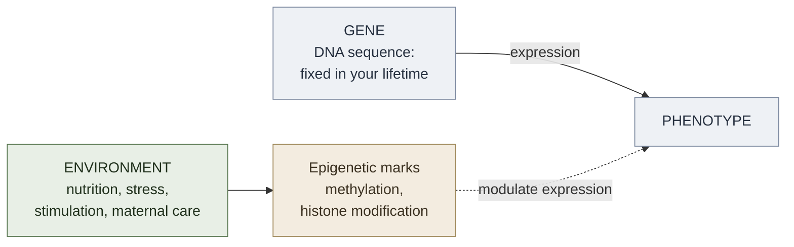
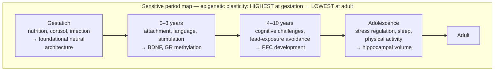

# Epigenetics and Intelligence

**Summary**: Epigenetics studies heritable changes in gene expression that do not involve alterations to the DNA sequence itself — instead, molecular marks (primarily methylation and histone acetylation) switch genes on or off in response to environmental conditions. Applied to intelligence, epigenetics provides the mechanistic bridge between gene and environment: cognitive traits emerge from gene-environment interactions, and those interactions are partially inherited across generations. The key implications are: (1) the heritability of intelligence does not imply genetic determinism — epigenetic marks are environmentally sensitive and partially reversible; (2) early-life environment (nutrition, stress, stimulation, parenting) shapes cognitive development through epigenetic pathways; (3) the [iq-history-and-critique](./iq-history-and-critique.md) Flynn Effect is epigenetics-compatible — rapid phenotypic change without genetic-sequence change is exactly what epigenetic mechanisms produce. This page is the canonical owner of the epigenetics × intelligence intersection.

**Sources**:
- Meaney, M. J. (2001). "Maternal Care, Gene Expression, and the Transmission of Individual Differences in Stress Reactivity Across Generations." *Annual Review of Neuroscience*, 24, 1161-1192. — licking/grooming → glucocorticoid receptor methylation; canonical study.
- Nisbett, R. E., et al. (2012). "Intelligence: New Findings and Theoretical Developments." *American Psychologist*, 67(2), 130-159. — review of environmental effects on IQ including epigenetics.
- Roth, T. L. (2012). "Epigenetics of Neuroscience: Translating Basic and Clinical Research." *Neuropsychopharmacology*, 37, 279-280. — epigenetic mechanisms in neural development.
- Meaney, M. J., & Szyf, M. (2005). "Environmental Programming of Stress Responses through DNA Methylation: Life at the Interface between a Dynamic Environment and a Fixed Genome." *Dialogues in Clinical Neuroscience*, 7(2), 103-123.
- Weaver, I. C., et al. (2004). "Epigenetic Programming by Maternal Behavior." *Nature Neuroscience*, 7(8), 847-854. — the molecular mechanism of the Meaney finding.
- Internal: [iq-history-and-critique](./iq-history-and-critique.md), brain-plasticity, stress-and-cognition, early-childhood-development, gene-environment-interaction.

**Last updated**: 2026-06-10

---

## The mechanism

**Epigenetics** = the study of heritable changes in gene expression that do not involve changes to the underlying DNA sequence.

Two primary mechanisms:

| Mechanism | What it does | Cognitive relevance |
|---|---|---|
| **DNA methylation** | Methyl groups attach to cytosine bases → genes silenced | Stress-response genes, glucocorticoid receptors; early-life regulation |
| **Histone modification** | Acetyl/methyl groups on histone proteins → chromatin opens or closes → gene accessible or not | Memory consolidation; BDNF (brain-derived neurotrophic factor) expression |

Key property: **these marks are environmentally sensitive**. Nutrition, stress, physical activity, early maternal care, and social environment all alter epigenetic marks. The marks can be stable across decades and partially inherited across generations without any change to the DNA sequence.

## The Meaney finding (canonical)

Michael Meaney and colleagues studied rat pups. Mother rats that **lick and groom their pups frequently** (high LG) produce offspring with:
- Lower stress reactivity throughout life
- Higher glucocorticoid receptor expression in the hippocampus
- Better spatial learning and memory

Weaver et al. (2004) identified the molecular mechanism: **high LG increases acetylation at the glucocorticoid receptor gene promoter**, making the gene more accessible for transcription. The behavior of the mother changes the epigenetic marking of the pup's genome — without altering the DNA sequence.

Cross-fostering confirmed the environmental cause: pups from low-LG mothers raised by high-LG mothers showed the high-LG epigenetic profile, and vice versa. The trait was transmitted behaviorally, not genetically, and the mechanism was epigenetic.

**Human analog**: early-life stress, neglect, abuse, and parental warmth all show parallel effects in human studies. Methylation at the NR3C1 (glucocorticoid receptor) gene differs significantly between individuals with and without histories of childhood abuse.

## Epigenetics and the Flynn Effect

The [iq-history-and-critique](./iq-history-and-critique.md) Flynn Effect (approximately +3 IQ points per decade across the 20th century) cannot be explained by genetic-sequence change — DNA evolves over thousands of generations, not 3-4. Epigenetics provides a compatible mechanism:

- Environmental changes (better nutrition, reduced early-life infection, changed cognitive stimulation demands, lower lead exposure) alter epigenetic marks across a population
- Epigenetic effects on BDNF, glucocorticoid receptor expression, and hippocampal development scale with these environmental improvements
- The effects are not fully random — they can be directional if the environment changes directionally (e.g., improved nutrition uniformly raising BDNF expression)

This is not the only explanation for the Flynn Effect, but it is mechanistically compatible with it in a way that pure genetic determinism is not.

## Epigenetics vs. genetic determinism

The popular misreading of behavioral genetics findings (high heritability of IQ) treats heritability as genetic determinism. Epigenetics explicitly falsifies this inference:

| Claim | Status |
|---|---|
| "IQ is 50-80% heritable" | True in studied Western populations, in current environments |
| "Heritability means genes fix the trait" | False — heritability is environment-specific; epigenetics shows genes are environmentally regulated |
| "Genetic traits cannot be changed by environment" | False — epigenetic marks change in response to environment and can reverse |
| "Intelligence is a fixed biological trait" | Falsified by Flynn Effect + epigenetic mechanism |

The precise claim: heritability measures how much of the *variance* in a population is attributable to genetic differences, given the range of environments in that population. If all environments were identical, heritability would be 100% — but that wouldn't mean the trait couldn't change if the environment changed.

## Sensitive periods and epigenetic vulnerability

Epigenetic marks are most malleable during **sensitive periods** — early development, gestation, and early childhood. This is why early-life environment has outsized effects on long-term cognitive development:

- **Prenatal nutrition** (folic acid, iodine, iron deficiency): alters methylation patterns during neural tube formation; some effects irreversible
- **Early-life stress** (childhood trauma, poverty, instability): elevates cortisol → methylates glucocorticoid receptors → reduced stress regulation → reduced hippocampal volume; reduced cognitive flexibility
- **Cognitive stimulation** (language exposure, reading, interactive play): upregulates BDNF expression; promotes synaptic density and dendritic arborization
- **Lead exposure** (historical from paint, gasoline): epigenetic changes in prefrontal and hippocampal tissue; reversal partial at best after sensitive period

The sensitive-period structure explains why interventions are most powerful earliest and progressively less effective with age — not because the genome changes, but because epigenetic marks become progressively more stable and less malleable.

## Transgenerational epigenetic inheritance

A subset of epigenetic marks are transmitted across generations without requiring direct environmental exposure in the offspring. Evidence includes:

- **Överkalix study** (Bygren et al.): paternal grandfather's food availability during his prepubertal sensitive period predicted grandson's cardiovascular mortality — two generations later
- **Holocaust survivor studies** (Yehuda et al.): children of Holocaust survivors show altered FKBP5 methylation and cortisol profiles consistent with transmitted stress-response dysregulation
- **Animal models**: methylation changes in sperm and oocyte survive reprogramming events and appear in offspring phenotypes

**Caution**: the human transgenerational data is contested; most replications in mice. The mechanism exists; its magnitude and specificity in humans is under active investigation. The neural OS posture: treat it as a real phenomenon with real uncertainty, not a confirmed effect size.

## Visual

## Implications for the Neural OS learning framework

| Epigenetic principle | Neural OS implication |
|---|---|
| **Early environment is disproportionate** | Front-load cognitive stimulation and stress reduction; early habits compound via epigenetic stabilization |
| **BDNF is upregulated by exercise** | Physical activity is not a lifestyle preference — it is a direct cognitive lever |
| **Stress dysregulates hippocampus** | Stress management is load-bearing for learning capacity, not ancillary to it |
| **Epigenetic marks are partially reversible** | No early-life damage is permanently fixed; later enrichment has real but diminishing returns |
| **Heritability is not destiny** | Environment design is a valid response to "I'm not genetically gifted" — the claim is incoherent given the mechanism |

## Failure modes

| Failure | What it produces |
|---|---|
| **Genetic fatalism** | "IQ is heritable → I can't change it" — ignores that heritability ≠ determinism; epigenetic malleability is real |
| **Ignoring stress as a cognitive variable** | Chronic stress directly degrades hippocampal volume and glucocorticoid regulation; treating it as emotional is a category error |
| **Dismissing early intervention as marginal** | Sensitive periods are real; early epigenetic marks have outsized lifetime effects |
| **Overstating transgenerational inheritance** | Mechanism is real in animals; human magnitude is contested; don't overread Yehuda |
| **Treating epigenetics as pure reversibility** | Some early-period marks (especially from severe trauma or nutritional deficiency) are only partially reversible |

## Related pages

- [iq-history-and-critique](./iq-history-and-critique.md) — Flynn Effect is the macro-level phenomenon; epigenetics is a compatible mechanism
- brain-plasticity — epigenetic malleability is one layer of the broader plasticity story
- stress-and-cognition — glucocorticoid → hippocampus pathway is the epigenetic mechanism under stress effects on cognition
- early-childhood-development — sensitive periods map directly to epigenetic vulnerability windows
- gene-environment-interaction — epigenetics is one mechanistic pathway through which G×E operates
- [desirable-difficulties](./desirable-difficulties.md) — contextualizes: effortful practice itself upregulates BDNF expression (one epigenetic pathway of learning)

---

## U — See (CAST)
1. Epigenetic marks (methylation, histone mod) modulate gene expression in response to environment → cognitive traits are not fixed by DNA
2. Meaney finding: maternal behavior changes offspring brain methylation → lifelong cognitive/stress-response profile

## D — Name (NEDF)
1. Epigenetics × intelligence = mechanism by which environment shapes cognitive development without changing DNA sequence
2. Distinguisher: heritability (variance attribution) ≠ genetic determinism (fixedness); epigenetics breaks the equivalence
3. Failure mode: genetic fatalism — high heritability → "can't change it"; epigenetic reversibility falsifies this

## F — Do (SPEAR)
1. When assessing cognitive environment: treat stress, sleep, nutrition, and physical activity as cognitive levers, not lifestyle optionals
2. When evaluating early-learning interventions: weight the sensitive-period window; earlier is disproportionately more powerful

## B — Watch (HEART)
1. "IQ is heritable → fixed" — red flag: heritability is environment-specific; epigenetic marks are malleable
2. Stress treated as emotional rather than cognitive → hippocampal degradation pathway being ignored

## L — Predict (ORACLE)
1. Early-life enrichment + stress reduction → favorable epigenetic marks → durable cognitive advantage
2. Chronic early-life stress → glucocorticoid dysregulation → hippocampal atrophy → persistent retrieval and regulation deficit

## R — Act (GRACE)
1. Cognitive environment audit: is stress management load-bearing in your system, or treated as optional wellness?
2. Exercise + sleep first, then learning — BDNF upregulation from physical activity is a direct prerequisite for optimal encoding
