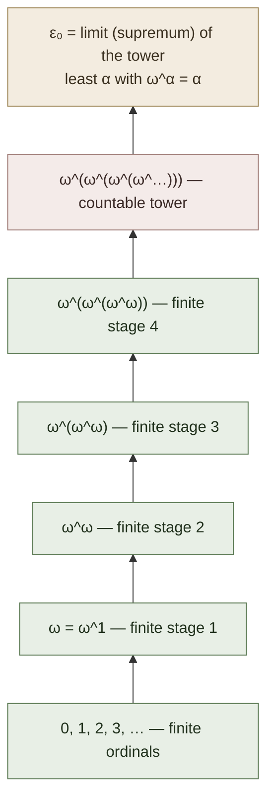

# ε₀ and Ordinal Induction

**Summary**: ε₀ is the least ordinal α such that ω^α = α — equivalently, the limit of the tower ω, ω^ω, ω^{ω^ω}, … (countably many levels). Gentzen's 1936 [consistency proof for PA](./consistency-of-peano-arithmetic.md) uses transfinite induction along *ordinal notations* < ε₀ — a *combinatorial* (almost-finitary) representation of these ordinals that doesn't require set theory. ε₀ is the **proof-theoretic ordinal of PA**: PA proves induction up to every α < ε₀ but cannot prove ε₀ is well-ordered. Stronger arithmetical theories need larger proof-theoretic ordinals (Γ₀ for predicative ACA; Bachmann-Howard ordinal for impredicative comprehension; far beyond for full second-order arithmetic).

**Sources**:
- [Mancosu, Galvan, Zach (2021)](./proof-theory-mancosu-galvan-zach.md) Ch 8 — primary source for this page.
- Gentzen, G. (1936) "Die Widerspruchsfreiheit der reinen Zahlentheorie."
- Schütte, K. (1977) *Proof Theory.* Berlin and New York: Springer.
- Pohlers, W. (2009) *Proof Theory: The First Step into Impredicativity.* Springer.
- Rathjen, M. and Sieg, W. (2020) "Proof theory," *Stanford Encyclopedia of Philosophy.*

**Last updated**: 2026-05-27

---

## Unlocks (lead, not footer)

1. **ε₀ × [OK Plateau](./ok-plateau.md) × [skill-progression-stages](./skill-progression-stages.md) × [self-image](./self-image.md).** ε₀ is the least ordinal that PA *cannot reach by finite construction from below*. Any finite power-tower stays strictly less than ε₀; the *limit* requires one ordinal layer beyond what PA's induction can certify. This is the formal-logic twin of the OK Plateau / self-image ceiling: **a finite procedure has a definable ceiling; crossing it requires the next ordinal layer (next paradigm, next self-image).** Same mechanism, two layers. The wiki's automaticity ladder (Lamp/Scale/Sword) is the *finite-ordinal* substrate; crossing into a new domain is the *ordinal jump*.

2. **Ordinal notations as the finitary substrate × wiki's combinatorial discipline.** Ordinal notations are *finite syntactic objects* — strings of symbols built up combinatorially (e.g., Cantor normal form: ω^β₁·n₁ + ω^β₂·n₂ + … + ω^βₖ·nₖ). Their well-foundedness is provable by elementary combinatorial argument. This is the architectural principle the wiki shares — *infinite-seeming* structures (Trophy Palace, skill ladder, knowledge graph) are encoded as *finite combinatorial objects* with combinatorial well-foundedness rules. **Ordinal notations are the formal-logic instance of the wiki's encode-the-infinite-as-finite-with-rules discipline.**

3. **Goodstein sequences × wiki's [gym](./red-queen-skill-gym.md) dynamics.** A Goodstein sequence on a natural number n: replace base-2 representation with base-3, subtract 1, replace base-3 with base-4, subtract 1, … The sequence *appears* to explode but actually reaches 0 in finitely many steps — provably by ordinal induction along < ε₀, but **not provable in PA** (Kirby-Paris 1982). This is the prototype for *gym drills that look hopeless but terminate by reasons outside the drill's substrate*. The dynamics of a Red Queen Gym session — apparently-fixed difficulty, eventual mastery — is the Goodstein-style structure at the skill layer.

## Mnemonic

**TOWER-W** = *Tower-of-ω · Ordinal-notations · Well-founded · ε-zero · Recursion-base · Wfd*.

Plays as "tower W" — the tower of ω-exponentiations, capped at the W-th level (W = ε₀ = "fixed point of x ↦ ω^x").

## Memory checksum

If you can answer these in <60 s each from memory, the page is encoded:

1. State **what ε₀ is**, three ways. (*(i) Least ordinal α with ω^α = α. (ii) Limit (supremum) of ω, ω^ω, ω^{ω^ω}, … (countably many iterations). (iii) Order-type of the ordinal notations definable in PA's language by primitive recursion.*)
2. State the **well-foundedness claim** at ε₀ and its catch. (*Every primitive-recursive ordinal notation < ε₀ has no infinite strictly-decreasing sequence of ordinal notations. **Catch**: this well-foundedness is provable, but **not in PA** — needs induction along < ε₀ itself, which is exactly the principle PA lacks.*)
3. Define **Cantor normal form** for ordinals < ε₀. (*Every ordinal α < ε₀ has a unique representation as α = ω^β₁·n₁ + ω^β₂·n₂ + … + ω^βₖ·nₖ where β₁ > β₂ > … > βₖ ≥ 0 are also ordinals < ε₀ and n₁, …, nₖ are positive integers. The representation is finite and recursive — each βᵢ has its own Cantor normal form, base case β = 0.*)
4. What is a **Goodstein sequence** and what's surprising about it? (*Goodstein sequence on n: write n in hereditary base-2 notation; replace 2 with 3; subtract 1; write result in hereditary base-3; replace 3 with 4; subtract 1; … The sequence terminates at 0 for *every* n (Goodstein 1944), provable by ordinal induction along < ε₀. But Kirby-Paris 1982: PA cannot prove "every Goodstein sequence terminates." A natural arithmetic statement unprovable in PA, distinct from Gödel's artificially-constructed one.*)
5. What is **the proof-theoretic ordinal** of a theory? (*The least ordinal α such that the theory cannot prove transfinite induction along α. For PA, this is ε₀. For ACA₀ and predicative analysis, Γ₀ (Feferman 1964; Schütte 1965). For impredicative Π¹₁-CA, the Bachmann-Howard ordinal. The proof-theoretic ordinal classifies the *strength* of arithmetic theories by what induction-power they have.*)

## Visual — ε₀ as a tower

Each ordinal α < ε₀ has a **Cantor Normal Form**:

> α = ω^β₁·n₁ + ω^β₂·n₂ + … + ω^βₖ·nₖ,  where β₁ > β₂ > … > βₖ ≥ 0 and each βᵢ also has CNF. The recursion terminates at base case β = 0. Result: a finite tree-of-naturals = ordinal notation.

**The well-foundedness point:** No infinite descending sequence α₁ > α₂ > α₃ > … of ordinals < ε₀. But PA cannot prove this — it goes beyond PA's induction. This is what Gentzen used, and what Gödel said PA must lack.

The tower visualization makes ε₀ feel large but each ordinal *below* ε₀ is still a *finite combinatorial object* (its Cantor normal form is a finite tree). Only ε₀ itself sits as the limit. PA can compute and compare any two ordinals < ε₀; what PA cannot do is *iterate this computation along the entire sequence below ε₀ in a single proof*.

---

## Ordinal notations (Mancosu et al. Ch 8.3, 8.4)

Mancosu et al. develop ordinal notations *combinatorially*, without set theory. The notations are syntactic objects built from:

- A symbol `0`.
- An operation `+` (addition).
- An operation `ω^_` (omega to the power).
- An ordering relation on these expressions, defined recursively.

Definition (Cantor normal form, syntactic version):

> An ordinal notation is either 0, or an expression ω^β₁·n₁ + ω^β₂·n₂ + … + ω^βₖ·nₖ where β₁, …, βₖ are themselves ordinal notations satisfying β₁ ≻ β₂ ≻ … ≻ βₖ in the recursively-defined order, and n₁, …, nₖ are positive naturals.

The ordering `≻` is defined by:
- 0 ≺ everything.
- ω^β₁·n₁ + … ≻ ω^β'₁·n'₁ + … iff (β₁ ≻ β'₁) or (β₁ = β'₁ and n₁ > n'₁) or (β₁ = β'₁ and n₁ = n'₁ and rest ≻ rest').

This is a *primitive-recursive* well-ordering — both the notations and the comparison relation can be computed by primitive-recursive functions on Gödel-numbers of the syntactic expressions.

### Well-foundedness

**Theorem (Mancosu et al. Ch 8.5).** The order ≻ on ordinal notations < ε₀ is well-founded: no infinite strictly-decreasing sequence exists.

**Proof:** by induction on the structure of the leading term. Base case: notations of the form *natural number* — already well-ordered. Inductive step: ω^β·n + rest decreases only by decreasing β (which is structurally smaller) or by decreasing n (a natural) or by decreasing rest (structurally smaller). The induction terminates at base case.

**The catch**: this proof needs *induction along the structural complexity of ordinal notations* — which is itself induction along ε₀ ordered by complexity, *not* by ≻ alone. Doing the well-foundedness proof rigorously already requires the very principle we're trying to certify.

This is Gödel's incompleteness theorem at work. PA + induction-along-ε₀ proves Con(PA). The induction principle is independent of PA. The well-foundedness of ε₀ *as proved by usual mathematics* uses set theory or stronger arithmetic.

## Goodstein sequences (Mancosu et al. Ch 8.9)

Goodstein 1944 defined a sequence operation on natural numbers:

**Goodstein sequence of n:**
1. Write n in *hereditary base-2* notation (write n in base 2, then write each *exponent* in base 2 recursively).
2. Replace every 2 with 3. Subtract 1.
3. Write the result in *hereditary base-3*. Replace every 3 with 4. Subtract 1.
4. Continue: at step k, replace base-(k+2) with base-(k+3), subtract 1.

The sequence at each step *appears* to grow rapidly (replacing 2 with 3 in a hereditary expression like 2^{2^2} multiplies by orders of magnitude). But the "subtract 1" eventually erodes the structure. Goodstein proved: **the sequence always reaches 0**, for *every* starting n.

Goodstein's proof uses ordinal notations: assign to each step's value an ordinal < ε₀ by interpreting the hereditary base-k notation in base ω. Each step strictly decreases this ordinal. Since ε₀ is well-founded, the sequence terminates.

**Kirby-Paris 1982:** PA cannot prove "every Goodstein sequence terminates." It's a natural arithmetic statement, provable by ε₀-induction but not by PA itself. The first *natural* incompleteness result after Gödel's artificial Gödel-sentence.

The Goodstein theorem is a prototype for *combinatorial statements that look elementary but require ordinal strength beyond their substrate.* Several other examples exist (Paris-Harrington 1977 on Ramsey theory; Kruskal's tree theorem provable in Π¹₁-CA but not in ATR₀; etc.).

## The proof-theoretic ordinal

Definition: the **proof-theoretic ordinal** |T| of a theory T is the least ordinal α such that T cannot prove transfinite induction along α (for some specific well-ordering of order-type α).

Schedule of major proof-theoretic ordinals:

| Theory | |T| | Source |
|---|---|---|
| Primitive recursive arithmetic (PRA) | ω^ω | folklore; Tait 1981 |
| Peano arithmetic (PA) | **ε₀** | Gentzen 1936 |
| Π¹₁-comprehension over PA | ε_{ε₀} | Gentzen-Schütte family |
| Predicative analysis (ACA₀, ATR₀ subset) | Γ₀ (Feferman-Schütte ordinal) | Feferman 1964; Schütte 1965 |
| Π¹₁-CA₀ (impredicative) | Bachmann-Howard ordinal | Takeuti 1967; Pohlers 1981 |
| Full Π¹₁-CA | ψ(Ω_ω) | Buchholz-Schütte 1988 |
| Π¹₂-CA | Pi¹₂-ordinal (not yet pinned down; active research) | Rathjen 2020 |

The schedule defines what ordinal analysis *is*: classify arithmetic and analytical theories by the ordinal strength needed to prove their consistency.

## Trees and ordinal notations

Mancosu et al. Ch 8.9 also discusses ordinal notations as *trees* — finite labeled trees in which the comparison ≻ is computed recursively. This view connects to:
- Kruskal's tree theorem (well-quasi-ordering of trees under embedding).
- The proof-theoretic interpretation of ordinals as recursive tree structures.
- The wiki's [memory-palace](./memory-palace.md) and palace-classification work — palaces are tree-structured combinatorial objects ordered by complexity. The ordinal-notation tree is the formal-logic ancestor.

## Connection to the wiki

### Substrate ceiling principle

The OK-Plateau page already names the principle: *you cannot lift the ceiling using only operations the ceiling permits.* ε₀ is the formal-logic statement: PA cannot prove ε₀-induction *because* PA's induction is bounded by every α < ε₀.

The skill-progression-stages model (Lamp/Scale/Sword) has the same structure at the skill layer. Each stage is well-founded on its own; crossing to the next stage requires a principle the previous stage lacks. The match isn't metaphorical — both are instances of "well-founded ordinal hierarchies with stage-by-stage strength."

### Trophy Palace ordinal

The Trophy Palace ([spark-overview](./spark-overview.md) §Trophy Palace) is the wiki's locus for ranked-tier wins (T0/T1/T2/T3). Each tier's notation is built from the previous (T1 = aggregate of T0s with a name; T2 = aggregate of T1s with a ceremony; T3 = aggregate of T2s with a Knowing-grade unlock). This is the structure of ordinal notation in Cantor normal form — each level built from the previous, with a well-defined ordering.

The wiki implicitly uses ordinal-notation discipline; this page makes it explicit.

### Combinatorial-not-set-theoretic discipline

The wiki insists on *combinatorial* representations for things that *look infinite*: the unbounded knowledge graph is encoded as wiki-links between finite pages; the unbounded skill ceiling is encoded as a well-founded ladder; the unbounded ANT scan is encoded as a 7-letter checklist. **Ordinal notations are the formal-logic ancestor of this discipline.**

## Failure modes

- **Confusing ordinal notations with the ordinals themselves.** Ordinal notations are *finite syntactic objects*. The ordinals are *set-theoretic*. The notations represent the ordinals but they're not the same thing. PA proves things *about ordinal notations*; it doesn't prove things about the ordinals as transfinite sets.
- **Treating ε₀-induction as "still finitary."** Hilbert's strict-finitary standpoint cannot accommodate ε₀-induction. Gentzen's extension is *constructive* (BHK-acceptable) but *not* strict-finitary. The wiki's [hilberts-program](./hilberts-program.md) page is explicit about this — be careful not to overclaim.
- **Thinking PA can't reach individual α < ε₀.** PA can: it can prove transfinite induction along any *specific* α < ε₀ by Cantor-normal-form arithmetic. What PA cannot do is prove the *single statement* "for all α < ε₀, transfinite induction along α holds" — that single statement requires ε₀-induction, which is the principle PA lacks.

## Related pages

- [proof-theory-mancosu-galvan-zach](./proof-theory-mancosu-galvan-zach.md) — source textbook (Ch 8)
- [consistency-of-peano-arithmetic](./consistency-of-peano-arithmetic.md) — uses ε₀-induction
- [gentzens-proof-theory](./gentzens-proof-theory.md) — historical context
- [hilberts-program](./hilberts-program.md) — what Gentzen partly rescued by going up to ε₀
- [godels-incompleteness](./godels-incompleteness.md) — limits PA's own induction; ε₀ is one of the things PA can't internalize
- [normalization-theorem](./normalization-theorem.md) · [cut-elimination-hauptsatz](./cut-elimination-hauptsatz.md) — finite-complexity terminations; PA needs ε₀-complexity
- [ok-plateau](./ok-plateau.md) · [snap-back-effect](./snap-back-effect.md) — substrate-ceiling principle at the skill layer
- [skill-progression-stages](./skill-progression-stages.md) — well-founded ladder pattern
- [spark-overview](./spark-overview.md) §Trophy Palace — ordinal-tier discipline
- [memory-palace](./memory-palace.md) — tree-structured combinatorial object
- [glossary](./glossary.md) — Logic layer registrations
