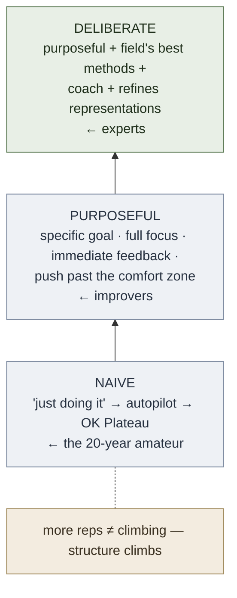

# Peak (Ericsson & Pool)

**Summary**: *Peak: Secrets from the New Science of Expertise* (Ericsson & Pool, Houghton Mifflin Harcourt 2016) is K. Anders Ericsson's trade-book statement of his life's research on expert performance, co-written with science writer Robert Pool. Its thesis: **expertise is built, not born — through [deliberate-practice](./deliberate-practice.md), the most structured form of practice, which works by building domain-specific [mental representations](./mental-models-for-learning.md)** rather than through innate talent or mere accumulated experience. *Peak* is the wiki's primary-source owner for the [deliberate-practice](./deliberate-practice.md) concept and is the source that explicitly **disowns Gladwell's ["10,000-hour rule"](./10000-hour-rule-mythbusting.md)** as a misframing of Ericsson's 1993 violinist study. This page is the source-summary / routing owner — the concept it centers on is defined on [deliberate-practice](./deliberate-practice.md), not here.

**Sources**:
- Ericsson, K. A., & Pool, R. (2016). *Peak: Secrets from the New Science of Expertise*. Houghton Mifflin Harcourt.
- Foundational paper: Ericsson, K. A., Krampe, R. T., & Tesch-Römer, C. (1993). *Psychological Review*, 100(3), 363–406 — the deliberate-practice expert-performance study that *Peak* popularizes.
- Internal concept owners: [deliberate-practice](./deliberate-practice.md), [mental-models-for-learning](./mental-models-for-learning.md), [ok-plateau](./ok-plateau.md), [10000-hour-rule-mythbusting](./10000-hour-rule-mythbusting.md), [automaticity-and-reflex-training](./automaticity-and-reflex-training.md).

**Last updated**: 2026-06-30

---

## What the book is

One of the three T1-canonical scientific spines under the wiki's `learning-systems/` cluster (with [brown-make-it-stick](./brown-make-it-stick.md) and Willingham). Its job in Neural OS is **citation backstop + routing**: it is the named source behind [deliberate-practice](./deliberate-practice.md) and the talent-myth correction, but the operational definition of deliberate practice lives on its own concept page.

## The thesis — expertise is built, not born

Ericsson's claim from decades of studying chess masters, musicians, athletes, and memorizers: the differences between experts and ordinary performers are overwhelmingly the *product* of structured practice, not the *cause* expressed as fixed talent. The brain and body are adaptable; the right kind of practice drives that adaptation. The book's recurring case is **Steve Faloon**, an ordinary student Ericsson trained to a digit span of 82 (from a normal ~7) purely through practice and self-built retrieval structures — a live demonstration that a "limit" was actually an untrained skill. (source: Peak, Ch 1, 3)

## The practice ladder — naive → purposeful → deliberate

*Peak*'s argument is structured as a three-rung ladder — naive, purposeful, and [deliberate](./deliberate-practice.md) practice — whose rungs are **defined in full on [deliberate-practice](./deliberate-practice.md)**; this page conveys only the book's narrative use of them. Ericsson's point is that the bottom rung ("just doing it") produces the "20-year amateur" who never improves past year two, while the top rung — disciplined practice *backed by a mature field's established training methods and a coach* — is what produces world-class performers. Most domains, he notes, can sustain the middle rung but not the top.

The autopilot trap at the bottom of the ladder is the [ok-plateau](./ok-plateau.md) — the point where a skill becomes "good enough," conscious effort stops, and the mental representations stop refining.

## Mental representations — the mechanism

The book's deepest contribution is *why* deliberate practice works: it builds and refines **mental representations** — domain-specific patterns that let experts chunk information, see meaning where novices see noise, anticipate, and plan. A chess master doesn't calculate faster; they *recognize* board positions as familiar wholes. This construct is the same one [Brown](./brown-make-it-stick.md) calls "mental models"; the wiki owns both under [mental-models-for-learning](./mental-models-for-learning.md). Representations are both the product of practice and the engine of further improvement — the feedback loop that the [ok-plateau](./ok-plateau.md) breaks. (source: Peak, Ch 3)

## The talent myth and the 10,000-hour correction

Ericsson spends a chapter dismantling the idea of fixed innate ceilings (perfect pitch, for instance, is *trainable* in young children — Sakakibara's study). He also corrects the most famous distortion of his own work: Gladwell's **"10,000-hour rule"** (*Outliers*, 2008). The wiki owns this correction at [10000-hour-rule-mythbusting](./10000-hour-rule-mythbusting.md) — in brief, 10,000 hours was the *average* accumulated by elite violinists *by age 20*, not a threshold, not a guarantee, and it varies widely by field; what matters is the *quality and structure* (deliberate vs naive), not the raw count. (source: Peak, Ch 4, 8)

## How it sits in Neural OS

*Peak* is the performance-layer floor of the wiki. [Deliberate practice](./deliberate-practice.md) names the mechanism behind the [red-queen-skill-gym](./red-queen-skill-gym.md) and the [Great Work](./automaticity-and-reflex-training.md) pipeline; the [ok-plateau](./ok-plateau.md) is the failure state every gym is designed to push past; "build mental representations" is the goal that [mental-models-for-learning](./mental-models-for-learning.md) operationalizes. It converges with [brown-make-it-stick](./brown-make-it-stick.md) (comfort-zone exit = desirable difficulty; mental representations = mental models) and with Willingham's [factual-knowledge-precedes-skill](./factual-knowledge-precedes-skill.md) (representations are built *from* domain knowledge, not in the abstract). The book's "expertise is trained, not innate" stance is also the empirical refutation of Galton's fixed-ceiling claim that [ok-plateau](./ok-plateau.md) records.

## Visual

## Mnemonic

**PEAK** — the four pillars of deliberate practice (title used as a backronym): **P**ush past the comfort zone · **E**xemplars (study the field's best methods; build mental representations) · **A**ttention on a specific goal (full focus) · **K**orrective feedback (immediate). The deliberate "structural" layer on top — field standards + a coach — is what turns *purposeful* PEAK into *deliberate* PEAK.

## Checksum

1. What separates *deliberate* from merely *purposeful* practice? (Deliberate adds a mature field's structural conditions — established training methods, a teacher/coach, objective standards; purposeful has goals · focus · feedback · comfort-zone-exit but no field structure.)
2. By what mechanism does deliberate practice produce expertise? (It builds and refines domain-specific mental representations — the pattern-library that enables chunking, recognition, and anticipation.)
3. What is Ericsson's actual position on the "10,000-hour rule"? (It is Gladwell's misframing; 10k was the age-20 *average* for elite violinists' deliberate practice, not a threshold, and varies by field — see [10000-hour-rule-mythbusting](./10000-hour-rule-mythbusting.md).)

## Related pages

- [brown-make-it-stick](./brown-make-it-stick.md) — T1 sister spine; desirable difficulty = comfort-zone exit
- [deliberate-practice](./deliberate-practice.md) — the concept this book owns the source for (definition lives there)
- [mental-models-for-learning](./mental-models-for-learning.md) — shared owner of "mental representations / mental models"
- [10000-hour-rule-mythbusting](./10000-hour-rule-mythbusting.md) — Ericsson's own correction of Gladwell
- [ok-plateau](./ok-plateau.md) — the autopilot trap that deliberate practice breaks
- [automaticity-and-reflex-training](./automaticity-and-reflex-training.md) — the Great Work pipeline deliberate practice feeds
- [red-queen-skill-gym](./red-queen-skill-gym.md) — where deliberate practice becomes gym design
- [factual-knowledge-precedes-skill](./factual-knowledge-precedes-skill.md) — Willingham's precondition (representations are built from knowledge)
