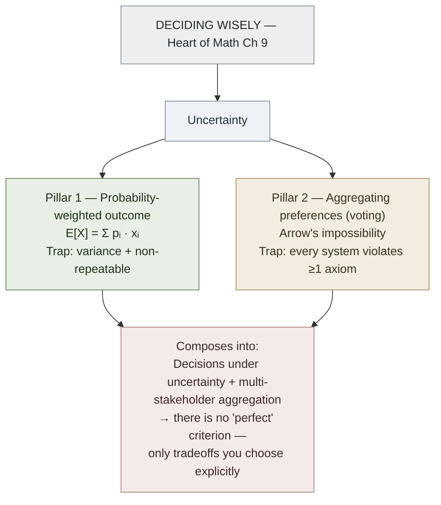

# Expected Value and Arrow's Impossibility Theorem

**Summary**: Two pillars of decision theory from Burger and Starbird's [*Heart of Mathematics*](./burger-heart-of-mathematics.md) Ch 9 ("Deciding Wisely"). **Expected value** (§9.1, pp. 839–854) — the probability-weighted average of outcomes — is the canonical rational-actor decision criterion under uncertainty and the upstream primitive for risk · insurance · investing · lottery analysis. **Arrow's impossibility theorem** (§9.4, pp. 893–911) — Kenneth Arrow's 1951 result that **no ranked-voting system can simultaneously satisfy 5 obviously-reasonable axioms** — is the canonical "you can't have everything" result in social choice theory. The two concepts compose into Burger's broader thesis: *decisions under uncertainty are not just probability problems and not just preference problems; they sit at the intersection of math, economics, ethics, and design*. Wiki-relevance: load-bearing for money-canon-synthesis (expected value) and the governance / decision layer (Arrow).

**Sources**: [burger-heart-of-mathematics](./burger-heart-of-mathematics.md) §9.1 ("Great Expectations — Deciding How to Weigh the Unknown Future") and §9.4 ("Peril at the Polls — Deciding Who Actually Wins an Election"); Arrow 1951 *Social Choice and Individual Values* (Yale doctoral thesis).

**Last updated**: 2026-05-27 — created during the Burger ingest.

---

## Expected value (Heart of Math §9.1)

**Definition**: for a random variable X with outcomes x₁, x₂, ..., xₙ occurring with probabilities p₁, p₂, ..., pₙ (where Σpᵢ = 1), the expected value is

```
   E[X] = p₁·x₁ + p₂·x₂ + ... + pₙ·xₙ = Σᵢ pᵢ · xᵢ
```

**The Burger framing** (pp. 840–845): expected value is *what you would gain or lose on average per trial* if you could repeat the bet infinitely many times. For a single trial, the actual outcome can be very different from E[X] — but E[X] is the long-run rational decision criterion when **(a)** trials can be repeated, **(b)** outcomes are utility-equivalent to their dollar values, and **(c)** the variance is acceptable.

**Burger's canonical examples** (pp. 845–854):

- **Roulette**: 38 slots (1–36 + 0 + 00). Bet $1 on red. 18 red, 18 black, 2 green. Win = +$1 with probability 18/38; lose = −$1 with probability 20/38. E[X] = (18/38)(1) + (20/38)(−1) = −$2/38 ≈ **−$0.0526**. Every $1 bet on red loses ~5¢ on average.
- **State lottery**: $1 ticket; jackpot $10 million; odds 1 in 14 million. E[X] = (1/14M)(10M − 1) + (13.999.../14M)(−1) ≈ **−$0.29** per ticket. You lose ~29¢ per dollar wagered, even ignoring tax.
- **Life insurance** (the inverse): the *expected-value* calculation favors the insurer; the *utility-value* calculation favors the family. Insurance is rational because the disutility of catastrophic loss outweighs the small negative E[X].
- **Compound interest with positive expected return**: $1,000 at 5% annually for 40 years grows to $1,000 · 1.05⁴⁰ ≈ $7,040. Time + compounding turns a tiny positive E[X] into a substantial expected return (Heart of Math §9.3).

**The expected-value trap** (Burger's pp. 849–854): E[X] is the right criterion only when (a) the trial is repeatable enough to converge to the mean and (b) you can survive bad runs. *"E[X] = +$1 per coin flip but you have $10 and the variance kills you in 12 flips"* is the canonical failure mode — and the philosophical content of risk-aversion, the kelly-criterion (if exists / candidate page), and Taleb's "black swan" canon.

---

## Arrow's Impossibility Theorem (Heart of Math §9.4)

**The setup**: a group of voters has individual rank-orderings of ≥3 candidates. We want a *social welfare function* that takes these individual rankings and produces a single group ranking.

**Arrow's 5 axioms** (Burger's framing, pp. 898–905):

1. **Unrestricted domain** — the function must accept *any* possible set of individual rankings as input
2. **Pareto efficiency (unanimity)** — if every voter prefers A to B, the group ranking prefers A to B
3. **Independence of irrelevant alternatives (IIA)** — the group ranking of A vs B depends only on individual rankings of A vs B (not on rankings of any third option C)
4. **Non-dictatorship** — no single voter's preferences automatically become the group ranking, regardless of how others vote
5. **Transitivity** — if the group ranks A > B and B > C, then it ranks A > C

**Arrow's theorem (1951)**: there is **no** social welfare function for ≥3 candidates that satisfies all 5 axioms simultaneously.

**The proof structure** (sketched in Heart of Math pp. 905–909): Arrow constructed a sequence of voter-by-voter argument steps showing that any rule satisfying axioms 1, 2, 3, 5 must concentrate decisive power in a single voter — violating axiom 4. Conversely, the only rule satisfying 1, 2, 3, 5 is a dictatorship.

**The Condorcet paradox** as the simplest illustration (Heart of Math pp. 894–897):

| Voter | 1st choice | 2nd | 3rd |
|---|---|---|---|
| Group A (33%) | X | Y | Z |
| Group B (33%) | Y | Z | X |
| Group C (33%) | Z | X | Y |

- Majority prefers X to Y (Groups A + C)
- Majority prefers Y to Z (Groups A + B)
- Majority prefers Z to X (Groups B + C)

The "group preference" is intransitive — there is no Condorcet winner. Any voting rule must produce *some* output here, which means it must abandon one of the axioms.

**Real-world consequences**: every voting system in actual use violates at least one axiom — usually IIA. Plurality, instant-runoff (IRV), Borda count, approval voting, single-transferable-vote (STV), Condorcet methods — all are partial workarounds for the underlying impossibility. **There is no "best" voting system** in the absolute sense; only systems with different tradeoffs.

---

## Why the wiki cares

**Expected value as money-canon spine** (money-canon-synthesis): EV is the upstream primitive for risk-treatment (cissp-risk-treatment-quadrant Mitigate/Transfer math), insurance, investing (Sharpe ratio, mean-variance optimization), gambling (Kelly criterion), and the wiki's *"E[X] without survivability check is a trap"* rule.

**Arrow as governance limit** (candidate arrow-impossibility-theorem for promotion): the wiki currently has RAP for emotional-bandwidth governance and meadows-12-leverage-points for systems intervention, but lacks an explicit social-choice / voting-design layer. Arrow's theorem is the canonical "no perfect aggregation" result the wiki should cite when discussing any group-decision problem.

**Cross-domain unlocks**:
- **[ORACLE](./oracle-overview.md) encoder**: probability prediction + expected-value scoring is ORACLE's *Distributional* slot
- **[METER](./meter-overview.md)**: every probabilistic METER event implicitly carries an E[X] — explicit registration makes thresholds / floor-violations EV-justifiable
- **[crux-recognition-gym](./crux-recognition-gym.md)** Tool-level: "EV sign?" (is this bet +EV or −EV?) is a ≤4-s recognition target. The wiki's prior Money pages reference EV without an owner page.
- **[problem-solving-three-levels](./problem-solving-three-levels.md) Zeitz**: Arrow's theorem is a Strategy-level result with a constructive Tactic (case-analysis on which axiom to relax).

**Burger's broader pedagogy**: §9.1 + §9.4 both demonstrate *"you can compute the rational decision criterion, but you must also know its limits."* This is the [memory-paradox](./memory-paradox.md) applied to decision theory.

---

## METER integration

| Event | Operational form | Pass floor |
|---|---|---|
| `ev_sign_recognition` | Given a bet description, recognize whether E[X] is positive, negative, or zero | ≤4 s; ≥85% accuracy |
| `ev_compute_simple` | Compute E[X] for a 2-outcome bet from cold | ≤30 s; ≥90% accuracy |
| `ev_survivability_audit` | When EV is positive, check whether variance could ruin you before mean recovers | binary; required-gate before any +EV strategy |
| `arrow_axiom_named` | Given a voting system, name which axiom it violates | ≤10 s; ≥70% accuracy |
| `condorcet_paradox_detection` | Recognize cyclical group-preferences in raw vote data | ≤15 s |

---

## Visual — EV and Arrow as decision-theory pillars



The Condorcet paradox table renders as a 3×3 voter-preference cycle showing X → Y → Z → X majority preferences. The expected-value computation renders as a 1-line probability-times-outcome sum.

---

## Mnemonic — *"Sum the gains; some games no game"*

Two half-lines:
- *"Sum the gains"* = E[X] = Σ pᵢ·xᵢ (expected value)
- *"Some games no game"* = no voting system satisfies all 5 axioms (Arrow)

Together they encode the chapter: compute when you can; admit limits when you must.

For Arrow's 5 axioms: *"Unrestricted, Pareto, Independence, Non-dictator, Transitive"* — UPINT (or pronounce as "you paint"). The line: *"you paint the picture; no rule paints it perfectly."*

---

## Memory Checksum

Numbered inventory (recite in ≤25 s):

1. **Expected value formula**: E[X] = Σᵢ pᵢ · xᵢ
2. **Burger canonical −EV examples**: roulette (−$0.0526/$1) · state lottery (−$0.29/$1)
3. **Burger canonical +EV trap**: $1000 at 5% × 40 yr → $7,040 *if* you survive bad years
4. **EV-survivability rule**: +EV is necessary but not sufficient; variance can ruin before mean recovers
5. **Arrow's 5 axioms**: Unrestricted-domain · Pareto · IIA · Non-dictator · Transitive
6. **Arrow's theorem (1951)**: no social welfare function satisfies all 5 with ≥3 candidates
7. **Condorcet paradox**: simplest 3-voter 3-candidate cycle violating transitivity
8. **Real-world consequence**: every voting system violates ≥1 axiom — usually IIA

**Counts**: 1 formula · 3 named examples · 5 axioms · 1 impossibility · 1 paradox · 1 consequence.

**Recite floor**: ≤25 s for full inventory; ≤4 s for EV-sign recognition; ≤10 s for Arrow-axiom-violated identification.

---

## Related pages

- [burger-heart-of-mathematics](./burger-heart-of-mathematics.md) — Ch 9.1 and Ch 9.4 source
- [pigeonhole-principle](./pigeonhole-principle.md) · [fibonacci-and-golden-ratio](./fibonacci-and-golden-ratio.md) · [cantor-infinities-and-power-set](./cantor-infinities-and-power-set.md) · [penrose-tilings-and-platonic-solids](./penrose-tilings-and-platonic-solids.md) · sibling Heart-of-Math concepts
- money-canon-synthesis · intelligent-investor · little-book-common-sense-investing — money-canon pages that operationalize EV
- cissp-risk-treatment-quadrant — risk = EV under uncertainty + survivability
- [oracle-overview](./oracle-overview.md) — ORACLE prediction encoder uses EV
- [crux-recognition-gym](./crux-recognition-gym.md) · [problem-solving-three-levels](./problem-solving-three-levels.md) — EV-sign + Arrow-axiom-named as recognition targets
- [meter-overview](./meter-overview.md) — every probabilistic METER event carries an implicit EV
- [memory-paradox](./memory-paradox.md) · meadows-12-leverage-points — Arrow's "no perfect rule" sister pattern
- relational-allocation-protocol — RAP is bandwidth-governance; Arrow names its analog at the voting layer
