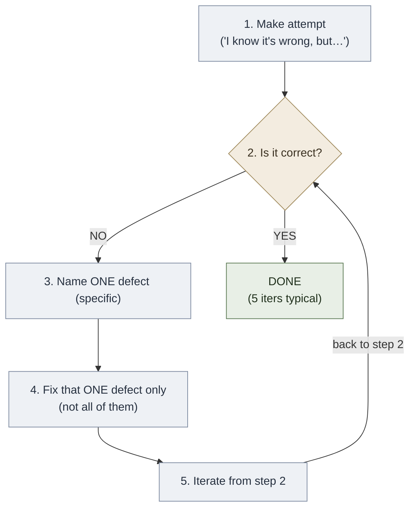

# Fire — Fail to Succeed (Burger Habit 2)

**Summary**: Burger and Starbird's second habit of effective thinking ([*The 5 Elements of Effective Thinking*](./burger-5-elements-effective-thinking.md) 2012, Ch 2). Mistakes are not signs of weakness — they are *the* mechanism by which understanding advances. Three sub-moves: (1) welcome accidental missteps · (2) find the right question to the wrong answer · (3) fail by intent. The canonical narrative is "Mary's loop" — an iterative defect-finding protocol structurally identical to the wiki's [crux-recognition-gym](./crux-recognition-gym.md) drills. Names overlap with [automaticity-and-reflex-training](./automaticity-and-reflex-training.md)'s Fire=Generative skill-type — they are not the same (see [five-elements-mapping-reconciliation](./five-elements-mapping-reconciliation.md)).

**Sources**: [burger-5-elements-effective-thinking](./burger-5-elements-effective-thinking.md) Ch 2 (pp. 47–72); Edison and Beckett citations; companion enactment throughout [burger-heart-of-mathematics](./burger-heart-of-mathematics.md).

**Last updated**: 2026-05-27 — created during the Burger ingest.

---

## The three sub-moves

### 1. Welcome accidental missteps — let your errors be your guide

> *"I have not failed. I've just found 10,000 ways that won't work."* — Thomas Edison (cited Burger & Starbird p. 57)
>
> *"Ever tried. Ever failed. No matter. Try again. Fail again. Fail better."* — Samuel Beckett (cited p. 64)

The Microsoft origin story (pp. 47–48): three young guys in the 1970s (one a college dropout) founded **Traf-O-Data** to analyze automobile traffic data from pneumatic road tube counters. It failed. They closed the business with just a few thousand dollars in revenue. But they had gained considerable insights into computing machines. Two of those founders — Paul Allen and Bill Gates — took those insights into the next venture: **Microsoft**.

**Mary's loop** (pp. 51–55) — the canonical narrative for the wiki's [crux-recognition-gym](./crux-recognition-gym.md) protocol:

Mary was a first-year art and literature student forced into an Honors math class she hated. During a discussion about *infinity* (a topic Starbird explicitly told the class was beyond their abilities), he cold-called Mary. She protested: *"I don't want to say it, because I know it's wrong."* Starbird replied: *"I'm sure it's wrong, but I still want to hear it."*

Mary gave her attempt. Starbird wrote it on the blackboard. *"You're right — your solution is wrong! But Mary, tell me just one thing that is wrong with your answer."* She named one defect quickly. *"Great! Now how can you expand your incomplete solution to remove that specific defect?"* She offered a modification. *"Great! Is this solution correct?"* — *"No."* — *"Great! Tell me just one thing that is wrong now."* — and so on.

After **5 iterations** of find-defect → fix → find-next-defect, Mary said: *"Yes, it is correct."* And it was — and her solution was *creatively different from the standard answer in the textbook the instructors had authored*. Starbird's entire contribution was a 5-step protocol: ask for a guess · ask if it's correct · ask for one specific defect · ask her to fix that flaw · repeat. Mary could have run this herself.

As class ended, Mary told Starbird her mind was reeling. She had an essay due in English she was stuck on. Now she knew what to do: *"sit down and write a really bad draft and then look for problems and fix them. There was a specific action she could definitely take. She could make a mistake. She felt liberated."*

### 2. Find the right question to the wrong answer

> *"A man's errors are his portals of discovery."* — James Joyce (cited p. 56)

The Post-it Note origin story (pp. 64–65): in 1970, 3M scientist Spencer Silver was working to create a stronger adhesive. He failed — his creation was *weaker* than competing 3M products: it could be stuck to objects and then easily lifted off without a trace. 3M did not fire him. Four years later, 3M scientist Arthur Fry was trying to devise a bookmark for his hymnal that wouldn't fall out and wouldn't damage the pages. He recalled Silver's superweak adhesive. The Post-it Note was born.

Operational form: when an attempt fails, ask *"what is the question to which this attempt is a correct answer?"* — sometimes your bad solution to problem X is an imaginative answer to problem Y you hadn't even posed.

### 3. Failing by intent

The Eiffel-Tower geometry teacher (pp. 66–67): a middle school teacher was asked how she would teach geometry with no constraints. She said she would fly her class to the Eiffel Tower and measure its height using angles to illustrate similar triangles. The Paris trip is impossible — but the *deliberate impractical exaggeration* led to the practical epiphany: *leave the classroom*. Take students outside so they realize mathematics is about the world around them, not just textbook confines.

The tavern-puzzle pretend-it's-rubber technique (p. 67): to disentangle a metal-piece tavern puzzle, pretend the pieces are completely elastic. Solve the easy rubber version of the puzzle. Translate the rubber-version steps back into rigid-piece steps.

Operational form: deliberately exaggerate features to ridiculous extremes — political positions, character traits, business models, organizational structures, religious arguments. The exaggeration exposes hidden assumptions. Stress-test as deliberate failure.

---

## "Fail nine times" protocol (Burger & Starbird's signature action item, p. 49)

When facing a daunting challenge, think: *"In order for me to resolve this issue, I will have to fail nine times, but on the tenth attempt, I will be successful."* After the first failure: *"Terrific, I'm 10% done!"* — not *"what a frustrating waste of time."*

In their own classes, Burger and Starbird grade **5% of students' course grades on quality of failure**. Students who do not fail productively cannot earn an A.

---

## Where Fire fits in the wiki

| Wiki page | How Fire shows up |
|---|---|
| [crux-recognition-gym](./crux-recognition-gym.md) | Mary's loop = canonical 60-s per-puzzle defect-recognition drill in narrative form |
| [ants-and-lies-of-learning](./ants-and-lies-of-learning.md) | Edison "10,000 ways" and Beckett "fail better" sit alongside the [Maltz Cancel!](./failure-mechanism.md) pattern and Burns/Beck distortions |
| [livingstone-thomson-brain-teasers](./livingstone-thomson-brain-teasers.md) | The "find the right question to the wrong answer" reframe complements the lateral-thinking trap-class taxonomy |
| [anti-tactic-detection](./anti-tactic-detection.md) | Burger's "find one defect" is the per-iteration tightening of the anti-tactic scan |
| [ok-plateau](./ok-plateau.md) | Foer-metronome 10-20% past comfort = "Failing by intent" stress-test pattern |
| [red-queen-skill-gym](./red-queen-skill-gym.md) | Lamp/Scale/Sword phases all depend on graded-failure as the load signal |
| [fail-to-succeed-habit](./fail-to-succeed-habit.md) | this page |

---

## METER integration

| Event | Operational form | Pass floor |
|---|---|---|
| `intentional_failure_sessions/week` | Sessions where the explicit goal is to *try and fail* on something stretching | ≥3/week |
| `useful_to_wasted_failure_ratio` | Of failures, how many produced a specific actionable insight | ratio ≥2:1 |
| `marys_loop_iterations_to_correct` | Number of defect-find→fix iterations before the solution clears all defects | tracked; target 3–8 per crux |
| `right_question_to_wrong_answer_finds/month` | How often a failed attempt resolved as the correct answer to a *different* question | ≥1/month (stretch) |

---

## Visual — Mary's loop as a 5-state cycle

*The mechanism: each iteration reduces uncertainty about WHAT'S WRONG by one named defect. After ~5 iterations, all defects have been named and fixed. The student discovers a creatively different solution from the textbook's because the defect-trail forces an original path through the solution space.*

---

## Mnemonic — *"Welcome · Right-Q · Fail-Intent"*

W-R-F = the three sub-moves in book order.

- **Welcome** = welcome accidental missteps (Edison, Beckett, Mary)
- **Right-Q** = find the right question to the wrong answer (Post-it Note)
- **Fail-Intent** = fail by intent (Eiffel Tower geometry · rubber tavern puzzle)

The line: *"Welcome the right question; fail with intent."*

---

## Memory Checksum

Numbered inventory (recite in ≤20 s):

1. **Sub-move 1**: Welcome accidental missteps (stories: Microsoft from Traf-O-Data · Mary's loop · Articles of Confederation → Constitution)
2. **Sub-move 2**: Find the right question to the wrong answer (story: Post-it Note from Silver's failed adhesive)
3. **Sub-move 3**: Fail by intent (stories: Eiffel Tower geometry teacher · rubber tavern puzzle · 3M-hires-hackers stress test)
4. **Fail-nine-times protocol**: ten attempts = nine failures + one success; reframe "10% done" after first miss
5. **Burger/Starbird's 5% quality-of-failure grade**: failure productivity is *graded* in their classes

**Counts**: 3 sub-moves · 7 named stories · 1 fail-nine-times protocol · 2 canonical quotes (Edison · Beckett).

**Recite floor**: ≤20 s for the 3 sub-moves; ≤90 s with named stories.

---

## Related pages

- [burger-5-elements-effective-thinking](./burger-5-elements-effective-thinking.md) — parent ingest summary
- [five-elements-mapping-reconciliation](./five-elements-mapping-reconciliation.md) — collision page (Fire-habit ≠ Fire-skill-type)
- [understand-deeply-habit](./understand-deeply-habit.md) · [socratic-question-generation](./socratic-question-generation.md) · [flow-of-ideas-habit](./flow-of-ideas-habit.md) · [transformative-change-habit](./transformative-change-habit.md) — sibling habits
- [crux-recognition-gym](./crux-recognition-gym.md) — Mary's loop = canonical narrative form
- [ants-and-lies-of-learning](./ants-and-lies-of-learning.md) — Edison/Beckett companion to Maltz Cancel! and Burns/Beck distortions
- [failure-mechanism](./failure-mechanism.md) — Maltz's identity-layer twin of Fire-habit
- [livingstone-thomson-brain-teasers](./livingstone-thomson-brain-teasers.md) · [anti-tactic-detection](./anti-tactic-detection.md) — fail-by-intent applied to lateral-thinking puzzles
- [ok-plateau](./ok-plateau.md) — Foer-metronome is "fail by intent" at the reflex layer
