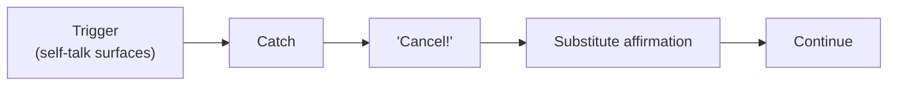

# Failure Mechanism — the F·A·I·L·U·R·E. Signals

**Summary**: Maltz's 7-letter diagnostic for the Automatic Failure Mechanism — the *same servomechanism* as the [ASM](./automatic-success-mechanism.md) running in reverse-mode, pursuing failure as faithfully as the ASM pursues success. The mnemonic is built into the word: **F**rustration · **A**ggressiveness (misdirected) · **I**nsecurity · **L**oneliness · **U**ncertainty · **R**esentment · **E**mptiness. Each letter is a *negative-feedback signal* — the system telling you it's mis-aimed. Operationally critical because they are the **early-warning lights** of an upcoming [snap-back](./snap-back-effect.md). Bolts onto [PULSE](./pulse-overview.md) as a Stress-side detection layer. Canonical source: [psycho-cybernetics-maltz](./psycho-cybernetics-maltz.md) Ch 9.

**Sources**:
- `Clippings/Books/Learning/The New Psycho-Cybernetics by Maxwell Maltz-no-password.pdf` (Maltz 1960 / Kennedy 2001) Ch 9
- [psycho-cybernetics-maltz](./psycho-cybernetics-maltz.md) — source-summary

**Last updated**: 2026-05-24 (initial ingest)

---

## The 7 signals

(source: pscyho-cybernetics-book-maxwell-maltz.pdf Ch 9, "How to Avoid Accidentally Activating Your Automatic Failure Mechanism")

| Letter | Signal | What it tells you the servo is doing |
|---|---|---|
| **F** | **F**rustration (hopelessness, futility) | Action pursues an unattainable or mis-conceived target |
| **A** | **A**ggressiveness (misdirected) | Action directs energy away from goal, toward side-targets (others, self) |
| **I** | **I**nsecurity | Self-image rejecting the work-order; ASM withholding authorisation |
| **L** | **L**oneliness (lack of "oneness") | Charity-trait failure; the field the ASM operates in is hostile |
| **U** | **U**ncertainty | Decision-paralysis; AIM letter of operating cycle missing |
| **R** | **R**esentment | Externalised responsibility; ASM cannot run if you are not the agent |
| **E** | **E**mptiness | No live target; the system has been idling too long without purpose |

The word *spells itself* as the mnemonic, mirroring [S·U·C·C·E·S·S.](./success-personality.md).

---

## The dual diagnostic

S·U·C·C·E·S·S. and F·A·I·L·U·R·E. are **paired diagnostics** for the same servomechanism in opposite modes:

| If you see… | Read as… |
|---|---|
| **S**ense of direction firing | Forward-mode |
| **U**nderstanding firing | Forward-mode |
| **C**ourage firing | Forward-mode |
| **C**harity firing | Forward-mode |
| **E**steem firing | Forward-mode |
| **S**elf-confidence firing | Forward-mode |
| **S**elf-acceptance firing | Forward-mode |
| **F**rustration firing | Reverse-mode (target mis-conceived) |
| **A**ggressiveness misdirected firing | Reverse-mode (energy diverted from goal) |
| **I**nsecurity firing | Reverse-mode (work-order rejected) |
| **L**oneliness firing | Reverse-mode (hostile field) |
| **U**ncertainty firing | Reverse-mode (no target) |
| **R**esentment firing | Reverse-mode (no agency) |
| **E**mptiness firing | Reverse-mode (no purpose) |

Either side is firing at any time. The discipline is to **scan all 14** and let the dominant signal name the mode.

---

## Per-signal operational definitions

### Frustration (hopelessness, futility)

(source: pscyho-cybernetics-book-maxwell-maltz.pdf Ch 9, "Frustration")

Frustration is the emotional feeling that develops when goal-pursuit is blocked. *Some* frustration is the normal output of negative feedback — useful information that the current approach is off-course.

**Pathological frustration**: chronic, unrelieved, treated as failure-of-self rather than failure-of-method. This is the [ASM](./automatic-success-mechanism.md)'s reverse-mode signal. The fix is not to push harder but to **re-conceive the target** (AIM letter) — frustration usually means you've aimed at the wrong thing.

> "Frustration without becoming upset about it." Maltz wants you to *acknowledge* frustration without letting it crash you into failure-mode.

### Aggressiveness (misdirected)

(source: pscyho-cybernetics-book-maxwell-maltz.pdf Ch 9, "Aggressiveness", "Don't Lash Out Blindly")

Aggression toward an attainable goal is normal — energy directed at a target. *Misdirected* aggression is the failure-signal: ulcers, high blood pressure, irritability, rudeness, gossip, nagging, fault-finding, compulsive overwork, sometimes violence. The energy is there; it's been redirected away from the goal because the goal pursuit is blocked.

> "The Automatic Failure Mechanism does not direct aggressiveness toward the accomplishment of a worthwhile goal. Instead it is used in such self-destructive channels…" (source: pscyho-cybernetics-book-maxwell-maltz.pdf Ch 9)

The fix: re-route the energy to a goal it can actually serve. Misdirected aggression is fuel; redirect it.

### Insecurity

(source: pscyho-cybernetics-book-maxwell-maltz.pdf Ch 9, "Insecurity")

Insecurity is the [self-image](./self-image.md) withholding authorisation for the work-order. The actor knows the action; the self-image won't allow them to be the one to do it.

> "His self-image was that of an unworthy, incompetent, inferior person who had no right to succeed or to enjoy the better things in life, and unwittingly he tried to be true to that role." (source: pscyho-cybernetics-book-maxwell-maltz.pdf Ch 9)

The fix: [self-image](./self-image.md) audit + [theater-of-the-mind](./theater-of-the-mind.md) cycle on the substitute identity. Drilling without this just produces longer-running insecurity.

### Loneliness (lack of "oneness")

(source: pscyho-cybernetics-book-maxwell-maltz.pdf Ch 9, "Loneliness")

Maltz's distinct framing: not the everyday loneliness of being temporarily alone, but the *extreme and chronic* feeling of being cut off and alienated from others. This is the Charity-trait failure ([success-personality](./success-personality.md) §Charity) — when the field the ASM operates in becomes hostile, performance collapses.

The fix: small daily acts of connection regardless of return — the unilateral Charity protocol from [success-personality](./success-personality.md) §Charity. Restores the field without requiring reciprocity.

### Uncertainty

(source: pscyho-cybernetics-book-maxwell-maltz.pdf Ch 9, "Uncertainty")

> "Uncertainty is a way of avoiding mistakes and responsibility. It is based on the fallacious premise that if no decision is made, nothing can go wrong. Being wrong holds untold horrors to the person who tries to conceive of himself as perfect." (source: pscyho-cybernetics-book-maxwell-maltz.pdf Ch 9)

Uncertainty is the AIM letter missing from the operating cycle. Without a target, the ASM idles, and the actor experiences this as decision-paralysis. The fix: pick a target *imperfectly*, run it, correct via negative feedback. Imperfect movement beats perfect stillness.

### Resentment

(source: pscyho-cybernetics-book-maxwell-maltz.pdf Ch 9, "Resentment")

> "Resentment doesn't fit into this picture, and because it doesn't it is a failure mechanism… In creative goal-striving you are the creator, not the passive recipient. You set your goals. No one owes you anything." (source: pscyho-cybernetics-book-maxwell-maltz.pdf Ch 9)

Resentment is externalised responsibility — the actor positioned as victim-of-injustice rather than agent-of-pursuit. The ASM cannot run reverse-engineered to "the world owes me X" because no servo can steer toward what others should do. The fix: take back authorship of the goal, recover agency, drop the case against the world.

### Emptiness

(source: pscyho-cybernetics-book-maxwell-maltz.pdf Ch 9, "Emptiness")

Emptiness is the system's signal that no live target is being supplied. The ASM has been idling too long. Common in transitions (post-promotion, post-graduation, post-retirement), in goal-completion without immediate replacement, in chronic [self-image](./self-image.md) mismatch.

The fix: supply a new live target — even a small one — and let the ASM begin to run again. Emptiness lifts when the system has work to do.

---

## The scan — when to run it

The F·A·I·L·U·R·E. scan triggers on any of:

1. **[PULSE](./pulse-overview.md) Stress reading S≥4** — the automated trigger; PULSE adds the scan as a Stress-side detector
2. **Three+ failed pass-floor attempts in one session** — the gym signal
3. **Subjective sense of "off" without specific cause** — the somatic signal
4. **Snap-back fired** — the post-mortem on the snap-back
5. **End-of-week review** — the scheduled scan

**Scan protocol** (target <60 seconds, per METER pass-floor):

1. Quiet sit, eyes closed.
2. Recite the 7 letters: F · A · I · L · U · R · E.
3. For each letter, ask: "is this firing for me right now?" Mark yes / no.
4. The yes-marks identify the failure-mode signature.
5. Match signature to fix (see operational definitions above).
6. Log the scan: which letters fired, which fix is being applied.

---

## Cancel! — the pattern-interrupt

(source: pscyho-cybernetics-book-maxwell-maltz.pdf Ch 4, also Ch 7 — "Cancel!" technique)

When self-talk surfaces a F·A·I·L·U·R·E.-signal narrative — "I'm a failure / nobody likes me / nothing ever works for me / they all owe me" — the immediate move is to yell `Cancel!` internally and substitute the constructive affirmation.

This is a pattern-interrupt, not denial. The narrative is acknowledged and *interrupted* before it imprints further. Repetition under self-as-authoritative-source ([self-image](./self-image.md) §three levers) over weeks weakens the original imprint.

**Pass-floor**: log ≥1 Cancel! event per day during identity-change phase.

---

## Where this bolts onto [PULSE](./pulse-overview.md)

[PULSE](./pulse-overview.md) reads Energy and Stress and modulates which level the user is allowed to attempt. This page adds: under Stress ≥4, run the F·A·I·L·U·R·E. scan as a Stress-side detector. The scan identifies *which* failure-mode is firing; PULSE then chooses the matching modulation (defer pressure-drills, switch to blocked single-mode, run a Theater session, take a recovery break).

This composes [PULSE](./pulse-overview.md)'s state-aware governance with [Maltz](./psycho-cybernetics-maltz.md)'s identity-layer diagnostic. The Stress reading alone says *something is wrong*; the F·A·I·L·U·R·E. scan says *what*.

---

## What this page is **not**

1. **Not a depression checklist.** F·A·I·L·U·R·E. signals can co-occur with clinical depression but are not equivalent. Persistent multi-letter scans, especially Emptiness + Loneliness + Resentment, should route to professional support, not Theater sessions alone.
2. **Not a moralising frame.** The signals are *operational data*, not character judgements. Resentment firing doesn't mean you're a bad person; it means the ASM is mis-routed.
3. **Not the failure-mode itself.** The signals are how the failure-mode *announces itself*. The mode is the [ASM](./automatic-success-mechanism.md) running in reverse; the signals are the warning lights.
4. **Not stable traits.** Any letter can fire and then resolve within hours. They are state-readings, not personality classifications.

---

## Failure modes

1. **Treating signals as personality** — "I am a frustrated person" rather than "frustration is firing." The latter is operational, the former is identity-imprinting.
2. **Skipping the scan when "I know what's wrong"** — the actor's first-guess is often a single letter; the scan reveals multiple co-firing letters whose combination is the actual signature.
3. **Cancel! without substitute** — interrupting the narrative but not replacing it. The next firing returns easily because nothing fills the space.
4. **Drilling through F·A·I·L·U·R·E. signals firing** — the corrective loop will not run under reverse-mode. Restore forward-mode (via fix appropriate to the signature) before continuing drills.
5. **Heroic suppression** — ignoring signals to "push through." Maltz: this trains *fossilized failure* (the identity-level analog of fossilized errors in the reflex layer).

---

## Mnemonic and checksum

**Mnemonic**: a row of seven red warning-lights on the brass control panel of the Velvet-Aeon temple — labelled **FAILURE** in order — each light dim by default; when one or more lights up, the [missile](./automatic-success-mechanism.md) is mis-aimed and the failure-mechanism is running. The scan technician (you) walks the panel slowly, names which lights are lit, applies the matching fix.

**Checksum**: (a) recite the 7 letters in order under 6 s; (b) name which letter (if any) is firing right now and the matching fix; (c) name one Cancel! event from the last 24 hours, with the narrative caught and the substitute used. If all three answer cleanly, the scan is operational.

---

## Related pages

- [psycho-cybernetics-maltz](./psycho-cybernetics-maltz.md) — source-summary
- [success-personality](./success-personality.md) — the diagnostic pair; S·U·C·C·E·S·S. traits in absence are F·A·I·L·U·R·E. signals
- [automatic-success-mechanism](./automatic-success-mechanism.md) — the same servo, opposite mode
- [self-image](./self-image.md) — what the signals report on; what gets fixed
- [theater-of-the-mind](./theater-of-the-mind.md) — the protocol that restores forward-mode
- [snap-back-effect](./snap-back-effect.md) — F·A·I·L·U·R·E. signals precede most snap-backs
- [pulse-overview](./pulse-overview.md) — the state-aware layer that schedules the scan
- [failure-modes-in-encoding](./failure-modes-in-encoding.md) — reflex-layer analog (fossilized errors) of identity-layer analog (fossilized failure)
- [winning-feeling](./winning-feeling.md) — the somatic opposite; recall it as part of the fix
- [grace-overview](./grace-overview.md) — Loneliness signal's fix uses unilateral Charity protocol

---

## U — See (CAST)

1. F·A·I·L·U·R·E. = 7-letter diagnostic of ASM reverse-mode
2. Edges: each letter → corresponding ASM failure → matching fix
3. Paired diagnostic with S·U·C·C·E·S·S.

## D — Name (NEDF)

1. FAILURE signals = warning lights of Automatic Failure Mechanism
2. Mnemonic = the word itself
3. Operational data, not personality

## F — Do (SPEAR)

1. Trigger detected (Stress≥4 / 3+ failed pass-floors / "off" feeling / snap-back / weekly review)
2. Scan 7 letters in <60 s
3. Identify signature (which letters firing)
4. Apply matching fix per operational definitions
5. Log scan + fix

## B — Watch (HEART)

1. Treating signals as personality
2. Skipping scan when you "know what's wrong"
3. Cancel! without substitute
4. Drilling through reverse-mode signals
5. Heroic suppression (trains fossilized failure)

## L — Predict (ORACLE)

1. Stress ≥4 → expect ≥1 letter firing
2. Multiple letters firing → snap-back probability rises
3. Persistent Emptiness + Loneliness + Resentment → route to professional support, not Theater alone

## R — Act (GRACE)

1. Scan trigger fires → 60-second scan
2. Letter identified → matching fix applied
3. Cancel! event → log it; substitute used
4. Snap-back post-mortem → scan first, then route to Theater
