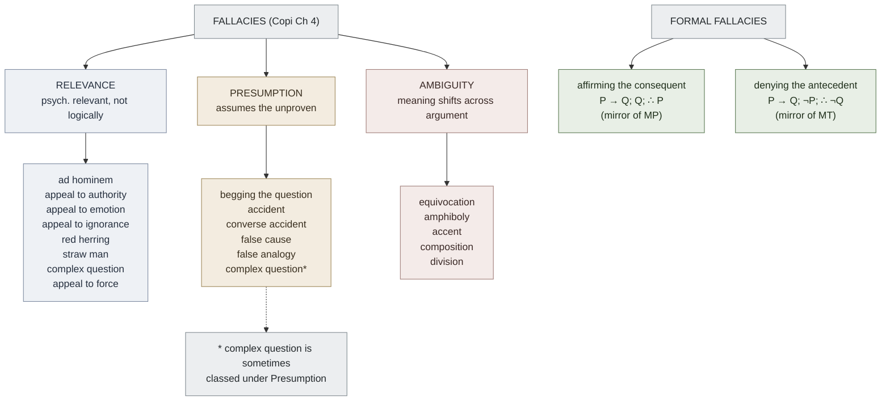

# Fallacy Taxonomy

**Summary**: Copi's three-family taxonomy of informal fallacies — **Relevance · Presumption · Ambiguity** — plus the two canonical *formal* fallacies that mirror [Modus Ponens](./per-rule-modus-ponens.md) and [Modus Tollens](./per-rule-modus-tollens.md) (*affirming the consequent · denying the antecedent*). The Molecule-tier concept page in [logic-atomic-design](./logic-atomic-design.md). **Drilled as the Fallacy-Recognition Gym** — the 3rd registered instance of the [recognition-gym candidate-pattern](./composability-index.md) after construct-recognition-gym (code patterns) and [crux-recognition-gym](./crux-recognition-gym.md) (puzzle crux). N=3 triggers promotion of the candidate-pattern to owner-page status per the composability-index promotion rule.

**Sources**:
- [Copi/Cohen/McMahon *Introduction to Logic* 14th ed](./copi-introduction-to-logic.md), Ch 4 *Fallacies* — the canonical three-family taxonomy.
- [anti-tactic-detection](./anti-tactic-detection.md) — sister page; the *puzzle-domain* anti-pattern detector. Fallacy taxonomy is the general superset.
- [red-herring-resistance](./red-herring-resistance.md) — Tool-level page; *red herring* is one specific fallacy of relevance and gets its own METER metric.
- [lateral-thinking-puzzles](./lateral-thinking-puzzles.md) — Tool-level page; the 7 trap classes are puzzle-instances of fallacy structures.

**Last updated**: 2026-08-31

---

## One-line

> A **fallacy** is an argument that *appears* to support its conclusion but does not. Copi sorts ~25 named fallacies into three families: **Relevance** (premises don't bear on conclusion), **Presumption** (premises assume what's to be proven, or smuggle in unwarranted leaps), **Ambiguity** (the argument's apparent validity depends on a meaning shift). Plus two formal fallacies that mirror the valid forms.

## Unlocks (lead, not footer)

1. **Fallacy-Recognition Gym — promotes the candidate-pattern N=2 → N=3.** [composability-index](./composability-index.md)'s recognition-gym candidate-pattern (a Red Queen Gym instance that drills recognition-of-which-pattern-applies under a tight time budget) was at 2 instances (construct-recognition-gym for code; [crux-recognition-gym](./crux-recognition-gym.md) for puzzles). Fallacy-recognition is the third — **triggering the pattern's promotion to its own owner page** per the composability-index N=3 rule. METER: given an English argument, name the fallacy in <60 s with ≥70% accuracy.

2. **Fallacy taxonomy is the general superset of [anti-tactic-detection](./anti-tactic-detection.md) and [lateral-thinking-puzzles](./lateral-thinking-puzzles.md)' 7 trap classes.** The puzzle-specific anti-patterns the wiki already drills (embellishment-to-arithmetic ratio · too-clean obvious answer · genre-aware framing · the 7 lateral trap classes) are *puzzle-domain instances* of Copi's general taxonomy. Cross-link: every lateral-thinking trap class maps onto one or more Copi family rows.

3. **Formal fallacies as the dark-twin of Modus Ponens / Modus Tollens.** *Affirming the consequent* is MP with the second premise flipped. *Denying the antecedent* is MT with the second premise flipped. These are the most common formal errors in non-trained reasoners. The wiki drills both as reflexive ID under 15 s.

4. **The Burns/Beck cognitive-distortion taxonomy is the *cognitive-layer* cousin of this page.** [thought-mastery-os](./thought-mastery-os.md) catalogues 15 cognitive distortions (all-or-nothing · overgeneralization · jumping to conclusions · …) — these are the *internal-monologue* fallacy taxonomy. The wiki cross-links: argument fallacies you make *aloud* and distortions you make *silently to yourself* share a common structural taxonomy.

## Mnemonic

**R-P-A** = *Relevance · Presumption · Ambiguity.*

Three families, one letter each. The mnemonic *"Reasoning Properly Avoids"* (R-P-A) reminds you that all three families are *failures of reasoning* — not merely rhetorical bad taste.

For the two formal fallacies: **AC-DA** = *Affirming the Consequent · Denying the Antecedent*. The two mirrors of the valid MP-MT pair.

## Memory checksum

If you can answer these in <60 s each from memory, the page is encoded:

1. **Name Copi's three families of fallacies.** (Relevance · Presumption · Ambiguity.)
2. **Name one fallacy from each family.** (Relevance: *ad hominem* or *red herring*. Presumption: *begging the question* or *false cause*. Ambiguity: *equivocation*.)
3. **State the two formal fallacies that mirror MP and MT.** (Affirming the consequent: *P → Q; Q; ∴ P* — invalid; mirror of MP. Denying the antecedent: *P → Q; ¬P; ∴ ¬Q* — invalid; mirror of MT.)
4. **What distinguishes the three families operationally?** (Relevance: the premises *don't logically bear* on the conclusion, only psychologically. Presumption: a premise *smuggles in* a contested claim or unwarranted leap. Ambiguity: the same word or structure means *different things* across the argument.)
5. **What is the difference between fallacy and false premise?** (A fallacy is a *defect in the inference*; a false premise is a defect in *content*. The same argument can be valid with a false premise (sound = no) or fallacious with all-true premises. They are independent failure modes.)

## Visual — the three-family map

The three informal families partition by *what's wrong with the inference*. The two formal fallacies are *structural mirrors* of valid forms — easy to confuse if you don't drill them.

---

## Family 1 — Fallacies of Relevance

The premises are *psychologically* persuasive but *logically irrelevant* to the conclusion. The argument works on the audience by means other than the inferential structure.

### Ad hominem ("against the person")

Attack the person rather than the argument. Two sub-types:

- **Abusive ad hominem**: attack character. *"You can't trust her economics — she's been married three times."*
- **Circumstantial ad hominem**: attack circumstances or interests. *"Of course he supports the tax cut — he's wealthy."*

Why it's fallacious: the truth of an argument is independent of the arguer's character or interests. (Note: it *can* be relevant evidence about *testimony* or *credibility*; the fallacy is treating it as a refutation of *content*.)

### Appeal to authority (*argumentum ad verecundiam*)

Cite an authority who is not actually authoritative on the question, or treat any authority as conclusive. *"Einstein believed in God, so God exists."* (Einstein was an authority on physics, not theology.)

Legitimate appeals to authority are not fallacious: citing a domain expert on a question in their domain *is* good evidence. The fallacy is *misplaced* or *absolute* authority.

### Appeal to emotion (*ad populum / ad misericordiam*)

Move the audience emotionally rather than provide reasons. *"Think of the children!"* (without showing how the conclusion connects to children's interests).

### Appeal to ignorance (*ad ignorantiam*)

*"X has not been proven false, therefore X is true."* (Or vice versa.) The absence of evidence is treated as evidence of absence (or presence). Famous: *"Science cannot prove ghosts don't exist; therefore ghosts exist."*

### Red herring

Distract from the actual issue with a related-but-different topic. The English fox-hunting reference (a smoked herring used to throw dogs off a scent). *"You're criticizing my tax policy? But what about my opponent's affair?"*

The wiki has its own page: [red-herring-resistance](./red-herring-resistance.md) — the METER-tracked skill of identifying irrelevant data the problem gave you. ≤1 false-positive per 10 puzzles with irrelevant data.

### Straw man

Misrepresent the opponent's argument as a weaker version, then attack the weaker version. *"My opponent wants higher taxes — so my opponent wants to take all your money."*

### Complex (loaded) question

A question that presupposes a contested claim. *"Have you stopped beating your wife?"* — either answer concedes that the addressee has been beating his wife.

### Appeal to force (*ad baculum*)

Threaten consequences rather than provide reasons. *"You really should agree with me — I'm your boss."*

---

## Family 2 — Fallacies of Presumption

The argument *smuggles in* an unwarranted assumption or makes an unjustified leap. Unlike relevance fallacies (premises don't bear), here premises do bear but they presuppose what's at issue.

### Begging the question (*petitio principii*)

Assume the conclusion in the premises. The argument is technically *valid* (the conclusion follows from premises that include it) but viciously circular — it cannot support a contested conclusion. *"The Bible is true because the Bible says it is true."*

### Accident

Apply a general rule to a case where the rule doesn't fit. *"It's wrong to lie. Therefore it's wrong to lie to the murderer asking where your friend is hiding."* (The general rule has known exceptions; the argument ignores them.)

### Converse accident (hasty generalization)

Treat an atypical case as representative of the general rule. *"My friend's grandfather smoked and lived to 95. Therefore smoking doesn't shorten life."*

### False cause (*post hoc ergo propter hoc* / *cum hoc*)

Treat temporal succession (or correlation) as causation. *"I wore my lucky shirt and we won. The shirt caused the win."*

Two main sub-types:
- *Post hoc*: B followed A, therefore A caused B.
- *Cum hoc*: A and B correlated, therefore A caused B.

### False analogy

Treat two cases as similar enough to license inference when the relevant similarity is absent. *"The economy is like a household budget; therefore the government should run a surplus like a thrifty family."*

### False dichotomy (false dilemma)

Present two options as exhaustive when they aren't. *"You're either with us or against us."* Often grouped with relevance fallacies, but Copi sometimes places it under presumption (the unwarranted assumption is that the disjunction is exhaustive).

---

## Family 3 — Fallacies of Ambiguity

The argument's apparent validity depends on a shift in meaning between premises and conclusion, or within a premise. Form looks right; semantics betray.

### Equivocation

Use a word in two different senses across the argument. *"All beings have rights; rocks are beings; therefore rocks have rights."* (*"Being"* shifts from *agent/person* to *thing-that-exists*.)

### Amphiboly

Structural ambiguity rather than lexical. *"I shot an elephant in my pajamas. How he got into my pajamas I'll never know."* (Groucho Marx.) The grammar permits two readings; the argument exploits the shift.

### Accent

Shift meaning by changing emphasis. *"We shouldn't speak ill of our friends"* — read with stress on *friends* (implying it's fine to speak ill of strangers), the meaning shifts.

### Composition

Treat what's true of parts as true of the whole. *"Every atom in the chair is invisible. Therefore the chair is invisible."*

### Division

Treat what's true of the whole as true of the parts. *"The orchestra is excellent. Therefore every musician in it is excellent."*

---

## Formal fallacies (the dark twins)

These are not informal fallacies — they're *invalid argument forms* that mirror valid forms closely enough to be confused with them. Drill them as reflexive ID.

### Affirming the consequent (mirror of Modus Ponens)

| VALID — Modus Ponens | INVALID — Affirming the Consequent |
|---|---|
| P → Q | P → Q |
| P | Q |
| ∴ Q | ∴ P |

Why invalid: P → Q doesn't mean Q → P. *"If it's raining, the ground is wet; the ground is wet; therefore it's raining"* — but sprinklers also wet the ground.

### Denying the antecedent (mirror of Modus Tollens)

| VALID — Modus Tollens | INVALID — Denying the Antecedent |
|---|---|
| P → Q | P → Q |
| ¬Q | ¬P |
| ∴ ¬P | ∴ ¬Q |

Why invalid: P → Q doesn't mean ¬P → ¬Q. *"If it's raining, the ground is wet; it's not raining; therefore the ground is not wet"* — sprinklers may still have wet it.

---

## Fallacy-Recognition Gym (METER)

A [Red Queen Gym](./red-queen-skill-gym.md) instance that drills per-fallacy recognition under timer.

**Material queue**: [Copi](./copi-introduction-to-logic.md) Ch 4 worked examples + Ch 4 exercises (~100 items in the 14th ed) + adversarial real-world arguments scraped from news/social media.

**Phases** ([Lamp · Scale · Sword](./automaticity-and-reflex-training.md)):

| Phase | Drill | Timer | Pass floor |
|---|---|---|---|
| **Lamp** (Recognition) | Given a worked example labeled with its fallacy, recall the fallacy from a cue | 8 s | ≥80% |
| **Scale** (Discrimination) | Given two arguments — one a clean fallacy, one a sound argument with similar surface — pick the fallacy | 20 s | ≥80% |
| **Sword** (Pressure) | Given an unlabeled English paragraph, name the fallacy (or declare "no fallacy") | 60 s | ≥70% naming accuracy |

**Promotion signal**: this is the **3rd registered instance** of the recognition-gym pattern after construct-recognition-gym and [crux-recognition-gym](./crux-recognition-gym.md). Per [composability-index](./composability-index.md)' rule, N=3 triggers promotion of the candidate-pattern to an owner page (`wiki/recognition-gym-pattern.md`). To be added during this ingest's parent-update pass.

## Cross-links to existing wiki layers

| Wiki layer | Cross-link |
|---|---|
| [anti-tactic-detection](./anti-tactic-detection.md) | Puzzle-domain instance of the general fallacy taxonomy. The 3 detection signals (embellishment-to-arithmetic · too-clean answer · genre-aware framing) are *puzzle-specific* relevance fallacy detectors. |
| [lateral-thinking-puzzles](./lateral-thinking-puzzles.md) | The 7 trap classes (irrelevant numerical data · embellishment · linguistic / lexical assumption · false precondition · counterfactual irrelevance · category-error setup · perspective-shift required) are puzzle-instances of fallacy structures — primarily *Relevance* and *Ambiguity*. |
| [red-herring-resistance](./red-herring-resistance.md) | The METER-tracked Tool-level page for *red herring* specifically. |
| [thought-mastery-os](./thought-mastery-os.md) | The Burns/Beck cognitive-distortion taxonomy is the *internal-monologue* fallacy taxonomy. All-or-nothing ≈ false dichotomy; jumping to conclusions ≈ hasty generalization; emotional reasoning ≈ appeal to emotion (turned inward). |
| [problem-solving-os](./problem-solving-os.md) | Step 2.5 (Anti-tactic detection) inserts a 30-s fallacy scan before tactic selection. |
| [methods-of-mathematical-argument](./methods-of-mathematical-argument.md) | Proof methods that fall to formal fallacy: incomplete induction, faulty WLOG, circular contradiction, missing base case. |
| Davidson hermeneutic | Reading-of-Scripture errors mapped onto fallacies: *eisegesis* = begging the question; *prooftexting out of context* = accident; *reading later genre into earlier* = composition/division. |
| [memory-paradox](./memory-paradox.md) | Take fallacies seriously enough to learn them; hold them lightly enough not to weaponize them in conversation. |

## Failure modes — when fallacy-naming itself fails

- **Crying fallacy.** Once you know the names, the temptation is to label every argument as *some* fallacy. Many real arguments are merely *unsound*, not *fallacious*. The distinction matters.
- **Fallacy-by-association.** Calling an argument *ad hominem* because it *mentions* the person is wrong; the fallacy is *attacking* the person *as if it refuted the argument*. Mentioning isn't attacking.
- **Burden-shifting via fallacy-naming.** "That's a straw man" can itself become a rhetorical move that avoids engaging with the substance. Use the labels to clarify, not to win.
- **Missing the formal fallacies because you were looking for informal ones.** *Affirming the consequent* is the single most common reasoning error; it doesn't have a colorful Latin name in everyday discourse. Drill it explicitly.

## Related pages

- [copi-introduction-to-logic](./copi-introduction-to-logic.md) — source textbook (Ch 4)
- [argument-anatomy](./argument-anatomy.md) — prerequisite (must extract argument before naming the fallacy)
- [validity-vs-soundness](./validity-vs-soundness.md) — fallacies are usually *invalid form*; some are *unwarranted premise*; the distinction matters
- [anti-tactic-detection](./anti-tactic-detection.md) — puzzle-domain instance
- [red-herring-resistance](./red-herring-resistance.md) — Tool-level page for one specific fallacy
- [lateral-thinking-puzzles](./lateral-thinking-puzzles.md) — 7 puzzle-trap classes as fallacy instances
- [ants-and-lies-of-learning](./ants-and-lies-of-learning.md) — cognitive-distortion sister taxonomy
- [composability-index](./composability-index.md) — recognition-gym pattern (promoted by this page)
- [logic-atomic-design](./logic-atomic-design.md) — hub; fallacy taxonomy is a Molecule-tier family
- [glossary](./glossary.md) — Logic layer registration (fallacy · relevance · presumption · ambiguity · ad hominem · begging-the-question · equivocation · affirming-the-consequent · denying-the-antecedent · fallacy-recognition gym)
